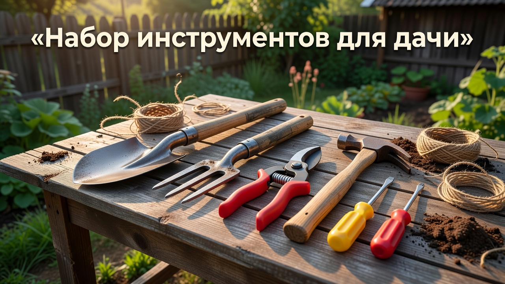
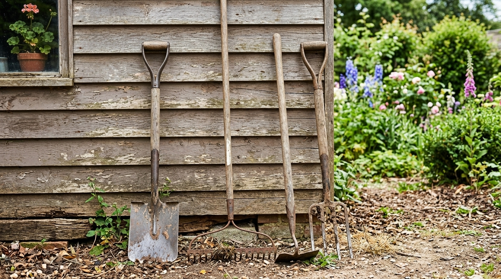
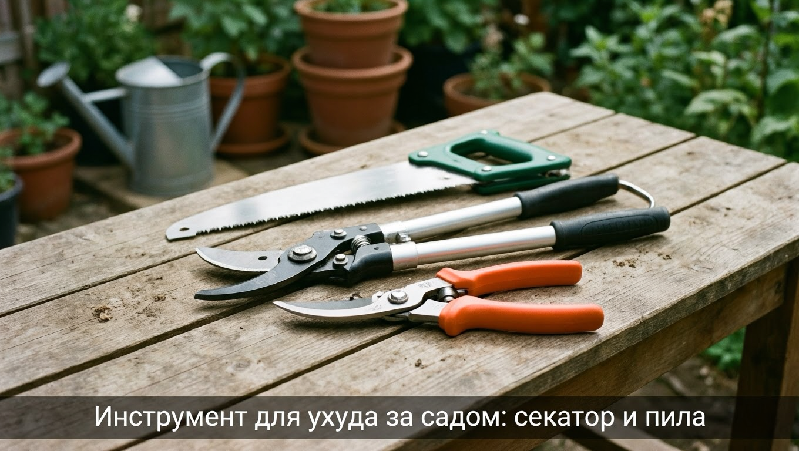
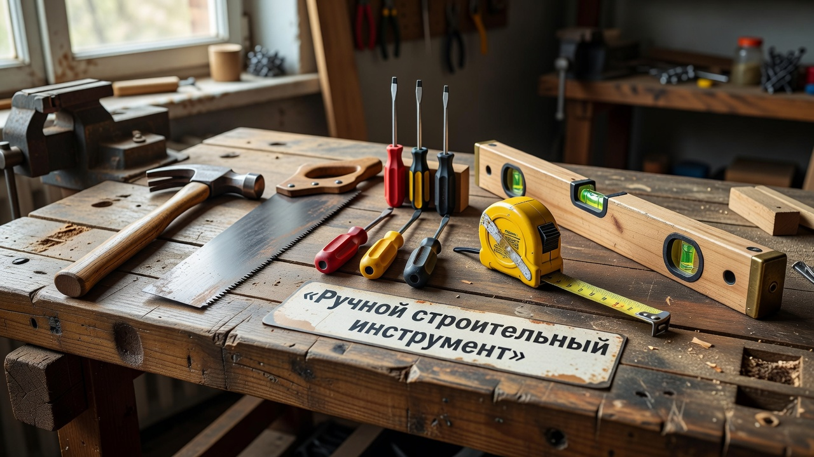
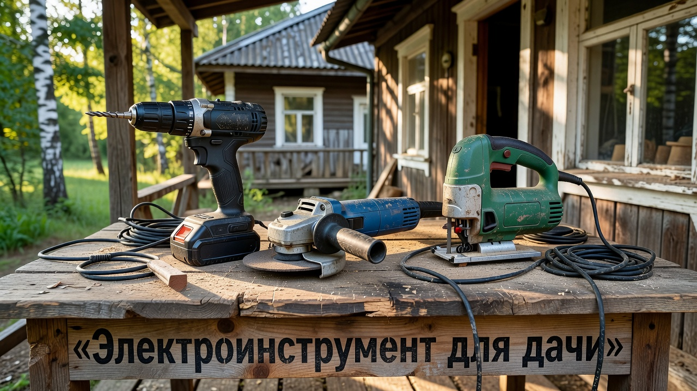
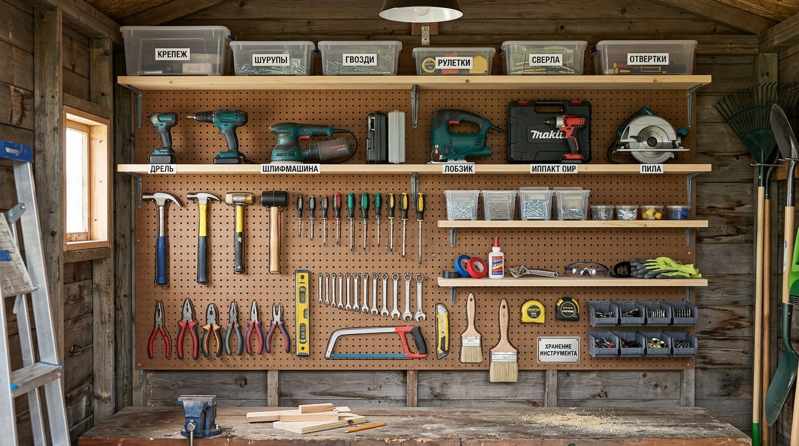

Дача — это постоянные дела: то грядки вскопать, то забор поправить, то дерево обрезать. И для каждой работы нужен свой инструмент. Новичку легко растеряться в изобилии инвентаря и накупить лишнего, а потом обнаружить, что самого нужного как раз и нет. В этой статье собрали полный список инструментов для дачи: что нужно для огорода, ухода за садом, мелкого строительства и ремонта, что купить в первую очередь и как всё это удобно хранить.

## 🌱 Садово-огородный инвентарь

Это база, без которой не обойтись ни на одном участке:

- **Лопата** — штыковая для копки и совковая для сыпучих материалов.
- **Вилы** — для перекопки, уборки навоза и компоста.
- **Грабли** — для рыхления, разравнивания и уборки листвы.
- **Тяпка (мотыга) и плоскорез** — для прополки и рыхления грядок.
- **Совок и посадочная лопатка** — для рассады и мелких посадок.
- **Лейка и шланг с насадками** — для полива.
- **Ведро, таз и садовая тачка** — для переноски земли, урожая и мусора.

Этого набора достаточно, чтобы полноценно ухаживать за огородом. Черенки у лопат, грабель и тяпок лучше выбирать по своему росту — так спина устаёт меньше, а работать удобнее.

## ✂️ Инструмент для ухода за садом

Для деревьев, кустарников и газона понадобится отдельный инструмент:

- **Секатор** — для обрезки веток и стеблей.
- **Сучкорез** — для толстых веток в труднодоступных местах.
- **Садовая пила (ножовка)** — для веток, которые не берёт секатор.
- **Кусторез** — для стрижки живой изгороди и кустарников.
- **Газонокосилка или триммер** — для стрижки газона и травы.

Хороший острый секатор — один из самых востребованных инструментов в саду, поэтому на его качестве экономить не стоит: тупой секатор мнёт и рвёт ветки, а раны на растениях дольше заживают и становятся воротами для болезней.

## 🔨 Ручной строительный инструмент

Для мелкого ремонта и построек на даче нужен базовый набор:

- **Молоток и гвоздодёр** — для гвоздей и демонтажа.
- **Ножовка по дереву** — для распила досок и брусков.
- **Отвёртки** (крестовые и плоские) или набор бит.
- **Плоскогубцы, пассатижи, кусачки.**
- **Рулетка, угольник, строительный уровень** — для замеров и разметки.
- **Топор** — для колки дров и грубых работ.
- **Набор ключей** — для сборки конструкций и техники.

С таким набором можно собрать грядку, починить забор или сколотить простую мебель. Хранить ручной инструмент удобно в одном ящике или сумке-органайзере, чтобы всё нужное было под рукой.

## 🔌 Электроинструмент

Электроинструмент ускоряет работу и облегчает труд. Для дачи полезны:

- **Дрель-шуруповёрт** — самый нужный электроинструмент: сверлит и закручивает саморезы. Аккумуляторный удобнее на участке.
- **Болгарка (УШМ)** — для резки металла, заточки, зачистки.
- **Электролобзик или циркулярная пила** — для распила дерева.
- **Бензопила или электропила** — для дров, спила деревьев и веток.
- **Перфоратор** — если предстоят работы по бетону и камню.

Начинать стоит с дрели-шуруповёрта — он выручает чаще всего, а остальное докупают под конкретные задачи. Именно шуруповёрт и пила понадобятся, если возьмётесь, например, за [забор из профнастила](https://mir-doma.pro/zabor-iz-profnastila-svoimi-rukami/) или [теплицу](https://mir-doma.pro/teplitsa-iz-polikarbonata-svoimi-rukami/) своими руками.

## 🧤 Средства защиты и мелочи

Не забудьте о том, что делает работу удобной и безопасной:

- **Перчатки** — рабочие и садовые.
- **Защитные очки и респиратор** — при работе с электроинструментом и пылью.
- **Стремянка или лестница** — для сбора урожая, обрезки и ремонта.
- **Точильный камень или станок** — чтобы держать инструмент острым.
- **Крепёж** — гвозди, саморезы, дюбели в ассортименте.
- **Ёмкости и органайзеры** — чтобы мелочь не терялась.
- **Удлинитель на катушке** — для работы электроинструментом по всему участку.

## 🗄️ Как хранить инструмент

Инструмент прослужит дольше, если правильно его хранить. Лучшее место — [сарай](https://mir-doma.pro/saray-svoimi-rukami/) или хозблок с полками и стеллажами. Организовать хранение помогают:

- **Настенные держатели и перфопанели** — для лопат, грабли и ручного инструмента.
- **Полки и стеллажи** — для ящиков, банок с крепежом и электроинструмента.
- **Ящики и органайзеры** — для мелочи и наборов.

Инструмент после работы очищают от земли и просушивают, металлические части периодически смазывают от ржавчины, а режущие — затачивают. Электроинструмент хранят в сухом месте, а аккумуляторы — при плюсовой температуре, не оставляя их на зиму в холодном сарае. Так техника прослужит заметно дольше.

## 💡 Советы по выбору

- **Не покупайте всё сразу.** Начните с базового набора, а специализированный инструмент докупайте под конкретные задачи.
- **Берите качественное для частых работ.** Лопата, секатор, шуруповёрт служат долго, если они хорошие, — на них не экономят.
- **Подбирайте под себя.** Инструмент должен быть удобным по весу и размеру, тогда работать им легко и безопасно.
- **Обращайте внимание на материал.** Кованые лопаты и вилы, качественная сталь режущих кромок служат в разы дольше дешёвых аналогов.

## 🛡️ Частые ошибки

- **Покупка лишнего.** Новички скупают инструмент, который потом пылится без дела. Берите нужное.
- **Экономия на главном.** Дешёвый секатор мнёт ветки, слабая лопата гнётся. На основном инструменте не экономят.
- **Хранение под открытым небом.** Инструмент ржавеет и приходит в негодность. Ему нужно сухое место.
- **Тупой инструмент.** Затупленным секатором и пилой работать тяжело и вредно для растений. Точите вовремя.
- **Нет средств защиты.** Работа без перчаток и очков ведёт к травмам. Не пренебрегайте защитой.

## ❓ Частые вопросы

### Какие инструменты нужны на даче в первую очередь?

Базовый набор: штыковая лопата, грабли, тяпка, секатор, лейка или шланг, ведро и тачка для огорода, а также молоток, ножовка, отвёртки, рулетка и дрель-шуруповёрт для мелкого ремонта. Этого достаточно для большинства дачных работ, а остальное докупают по мере необходимости.

### Какой электроинструмент нужен на даче?

В первую очередь дрель-шуруповёрт — он нужен чаще всего. Полезны также болгарка для резки металла, электролобзик или циркулярная пила для дерева и бензопила либо электропила для дров и веток. Перфоратор берут, если предстоят работы по бетону.

### Что нужно для ухода за садом?

Для сада понадобятся секатор для обрезки веток, сучкорез для толстых веток, садовая пила, кусторез для живой изгороди и газонокосилка или триммер для травы. Особенно важен качественный острый секатор — им пользуются чаще всего.

### Как хранить садовый инструмент?

Лучше всего в сухом сарае или хозблоке на полках, стеллажах и настенных держателях. После работы инструмент очищают, просушивают, металлические части смазывают от ржавчины, а режущие затачивают. Хранение под открытым небом быстро выводит инструмент из строя.

### На каком инструменте нельзя экономить?

На том, которым пользуются постоянно и от которого зависит результат: лопате, секаторе, дрели-шуруповёрте, садовой пиле. Качественный инструмент служит годами и работает лучше, тогда как дешёвый быстро ломается и портит работу. А редкий специализированный инструмент можно взять и попроще.

### Сколько стоит собрать набор инструментов для дачи?

Базовый набор садового и ручного инструмента обходится недорого, а основные траты приходятся на электроинструмент. Собирать набор удобно постепенно: сначала самое необходимое, а специализированный и дорогой инструмент докупать под конкретные задачи, когда он реально понадобится.

### Нужна ли бензопила на даче?

Если на участке есть деревья, нужно заготавливать дрова или спиливать ветки — бензопила или электропила очень пригодятся. Электропила проще и тише, подходит для небольших работ у дома, а бензопила мощнее и не привязана к розетке. Для редких мелких работ хватит и хорошей садовой пилы.

## Заключение

Набор инструментов для дачи собирается постепенно: сначала базовый садовый инвентарь и ручной инструмент для мелкого ремонта, затем — дрель-шуруповёрт и инструмент для ухода за садом, а дальше специализированный под ваши задачи. Не гонитесь за количеством, берите качественное для частых работ, храните инструмент в сухом месте и держите его острым — тогда любая дачная работа будет в радость, а инструмент прослужит долгие годы. С правильным набором и грядки, и стройка, и сад окажутся вам по плечу, а работа будет спориться. А по мере освоения новых задач набор инструментов вырастет сам собой — под ваши реальные потребности.

А без каких инструментов не представляете дачу вы? Делитесь в комментариях и подписывайтесь, чтобы не пропустить новые статьи об инструментах и обустройстве дачи.
