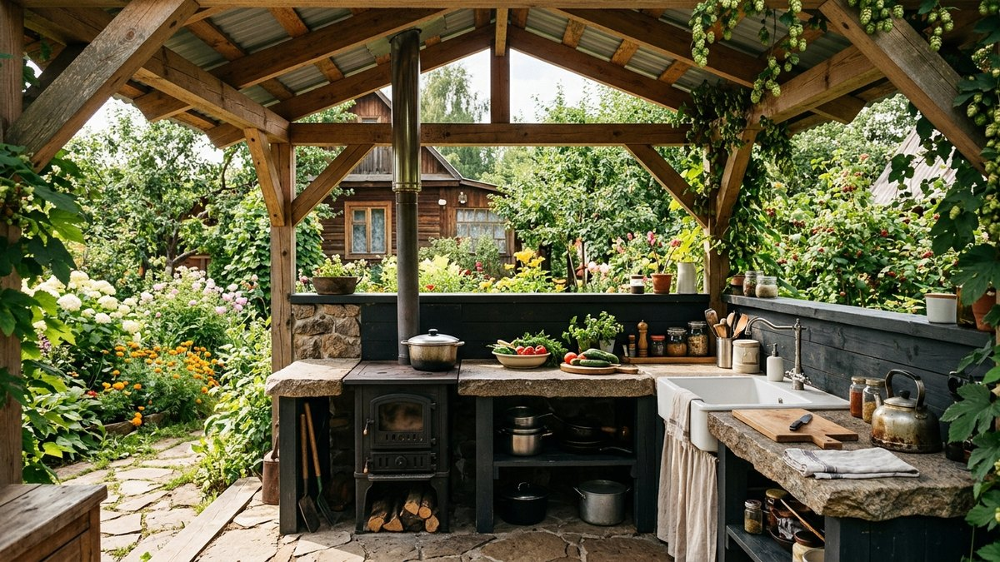
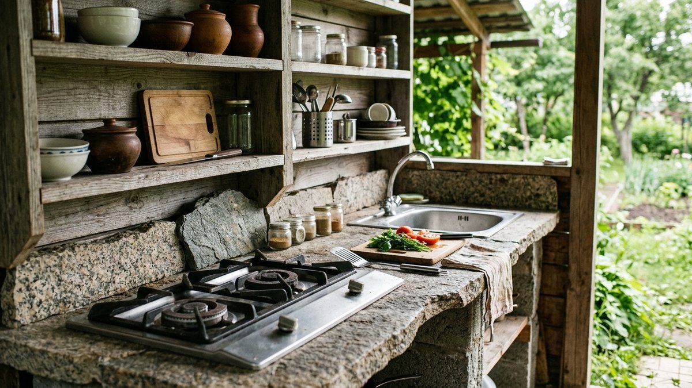
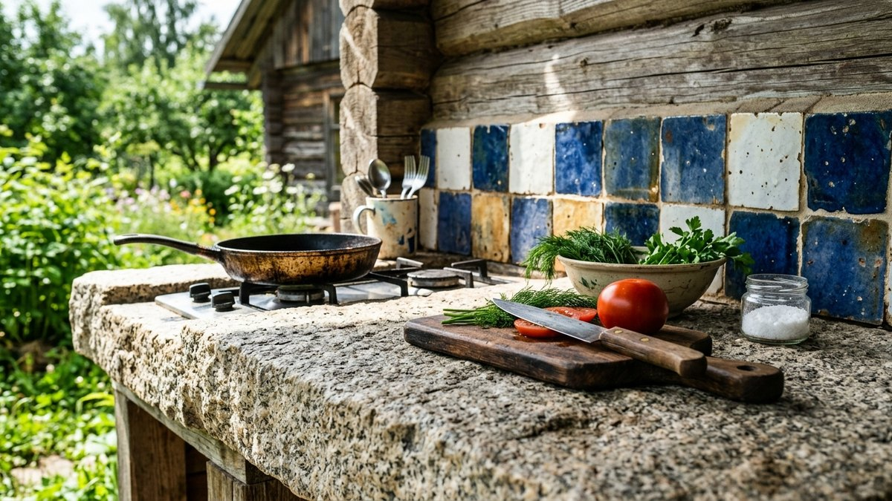
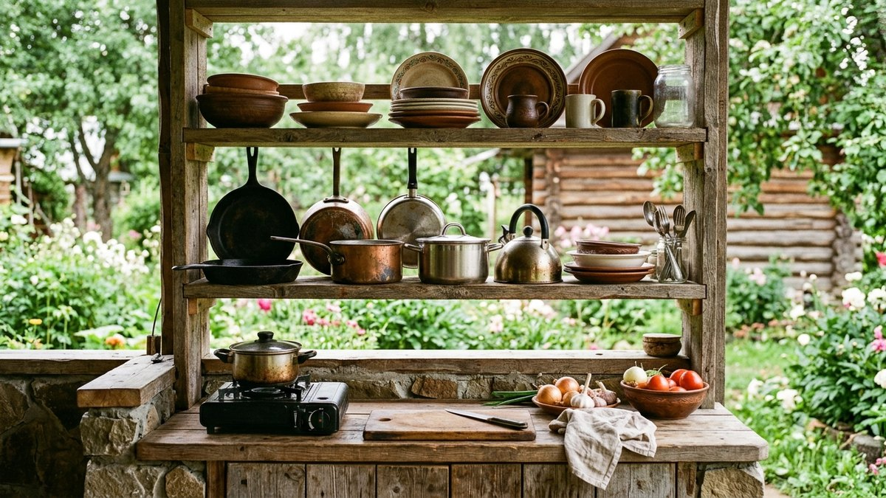
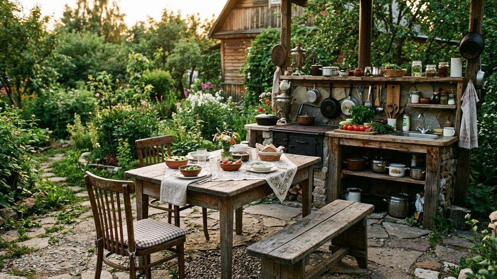
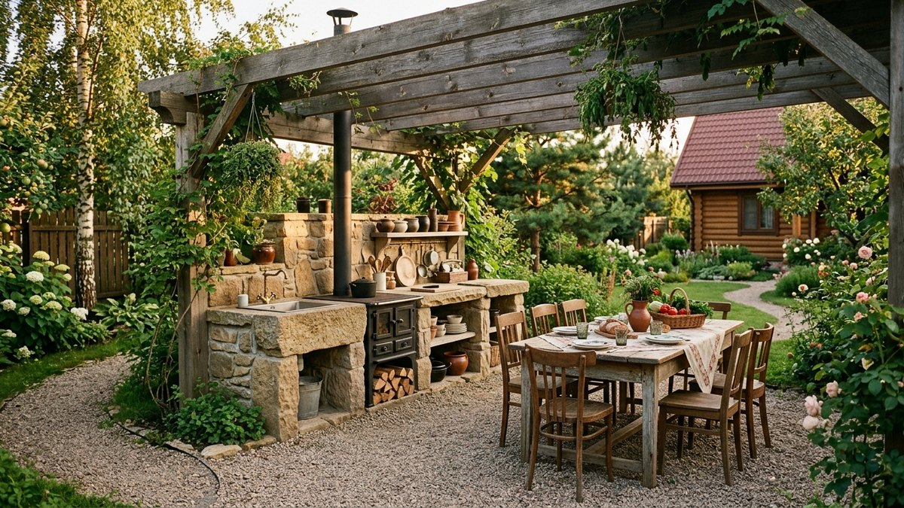

Летняя кухня — это не веранда для отдыха, а рабочее пространство: здесь
готовят, моют посуду и убирают продукты, поэтому интерьер строится вокруг
удобства готовки, а не только внешнего вида. Разберём, как расставить
рабочую зону, какие материалы выдерживают жар и влагу и куда убрать посуду,
чтобы летняя кухня не превращалась в склад после первого сезона.

*Интерьер летней кухни на даче*

## Чем летняя кухня отличается от веранды

Веранда — это в первую очередь зона отдыха: диван, кресла, декор, вид из
окна. Летняя кухня — рабочее помещение с плитой, мойкой и разделочными
поверхностями, где важны совсем другие вещи: устойчивые к жару и влаге
материалы, вытяжка от чада и продуманное расположение техники. Если ищете
идеи именно для зоны отдыха на открытой террасе, смотрите статью [летняя
веранда на даче: как оформить и
обустроить](https://mir-doma.pro/letnyaya-veranda-na-dache/) — там разобраны
мебель, текстиль и озеленение для лаунж-пространства.

## Рабочий треугольник: плита, мойка, хранение

Основа удобной кухни — расстояние между плитой, мойкой и местом хранения
продуктов и посуды. На летней кухне, где место обычно ограничено, эти три
точки располагают по компактному треугольнику или в один ряд вдоль стены,
чтобы не приходилось пересекать помещение с горячей сковородой в руках.
Между плитой и мойкой оставляют минимум 40–60 см рабочей поверхности для
разделки.

*Рабочий треугольник: плита, мойка, хранение*

## Материалы для рабочих поверхностей

Летняя кухня чаще открытая или полуоткрытая, поэтому отделка должна
выдерживать перепады влажности и температуры:

- **Столешница** — керамогранит, искусственный или натуральный камень:
  не боятся жара от плиты и не впитывают жир.
- **Фартук у рабочей зоны** — плитка или закалённое стекло, легко моются от
  копоти и брызг.
- **Пол** — керамогранит или террасная доска из термодерева, устойчивая к
  влаге.
- **Стены вне рабочей зоны** — вагонка или влагостойкие панели, как и на
  веранде, но у самой плиты дерево лучше не использовать без защитного
  экрана.

*Материалы рабочей зоны летней кухни*

## Вентиляция и защита от дыма

Открытая летняя кухня проветривается сама, но полуоткрытая или встроенная
в постройку требует вытяжки над плитой — иначе копоть оседает на мебели и
отделке. Если рядом стоит мангал или барбекю, зону готовки на углях
размещают так, чтобы дым уходил от посадочных мест, а не в сторону стола —
чертежи такой конструкции разобраны в статье [навес для мангала своими
руками](https://mir-doma.pro/naves-dlya-mangala-svoimi-rukami/).

## Хранение посуды и утвари

- **Открытые полки и рейлинги** над рабочей зоной — то, что нужно под рукой
  каждый день.
- **Закрытые шкафы или сундуки** — для посуды, которая используется реже,
  защищают от пыли и насекомых между приездами на дачу.
- **Тележка на колёсах** — мобильное решение, если кухня совмещена с зоной
  отдыха и на день посуду нужно убирать с виду.

*Система хранения посуды на летней кухне*

## Мебель и обеденная зона

Стол и стулья для летней кухни выбирают из материалов, которые не боятся
улицы — металл с порошковой покраской, тик или полипропилен. Если летняя
кухня совмещена с зоной отдыха, обеденную группу и рабочую зону
разграничивают барной стойкой или высоким столом — это держит гостей на
расстоянии от плиты, но не разрывает пространство перегородкой.

*Обеденная зона летней кухни*

## Частые ошибки

- **Копируют интерьер веранды** — мягкая мебель и текстиль возле плиты
  быстро пропитываются запахом дыма и жира.
- **Экономят на вытяжке в полуоткрытой кухне** — копоть оседает на мебели
  и отделке быстрее, чем кажется.
- **Ставят плиту и мойку далеко друг от друга** — увеличивает число шагов
  при готовке и риск пролить воду или уронить горячее.
- **Хранят посуду в открытых шкафах без дверец** — между приездами на дачу
  она покрывается пылью и становится домом для насекомых.

*Готовый интерьер летней кухни на даче*

## Частые вопросы

### Как обустроить интерьер летней кухни на даче

Начните с расстановки рабочего треугольника — плита, мойка и место
хранения продуктов на минимальном расстоянии друг от друга, — выберите
материалы, устойчивые к жару и влаге, и продумайте вытяжку, если кухня не
полностью открытая.

### Чем отличается летняя кухня от веранды по интерьеру

Веранда — зона отдыха, где на первом месте декор и комфортная мебель.
Летняя кухня — рабочее пространство: материалы и расстановка там подчинены
удобству готовки, а не только внешнему виду.

### Какой пол лучше сделать на летней кухне

Керамогранит или террасная доска из термодерева — оба материала устойчивы
к влаге и перепадам температуры, характерным для полуоткрытого помещения.

### Нужна ли вытяжка на летней кухне

Нужна, если кухня полуоткрытая или встроена в постройку без сквозного
проветривания — без вытяжки копоть от готовки оседает на мебели и отделке.
Полностью открытую кухню под навесом проветривает естественная тяга.

### Как хранить посуду на летней кухне между приездами на дачу

В закрытых шкафах или сундуках, а не на открытых полках — так посуда не
пылится и не становится убежищем для насекомых в межсезонье. Для
повседневной утвари, которой пользуются каждый день, подходят открытые
рейлинги над рабочей зоной.
