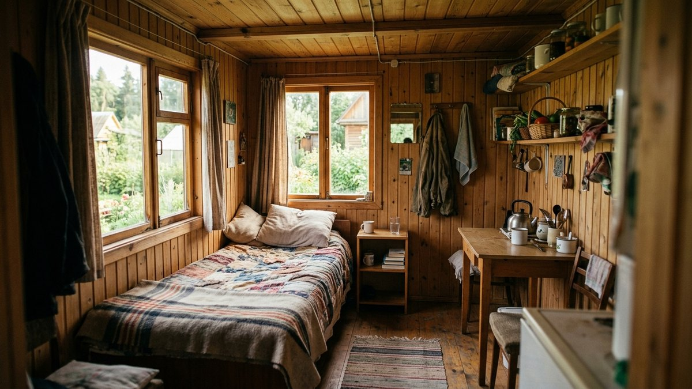
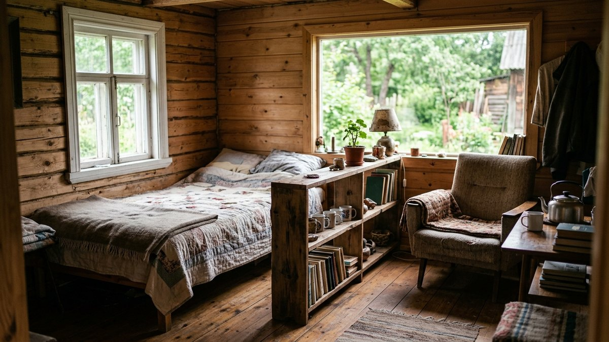
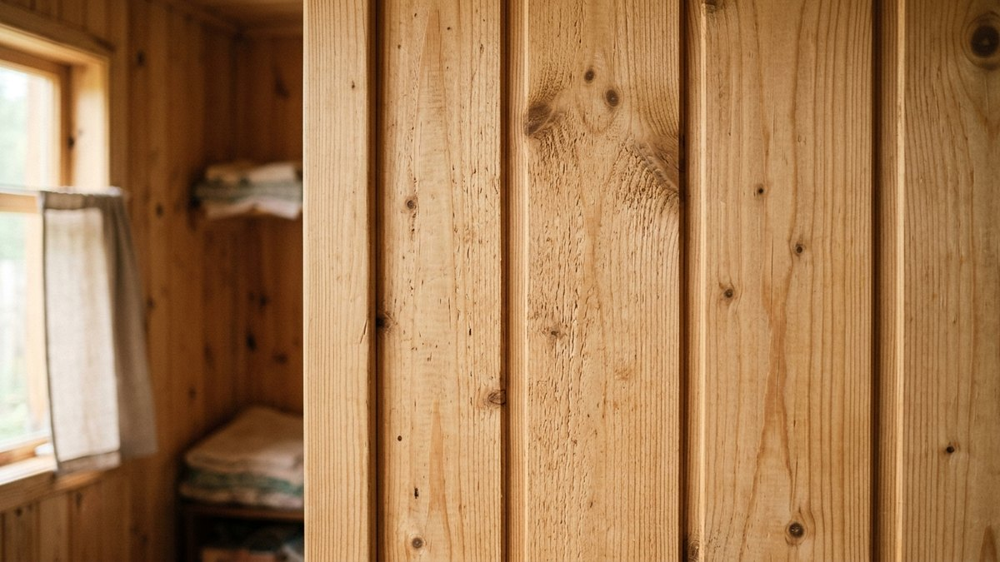
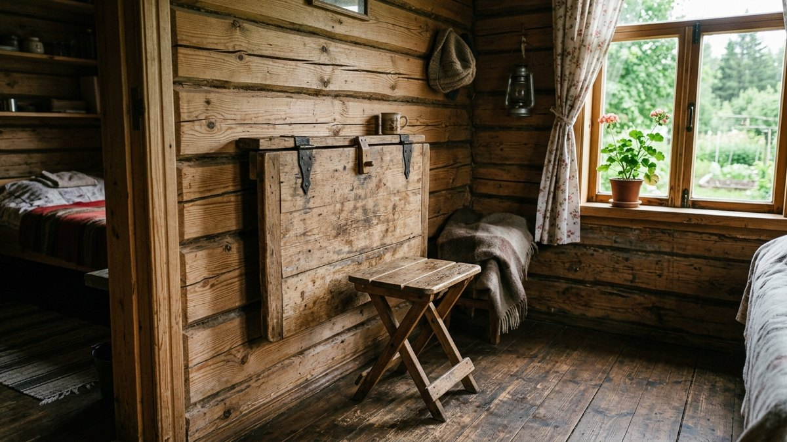
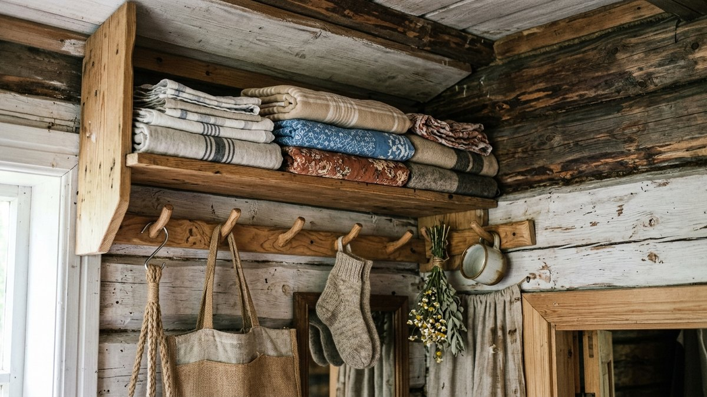
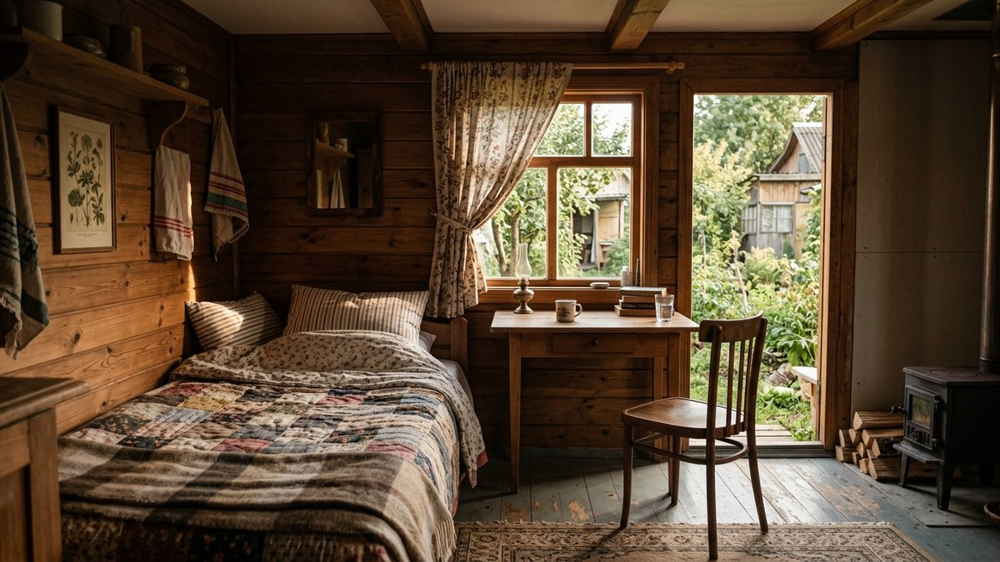

Бытовка редко строилась как жильё — обычно это времянка на период стройки
или подсобка, которую позже решили превратить в гостевой домик или комнату
для отдыха. Проблема в том, что 12–18 м² с тонкими стенами легко превращаются
в склад, если не продумать зонирование заранее. В статье — как обустроить
интерьер бытовки на даче: от зонирования и отделки до мебели и хранения.

*Интерьер бытовки на даче*

## Зонирование маленького пространства

В бытовке обычно совмещают спальное место, зону отдыха и хранение на
15–20 м², поэтому зонирование — первый и главный шаг:

- **Спальная зона** — у глухой стены, подальше от двери и сквозняка.
- **Зона отдыха** — у окна, где больше света.
- **Хранение** — вдоль торцевой стены или под кроватью, если она приподнята
  на подиуме.

Визуально зоны разделяют не перегородками (они съедают и без того малую
площадь), а разным цветом стен, ковром или подвесной полкой-стеллажом,
которая не доходит до потолка и не блокирует свет.

*Зонирование бытовки на функциональные зоны*

Если места больше и в план нужно вписать ещё и кухонную зону — приёмы
немного другие: перегородки-разделители, второй уровень под спальню и
мебель-трансформер разобраны в статье [как зонировать маленький дачный
домик](https://mir-doma.pro/kak-zonirovat-malenkiy-dachnyy-domik/).

## Отделка стен и пола

Стены бытовки — чаще всего тонкий металл или необрезная доска снаружи,
поэтому изнутри их в любом случае нужно зашить заново. Практичные варианты:

- **Вагонка** — тёплый вид, простой монтаж, дополнительно утепляет при
  прокладке минваты между обрешёткой и обшивкой.
- **МДФ-панели или ПВХ-панели** — быстрее в монтаже и легче моются, подходят
  для влажных зон у входа.
- **Покраска по OSB или фанере** — самый бюджетный вариант, если бюджет
  ограничен, а стены нужно просто освежить.

Пол утепляют и застилают линолеумом или ламинатом на влагостойкой подложке —
дощатый пол бытовки обычно холодный и продувается снизу.

*Отделка стен бытовки вагонкой*

## Мебель для маленького пространства

В бытовке работает только мебель, которая совмещает функции:

- **Кровать с ящиками под матрасом** или **подиум с выдвижными коробами** —
  спальное место одновременно становится основным хранением.
- **Складной или откидной стол** — крепится на кронштейнах к стене и
  убирается, когда не нужен.
- **Узкие навесные полки** вместо шкафов — не съедают проходную площадь.
- **Табуреты, которые задвигаются под стол** — экономят место лучше стульев
  со спинками.

Мебель для такого пространства часто делают своими руками из подручных
материалов — идеи и пошаговая сборка разобраны в статье [садовая мебель из
поддонов своими руками](https://mir-doma.pro/sadovaya-mebel-iz-poddonov/).

*Компактная мебель для бытовки*

## Освещение и вентиляция

Одного окна бытовке обычно не хватает — добавьте настенные светильники или
светодиодную ленту под навесными полками, чтобы свет не бил из одной точки
и не оставлял углы в тени. Вентиляция важна не меньше: в закрытой бытовке
без вытяжки или форточки с решёткой быстро скапливается конденсат на
холодном металле стен, особенно если внутри готовят на портативной плитке.
Если в бытовке или рядом с ней организована полноценная зона готовки, расстановку
рабочего треугольника и материалы для него стоит продумать отдельно — разбор в
статье [интерьер летней кухни на даче](https://mir-doma.pro/interer-letney-kuhni-na-dache/).

## Хранение вещей

Главный дефицит бытовки — не квадратные метры, а вертикальное пространство.
Используйте его по максимуму:

- полки под самым потолком для вещей, которые нужны редко;
- крючки и рейлинги на стенах вместо шкафов;
- ящики под подиумом или кроватью;
- многоуровневые органайзеры на двери.

*Компактное хранение в бытовке*

## Частые ошибки

- **Ставят мебель по всему периметру** — в комнате 12–15 м² это оставляет
  только узкий проход и делает пространство ещё теснее.
- **Не утепляют пол** — через тонкий дощатый пол бытовки уходит больше
  тепла, чем через стены.
- **Забывают про вентиляцию** — герметично закрытая бытовка с обшивкой
  копит конденсат и запахи.
- **Перегораживают пространство сплошной стенкой** — зонирование лёгкими
  средствами (цвет, стеллаж без задней стенки) работает лучше и не крадёт
  свет.

*Готовый интерьер бытовки на даче*

## Частые вопросы

### Как обустроить бытовку внутри на даче

Начните с зонирования — определите, где спальное место, зона отдыха и
хранение, затем зашейте стены вагонкой или панелями, утеплите пол и
подберите мебель-трансформер (кровать с ящиками, откидной стол), которая
совмещает несколько функций на минимальной площади.

### Чем лучше отделать бытовку внутри

Вагонкой — она даёт тёплый вид и попутно утепляет стены при прокладке
минваты в обрешётке. Более бюджетный вариант — покраска по OSB или фанере,
практичный для влажных зон — МДФ или ПВХ-панели.

### Можно ли жить в бытовке на даче постоянно

Для сезонного проживания бытовка подходит при должном утеплении стен, пола
и потолка и наличии отопления. Для круглогодичного проживания она обычно
всё же уступает капитальному дому по теплоизоляции — щели и мостики холода
в металлическом каркасе сложнее устранить полностью.

### Как визуально увеличить пространство в бытовке

Светлые стены, зеркало напротив окна, мебель на ножках (а не сплошные
тумбы до пола) и хранение, поднятое к потолку, а не расставленное по полу —
эти приёмы работают в бытовке так же, как в любой маленькой комнате.

### Нужно ли утеплять бытовку для интерьера

Да, если планируете пользоваться ей не только летом — тонкие стены бытовки
без утепления промерзают, и любая отделка внутри отсыревает от конденсата
на холодном металле или дереве.
