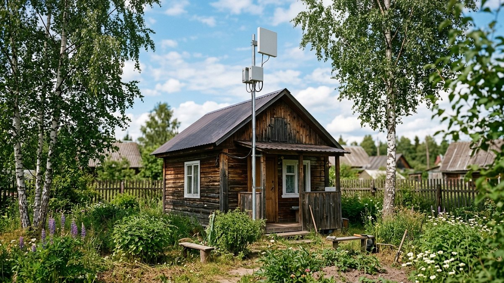
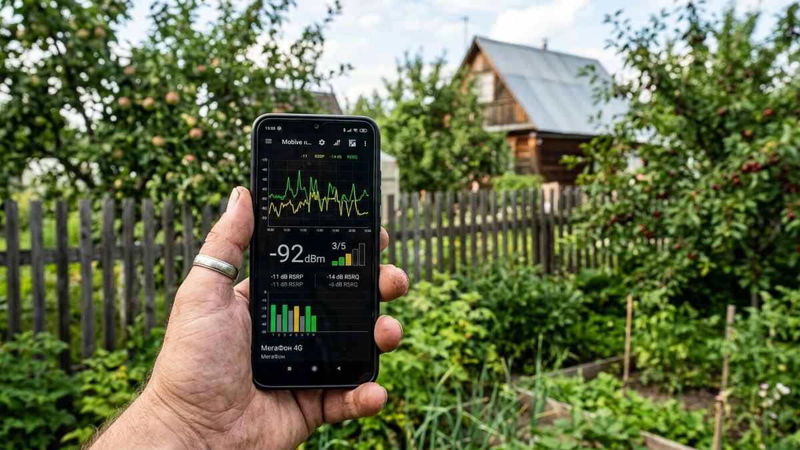
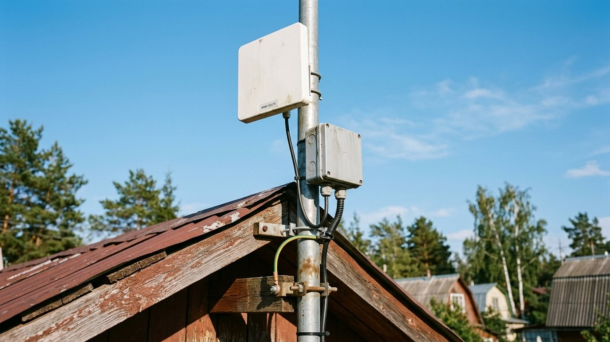
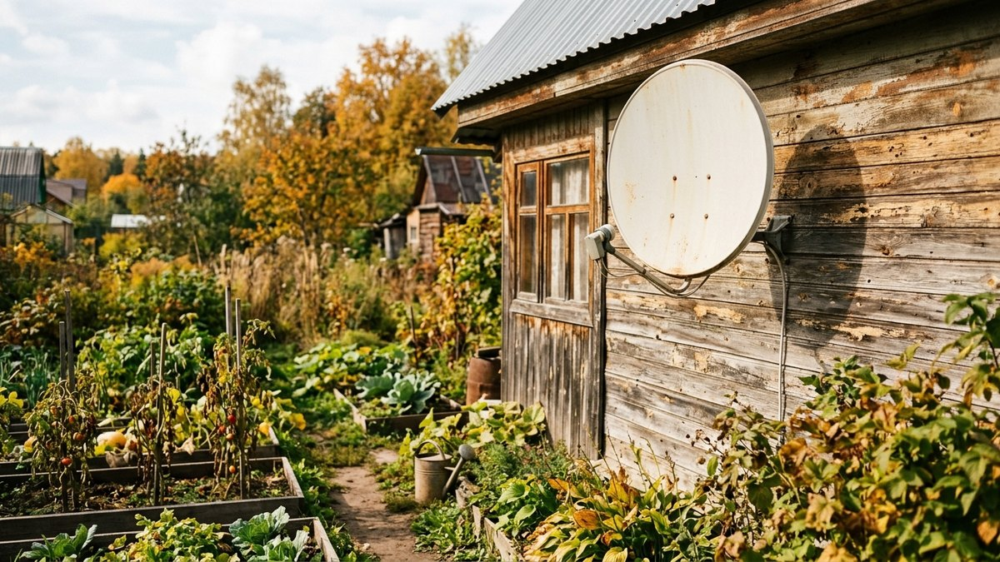
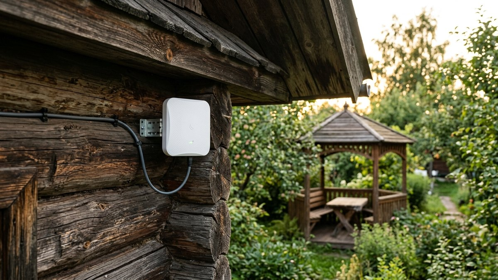
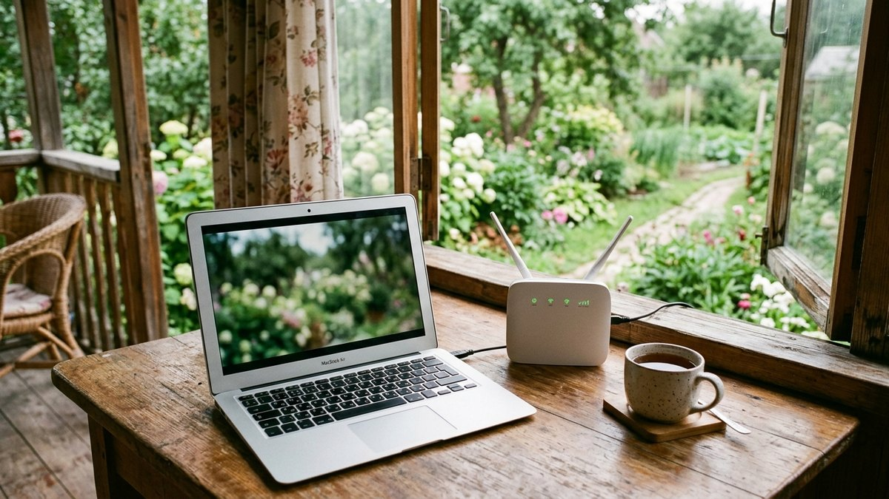

Как провести интернет на дачу, обычно задумываются в два момента: когда
на лето приезжают работать из-за города и когда на участке появляется
камера или котёл с управлением через приложение. Телефон в руке ловит
3–4 палки, но стоит раздать с него Wi-Fi на ноутбук, и видеозвонок
начинает рассыпаться. Способов провести интернет за город всего четыре:
мобильный 4G с внешней антенной, оптика от провайдера, радиомост и
спутник. У каждого своя цена входа, свои ограничения и свои условия, при
которых он вообще возможен. Разберём, как выбрать способ под ваш
участок, как замерить сигнал до покупки и сколько трафика нужно на
месяц. Для трафика есть калькулятор.

## Четыре способа: сравнение

| Способ | Скорость в реальности | Задержка | Цена входа | Когда подходит |
|---|---|---|---|---|
| 4G-роутер с внешней антенной | 10–50 Мбит/с, зависит от вышки и загрузки | 30–70 мс | низкая | в большинстве СНТ, где телефон ловит хотя бы 3G |
| Оптика (GPON) от провайдера | 100–500 Мбит/с | 5–20 мс | от нуля до высокой | если провайдер уже заходит в посёлок |
| Радиомост от точки с интернетом | до 100–300 Мбит/с | 2–10 мс плюс задержка исходного канала | средняя | есть дом, офис или сосед с оптикой в прямой видимости |
| Спутниковый интернет | 5–40 Мбит/с, тарифы с лимитом | около 600 мс на геостационарных спутниках | высокая | нет ни сотовой связи, ни провайдера |

Главное из таблицы: **начинайте с проверки оптики, потом 4G.** Если в
посёлок уже заходит провайдер, подключение стоит как установка роутера
в квартире, и никакие антенны с ним не сравнятся. Если провайдера нет,
почти всегда выигрывает 4G с правильно выставленной антенной. Радиомост
и спутник — решения для особых случаев.

## Сначала проверьте оптику

Крупные провайдеры и местные операторы всё чаще тянут GPON в
садовые товарищества: одна магистраль заходит в СНТ, дальше кабель
идёт по столбам к каждому участку. Проверить это можно тремя путями:

- **Спросить председателя СНТ** или в общем чате посёлка. Если хотя бы
  у одного соседа есть проводной интернет, провайдер уже рядом.
- **Посмотреть карты покрытия** на сайтах провайдеров вашего района:
  там обычно можно ввести адрес или кадастровый номер участка.
- **Оставить заявку** у 2–3 провайдеров. Часто они тянут линию в
  посёлок, когда набирается 10–20 заявок, и подключают бесплатно.

Если провайдер есть, но до участка 200–300 м, он может выставить
счёт за прокладку кабеля по столбам. В этом случае сравните его
с ценой 4G-комплекта: антенна с роутером окупают себя только при
тарифах на мобильный интернет без жёстких лимитов.

## 4G на даче: как сделать, чтобы работало

Большинство проблем с мобильным интернетом за городом не в тарифе и не
в роутере, а в том, что сигнал принимается внутри дома, на уровне
первого этажа, за деревьями. Каждая стена и каждое дерево на пути к
вышке отнимают часть сигнала. Вынесенная на мачту антенна, направленная
на вышку, даёт больше, чем самый дорогой роутер на подоконнике.

### Как замерить сигнал до покупки

Не ориентируйтесь на «палки» в телефоне: они показывают уровень очень
грубо. Установите на смартфон приложение для замера сотового сигнала
(например, Network Cell Info Lite или аналог) и посмотрите два параметра
для 4G (LTE):

| Параметр | Отлично | Хорошо | Терпимо | Плохо |
|---|---|---|---|---|
| RSRP — уровень сигнала, дБм | выше −80 | −80…−90 | −90…−100 | ниже −100 |
| SINR — чистота сигнала, дБ | выше 20 | 13…20 | 0…13 | ниже 0 |

Замеры делайте в нескольких точках: в доме, на чердаке, во дворе,
на лестнице на уровне конька крыши. Разница между первым этажом и
крышей часто составляет 10–15 дБ, а это разница между «не грузится» и
«смотрим кино». Сравните SIM-карты 2–3 операторов: на одной даче лучшая
сеть у одного, в соседнем посёлке — у другого.

Узнать, где стоит вышка, можно по картам покрытия операторов или в
приложении, которое показывает номер соты и её примерное направление.
Антенну направляют на вышку, а не «куда-то на город».

### Какой комплект взять

- **Сигнал хороший (RSRP выше −90) и на крыше, и в доме** — достаточно
  4G-роутера со слотом под SIM у окна, смотрящего на вышку. Антенна
  не нужна.
- **Сигнал терпимый (−90…−105)** — роутер плюс внешняя MIMO-антенна
  панельного типа с усилением 15–18 дБи на мачте.
- **Сигнал плохой (ниже −105) или вышка дальше 10–15 км** —
  параболическая MIMO-антенна 24–27 дБи. Она узконаправленная, её
  нужно точно выставлять по азимуту.

Второе правило — **короткий кабель.** Каждый метр высокочастотного
кабеля от антенны до роутера теряет часть сигнала, а 10–15 м кабеля
могут «съесть» всё усиление антенны. Поэтому для мачты лучше модем или
роутер, который ставится в герметичный бокс прямо у антенны, а в дом
идёт обычный сетевой кабель с питанием по нему (PoE). Такой кабель без
потерь тянется на десятки метров.

MIMO-антенна принимает на два канала сразу, и на хорошей вышке это
почти удваивает скорость. Для 4G берите только MIMO, одноканальные
антенны остались от эпохи 3G.

### Установка антенны по шагам

1. **Выбрать место** на фронтоне или коньке со стороны вышки, выше
   крон деревьев в сторону вышки.
2. **Закрепить мачту** из оцинкованной трубы 32–40 мм на кронштейнах к
   стене или стропилам. Высота над коньком — 1–2 м.
3. **Поставить антенну** и модем в боксе, подключить сетевой кабель.
4. **Выставить направление:** поворачивать антенну по 5–10° и после
   каждого поворота ждать 20–30 секунд, пока роутер обновит показания
   RSRP и SINR. Ищут максимум SINR, а не только RSRP.
5. **Закрепить антенну окончательно** и проверить скорость в разное
   время суток: вечером вышка загружена сильнее.
6. **Заземлить мачту.** Металлическая мачта выше конька — это
   громоотвод. Её соединяют с контуром заземления отдельным проводником;
   как устроен контур на участке, есть в статье [электрика на даче своими
   руками](https://mir-doma.pro/elektrichestvo-na-dache-svoimi-rukami/).

### SIM-карта и тариф

Тарифы для смартфона у многих операторов запрещают или ограничивают
раздачу интернета и использование SIM-карты в модеме: скорость режут,
а трафик списывают отдельно. Для роутера берите тариф для модема или
роутера, это прямо указано в его условиях. Смотрите не на
«безлимит» в рекламе, а на мелкий шрифт: скорость после исчерпания
пакета, ограничения на торренты и раздачу.

## Радиомост: интернет от соседа или от дома в деревне

Если в 1–5 км есть здание с проводным интернетом (ваш дом в деревне,
дача родственников, офис правления) и между ним и вашим участком нет
препятствий, можно поставить радиомост. Это две направленные
Wi-Fi-антенны, которые «смотрят» друг на друга и передают канал без
провода.

Условия, без которых радиомост не заработает:

- **Прямая видимость.** Между антеннами не должно быть деревьев,
  холмов и крыш. Листва летом глушит сигнал сильнее, чем голые ветки
  зимой: мост, который работал в марте, может отвалиться в июне.
- **Договорённость с владельцем канала.** Скорость делится между двумя
  домами, а в договоре с провайдером может быть запрет на раздачу.
- **Мачты с обеих сторон** выше препятствий, тоже с заземлением.

При этих условиях радиомост даёт скорость проводного канала за
цену двух точек доступа. Если хотя бы одно не выполняется, берите 4G.

## Спутниковый интернет: когда ничего другого нет

Спутник остаётся вариантом для участков вне зоны сотовой связи и без
провайдеров. Российские операторы работают через геостационарные
спутники, поэтому у такого интернета есть свойства, которые надо
знать заранее:

- **Задержка около 600 мс.** Сайты и видео работают, а видеозвонки
  идут с заметной паузой, онлайн-игры практически невозможны.
- **Тарифы с лимитом трафика.** Безлимитные пакеты дорогие, а после
  исчерпания лимита скорость сильно снижается.
- **Тарелка 0,75–1,2 м** с точной настройкой на спутник, на южной
  стороне, без деревьев в направлении на юг.
- **Сильный дождь и снег** на тарелке снижают скорость или прерывают
  связь.

Прежде чем покупать спутниковый комплект, проверьте, не ловится ли на
участке 4G на высоте 8–10 м. Часто связь «отсутствует» только на
уровне земли, а над деревьями есть вышка на 15–20 км.

## Калькулятор трафика на месяц

Чтобы выбрать тариф, прикиньте, сколько гигабайт уходит за месяц.
Расход на видео и звонки — средний, при сжатии сервисами реальный
расход может быть меньше.

<!-- wp:html -->

<h3 class="md-nt__title">Сколько трафика нужно на даче</h3>

Ориентиры: видео 480p — 0,5 ГБ/ч, 720p — 1 ГБ/ч, 1080p — 2 ГБ/ч; видеозвонок — 0,8 ГБ/ч; сайты и соцсети — 0,15 ГБ/ч. К сумме добавляется 10% на обновления и фоновые приложения.

<label class="md-nt__f">Дней на даче в месяц<input type="number" id="ntDays" value="12" min="1" max="31" step="1"></label>
<label class="md-nt__f">Человек онлайн<input type="number" id="ntPeople" value="2" min="1" max="10" step="1"></label>
<label class="md-nt__f">Видео, часов в день на человека<input type="number" id="ntVideo" value="1.5" min="0" max="12" step="0.5"></label>
<label class="md-nt__f">Качество видео
<select id="ntQ">
<option value="0.5">480p</option>
<option value="1" selected>720p</option>
<option value="2">1080p</option>
</select></label>
<label class="md-nt__f">Видеозвонки, часов в день (всего)<input type="number" id="ntCall" value="0.5" min="0" max="12" step="0.5"></label>
<label class="md-nt__f">Сайты и соцсети, часов в день на человека<input type="number" id="ntWeb" value="2" min="0" max="16" step="0.5"></label>
<label class="md-nt__f">4G-камера, ГБ в месяц<input type="number" id="ntCam" value="0" min="0" max="500" step="1"></label>

В день на даче<b id="ntDay">—</b>

В месяц<b id="ntMonth">—</b>

Тариф брать от<b id="ntTariff">—</b>

Трафик камеры, которая пишет весь месяц, в том числе без вас, посчитайте отдельно в калькуляторе статьи про видеонаблюдение на даче и впишите сюда.

<button type="button" id="ntCopy" class="md-nt__btn md-nt__btn--main">Скопировать результат</button>
<a id="ntVk" class="md-nt__btn md-nt__btn--vk" href="#" target="_blank" rel="noopener noreferrer">Поделиться ВКонтакте</a>
<a id="ntTg" class="md-nt__btn md-nt__btn--tg" href="#" target="_blank" rel="noopener noreferrer">Поделиться в Telegram</a>
<button type="button" id="ntShareNative" class="md-nt__btn" hidden>Поделиться…</button>
<button type="button" id="ntPrint" class="md-nt__btn">Печать</button>

<!-- /wp:html -->

Тариф калькулятор подбирает с запасом 20%: в дождливые выходные
смотрят больше, чем планировали. Если камера записывает круглосуточно,
её трафик часто больше всего остального вместе. Посчитать его
по битрейту и режиму записи можно в статье [видеонаблюдение на даче
своими руками](https://mir-doma.pro/videonablyudenie-na-dache-svoimi-rukami/):
там же разобрано, какие камеры вообще обходятся без интернета.

## Wi-Fi по всему участку

Интернет пришёл в дом, но до беседки и бани не добивает. Решения по
возрастанию сложности:

- **Роутер у окна в сторону участка.** Бесплатно и часто достаточно,
  если беседка в 15–20 м.
- **Mesh-система** из 2–3 модулей: второй модуль ставят у окна или в
  хозпостройке, связь между ними автоматическая. Для участка до 10–15
  соток это самый простой путь.
- **Уличная точка доступа** со степенью защиты IP65 на стене дома,
  подключённая кабелем. Покрывает двор и огород, на морозе работает.

Зимой, когда на даче никого нет, интернет нужен только автоматике.
Если он держится через 4G-модем без резервного питания, при отключении
света пропадёт управление всем сразу. Поэтому для котла мы советуем
GSM-управление, а не Wi-Fi: SMS проходят и при слабой связи. Сравнение
подходов есть в статье [удалённое управление отоплением на даче](https://mir-doma.pro/udalennoe-upravlenie-otopleniem-na-dache/).
Роутер и модем при этом стоит подключить через небольшой ИБП на 1–2
часа: большинство коротких отключений света в СНТ он перекрывает.

## Частые ошибки

- **Роутер с SIM-картой на первом этаже** за деревьями, когда
  на крыше сигнал в 10 раз сильнее.
- **Антенна на 20 м кабеля.** Потери в кабеле съедают усиление
  антенны; модем нужно ставить у антенны.
- **Выставили антенну по RSRP, а не по SINR.** Сильный, но «грязный»
  сигнал от перегруженной вышки даёт меньшую скорость, чем чуть более
  слабый от свободной.
- **SIM-карта от смартфона в роутере.** Оператор режет скорость или
  списывает трафик за раздачу.
- **Незаземлённая мачта** выше конька: при грозе страдает и роутер, и
  всё, что подключено к сети.
- **Спутник «на всякий случай»** без проверки 4G на высоте мачты.

## Частые вопросы

### Как провести интернет на дачу, если нет проводного провайдера

Поставить 4G-роутер с внешней MIMO-антенной на мачте, направленной на
ближайшую вышку оператора. Предварительно замерьте сигнал приложением
на смартфоне в нескольких точках, включая уровень крыши, и сравните
SIM-карты 2–3 операторов. Если сотовой связи нет даже на высоте 8–10 м,
остаётся спутниковый интернет.

### Какой интернет лучше для дачи

Если в посёлок заходит оптика — оптика: она быстрее и стабильнее всего
остального. Если нет — мобильный 4G с внешней антенной: он дешевле
спутника, быстрее и почти без задержки. Радиомост хорош, когда в
прямой видимости есть дом с проводным интернетом.

### Какую антенну выбрать для 4G на даче

MIMO-антенну: панельную на 15–18 дБи при терпимом сигнале (RSRP −90…−105)
и параболическую на 24–27 дБи при слабом (ниже −105) или вышке дальше
10–15 км. Модем лучше ставить прямо у антенны в герметичном боксе, чтобы
не терять сигнал в длинном кабеле.

### Сколько трафика нужно на даче в месяц

Для двух человек, которые приезжают на 12 дней в месяц, смотрят видео
в 720p по полтора часа, полчаса в день созваниваются и по два часа сидят в соцсетях, выходит около 53 ГБ, то есть тариф от 100 ГБ.
Точную цифру под ваш режим посчитайте в калькуляторе выше. Если на
даче работает 4G-камера, её трафик прибавляется отдельно.

### Можно ли провести интернет на дачу бесплатно

Бесплатно обычно подключают оптику, если провайдер уже тянет линию в
посёлок и набралось достаточно заявок. Раздача с телефона тоже ничего
не стоит, но годится только для переписки и сайтов: тарифы для
смартфона часто ограничивают раздачу, а без внешней антенны скорость
на даче низкая.
