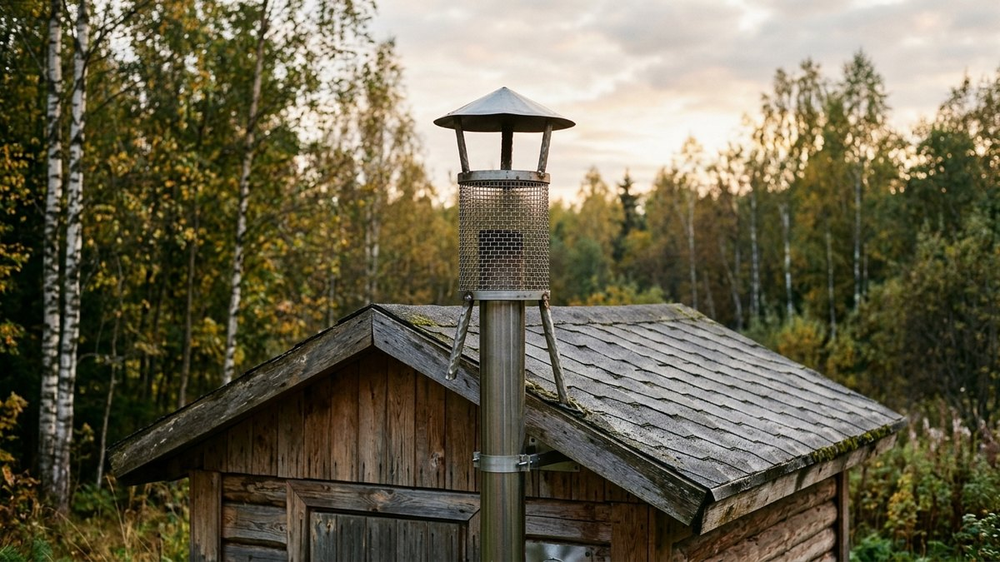
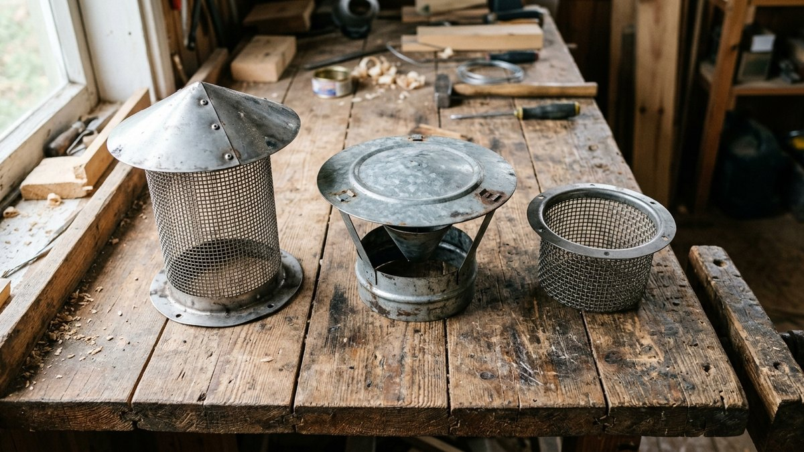
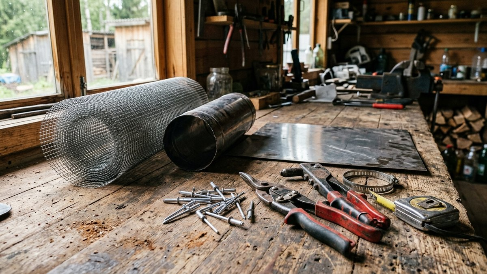
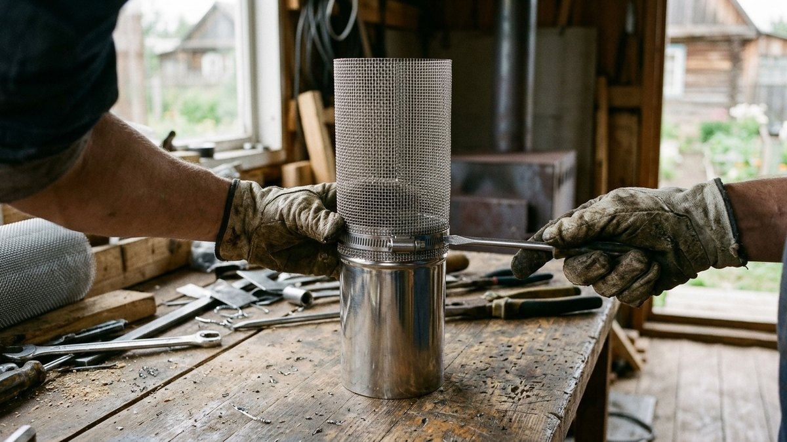
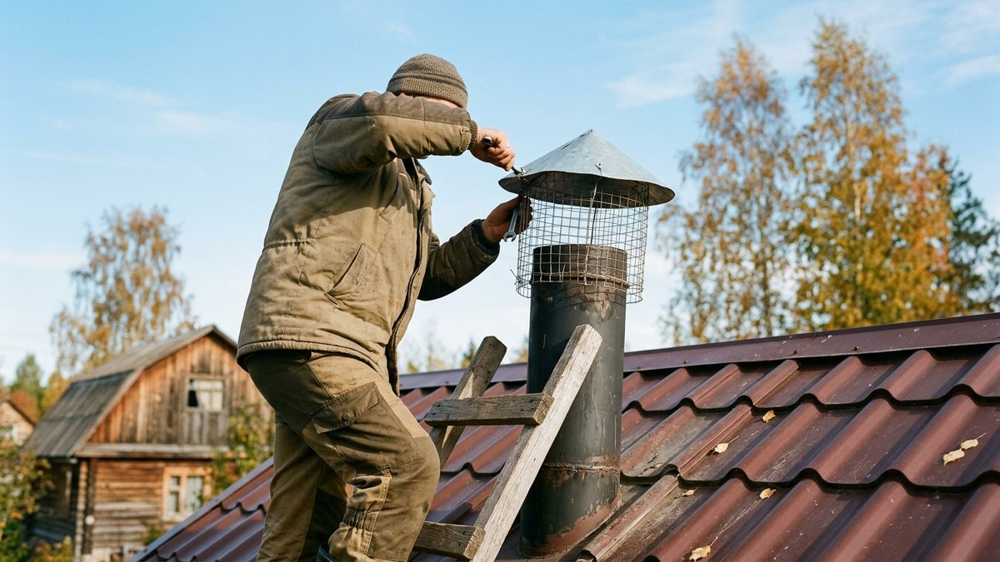
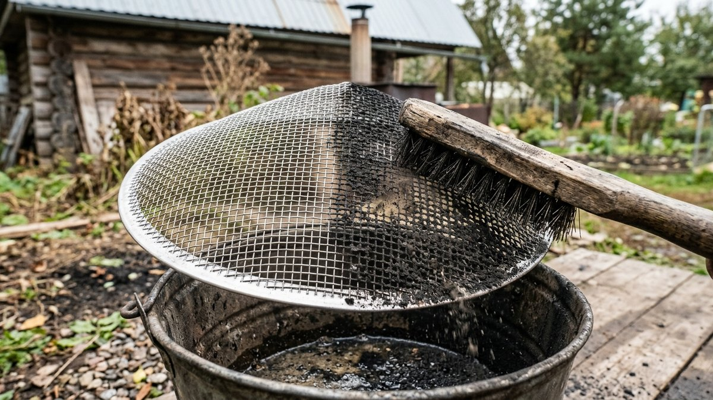

Искрогаситель на дымоход для бани своими руками делают в двух случаях:
когда заводской не подходит к самодельной трубе или когда купленный
забивается сажей так, что печь начинает дымить. Банная печь топится
жарко и быстро, на берёзовых дровах из трубы летят крупные искры,
а кровля бани часто горючая — мягкая черепица, рубероид, деревянная
обшивка фронтонов. Ниже разберём три рабочие конструкции, какую сетку
брать, чтобы искры гасли, а тяга оставалась, и как закрепить всё
на трубе так, чтобы искрогаситель можно было снять и почистить. Размеры
сетки и колпака под свой диаметр трубы посчитает калькулятор.

## Как работает искрогаситель и почему он забивается

Искра — это раскалённая частица несгоревшего дерева, которую поток дыма
выносит из топки. Пока она летит по трубе, она остывает, но при сильной
тяге и короткой трубе вылетает ещё горящей. Искрогаситель решает задачу
одним из двух способов:

- **задерживает** искру сеткой, где она догорает до пепла;
- **гасит удар** — искра бьётся о пластину или стенку, теряет скорость,
  дробится и остывает.

Обратная сторона любой преграды — сопротивление потоку дыма. Сетка
с мелкой ячейкой задерживает всё, но за одну-две топки обрастает сажей
и смолой, и тяга падает. Зимой на холодной сетке ещё и оседает иней
из водяного пара: если в морозную ночь баня дымит при растопке, первым
делом проверяют именно оголовок.

Поэтому самодельный искрогаситель делают с запасом площади: открытого
сечения сетки должно быть заметно больше, чем сечение самой трубы.
Тогда частичное засорение не мешает тяге, а чистить приходится раз
в сезон, а не каждую неделю.

## Нужен ли он именно вашей бане

Для бани с горючей кровлей искрогаситель обязателен по нормам пожарной
безопасности. Требование и остальные правила вывода трубы над кровлей
разобраны в статье [«Какой дымоход лучше для бани»](https://mir-doma.pro/kakoy-dymokhod-luchshe-dlya-bani/) —
там же калькулятор высоты трубы. Здесь коротко о том, когда без
искрогасителя рискованно, даже если норма формально не требует:

- баня стоит под кронами деревьев или рядом с сухой травой;
- рядом поленница, дровник или сарай с сеном;
- кровля из металлочерепицы или профнастила с полимерным покрытием:
  искры прожигают покрытие, и через год на скате видны ржавые точки;
- топите хвойными или сухими берёзовыми дровами — они стреляют
  сильнее всего.

Если баня стоит близко к дому или соседскому забору, искры — одна из
причин, по которой нормы задают противопожарные отступы. Их значения
по материалу стен — в материале про [расстояние от дома до бани
и забора](https://mir-doma.pro/rasstoyanie-ot-doma-do-bani-zabora/).

## Три конструкции: что выбрать

| Конструкция | Как гасит искры | Сопротивление тяге | Сложность | Когда подходит |
|---|---|---|---|---|
| Сетчатый цилиндр под колпаком | задерживает сеткой | низкое при правильной площади | простая, без сварки | основной вариант для бани |
| Колпак с отражателем (без сетки) | искра бьётся о пластину и гаснет | минимальное, не забивается инеем | средняя | если сетка постоянно обмерзает |
| Сетка внутри трубы (вставка-корзинка) | задерживает сеткой | высокое, площадь мала | очень простая | только как временная мера |

**Сетчатый цилиндр под колпаком** — самый практичный вариант. Сетку
сворачивают в цилиндр того же диаметра, что и труба, надевают на
верхний срез, сверху закрывают колпаком. Дым выходит вбок через всю
боковую поверхность цилиндра, а площадь этой поверхности легко
сделать в два-три раза больше сечения трубы.

**Колпак с отражателем** — для тех, у кого сетка зимой превращается
в ледяную пробку. Под колпаком на небольшом расстоянии от среза трубы
ставят конус или пластину вершиной вниз. Поток бьёт в неё, искры
дробятся и остывают, а дым уходит по сторонам. Задерживает он хуже
сетки, поэтому на горючей кровле его ставят вместе с сетчатым
цилиндром с крупной ячейкой.

**Сетка внутри трубы** — самодельная «корзинка», вставленная в срез.
Её площадь равна сечению трубы, поэтому она забивается за пару топок.
Годится, только пока не сделан нормальный оголовок.

## Какую сетку и металл брать

Сетка — главная деталь, и ошибки с ней самые частые.

- **Материал — только нержавейка.** Оцинкованная сетка выгорает:
  цинк испаряется уже при сильном нагреве, проволока ржавеет
  и рвётся за один-два сезона. Чёрная сталь ржавеет ещё быстрее.
- **Ячейка — от 3 до 5 мм.** Для дымоходов на твёрдом топливе
  при горючей кровле нормы допускают ячейку не больше 5×5 мм.
  Мельче 3 мм не берите: такая сетка зарастает сажей быстрее,
  чем вы успеете её почистить.
- **Проволока — 0,8–1 мм.** Тонкая сетка из проволоки 0,3–0,5 мм
  прогорает над банной печью, у которой дым на выходе из трубы
  бывает очень горячим в начале топки.
- **Колпак и крепёж — нержавейка толщиной 0,5–1 мм.** Заклёпки
  тоже из нержавейки: алюминиевые в паре с нержавейкой корродируют.

Если труба — сэндвич, искрогаситель крепят к внутренней трубе или
к стандартному оголовку. Наружный кожух сэндвича тонкий, и тяжёлый
колпак на нём со временем разбалтывается.

## Калькулятор: размеры сетки и колпака

Калькулятор исходит из простого правила: открытая площадь сетки должна
быть больше сечения трубы с запасом на засорение. Открытая площадь
зависит от ячейки и толщины проволоки: у сетки 5 мм из проволоки 1 мм
свободно около 70 % поверхности, у сетки 3 мм из той же проволоки —
около 56 %. Колпак поднимают над верхом сетки так, чтобы кольцевой
зазор под ним тоже не сужал поток.

<!-- wp:html -->

<h3 class="md-ig__title">Калькулятор искрогасителя для дымохода бани</h3>

Считает высоту сетчатого цилиндра, размер заготовки сетки и колпака по внутреннему диаметру трубы. Запас площади компенсирует засорение сажей.

<label class="md-ig__f">Внутренний диаметр трубы, мм
<select id="igD">
<option value="100">100</option>
<option value="110">110</option>
<option value="115" selected>115</option>
<option value="120">120</option>
<option value="130">130</option>
<option value="150">150</option>
</select></label>
<label class="md-ig__f">Ячейка сетки, мм
<select id="igA">
<option value="3">3×3</option>
<option value="4">4×4</option>
<option value="5" selected>5×5</option>
</select></label>
<label class="md-ig__f">Толщина проволоки, мм<input type="number" id="igW" value="1" min="0.3" max="2" step="0.1"></label>
<label class="md-ig__f">Запас площади (во сколько раз больше сечения трубы)
<select id="igK">
<option value="1.5">1,5 — регулярная чистка</option>
<option value="2" selected>2 — рекомендуемый</option>
<option value="3">3 — топите хвоей или сырыми дровами</option>
</select></label>

Открытая доля сетки<b id="igF">—</b>

Высота сетчатого цилиндра<b id="igH">—</b>

Заготовка сетки<b id="igSheet">—</b>

Диаметр колпака<b id="igCap">—</b>

Зазор под колпаком, не меньше<b id="igGap">—</b>

Заготовка сетки дана с нахлёстом 20 мм по шву и 30 мм на крепление к трубе. Колпак взят вдвое шире трубы, чтобы перекрывать сетку от дождя и снега. Если сетка забивается быстрее чем за сезон, выбирайте больший запас.

<button type="button" id="igCopy" class="md-ig__btn md-ig__btn--main">Скопировать результат</button>
<a id="igVk" class="md-ig__btn md-ig__btn--vk" href="#" target="_blank" rel="noopener noreferrer">Поделиться ВКонтакте</a>
<a id="igTg" class="md-ig__btn md-ig__btn--tg" href="#" target="_blank" rel="noopener noreferrer">Поделиться в Telegram</a>
<button type="button" id="igShareNative" class="md-ig__btn" hidden>Поделиться…</button>
<button type="button" id="igPrint" class="md-ig__btn">Печать</button>

<!-- /wp:html -->

Для самой частой банной трубы 115 мм с сеткой 5×5 мм и запасом
вдвое получается цилиндр высотой около 85 мм — это меньше ладони.
Такой искрогаситель почти незаметен на крыше и при этом не душит тягу.

## Материалы и инструменты

Для сетчатого искрогасителя под колпаком:

- сетка из нержавейки, ячейка 3–5 мм, проволока 0,8–1 мм — заготовка
  по калькулятору;
- обрезок трубы из нержавейки того же диаметра, что дымоход, длиной
  100–150 мм — это будет патрубок, который надевается на трубу;
  удобнее всего взять готовый короткий элемент дымохода;
- лист нержавейки 0,5–1 мм на колпак;
- полоса или пруток из нержавейки на три ножки колпака;
- заклёпки и саморезы из нержавейки, хомут под диаметр трубы;
- ножницы по металлу, дрель, заклёпочник, плоскогубцы, маркер,
  рулетка; если есть сварка для нержавейки — она упростит работу,
  но не обязательна.

Если печь и дымоход только собираются, проще сразу заказать патрубок
нужной длины: тогда искрогаситель станет частью оголовка, а не
навесной деталью. Как варится сама печь и почему патрубок дымохода
удобнее делать под стандартный диаметр, описано в статье про
[печь для бани из металла своими руками](https://mir-doma.pro/pech-dlya-bani-iz-metalla/).

## Сборка сетчатого искрогасителя пошагово

1. **Раскроить сетку.** Отрежьте полосу по размерам из калькулятора.
   Края сетки после резки колючие, работайте в перчатках.
2. **Свернуть цилиндр.** Оберните сетку вокруг патрубка с нахлёстом
   20 мм и скрепите шов вязальной проволокой из нержавейки или
   заклёпками через шайбы. Нижний край цилиндра на 30 мм заходит
   на патрубок.
3. **Закрепить сетку на патрубке.** Прижмите нижний край хомутом
   или прикрепите заклёпками по кругу через 40–50 мм. Сетка должна
   сидеть плотно: искра найдёт любую щель.
4. **Сделать колпак.** Вырежьте из листа круг диаметром по калькулятору,
   сделайте надрез до центра и сведите края в пологий конус —
   нахлёст закрепите заклёпками. Конус сбрасывает снег и дождь.
5. **Поставить ножки.** Приклепайте к патрубку три ножки из полосы,
   отогните их верхние концы и прикрепите к колпаку. Колпак должен
   стоять над верхним срезом сетки с зазором не меньше указанного
   в калькуляторе.
6. **Закрыть сетку сверху.** Верхний срез цилиндра закрывают кругом
   сетки или колпак опускают так, чтобы он перекрывал сетку сверху —
   искре не должно быть прямого пути вверх.
7. **Примерить на трубу.** Патрубок надевается на верхний срез дымохода
   и фиксируется хомутом или двумя-тремя саморезами. Не приваривайте
   и не сажайте его на герметик: искрогаситель придётся снимать
   для чистки.

Отражатель для второй конструкции делают из того же листа: небольшой
конус вершиной вниз крепится под колпаком на расстоянии примерно
четверти диаметра трубы от её среза. Если ставите его вместе с сеткой,
берите сетку 5×5 мм — отражатель сам гасит часть искр, и мелкая
ячейка не нужна.

## Установка на трубу и безопасность на крыше

На крышу бани с искрогасителем лезут один раз, если всё собрано на
земле. Перед подъёмом проверьте, что патрубок садится на трубу без
усилия, а колпак не шатается.

- Работайте в сухую безветренную погоду, с лестницей, закреплённой
  на кровле, и страховкой, если скат крутой.
- Ставьте искрогаситель на холодную трубу — после топки сетка и
  колпак долго остаются горячими.
- Если оголовок выше 1,5 м над кровлей и уже закреплён растяжками,
  проверьте их натяжение: колпак добавляет парусность.
- После установки сделайте пробную топку и посмотрите на трубу
  с земли в сумерках: искр не должно быть видно над колпаком.

## Чистка и зимняя эксплуатация

Самодельный сетчатый искрогаситель чистят по мере засорения: смотрят
на тягу и на сетку при осмотре оголовка. Обычно хватает раза за
сезон, при топке хвойными или сырыми дровами — чаще.

Чистка занимает десять минут: искрогаситель снимают, сетку отжигают
на костре или паяльной лампой и проходят металлической щёткой. Сажа
с сетки выгорает быстрее, чем отмывается. Химические средства для
чистки дымохода (поленья-трубочисты) помогают и сетке: сажа становится
рыхлой и осыпается при следующей топке.

Зимой главная проблема — иней. Водяной пар из дыма оседает на холодной
сетке, и к утру ячейки затягивает льдом. Признак — печь, которая
в прошлый раз тянула нормально, при розжиге в мороз дымит. Решения:

- при растопке сначала сжечь бумагу и мелкую щепу — горячий поток
  отогреет сетку за пару минут;
- взять сетку с ячейкой 5×5 мм и проволокой потолще — она меньше
  обмерзает;
- если обмерзание повторяется каждую топку, добавить отражатель
  и перейти на крупную ячейку.

Остальные зимние причины плохой тяги и порядок растопки выстуженной
бани описаны в статье о том, [как топить баню зимой](https://mir-doma.pro/kak-topit-banyu-zimoy/).

## Частые ошибки

- **Оцинкованная сетка.** Выгорает за сезон, рвётся, и искры летят
  мимо.
- **Ячейка 1–2 мм «для надёжности».** Забивается сажей за несколько
  топок, печь начинает дымить в парную.
- **Сетка площадью с сечение трубы.** Вставка внутрь среза или
  плоская сетка поверх трубы почти сразу перекрывает тягу.
- **Колпак вплотную к срезу трубы.** Зазор меньше четверти диаметра
  сужает поток так же, как забитая сетка.
- **Глухое крепление.** Искрогаситель, посаженный на герметик или
  приваренный к трубе, не снять для чистки — его будут чистить
  ёршиком на крыше, то есть никогда.
- **Щель между сеткой и патрубком.** Искры уходят именно туда,
  где сопротивление меньше.

## Частые вопросы

### Как сделать искрогаситель на трубу бани своими руками

Проще всего — сетчатый цилиндр из нержавейки с ячейкой 3–5 мм на
коротком патрубке трубы того же диаметра, а сверху колпак на трёх
ножках. Высоту цилиндра и размер колпака под свою трубу посчитайте
калькулятором выше.

### Какую сетку использовать для искрогасителя

Нержавеющую, с ячейкой от 3 до 5 мм и проволокой 0,8–1 мм. Оцинкованная
и чёрная сталь над банной печью выгорают и ржавеют за один-два сезона.

### Снижает ли искрогаситель тягу

Правильно сделанный — почти нет: если открытая площадь сетки больше
сечения трубы в два раза и больше, тяга остаётся прежней. Тягу снижает
забитая сеткой сажа или иней, поэтому искрогаситель делают съёмным.

### Как часто чистить искрогаситель на бане

Обычно раз в сезон, а при топке хвоей и сырыми дровами чаще. Сигнал —
печь хуже разгорается и дымит при открытой дверце.

### Можно ли поставить искрогаситель на сэндвич-трубу

Можно: патрубок искрогасителя надевают на внутреннюю трубу или на
стандартный оголовок сэндвича, а не на тонкий наружный кожух. Многие
производители выпускают оголовки с посадочным местом под сетку.
