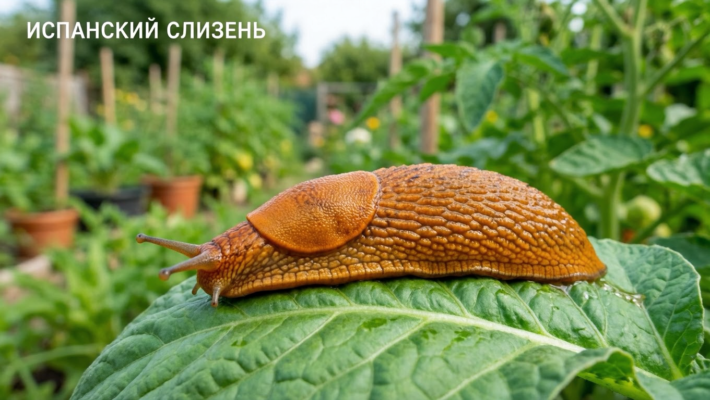
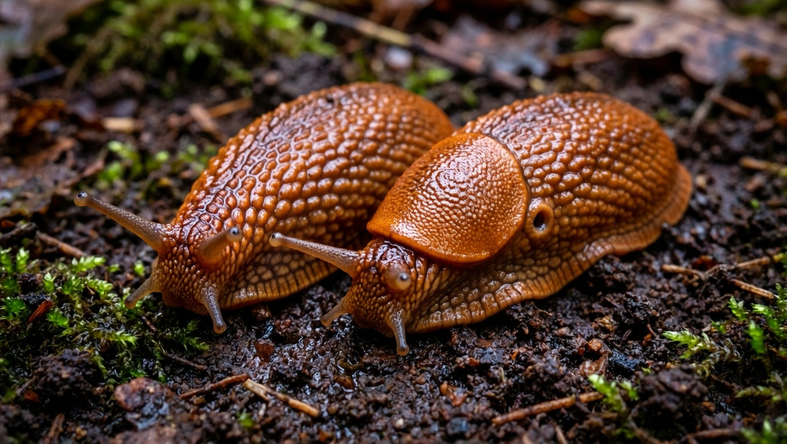
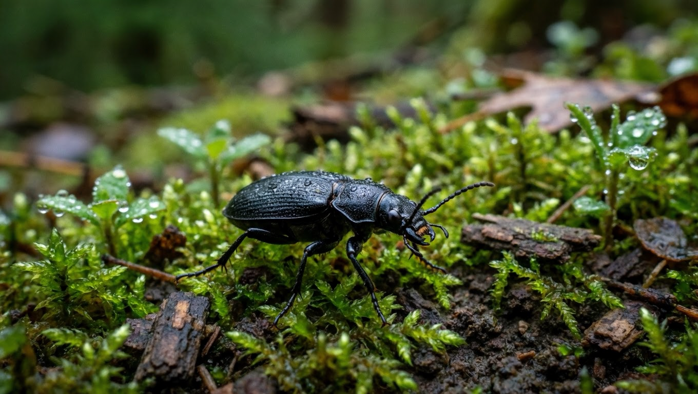
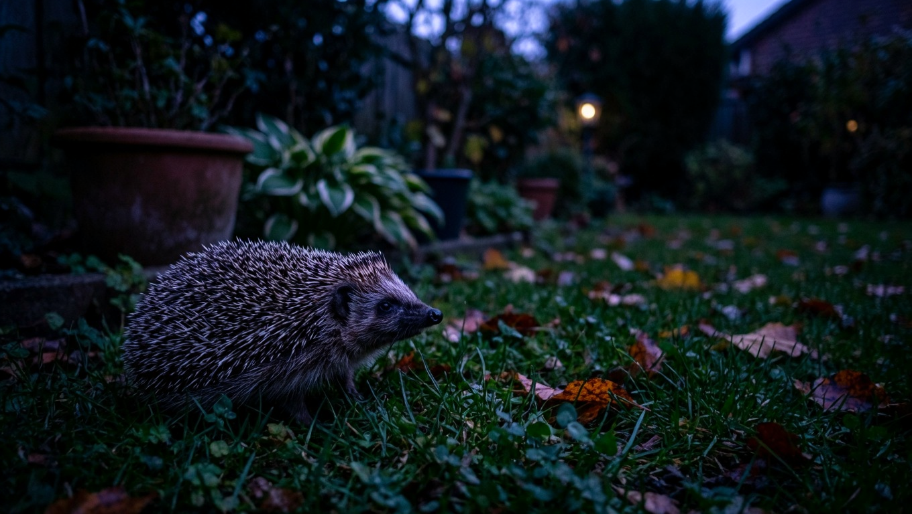
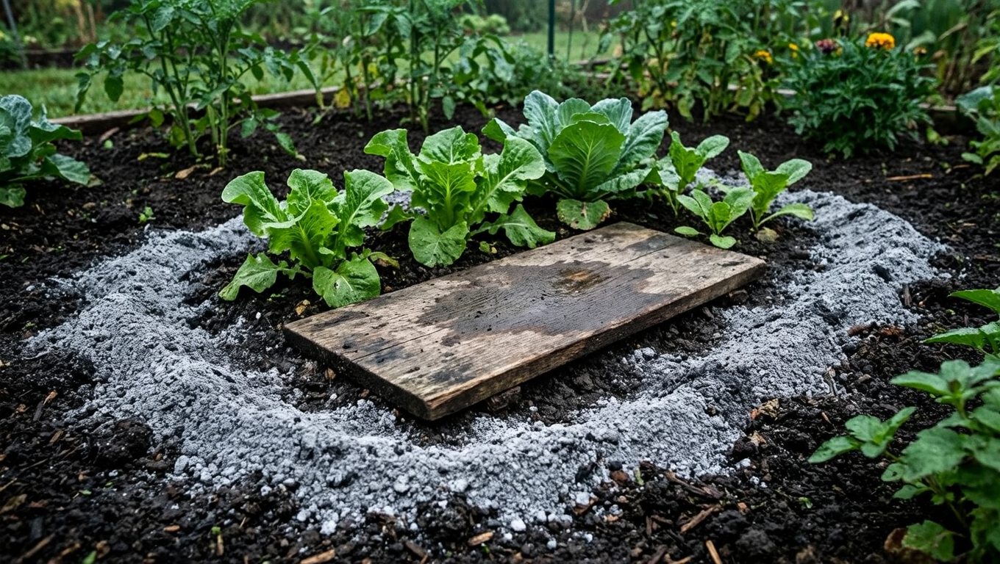
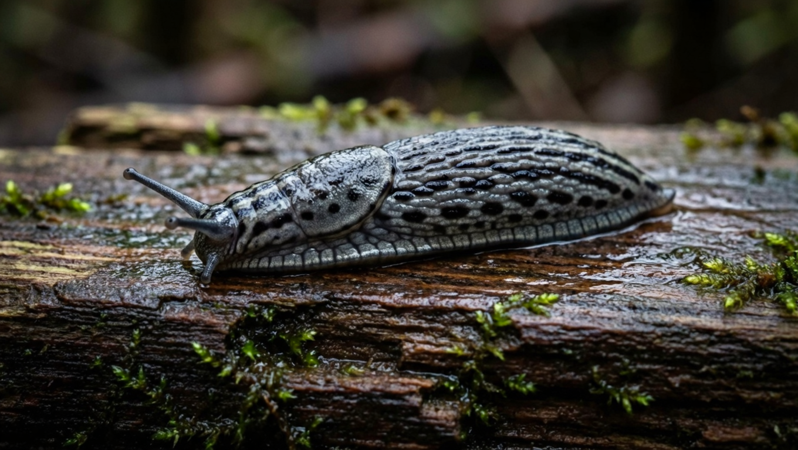

Испанский слизень (*Arion vulgaris*) — инвазивный вредитель, который за последние десятилетия расселился по Европе и добрался до российских участков. От привычных слизней он отличается не столько внешностью, сколько поведением: размножается взрывообразно, ест почти всё подряд и вытесняет местные виды. Разберём, чем он опасен, можно ли отличить его от рыжего слизня, кто его естественные враги и как избавиться от нашествия на участке.

## 🐌 Кто такой испанский слизень

Это крупный наземный слизень длиной до 10–15 см, окраска — от рыжевато-оранжевой до бурой и почти чёрной. Родом он с Пиренейского полуострова, но давно расселился далеко за его пределы: путешествует с посадочным материалом, грунтом в горшках, овощами и садовой техникой.

Чем он отличается по поведению от обычных слизней:

- **взрывное размножение** — одна особь откладывает несколько сотен яиц за сезон, и при благоприятной погоде численность растёт лавинообразно;
- **всеядность** — ест овощи, зелень, цветы, ягоды, падалицу, грибы, а при нехватке корма и погибших сородичей;
- **выносливость** — переносит и сухость, и холод лучше многих местных видов;
- **вытеснение местных видов** — там, где он закрепился, других слизней становится меньше;
- **мало естественных врагов** — из-за обильной густой слизи и неприятного вкуса многие хищники им брезгуют.

Именно сочетание плодовитости и малой поедаемости делает его настоящей проблемой, а не просто ещё одним слизнем на грядке.

## 🔍 Как отличить от рыжего слизня: честный ответ

Здесь важно не вводить себя в заблуждение. **Испанский слизень (*Arion vulgaris*) и рыжий слизень (*Arion rufus*) внешне почти неразличимы.** Оба бывают оранжевыми, бурыми и тёмными, оба крупные, и надёжно определить вид можно только по внутреннему строению или генетическому анализу — этим занимаются специалисты, а не садоводы с лупой.

Все «признаки», которые гуляют по интернету — оттенок подошвы, рисунок складок, цвет слизи — **не работают надёжно**: окраска сильно варьирует внутри одного вида и зависит от возраста и условий.

**Практические ориентиры, которые действительно что-то говорят:**

| Признак | На что указывает |
|---|---|
| **Массовость** — десятки особей на грядке разом | Скорее испанский: местные виды редко дают такие вспышки |
| **Каннибализм** — слизни едят раздавленных сородичей | Характерное поведение испанского |
| **Скорость нашествия** — за пару сезонов из единичных стал массовым | Признак инвазивного вида |
| **Реакция на прикосновение** — сжимается в плотный шар и раскачивается | Чаще у испанского |

И главный практический вывод: **для борьбы вид знать не обязательно.** Методы против всех крупных наземных слизней одинаковы — разница лишь в том, что при нашествии испанского работать придётся системнее и дольше. Общие приёмы борьбы, включая народные средства, разобраны в статье про [слизней на огороде](https://mir-doma.pro/slizni-na-ogorode/).

## 🦔 Естественные враги слизней

Самый устойчивый способ сдерживать слизней — не воевать в одиночку, а вернуть на участок тех, кто ест их естественным образом.

**Жужелицы — главный союзник.** Крупные жуки-жужелицы и их личинки поедают слизней и их яйца, и именно они дают самый ощутимый эффект. Живут под камнями, досками, в мульче и растительных остатках. Погибают от сплошных обработок инсектицидами — если травить всё подряд, вы уничтожаете собственную защиту.

**Ежи.** Едят слизней, улиток и насекомых. Чтобы ёж поселился, нужны укрытия (куча хвороста, компост, живая изгородь) и отсутствие ядов на участке. Молоко ежам давать нельзя — оно им вредно; если хочется помочь, поставьте плошку с водой.

**Жабы и лягушки.** Одна жаба за ночь съедает заметное количество слизней. Их привлекает влажный уголок, небольшой водоём или просто тенистое сырое место с укрытиями.

**Птицы** — дрозды, скворцы, галки, вороны склёвывают слизней, особенно молодых. Помогают кормушки и купальни для птиц в саду.

**Домашняя птица.** Утки и куры — эффективные охотники на слизней. Уток индийских бегунов вообще держат специально для этого. Минус очевиден: по грядкам их пускать нельзя, только по свободным участкам или после уборки урожая.

**Землеройки, кроты, ящерицы, светляки** — их личинки и взрослые особи тоже входят в число естественных врагов.

**Леопардовый слизень (*Limax maximus*).** Тот самый случай, когда враг вредителя — сам слизень. Этот крупный серый слизень с тёмными пятнами — хищник: он поедает других слизней, включая молодь, а также падаль и грибы. Растения он тоже может подъедать, но вреда от него несопоставимо меньше, чем пользы. **Не убивайте пятнистых серых слизней на участке** — они работают на вашей стороне.

## 🧬 Хищные нематоды: биометод

Отдельно стоит упомянуть *Phasmarhabditis hermaphrodita* — микроскопических хищных нематод, которые продаются как биопрепарат специально против слизней.

Как это работает: нематод разводят в воде и проливают почву. Они проникают в слизня, заражают его, и тот погибает в течение нескольких дней, обычно уходя в почву.

Что важно знать:

- **безопасно** для людей, домашних животных, птиц, ежей и дождевых червей;
- работает при **влажной почве и температуре от +5 °C**;
- эффект развивается не мгновенно, а в течение недели-двух;
- **действует и на молодь в почве**, чего не даёт ручной сбор;
- препарат живой, поэтому имеет срок годности и требует хранения в холодильнике.

Это один из немногих методов, который бьёт по популяции, а не только по видимым особям.

## 🛠️ Как избавиться от испанского слизня

Против массового нашествия работает только система из нескольких приёмов одновременно.

**1. Ручной сбор — основа.** Собирают вечером и рано утром, в пасмурную и сырую погоду, когда слизни активны. Работайте в перчатках: слизь плохо смывается. Собранных уничтожают (например, в ёмкости с крепким солевым раствором).

**2. Убирайте погибших слизней.** Специфика именно испанского: раздавленные особи привлекают сородичей, которые сползаются их поедать. Оставлять трупы на грядке — значит подкармливать популяцию.

**3. Ловушки-укрытия.** Разложите доски, куски шифера, влажные мешковины, половинки грейпфрута. Слизни забираются туда на день — утром остаётся собрать.

**4. Барьеры.** По периметру грядок — сухая зола, песок, измельчённая яичная скорлупа, медная лента. Важно: **зола и скорлупа работают только сухими** и после дождя требуют обновления.

**5. Биопрепараты** — хищные нематоды (см. выше).

**6. Гранулы-моллюскоциды.** Есть два типа:
   - **на основе фосфата железа** — безопаснее для домашних животных, ежей и почвы; предпочтительный вариант для участка;
   - **на основе метальдегида** — эффективнее, но **опасен для собак, кошек и ежей**; если используете, раскладывайте так, чтобы животные не добрались.

**7. Осенняя перекопка.** Яйца слизней зимуют в почве и растительных остатках. Перекопка поднимает их на поверхность, где они гибнут от мороза и склёвываются птицами. Это одна из самых недооценённых мер — она бьёт по следующему поколению.

## 🌿 Профилактика: сделать участок неудобным

Слизню нужны сырость и укрытия. Уберите их — и нашествие станет менее вероятным:

- **не загущайте посадки**, обеспечивайте проветривание;
- **поливайте утром, а не вечером** — к ночи поверхность подсохнет, и слизням будет некомфортно;
- **используйте капельный полив** вместо дождевания;
- **убирайте укрытия** — доски, старые мешки, кучи травы, растительные остатки у грядок;
- **скашивайте траву** вдоль дорожек и заборов, где слизни отсиживаются днём;
- **осматривайте покупную рассаду и грунт** — именно так вид чаще всего и попадает на новые участки;
- **не оставляйте падалицу** и порченые овощи на земле.

## ❓ Частые вопросы

**Чем испанский слизень отличается от рыжего?**
Внешне — практически ничем: оба крупные, окраска варьирует от оранжевой до бурой, и надёжно различить их можно только по анатомии или генетическому анализу. На испанского указывает поведение: массовые вспышки численности, поедание раздавленных сородичей и быстрое расселение.

**Кто ест испанских слизней?**
Жужелицы и их личинки (главный естественный враг), ежи, жабы и лягушки, землеройки, ящерицы, птицы — дрозды и скворцы, а также домашние утки и куры. Из слизней хищником выступает леопардовый слизень. Отдельно работают хищные нематоды, которые продаются как биопрепарат.

**Правда ли, что леопардовый слизень ест других слизней?**
Да, *Limax maximus* — крупный серый слизень с тёмными пятнами — поедает других слизней, включая молодь, а также падаль и грибы. Растения он тоже может подъедать, но пользы от него на участке больше, чем вреда, поэтому убивать его не стоит.

**Чем опасен испанский слизень?**
Он всеяден и очень плодовит: одна особь откладывает сотни яиц за сезон. Слизни уничтожают овощи, зелень, ягоды и цветы, оставляют слизь на плодах, вытесняют местные виды и могут переносить возбудителей болезней растений и паразитов животных.

**Как избавиться от слизней навсегда?**
Полностью извести их не получится, но численность реально снизить до безвредной: сочетайте ручной сбор, ловушки, барьеры, биопрепараты и осеннюю перекопку, а главное — привлекайте естественных врагов и не травите жужелиц сплошными обработками.

**Помогают ли нематоды от слизней?**
Да, *Phasmarhabditis hermaphrodita* заражает слизней и действует в том числе на молодь в почве. Метод безопасен для людей, животных и дождевых червей, но требует влажной почвы, температуры от +5 °C и работает не мгновенно, а за неделю-две.

**Когда собирать слизней вручную?**
Вечером после захода солнца, ранним утром и в пасмурную сырую погоду — в это время они выходят кормиться. Днём в сухую погоду они прячутся под досками, камнями и в густой траве.

---

Испанский слизень берёт не столько прожорливостью, сколько плодовитостью: пока вы собираете взрослых особей, в почве созревает следующее поколение. Поэтому ставку делают не на разовую зачистку, а на систему — регулярный сбор, ловушки, барьеры и, главное, естественных врагов, которые работают за вас круглосуточно.

**Куда идти дальше:**

- Народные средства, ловушки и подручные способы борьбы со слизнями подробно разобраны в основной статье про [слизней на огороде](https://mir-doma.pro/slizni-na-ogorode/).
- Осенняя перекопка и уборка остатков бьют по зимующим яйцам — что ещё нужно успеть сделать до морозов, собрано в статье про [подготовку сада к зиме](https://mir-doma.pro/podgotovka-sada-k-zime/).
- Слизни особенно любят сырость в теплице: как убрать лишнюю влагу и обработать её осенью — в материале про [обработку теплицы](https://mir-doma.pro/obrabotka-teplicy-osenyu/).
- А чтобы не поливать грядки вечером и не создавать слизням комфорт, стоит наладить [капельный полив](https://mir-doma.pro/kapelnyy-poliv-svoimi-rukami/).
