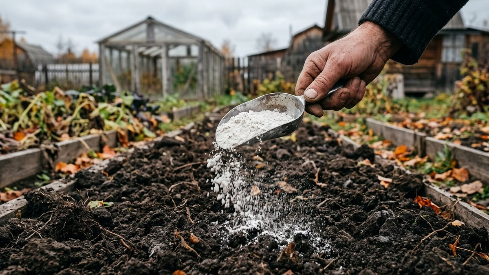
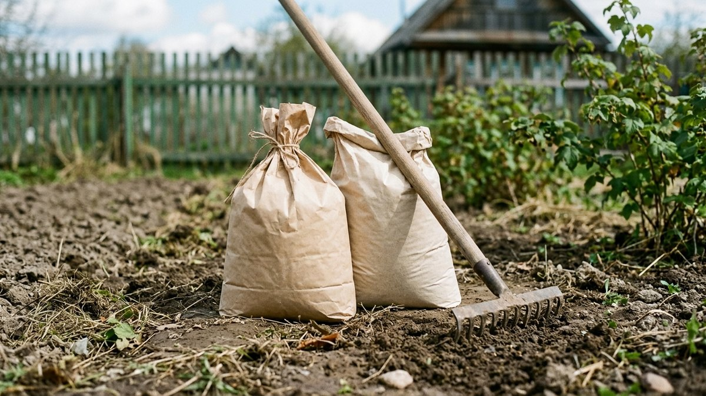
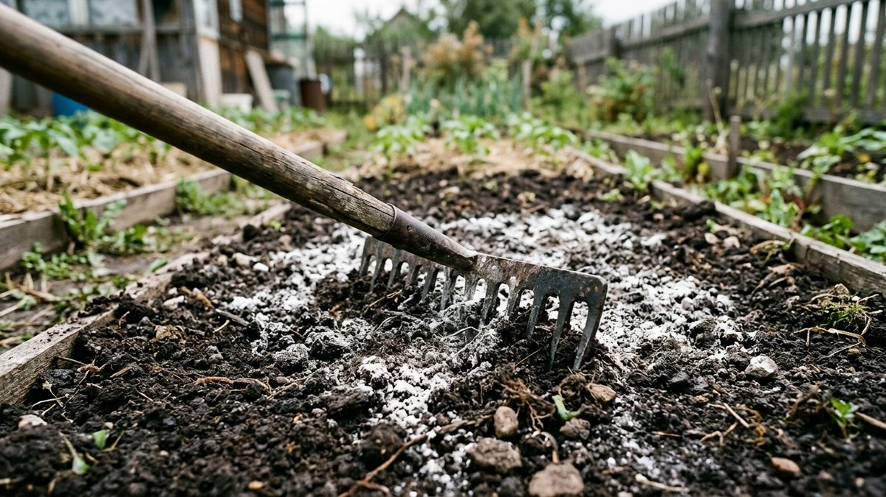
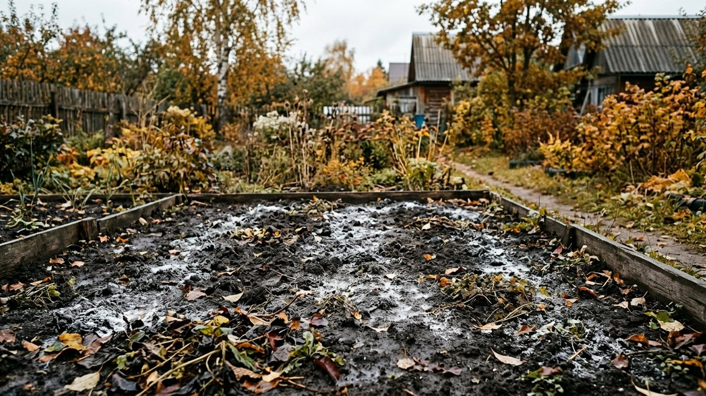
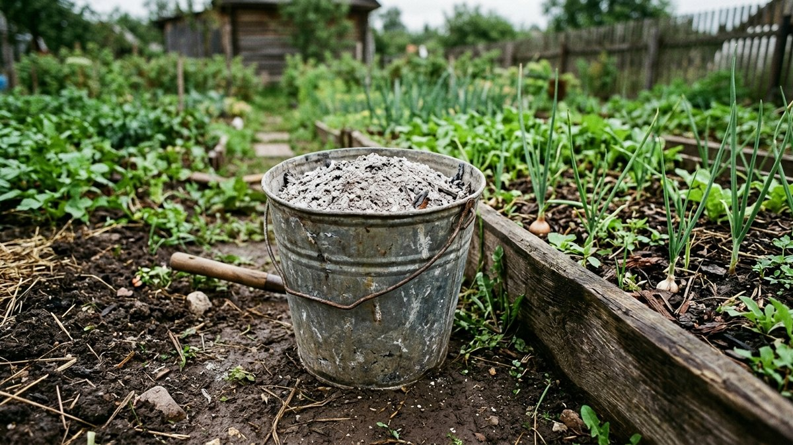
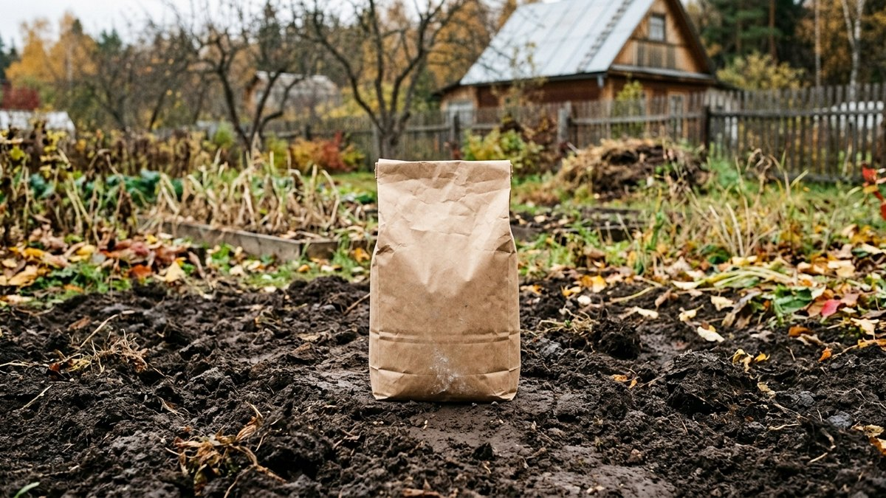

# Известкование почвы осенью: зачем нужно и как правильно сделать

Если на грядках год за годом плохо растёт капуста и свёкла, зато отлично
чувствуют себя щавель, хвощ и мокрица — почва, скорее всего, закислена.
На кислой почве питательные вещества из обычных подкормок усваиваются хуже:
корни не могут взять фосфор и кальций, даже если удобрений внесено с избытком.
Осень — лучшее время исправить это известкованием: материалу нужно несколько
месяцев, чтобы прореагировать с почвой, и к весенней посадке кислотность
успеет прийти в норму. Разберём, как понять, что известкование действительно
нужно, чем его проводить и как не переборщить.

## Как понять, что почва кислая

Точный ответ даёт только анализ — покупной набор с индикаторными полосками
или почвенная лаборатория. Но есть и признаки, по которым можно
сориентироваться без анализа:

- на участке хорошо растут щавель, хвощ полевой, мокрица, подорожник —
  это индикаторы кислой почвы;
- капуста, свёкла, лук плохо развиваются даже при регулярных подкормках;
- после дождя на поверхности земли заметен ржавый или сизый налёт;
- почва тяжёлая, глинистая, плохо пропускает воду.

Ни один из этих признаков сам по себе не доказательство, но три-четыре
совпадения — повод известковать без покупного теста.

## Чем известковать: сравнение материалов

| Материал | Скорость действия | Особенности |
|---|---|---|
| Гашёная известь (пушонка) | Быстрая | Сильное защелачивание, легко переборщить с дозой |
| Доломитовая мука | Медленная, мягкая | Дополнительно даёт магний, безопаснее для регулярного применения |
| Мел молотый | Средняя | Хорошо подходит для лёгких почв |
| Древесная зола | Слабая | Годится для поддержания, а не для сильного закисления |

Для большинства дачных участков доломитовая мука — самый безопасный выбор:
она действует мягче извести, и превысить дозу с ней сложнее, чем с пушонкой.
Известь стоит брать только при сильном закислении и явном недостатке времени
на несколько щадящих подходов доломитовой мукой.

## Нормы внесения

Норма зависит от типа почвы и степени закисления:

- **Песчаная почва:** 300–400 г доломитовой муки на м².
- **Суглинок:** 400–500 г на м².
- **Тяжёлая глинистая почва:** 500–600 г на м².

Для гашёной извести дозу снижают примерно вдвое — материал действует
сильнее. Точную норму лучше уточнить по результату теста кислотности:
чем ниже pH, тем ближе к верхней границе диапазона.

### Калькулятор нормы известкования

Калькулятор берёт нормы из списка выше и уточняет их по pH. Кислотность
делится на классы по стандартной агрохимической шкале: сильнокислая —
до 4,5, среднекислая — 4,6–5,0, слабокислая — 5,1–5,5, близкая к
нейтральной — 5,6–6,0. Если pH не измеряли, выберите «не знаю»:
калькулятор возьмёт середину диапазона.

<!-- wp:html -->

  
Сколько доломитовой муки или извести внести

  <label class="md-calc__label" for="mdIzA">Площадь, м²</label>
  <input type="number" id="mdIzA" class="md-calc__input" min="1" step="1" value="100">
  <label class="md-calc__label" for="mdIzS">Почва</label>
  <select id="mdIzS" class="md-calc__input">
    <option value="300,400">Песчаная, супесь</option>
    <option value="400,500" selected>Суглинок</option>
    <option value="500,600">Тяжёлая глинистая</option>
  </select>
  <label class="md-calc__label" for="mdIzP">pH по тесту</label>
  <select id="mdIzP" class="md-calc__input">
    <option value="1">До 4,5 — сильнокислая</option>
    <option value="0.5">4,6–5,0 — среднекислая</option>
    <option value="0">5,1–5,5 — слабокислая</option>
    <option value="-1">5,6–6,0 — близкая к нейтральной</option>
    <option value="-2">Выше 6,0 — нейтральная</option>
    <option value="0.5x" selected>Не знаю, признаки кислой почвы есть</option>
  </select>
  <label class="md-calc__label" for="mdIzM">Материал</label>
  <select id="mdIzM" class="md-calc__input">
    <option value="1" selected>Доломитовая мука</option>
    <option value="1m">Мел молотый</option>
    <option value="0.5">Гашёная известь (пушонка)</option>
  </select>
  
Заполните поля

<!-- /wp:html -->

## Пошаговая инструкция

1. Уберите с грядки растительные остатки и перекопайте почву на глубину
   штыка лопаты.
2. Равномерно рассыпьте известковый материал по поверхности — граблями
   легче распределить его без пропусков и куч.
3. Заделайте в верхний слой почвы граблями или неглубокой перекопкой —
   на 5–10 см, глубже не нужно.
4. Пролейте грядку водой, если осень сухая — это ускоряет реакцию
   с почвой.
5. Оставьте почву до весны без дополнительных подкормок минеральными
   удобрениями с этого участка.

## Что нельзя совмещать с известкованием

Известкование снижает эффективность азотных удобрений и свежего навоза,
если вносить их одновременно: щёлочь ускоряет улетучивание азота в виде
аммиака, и подкормка теряет смысл. Хорошо перепревший
[компост](https://mir-doma.pro/kak-uskorit-sozrevanie-komposta-osenyu/) в
этом смысле безопаснее свежего навоза — азот в нём уже связан и меньше
улетучивается при контакте с известью, но выдержать интервал всё равно
стоит. Между известкованием и внесением
[осенних подкормок](https://mir-doma.pro/osennie-podkormki/) нужно выдержать
минимум 3–4 недели — сначала известь или доломитовая мука, затем фосфорно-
калийные удобрения, а не наоборот и не одновременно.

По той же причине известкование стоит развести по времени с посевом
[сидератов осенью](https://mir-doma.pro/sideraty-osenyu/): свежепроизвесткованная
почва меньше подходит для быстрого прорастания семян, лучше выдержать пару
недель после внесения. Уже следующим летом на произвесткованном участке
[летние подкормки](https://mir-doma.pro/letnie-podkormki-ovoshchey/) сработают
заметно эффективнее — корневые подкормки перестают «зависать» в кислой
среде и доходят до растений в полном объёме.

## Частые ошибки

- **Известковать каждый год без теста кислотности.** Почва становится
  щелочной, и растения начинают страдать уже от нехватки железа и марганца —
  симптомы похожи на нехватку азота, но подкормка не помогает.
- **Вносить известь под культуры, которые любят кислую почву** — картофель,
  щавель, голубику. Известкование под них снижает урожай, а не повышает.
- **Смешивать известь со свежим навозом или азотными удобрениями в один
  день** — азот улетучивается, эффект от обеих процедур теряется.
- **Известковать локально только грядку с симптомами**, не проверив соседние —
  если участок закислен целиком, точечная обработка даёт временный эффект.

## Частые вопросы

### Можно ли известковать почву золой вместо извести

Зола действует гораздо слабее и подходит только для лёгкого поддержания
уровня pH, а не для исправления сильно закисленной почвы. При явных
признаках закисления зола не заменит доломитовую муку или известь — не
хватит объёма щелочного вещества. Где зола действительно полезна и в каких дозах её вносить, чтобы
не увести почву в щелочь, разобрано в статье [зола как удобрение](https://mir-doma.pro/zola-kak-udobrenie/).

### Как часто нужно известковать почву

На тяжёлых закисленных почвах — раз в 3–4 года, на лёгких песчаных —
реже, раз в 5–6 лет, так как вымывание извести там быстрее. Ежегодное
известкование без теста кислотности — частая причина защелачивания.

### Что будет, если не известковать кислую почву

Питательные вещества из подкормок будут усваиваться хуже независимо от
их количества: фосфор и кальций в кислой среде переходят в
малодоступные для корней формы. Урожайность капусты, свёклы, лука и
большинства садовых культур на такой почве стабильно ниже нормы.

### Можно ли известковать почву весной вместо осени

Можно, но осеннее известкование даёт больше времени материалу
прореагировать с почвой до посадки. При весеннем внесении растения
могут высаживаться раньше, чем закончится реакция, и часть эффекта
теряется.

## Заключение

Известкование — не ежегодная профилактика, а точечное исправление кислой
почвы по факту закисления, подтверждённого тестом или явными признаками.
Осенью для этого лучшие условия: материал успевает подействовать до
весенней посадки, а грядку можно совместить с [обработкой теплицы к
зиме](https://mir-doma.pro/obrabotka-teplicy-osenyu/), если закисление
затронуло и тепличную почву. Главное — развести известкование по времени
с азотными подкормками и не превращать разовую процедуру в ежегодный
ритуал без проверки результата.
