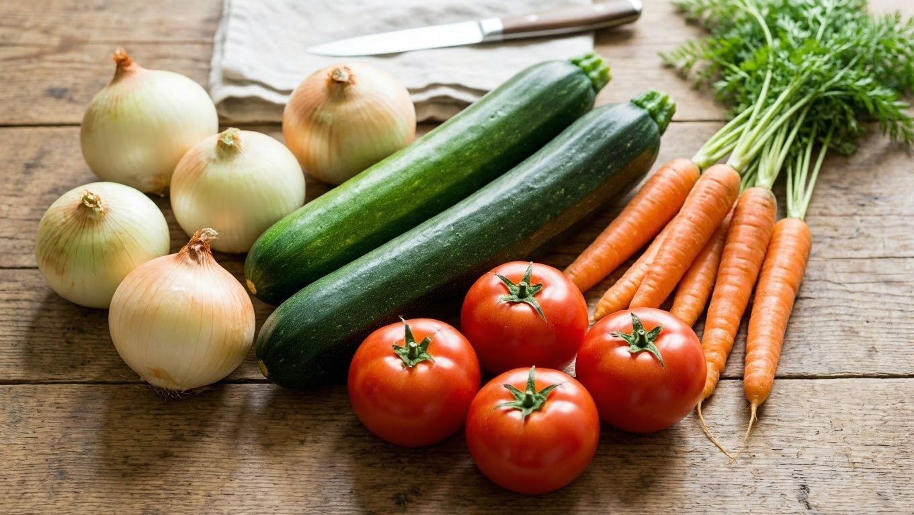
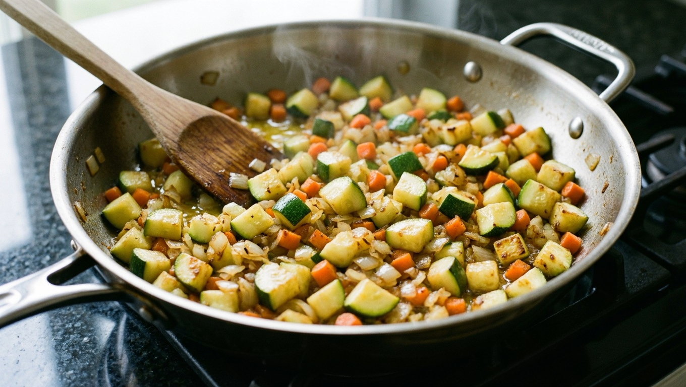
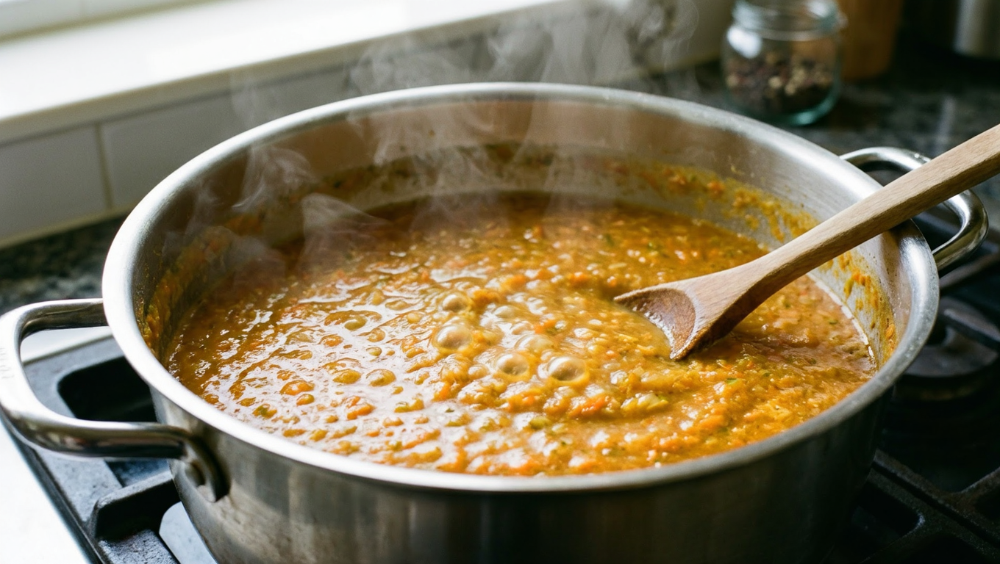
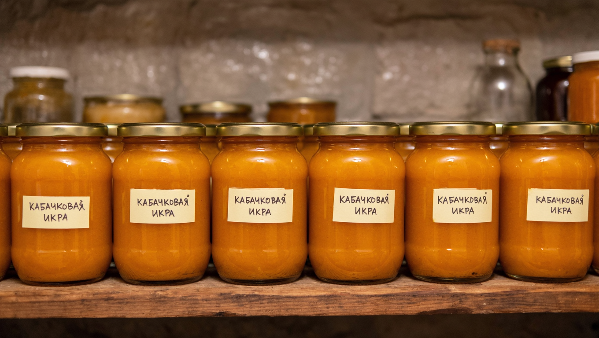

Когда кабачки идут с грядки один за другим, их девают куда угодно — но самая любимая заготовка из них всё равно кабачковая икра. Нежная, густая, с морковно-луковой сладостью — зимой такая банка улетает за один присест. В этой статье собрали классический рецепт кабачковой икры на зиму «пальчики оближешь», проверенные варианты и главные секреты: как сделать икру густой, не водянистой и без горечи, и как правильно её хранить.

Если кабачков много и хочется не только закатать, но и приготовить что-то на стол сейчас — загляните в подборку [блюд из кабачков](https://mir-doma.pro/blyuda-iz-kabachkov-recepty/). А здесь сосредоточимся именно на заготовке икры на зиму.

## 🥕 Что понадобится

Икра хороша тем, что рецепт гибкий — пропорции можно менять на глаз. Классический набор на выход примерно 2–2,5 литра:

- кабачки — 3 кг (очищенные);
- морковь — 500 г;
- репчатый лук — 500 г;
- томатная паста — 3 ст. ложки (или 1 кг свежих помидоров);
- растительное масло — 200 мл;
- сахар — 2 ст. ложки;
- соль — 2 ст. ложки (без горки);
- уксус 9% — 2 ст. ложки;
- чеснок — 3–4 зубчика;
- чёрный перец — по вкусу.

Молодые кабачки можно не чистить, у зрелых обязательно снять кожуру и вычистить семена — иначе икра будет с жёсткими вкраплениями.

## 🥒 Из каких кабачков делать икру

Для икры годятся практически любые кабачки, но есть нюансы, от которых зависит вкус и текстура:

- **Молодые кабачки** — идеальны: тонкая кожица, мягкие семена, нежная мякоть. Их можно не чистить и пускать в дело целиком.
- **Зрелые и крупные** — тоже подойдут, но у них обязательно снимают грубую кожуру и вычищают крупные семена. Иначе в готовой икре попадаются жёсткие волокна и семечки.
- **Цукини** — отличная альтернатива обычным кабачкам, дают более плотную и яркую икру.

Кабачки должны быть здоровыми, без гнили и без горечи. Мелкую плодоножку всегда срезают. Кстати, икра — лучший способ пустить в дело гигантские переросшие кабачки, которые «спрятались» в листве и больше никуда не годятся: очистили, убрали семена — и в казан.

По количеству ориентируйтесь так: из 3 кг очищенных кабачков выходит примерно 2–2,5 литра готовой икры, то есть 4–5 банок по 0,5 л. Удобно готовить сразу большую партию — икра расходится быстро.

## 🍲 Классический рецепт кабачковой икры на зиму

Пошагово — рецепт, который получается всегда:

1. **Подготовка овощей.** Кабачки нарезать кубиком, морковь натереть или измельчить, лук нашинковать.
2. **Обжарка.** На растительном масле обжарить лук до прозрачности, добавить морковь, тушить 5–7 минут. Отдельно обжарить кабачки до мягкости и лёгкой румяности — так уходит лишняя влага.
3. **Соединение.** Сложить овощи в казан или толстостенную кастрюлю, добавить томатную пасту (или перекрученные помидоры), соль, сахар, перец. Тушить на слабом огне 40–50 минут, помешивая.
4. **Измельчение.** Пробить массу погружным блендером до однородности. Вернуть на огонь ещё на 10–15 минут, чтобы икра уварилась и загустела.
5. **Кислота и чеснок.** В конце добавить уксус и продавленный чеснок, прогреть 5 минут. Уксус нужен не только для вкуса, но и для надёжного хранения.
6. **Закатка.** Разложить горячую икру в стерилизованные банки, закатать крышками, перевернуть и укутать до остывания.

## 🔀 Варианты приготовления

Один базовый рецепт легко превращается в несколько:

- **С томатной пастой или с помидорами.** С пастой быстрее и гуще, со свежими помидорами — нежнее и с кислинкой. На вкус хороши оба.
- **Через мясорубку или блендером.** Блендер даёт гладкую «магазинную» текстуру, мясорубка — более деревенскую, с крупинкой. Кто-то специально оставляет часть массы неизмельчённой.
- **Острая икра.** Добавьте острый перец, больше чеснока или ложку аджики — получится пикантный вариант.
- **В духовке.** Овощи можно не жарить, а запечь на противне — так меньше масла и более «печёный» вкус.
- **В мультиварке.** Удобно готовить в режиме «Тушение»: всё закладывается разом, помешивать почти не нужно.

## 💡 Секреты вкусной икры

Чтобы икра получилась густой, негорькой и хранилась без сюрпризов:

- **Уваривайте лишнюю влагу.** Главная причина водянистой икры — недостаточно выпарили жидкость. Кабачки очень сочные, поэтому их обжаривают отдельно и тушат массу подольше, пока она не загустеет.
- **Не жалейте времени на обжарку.** Именно румяные, обжаренные овощи дают тот самый насыщенный вкус, а не варёный.
- **Про горечь.** Сама икра горчить не должна. Если попались горькие кабачки, дело в них — как это исправить и почему [огурцы и кабачки горчат](https://mir-doma.pro/pochemu-ogurtsy-gorchat/), разбирали отдельно; для икры просто берите здоровые плоды и срезайте плодоножку.
- **Соль и сахар — по вкусу.** Пробуйте массу перед закаткой и балансируйте: сахар смягчает кислоту помидоров.

## 🫙 Сколько и как хранить

Кабачковая икра с уксусом, закатанная в стерилизованные банки, спокойно стоит **до года** в прохладном тёмном месте — погребе, подвале или кладовке. Несколько правил надёжного хранения:

- банки и крышки обязательно стерилизовать, икру закатывать горячей;
- для долгого хранения не пропускать уксус — он подавляет размножение бактерий;
- после остывания убрать в прохладу; вскрытую банку держать в холодильнике и съесть за несколько дней.

Если хочется сохранить кабачки без закатки — часть урожая можно просто заморозить; что и как, разбирали в статье [что заморозить на зиму](https://mir-doma.pro/chto-zamorozit-na-zimu/). А общие правила хранения заготовок и овощей — в материале [как хранить овощи зимой](https://mir-doma.pro/kak-hranit-ovoshchi-zimoy/).

## ❓ Частые вопросы

**Как сделать кабачковую икру как в магазине?**
Секрет магазинной текстуры — гладкое измельчение блендером и хорошее уваривание до густоты. Пропорции близки к классическим: кабачки, морковь, лук и томатная паста, всё пробить в однородную массу.

**Почему кабачковая икра получилась водянистой?**
Не выпарили лишнюю влагу. Кабачки очень сочные — их нужно обжаривать отдельно и уваривать массу дольше, пока она не загустеет. Лишнюю жидкость можно слить в процессе.

**Нужно ли стерилизовать банки для икры?**
Да. Для заготовки на зиму банки и крышки стерилизуют, а икру раскладывают горячей и сразу закатывают — это защита от вздутия и плесени.

**Сколько хранится кабачковая икра на зиму?**
Закатанная с уксусом в стерильные банки — до года в прохладном тёмном месте. Вскрытую банку хранят в холодильнике и съедают за 3–4 дня.

**Можно ли приготовить икру без уксуса?**
Для еды сейчас — да. Но для длительного хранения уксус лучше не убирать: без кислоты риск, что банка «взорвётся». Без уксуса икру хранят только в холодильнике и недолго.

**Можно ли делать икру из перезрелых кабачков?**
Можно, но обязательно очистить кожуру и полностью вычистить крупные семена — иначе в икре будут жёсткие вкрапления. По вкусу перезрелые кабачки не хуже молодых.

---

Кабачковая икра — тот случай, когда простые овощи с грядки превращаются в любимую зимнюю заготовку. Приготовьте базовый рецепт, а дальше подстраивайте под себя: острее, гуще, с помидорами или пастой. Другие сезонные заготовки — [помидоры на зиму](https://mir-doma.pro/pomidory-na-zimu-recepty/) и [маринованные огурцы](https://mir-doma.pro/marinovannye-ogurtsy-na-zimu/).
