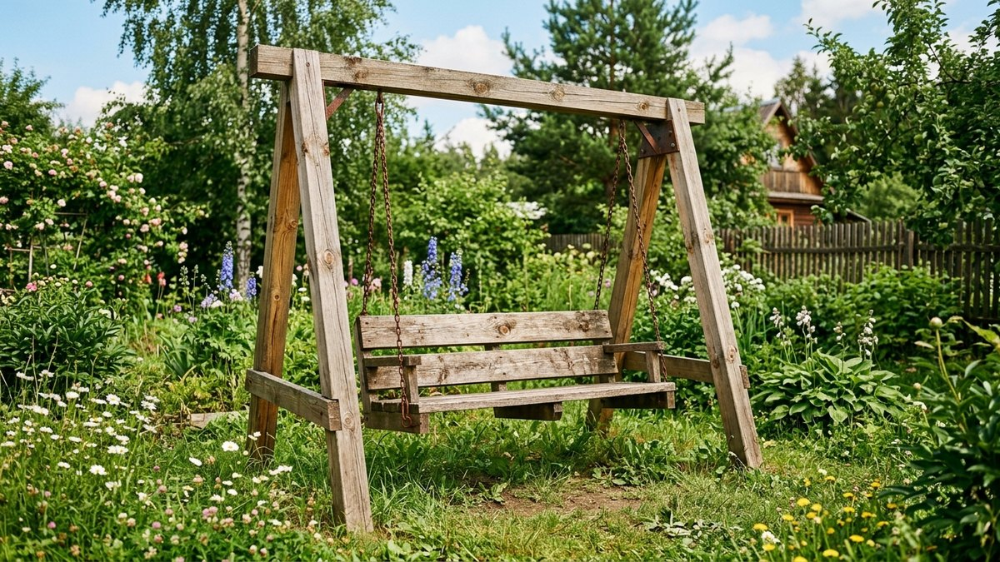
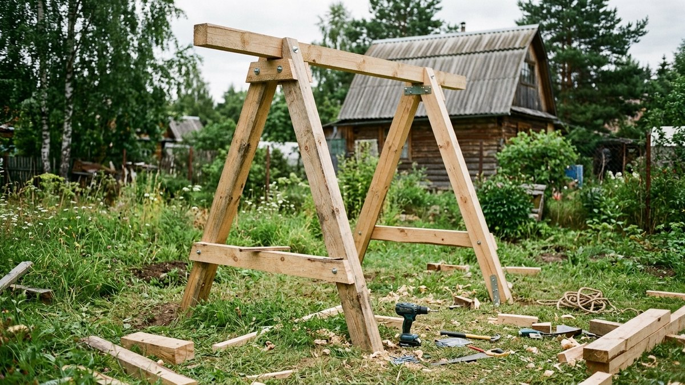
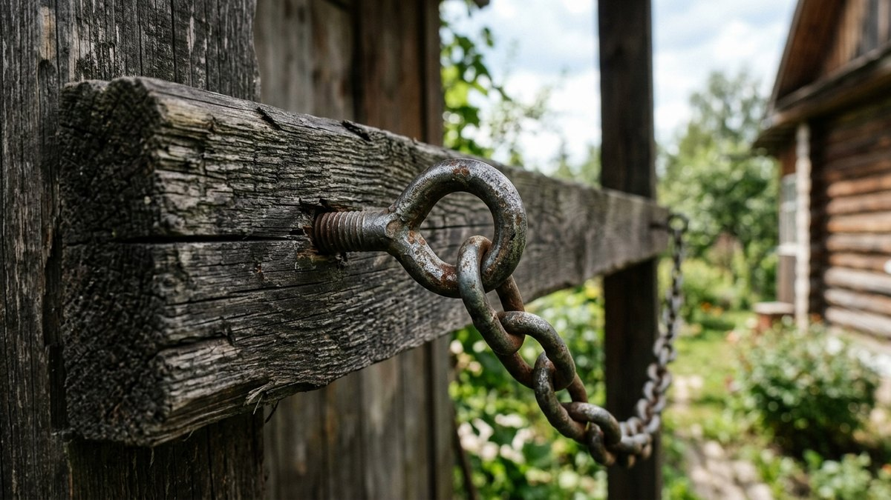
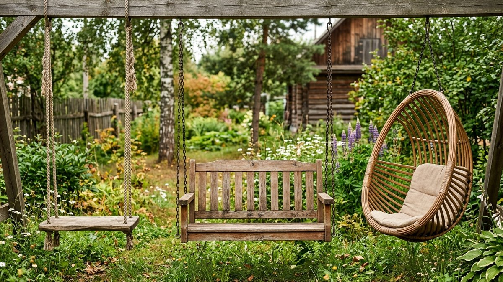
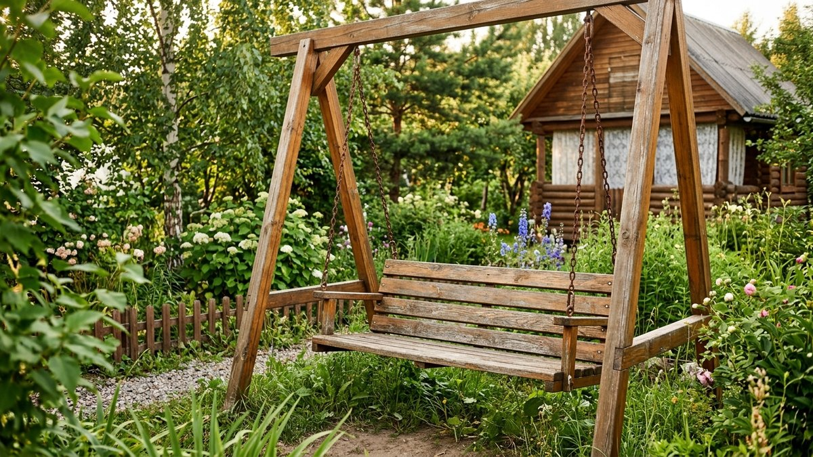
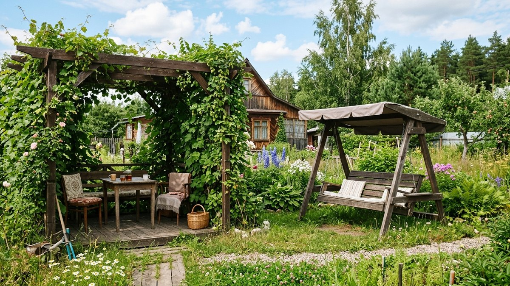

Деревянные качели — одна из самых благодарных построек на даче: материала уходит немного, а пользуются ими и взрослые, и дети весь тёплый сезон. Но чтобы конструкция не шаталась и не расшатала со временем крепления, важно правильно рассчитать размеры каркаса, взять брус нужного сечения и надёжно закрепить подвес. Разберём пошагово, как сделать садовые качели из дерева от каркаса до сиденья.

## Конструкция: А-образная рама или качели у опоры

Есть два основных подхода:

- **Отдельно стоящая А-образная рама** — две пары ножек, поставленных крест-накрест (или буквой «А»), соединённых сверху горизонтальной перекладиной. Не привязана к другим постройкам, можно поставить в любом месте участка.
- **Подвес к существующей опоре** — балке беседки, толстой ветке дерева или перекладине между двумя столбами забора. Дешевле по материалу, но требует надёжной несущей конструкции сверху.

Для большинства дачных участков проще и надёжнее собрать отдельно стоящую раму — она не зависит от прочности сторонних конструкций и её можно перенести при необходимости.

## Сечение бруса и размеры рамы

| Элемент | Сечение / размер |
|---|---|
| Стойки (ножки рамы) | Брус 100×100 мм или брёвна диаметром от 120 мм |
| Верхняя перекладина | Брус 100×150 мм — именно на неё приходится вся нагрузка от подвеса |
| Угол наклона стоек | 60–70° от земли для устойчивости А-образной рамы |
| Высота перекладины от земли | 2,2–2,4 м — даёт достаточный запас для взмаха и роста сиденья |
| Ширина рамы (расстояние между парами стоек) | 1,5–2 м — под одно- или двухместное сиденье с запасом по бокам |

Экономить на сечении верхней перекладины не стоит: именно этот элемент испытывает знакопеременную нагрузку от раскачивания, и при недостаточном сечении со временем появляется прогиб или трещины в месте крепления цепей.

## Порядок сборки

1. **Собрать две А-образные опоры** — попарно скрепить стойки болтами или металлическими уголками у вершины.
2. **Забетонировать или закрепить опоры в грунте** — на постоянное место ставят на бетонные подушки глубиной 40–50 см; для временной установки подойдут металлические анкеры-стаканы.
3. **Уложить и закрепить верхнюю перекладину** на болты сквозным креплением, а не просто на саморезы — соединение несёт всю рабочую нагрузку.
4. **Установить крепления для подвеса** — рым-болты или карабины на цепь, ввинченные в перекладину строго по её оси, с шагом по ширине сиденья.
5. **Закрепить цепи или канаты**, отрегулировав длину подвеса по нужной высоте сиденья.
6. **Собрать и подвесить сиденье.**

## Сиденье: доска, скамья или подвесное кресло

- **Простая доска** — самый быстрый и дешёвый вариант, толщиной от 30–40 мм, с закруглёнными краями и отверстиями под цепь по углам.
- **Скамья со спинкой** — удобнее для долгого сидения, собирается из нескольких досок на раме, требует более прочного крепления цепей в четырёх точках; технику сборки скамьи из дерева можно позаимствовать из статьи про [скамейку для дачи своими руками](https://mir-doma.pro/skameyka-dlya-dachi-svoimi-rukami/), адаптировав крепления под подвес.
- **Подвесное кресло-кокон** — готовое изделие или самодельный каркас, обтянутый тканью или верёвкой, подвешивается на одной точке через вертлюг для свободного вращения.

## Расчёт длины подвеса

Длина цепи или каната от перекладины до сиденья определяет итоговую высоту сиденья над землёй — важно, чтобы взрослому было удобно сидеть и отталкиваться ногами, а маху хватало пространства до земли.

<!-- wp:html -->

<h3 class="md-kc__title">Калькулятор длины подвеса качелей</h3>

Комфортная высота сиденья над землёй в состоянии покоя — обычно 40–50 см.

<label class="md-kc__f">Высота перекладины от земли, см<input type="number" id="kcBeam" value="230" min="150" max="400" step="1"></label>
<label class="md-kc__f">Желаемая высота сиденья от земли, см<input type="number" id="kcSeat" value="45" min="20" max="100" step="1"></label>
<label class="md-kc__f">Толщина сиденья, см<input type="number" id="kcThick" value="4" min="1" max="15" step="0.5"></label>

Длина подвеса<b id="kcChain">181 см</b>

Расчёт для состояния покоя, без учёта растяжения цепи под нагрузкой и амплитуды раскачивания.

<button type="button" id="kcCopy" class="md-kc__btn md-kc__btn--main">Скопировать результат</button>
<a id="kcVk" class="md-kc__btn md-kc__btn--vk" href="#" target="_blank" rel="noopener noreferrer">Поделиться ВКонтакте</a>
<a id="kcTg" class="md-kc__btn md-kc__btn--tg" href="#" target="_blank" rel="noopener noreferrer">Поделиться в Telegram</a>
<button type="button" id="kcShareNative" class="md-kc__btn" hidden>Поделиться…</button>
<button type="button" id="kcPrint" class="md-kc__btn">Печать</button>

<!-- /wp:html -->

## Крепёж: на что вешать сиденье

Цепи надёжнее верёвки и каната — не перетираются о край перекладины и не растягиваются со временем от влаги. Если используете верёвку или канат, на месте контакта с деревом обязательно ставьте металлическую втулку или трубку — иначе верёвка перетирается о перекладину за один сезон активного использования.

Рым-болты вкручивают в перекладину на глубину не менее 8–10 диаметров резьбы и обязательно в массив бруса, а не в торец или скол. Для дополнительной надёжности отверстие под рым-болт можно предварительно проклеить эпоксидным составом — это увеличивает удерживающую способность резьбы в древесине.

## Место установки и зона отдыха

Качели лучше ставить на ровной площадке с небольшим запасом свободного пространства спереди и сзади — минимум 1,5–2 м на амплитуду раскачивания. Хорошо смотрятся и удобно эксплуатируются качели по соседству с остальной зоной отдыха: если рядом уже есть или планируется беседка или патио с [перголой](https://mir-doma.pro/pergola-na-dache-svoimi-rukami/), качели логично встроить в общую композицию, а не ставить особняком у забора. Для отдыха лёжа по соседству удобно поставить и [шезлонг](https://mir-doma.pro/shezlong-svoimi-rukami/) — вместе они закрывают разные сценарии отдыха на одной площадке.

## Частые ошибки

- **Сэкономили на сечении верхней перекладины.** Тонкий брус со временем прогибается и трескается в месте крепления цепей под постоянной знакопеременной нагрузкой.
- **Закрепили опоры без бетонирования** на постоянном месте. Рама со временем расшатывается и «гуляет» при активном раскачивании.
- **Использовали обычную верёвку без защитной втулки** в месте контакта с перекладиной. Верёвка перетирается за один сезон.
- **Вкрутили рым-болты слишком неглубоко** или в скол древесины. Крепление вырывается под нагрузкой взрослого человека или при активном раскачивании детьми.
- **Не оставили запас пространства** перед и позади качелей. Амплитуда взмаха задевает соседние постройки или растения.

## Частые вопросы

### Какой брус самый прочный для качелей: сосна или лиственница?

Лиственница прочнее и устойчивее к гниению во влажной среде, но заметно дороже. Сосна с качественной пропиткой антисептиком и периодическим обновлением защитного покрытия служит вполне достаточно для дачных качелей.

### Нужно ли бетонировать опоры качелей?

Для постоянной установки — да: бетонные подушки в грунте держат раму устойчиво даже при активном раскачивании. Для сезонной установки, которую убирают на зиму, подойдут металлические анкеры-стаканы, вкапываемые без бетона.

### Какую нагрузку выдерживают деревянные качели?

При сечении перекладины 100×150 мм и качественном крепеже конструкция рассчитана на нагрузку до 150–200 кг на одну точку подвеса — этого достаточно для взрослого человека или двух детей на одном сиденье. Для более высокой нагрузки увеличивают сечение перекладины и число точек крепления.

### Можно ли сделать качели без сварки и металлических деталей?

Можно: соединения рамы делают на болтах и деревянных нагелях, а для подвеса используют кольца-карабины вместо сварных рым-болтов, вкручивая обычные оцинкованные рым-болты с резьбой по дереву.

### Как защитить деревянные качели от гниения на зиму?

Осенью конструкцию обрабатывают антисептиком повторно, снимают тканевые и верёвочные элементы на хранение в сухое помещение, а деревянное сиденье и раму оставляют на улице — для постоянной А-образной рамы дополнительное укрытие не требуется, если древесина обработана.

## Заключение

Прочные и долговечные качели — это брус нужного сечения на перекладине, надёжно забетонированная рама, крепёж на цепях с рым-болтами, вкрученными в массив древесины, и правильно рассчитанная длина подвеса под комфортную высоту сиденья. При таком подходе конструкция служит без ремонта не один сезон.
