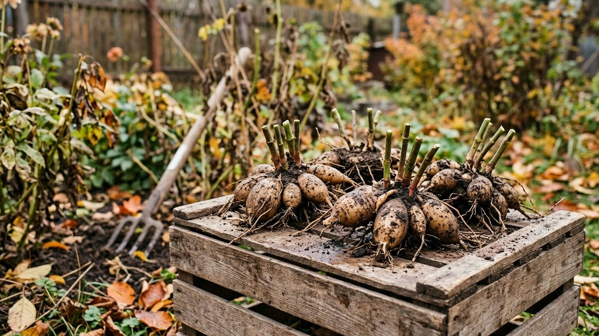
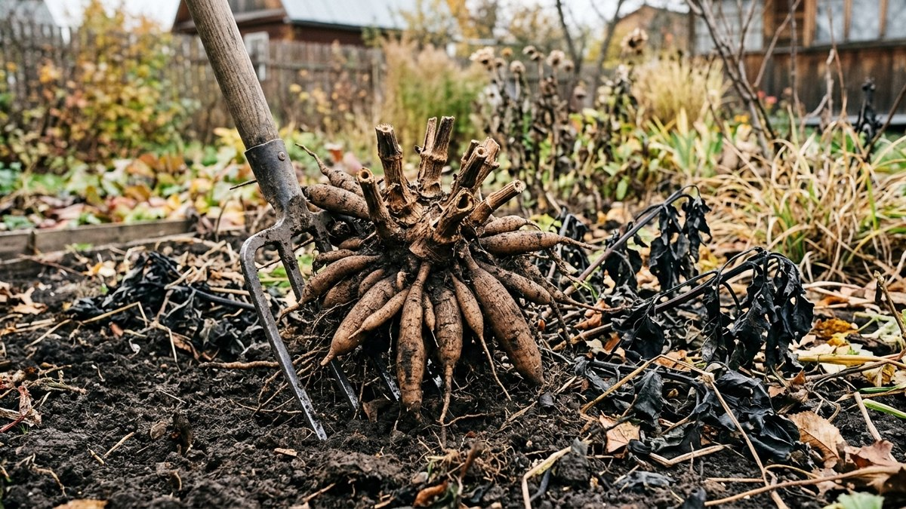
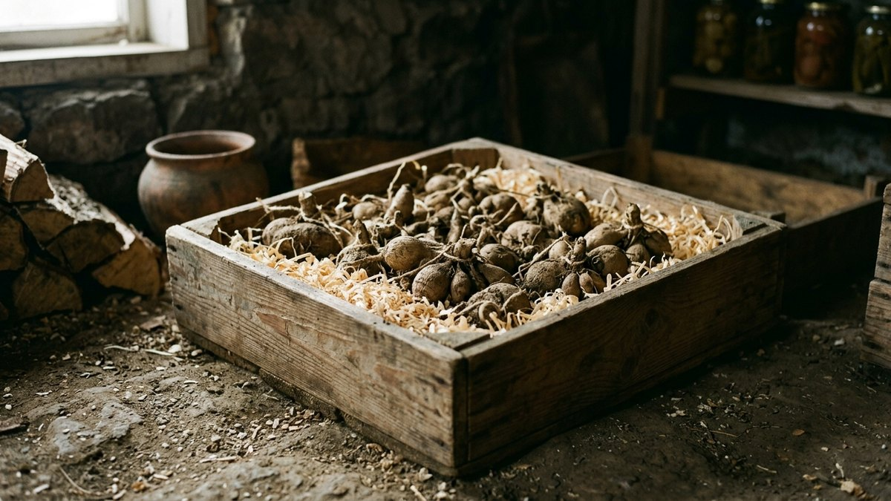
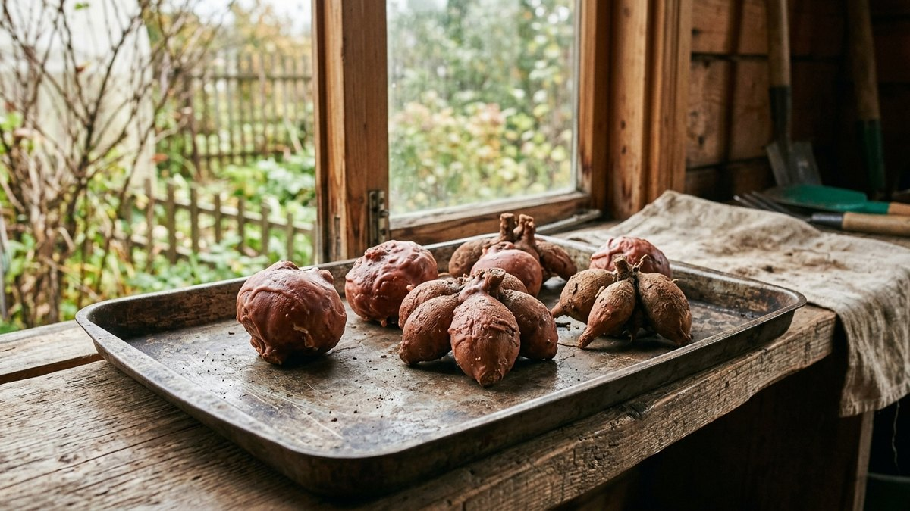
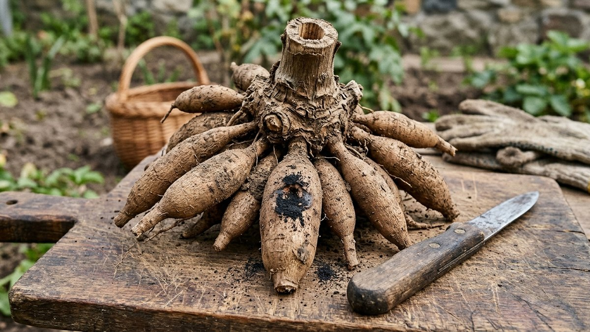
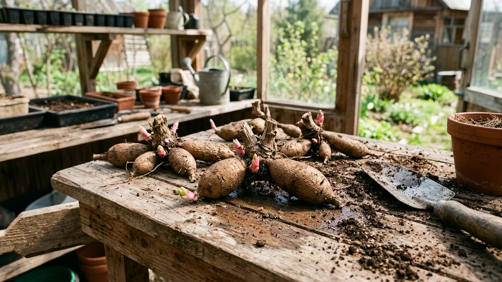

# Как хранить георгины зимой: когда выкапывать, как сушить и где хранить клубни

Георгины в средней полосе не зимуют в грунте: клубни погибают уже при
небольшом промерзании почвы. Поэтому каждую осень их выкапывают, а
весной сажают снова. Самое сложное — не выкопать, а сохранить до весны:
клубни гниют в сырости, сохнут в тепле и прорастают раньше времени,
если в помещении слишком тепло. Разберём, как хранить георгины зимой:
когда выкапывать, как подготовить клубни, где их держать — в погребе, в
квартире или на балконе — и как спасти клубни, если к февралю что-то
пошло не так.

## Когда выкапывать георгины

Сигнал — **первые заморозки**. После ночи с лёгким минусом листья
георгинов чернеют. Через несколько дней после этого, в сухую погоду,
клубни выкапывают. В средней полосе это обычно конец сентября —
октябрь.

Почему не раньше: пока ботва зелёная, клубни дозревают и набирают
запас питания, а «недоспевшие» клубни хуже хранятся. Почему не позже:
при сильном заморозке, когда промерзает верхний слой почвы, корневая
шейка подмерзает и потом загнивает.

## Как выкопать, чтобы не повредить клубни

1. **Срежьте стебли** на высоте 10–15 см от земли. Пенёк понадобится,
   чтобы подписать сорт и по нему же ориентироваться при выкопке.
2. **Подкопайте куст по кругу** на расстоянии 20–30 см от стебля. Клубни
   расходятся широко, вилы у самого стебля их проткнут.
3. **Поднимите куст вилами вместе с комом**, а не тяните за стебель:
   корневая шейка — самое хрупкое место, и клубни без шейки не дадут
   ростков.
4. **Стряхните землю.** Липкую глину можно смыть водой из шланга.
5. **Сразу подпишите сорт**: бирка на стебле или надпись маркером на
   клубне.

## Подготовка к хранению

**Просушка стеблями вниз.** В полых стеблях скапливается вода, и
именно с неё начинается гниль корневой шейки. Выкопанные клубни
несколько часов держат перевёрнутыми, чтобы вода стекла.

**Обработка.** Промытые клубни замачивают на 20–30 минут в растворе
фунгицида по инструкции или в розовом растворе марганцовки. Это
профилактика грибков, которые проявляются к середине зимы.

**Сушка.** Несколько дней в прохладном сухом помещении (+10…+15 °C), не на
солнце и не у батареи. Кожица должна подсохнуть, но клубни не должны
сморщиться.

**Осмотр.** Повреждённые и подгнившие места вырезают острым ножом до
здоровой ткани, срез присыпают толчёным древесным углём.

## Условия хранения

Идеальные условия для клубней георгинов:

- **температура +3…+7 °C**. Теплее — клубни просыпаются и прорастают в
  феврале, холоднее нуля — промерзают;
- **влажность 60–70%**. Суше — клубни сморщиваются, сырее — гниют;
- **вентиляция** без сквозняков.

Эти условия почти совпадают с условиями для овощей в погребе. Как
устроить хранение в погребе и почему там важна вентиляция, разобрано в
статье [как хранить овощи зимой](https://mir-doma.pro/kak-hranit-ovoshchi-zimoy/).

## Пять способов хранения

| Способ | Где | Плюсы | Минусы |
|---|---|---|---|
| Ящик с песком, торфом или опилками | Погреб, подвал | Стабильная влажность, проверено поколениями | Нужен прохладный погреб |
| Вермикулит | Погреб, гараж, балкон | Держит влажность, не гниёт | Дороже опилок |
| Парафин | Квартира | Клубни не сохнут даже в тепле | Трудоёмко, почки просыпаются позже |
| Пищевая плёнка | Квартира, холодильник | Просто, компактно | Нужно проверять на конденсат |
| Термоящик на балконе | Утеплённая лоджия | Выход, если нет погреба | Следить за морозами |

**Ящик с субстратом.** На дно слой сухого песка, торфа или хвойных
опилок, клубни в один-два ряда, пересыпают так, чтобы они не касались
друг друга. Ящики — деревянные или картонные, не пластиковые пакеты.

**Парафин** — для квартиры. Парафин (подойдут свечи) растапливают на
водяной бане, чистые сухие клубни на секунду окунают и дают застыть.
Корочка не даёт влаге уйти. Весной её снимают перед посадкой.

**Плёнка.** Каждый клубень плотно заворачивают в пищевую плёнку и
складывают в коробку в прохладном месте: у балконной двери, в
овощном ящике холодильника.

**Балкон.** Подходит, если лоджия утеплена и в морозы не уходит в минус.
Для надёжности клубни держат в термоящике или в ящике, укрытом старым
одеялом. Как сделать термоящик своими руками и следить за температурой, описано в
статье [хранение овощей на балконе](https://mir-doma.pro/hranenie-ovoshchey-na-balkone/).

## Проверка раз в месяц

Раз в 3–4 недели клубни перебирают:

- **Гниль или плесень** — вырезать до здоровой ткани, срез присыпать
  углём, клубень переложить отдельно.
- **Сморщивание** — субстрат слегка сбрызнуть водой или переложить
  клубни во влажные опилки.
- **Ранние ростки** в феврале — перенести в место прохладнее. Если
  холоднее некуда, клубни можно посадить в горшки и держать на светлом
  окне как рассаду.

## Весной: деление и посадка

Делят клубни весной, когда на корневой шейке проклюнутся почки: осенью
глазки почти не видны, и легко получить деление без точки роста. У
каждого деления должны быть клубень и кусок корневой шейки с почкой.

Высаживают в грунт после окончания возвратных заморозков, в средней
полосе — в конце мая. Проращивание в горшках за 3–4 недели до высадки
даёт более раннее цветение.

Гладиолусы выкапывают и хранят по-другому: у них клубнелуковицы, которые
требуют долгой сушки в тепле. Разница разобрана в статье
[как хранить гладиолусы зимой](https://mir-doma.pro/kak-hranit-gladiolusy-zimoy/).

## Частые ошибки

- **Выкопать до заморозков, с зелёной ботвой.** Клубни не дозрели и
  хуже хранятся.
- **Тянуть куст за стебель.** Отрывается корневая шейка, клубень без
  шейки не прорастёт.
- **Не дать стечь воде из стеблей.** Гниль начинается с шейки.
- **Хранить в полиэтиленовых пакетах в субстрате.** Конденсат, гниль.
- **Тепло.** При +12 °C и выше клубни просыпаются в январе.
- **Не проверять до весны.** Одна гниющая луковица заражает весь ящик.

## Частые вопросы

### Когда выкапывать георгины на хранение

После первых заморозков, когда почернеют листья, в сухую погоду. В
средней полосе — конец сентября или октябрь.

### Как хранить георгины зимой в квартире

В парафине или пищевой плёнке, в самом прохладном месте: у балконной
двери, в кладовке без батареи, в овощном ящике холодильника.
Раз в месяц проверять.

### При какой температуре хранить клубни георгинов

При +3…+7 °C и влажности 60–70%. Выше +10 °C клубни прорастают раньше
времени.

### Нужно ли мыть клубни георгинов перед хранением

Не обязательно, но промытые проще осмотреть и обработать от грибков.
Главное — хорошо просушить после мытья.

### Что делать, если клубни георгинов проросли зимой

Перенести в место прохладнее. Если нет такой возможности — посадить в
горшки и вырастить как рассаду на светлом окне до высадки в мае.

## Итог

Георгины выкапывают после первых заморозков, срезают стебли, дают
стечь воде, обрабатывают и сушат. Хранят при +3…+7 °C и влажности
60–70% — в ящике с опилками или песком в погребе, в парафине или плёнке
в квартире. Раз в месяц клубни перебирают, а делят весной, когда
видны почки.
