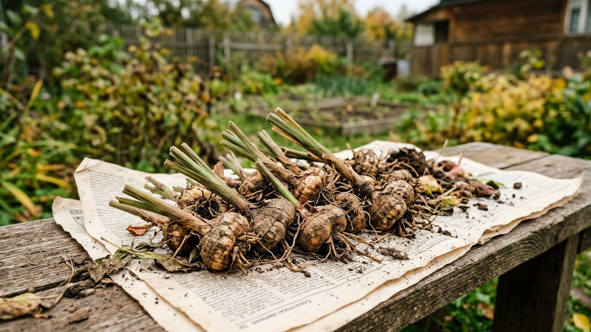
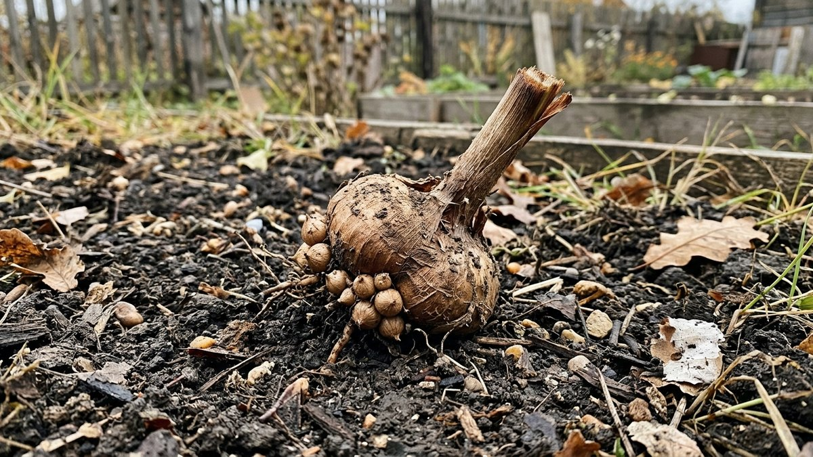
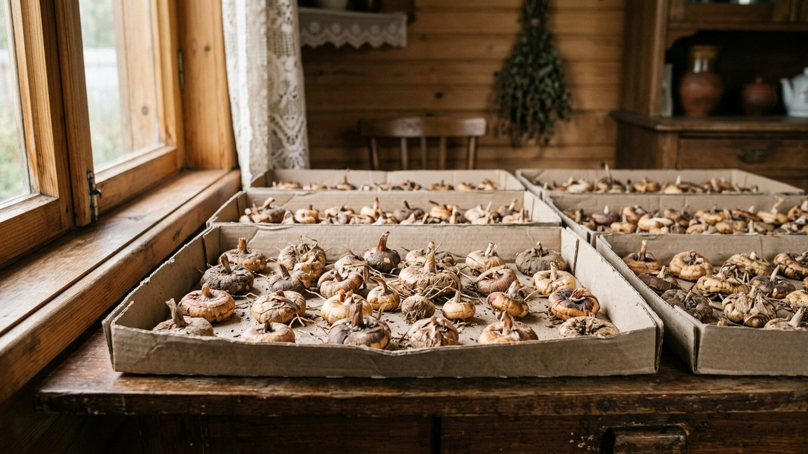
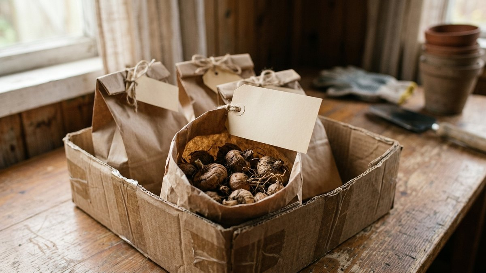
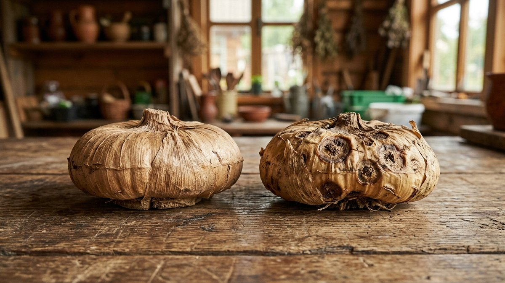
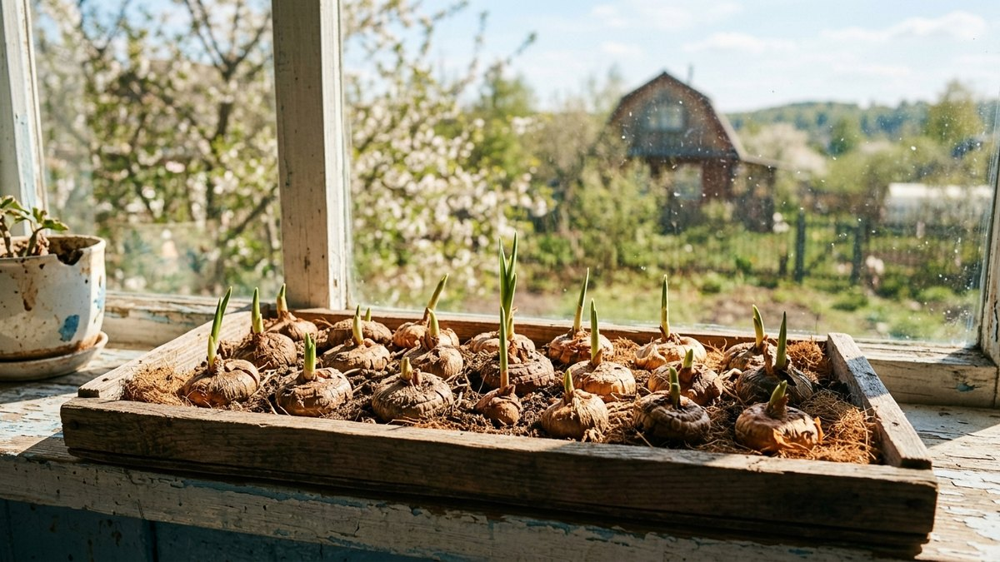

# Как хранить гладиолусы зимой: выкопка, сушка клубнелуковиц и хранение до весны

Гладиолусы, в отличие от георгинов, не ждут заморозков. Их
клубнелуковицы выкапывают раньше, а главное в подготовке к зиме — не
место хранения, а сушка. Плохо просушенная клубнелуковица начинает
гнить к декабрю, а без обработки от трипса к весне от неё остаётся
сухая шелуха. Разберём, как хранить гладиолусы зимой: когда выкапывать,
как сушить в два этапа, чем обработать, где держать клубнелуковицы в
квартире и погребе и что делать с детками.

## Когда выкапывать гладиолусы

Ориентир — **30–45 дней после цветения**. За это время на месте старой
клубнелуковицы вызревает новая, замещающая, и нарастают детки. В средней
полосе гладиолусы выкапывают в сентябре — начале октября, **до первых
заморозков**.

Если лето было холодным и поздние сорта не успевают, их всё равно
выкапывают до заморозков: промёрзшая клубнелуковица не хранится, а
недозревшая хранится хуже, но выживает.

Выкапывают в сухую погоду, начиная с ранних сортов и заканчивая
поздними.

## Как выкопать

1. **Подкопайте растение** лопатой или вилами на расстоянии 10–15 см от
   стебля.
2. **Вытяните клубнелуковицу за стебель** вместе с землёй: у гладиолуса
   стебель держит крепко, в отличие от георгина.
3. **Соберите детки** — мелкие клубнепочки вокруг донца. Часть осыпается
   в землю, их выбирают руками.
4. **Обрежьте стебель**, оставив пенёк 1–2 см.
5. **Подпишите сорт**: в разные пакеты или коробки с этикетками.

## Обработка перед сушкой

Промойте клубнелуковицы от земли и замочите на 20–30 минут в растворе
фунгицида по инструкции или в розовом растворе марганцовки. Это
профилактика грибковых гнилей.

**Трипс** — главный вредитель гладиолусов при хранении. Он прячется
под чешуйками клубнелуковицы и за зиму высасывает её, оставляя
сухие бурые пятна. Если летом на цветках были серебристые пятна и
засохшие бутоны, клубнелуковицы обрабатывают инсектицидом против
трипса строго по инструкции к препарату, до закладки на хранение.
Народный способ — дольки чеснока в коробке с клубнелуковицами — может
отпугнуть, но полноценной обработки не заменяет.

## Сушка в два этапа: главное в хранении

**Этап 1 — тепло, 1–2 недели при +25…+30 °C.** Клубнелуковицы
раскладывают в один слой в сухом тёплом месте: у батареи на
расстоянии, на тёплом чердаке, в котельной. Кожица подсыхает, раны
затягиваются.

**Этап 2 — комнатная температура, 3–4 недели при +20…+22 °C.**
Клубнелуковицы досыхают в коробках с доступом воздуха.

**Отделите старую клубнелуковицу.** Через 2–3 недели сушки старая,
материнская клубнелуковица легко отламывается от новой. Её выбрасывают,
а на новой оставляют корни только если они засохли сами, их не
обрывают на сырой.

Общий срок сушки — около полутора месяцев. Это больше, чем кажется
нужным, но именно недосушенные клубнелуковицы гниют к середине зимы.

## Условия и способы хранения

После сушки клубнелуковицы хранят при **+5…+10 °C** и умеренной
влажности, в темноте и с вентиляцией.

| Где | Как | На что смотреть |
|---|---|---|
| Погреб, подвал | Картонные коробки или деревянные ящики в 1–2 слоя | Не держать рядом с овощами и фруктами, которые дают влагу |
| Квартира | Бумажные пакеты или капроновые чулки в самом прохладном месте | У балконной двери, в кладовке без батареи |
| Холодильник | Бумажный пакет в овощном ящике | Подходит для небольшой коллекции, проверять на влагу |
| Утеплённый балкон | Коробки в термоящике | Не допускать минуса |

**Нельзя:** полиэтиленовые пакеты и плотно закрытые контейнеры. В них
скапливается влага, и клубнелуковицы плесневеют.

Если погреб на даче общий для урожая и цветов, держите клубнелуковицы на
верхних полках, подальше от картофеля и яблок. Температурный режим
погреба и соседство продуктов разобраны в статье
[как хранить овощи зимой](https://mir-doma.pro/kak-hranit-ovoshchi-zimoy/).

## Детки: как хранить отдельно

Детки хранят в тех же условиях, но отдельно и подписанными по сортам.
Они сохраняют всхожесть до двух лет, если их хорошо просушить. Весной
перед посадкой их очищают от жёсткой оболочки или замачивают на сутки,
иначе прорастают медленно. Из деток за один-два сезона вырастают
цветущие клубнелуковицы.

## Проверка зимой

Раз в месяц клубнелуковицы перебирают:

- **мягкие, с гнилью** — выбрасывают, чтобы не заразили соседние;
- **с сухими бурыми пятнами** — возможно, трипс. Такую клубнелуковицу
  обрабатывают отдельно;
- **с ранними ростками** в феврале — переносят в место прохладнее.

## Подготовка к посадке весной

За 2–3 недели до посадки клубнелуковицы достают, очищают от сухих
чешуек, осматривают и раскладывают в светлом тёплом месте ростками
вверх для проращивания. Высаживают, когда почва на глубине 10 см
прогреется до +8…+10 °C — в средней полосе обычно в первой половине
мая.

Георгины хранят иначе: их выкапывают после заморозков и держат в
субстрате, чтобы клубни не пересохли. Подробно — в статье
[как хранить георгины зимой](https://mir-doma.pro/kak-hranit-georginy-zimoy/).
Общий уход за многолетними и луковичными цветами на участке — в статье
[многолетние цветы для дачи](https://mir-doma.pro/mnogoletnie-tsvety-dlya-dachi/).

## Частые ошибки

- **Ждать заморозков, как с георгинами.** Промёрзшие клубнелуковицы не
  хранятся.
- **Короткая сушка.** Неделя вместо полутора месяцев — и гниль к декабрю.
- **Полиэтиленовые пакеты.** Конденсат и плесень.
- **Пропустить обработку от трипса.** К весне от клубнелуковиц остаются
  сухие мумии.
- **Хранить вместе с яблоками и овощами.** Лишняя влага и этилен.
- **Не отделить старую клубнелуковицу.** Она отмирает и может загнить.

## Частые вопросы

### Когда выкапывать гладиолусы на зиму

Через 30–45 дней после цветения, до первых заморозков. В средней полосе
это сентябрь — начало октября.

### Сколько сушить гладиолусы после выкопки

Около полутора месяцев: 1–2 недели в тепле при +25…+30 °C, затем 3–4
недели при комнатной температуре.

### Как хранить гладиолусы зимой в квартире

В бумажных пакетах или капроновых чулках в самом прохладном месте:
у балконной двери, в кладовке, в овощном ящике холодильника. Не в
полиэтилене.

### При какой температуре хранить гладиолусы

При +5…+10 °C, в темноте, с вентиляцией и умеренной влажностью.

### Нужно ли отделять детки от гладиолусов

Да. Детки собирают при выкопке, сушат и хранят отдельно по сортам. Они
сохраняют всхожесть до двух лет.

## Итог

Гладиолусы выкапывают до заморозков, через 30–45 дней после
цветения. Клубнелуковицы обрабатывают от грибков и трипса, сушат в два
этапа около полутора месяцев, отделяют старую клубнелуковицу и хранят
при +5…+10 °C в бумаге, а не в полиэтилене. Проверка раз в месяц
спасает коллекцию от одной загнившей луковицы.
