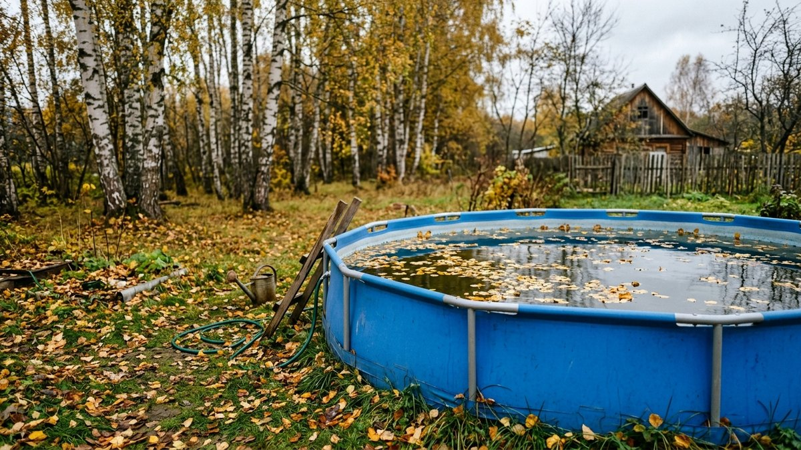
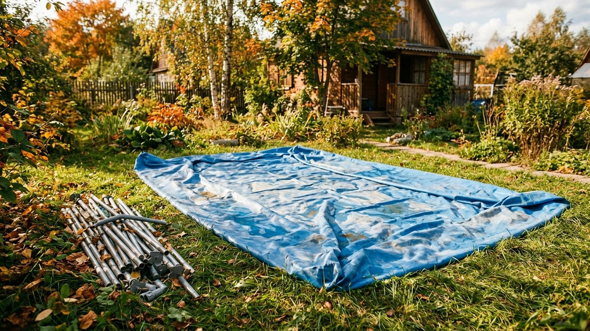
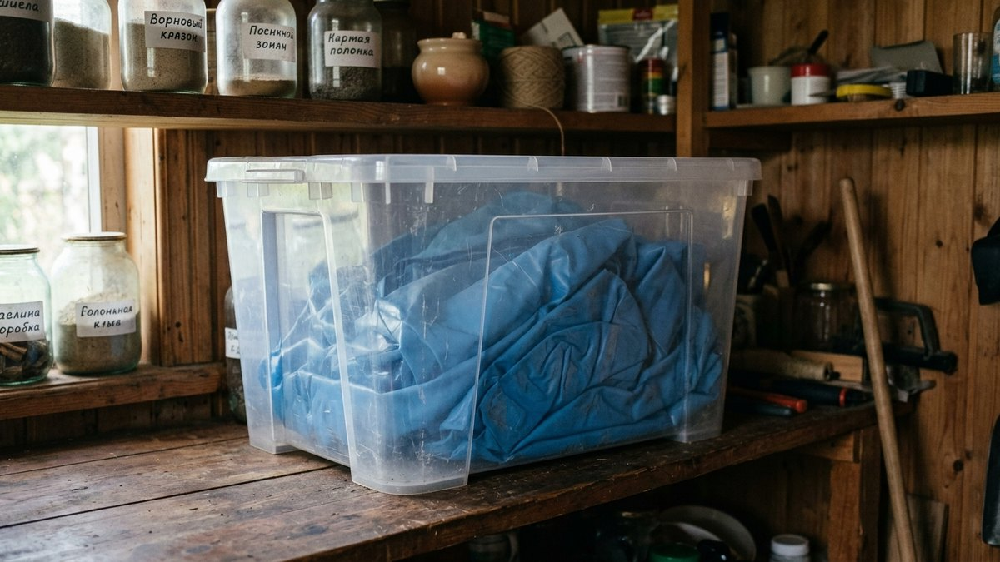
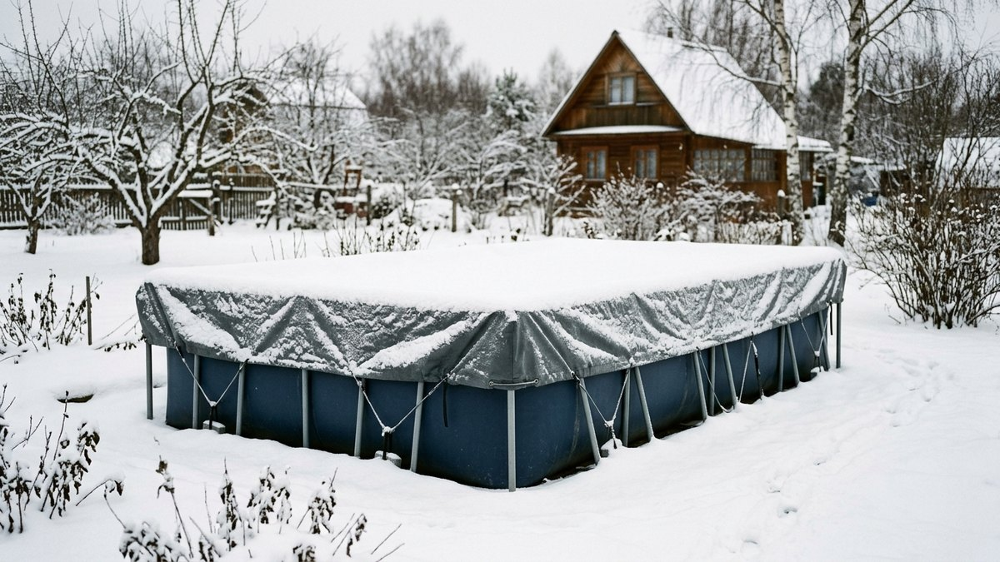
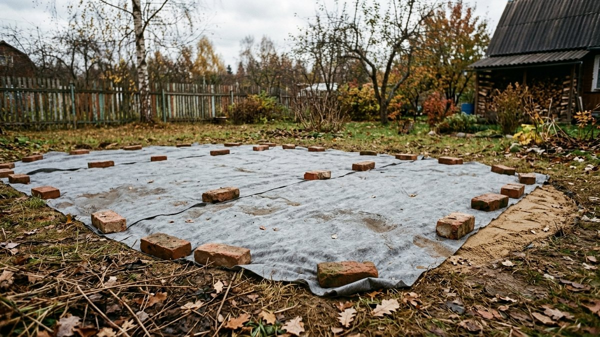
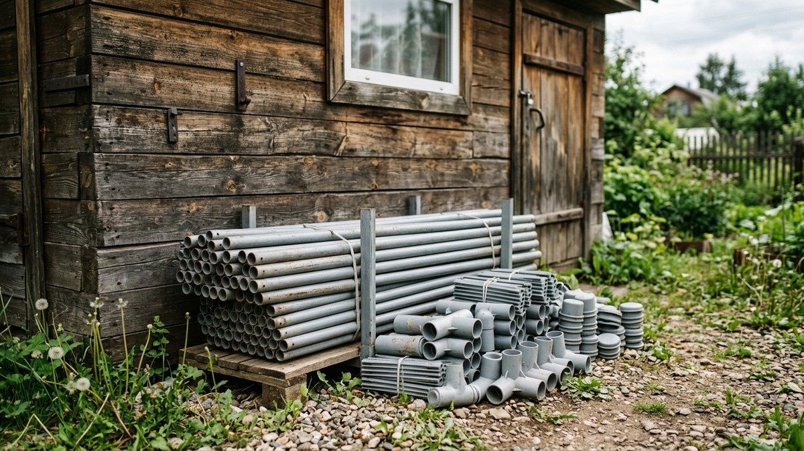

Как хранить каркасный бассейн зимой, решают в сентябре — октябре,
когда вода остыла и купаться уже никто не будет. Ошибка здесь стоит
целого бассейна: ПВХ-чаша, сложенная мокрой, к весне покрывается
плесенью, сложенная на холоде — трескается на сгибах, а оставленная
на улице без подготовки рвётся льдом. Ниже — когда бассейн нужно
разбирать, а когда его можно оставить, куда слить воду, чтобы не
загубить грядки, как просушить и сложить чашу, где её хранить и что
делать с насосом и фильтром. Калькулятор посчитает объём воды и сколько
времени займёт слив.

## Разбирать или оставить на зиму

Ответ всегда в инструкции вашей модели, и он почти всегда один:
**большинство производителей каркасных бассейнов требуют разбирать их
на зиму**, когда температура опускается ниже примерно +5 °C. Оставлять
на улице разрешают только модели, у которых это прямо указано, — обычно
их называют всесезонными или морозостойкими.

| | Разобрать | Оставить на улице |
|---|---|---|
| Для каких моделей | Любые каркасные | Только с пометкой «всесезонный» в инструкции |
| Риск | Минимальный при правильной сушке | Лёд давит на стенки, снег рвёт тент, мыши |
| Работа осенью | Слить, вымыть, просушить, сложить | Понизить уровень, снять оборудование, компенсаторы льда, тент |
| Работа весной | Собрать заново | Почистить и долить |
| Гарантия | Сохраняется | Может не распространяться на морозные повреждения |

Если сомневаетесь, разбирайте. Новый бассейн стоит дороже одного
выходного на разборку.

## Калькулятор: сколько воды сливать и как долго

Введите размеры бассейна и уровень воды. Калькулятор посчитает объём
и время слива: самотёком через шланг и дренажным насосом.

<!-- wp:html -->

  
Калькулятор слива бассейна

  <label class="md-calc__label" for="mdBpF">Форма</label>
  <select id="mdBpF" class="md-calc__input">
    <option value="r">Круглый</option>
    <option value="p">Прямоугольный</option>
  </select>
  <label class="md-calc__label" for="mdBpA">Диаметр или длина, м</label>
  <input type="number" id="mdBpA" class="md-calc__input" min="0" step="0.05" value="3.66">
  <label class="md-calc__label" for="mdBpB">Ширина, м (для прямоугольного)</label>
  <input type="number" id="mdBpB" class="md-calc__input" min="0" step="0.05" value="2">
  <label class="md-calc__label" for="mdBpH">Уровень воды, см</label>
  <input type="number" id="mdBpH" class="md-calc__input" min="0" step="1" value="70">
  <label class="md-calc__label" for="mdBpQ">Производительность дренажного насоса, м³/ч</label>
  <input type="number" id="mdBpQ" class="md-calc__input" min="0" step="0.5" value="7">
  
Заполните поля

<!-- /wp:html -->

Время самотёка — ориентир: всё зависит от перепада высот и длины шланга.
Дренажный насос в разы быстрее, но последние 2–3 см со дна он не возьмёт —
их убирают губкой и ведром.

## Куда слить воду из бассейна

- **Если воду не хлорировали** или химию не добавляли последние 7–10
  дней, её можно лить на газон, под деревья и кусты. Не одним местом:
  перекладывайте шланг, чтобы вода уходила в землю, а не стояла лужей.
- **Если хлорировали недавно**, дайте воде постоять 3–5 дней без
  добавок под открытым небом: свободный хлор выветривается. Проверить
  можно тест-полосками — показатель должен быть близок к нулю.
- **Не на грядки с овощами** большими объёмами и не к соседям: 10–15 м³
  воды за раз — это заболоченный участок и подтопленный погреб.
- **В дренажную канаву или колодец**, если они есть. Сливать в септик
  нельзя: такой объём переполнит его и вынесет бактерии.

## Как разобрать и сложить каркасный бассейн: по шагам

Работу делают в тёплый сухой день: при +10 °C и выше ПВХ эластичный,
при морозе — ломкий, и на сгибах появляются трещины.

1. **Снимите оборудование**: насос, фильтр, скиммер, лестницу, шланги.
   Отверстия в чаше закройте заглушками из комплекта.
2. **Слейте воду** через сливной клапан, подсоединив садовый шланг,
   или дренажным насосом. Остатки со дна — губкой и ведром.
3. **Вымойте чашу** мягкой щёткой или губкой с мягким моющим средством,
   без абразивов и растворителей. Налёт на ватерлинии — специальным
   средством для бассейнов.
4. **Разберите каркас**: стойки, балки, соединители. Перед разборкой
   сфотографируйте узлы или пронумеруйте детали малярным скотчем.
5. **Просушите всё** — это главный шаг. Чашу расстелите на чистой
   траве или плёнке на 1–2 солнечных дня, переворачивая, пока не
   высохнут обе стороны и все складки. Каркас протрите насухо.
6. **Присыпьте чашу тальком**, если это рекомендует инструкция: он не
   даёт ПВХ слипаться при хранении.
7. **Сложите свободно**: сначала в квадрат или прямоугольник, потом
   рулоном, без острых заломов. Не туго, не перетягивая верёвкой.
8. **Упакуйте** в пластиковый ящик с крышкой. Мешок на полу сарая —
   почти гарантированно погрызенная мышами чаша.

## Где хранить бассейн зимой

Производители обычно указывают температуру хранения в пределах от 0
до +40 °C — посмотрите её в инструкции вашей модели. Лучше всего:

- **отапливаемый дом, кладовка, сухой подвал** — оптимально;
- **гараж или утеплённая веранда** — если там не бывает сильного
  мороза и сырости;
- **неотапливаемый сарай** — допустимо, только если чаша сложена
  заранее в тепле, лежит в закрытом ящике на полке, а не на полу,
  и её не трогают до тепла: на морозе ПВХ ломается при разворачивании;
- **чердак** — только если зимой там не бывает конденсата и летом
  не перегревается выше +40 °C.

Каркас можно хранить в любом сухом месте, на морозе металлу и пластиковым
соединителям ничего не будет. Резиновые уплотнители и кольца снимите,
высушите и храните с чашей в тепле.

## Насос, фильтр, лестница

- **Насос** слейте полностью, просушите и храните в доме: вода
  в корпусе на морозе разрывает его.
- **Картриджный фильтр** промойте и высушите, если картридж старый —
  выбросьте и купите новый к сезону: зимовку он переживает плохо.
- **Песчаный фильтр** слейте, откройте все краны, бак храните в сухом
  месте. Песок меняют раз в 2–3 сезона.
- **Шланги** промойте, просушите, сверните кольцами без заломов.

Тот же принцип — всё, где может остаться вода, слить и убрать
в тепло — работает для всего летнего водопровода на участке. Полный
порядок, что и в какой последовательности сливать, разобран в статье
про [консервацию полива и водопровода на зиму](https://mir-doma.pro/konservaciya-poliva-na-zimu/).

## Если оставить бассейн на улице с водой

Только для моделей, где это разрешено инструкцией. Порядок:

1. **Почистите воду и стенки**, сделайте шоковое хлорирование
   по инструкции к химии, чтобы вода не зацвела под тентом.
2. **Понизьте уровень** на 10–15 см ниже форсунок и скиммера.
   Не сливайте полностью: пустая чаша без воды на морозе деформируется
   от ветра и снега.
3. **Снимите насос, фильтр, скиммер**, отверстия закройте заглушками.
4. **Положите компенсаторы льда** — специальные поплавки или
   пластиковые бутылки, частично заполненные песком, на верёвке
   вдоль стенок. Лёд сжимает их, а не давит на стенку.
5. **Накройте плотным тентом** по размеру с креплением по борту.
   Снег на тенте после сильных снегопадов сметают: его вес рвёт тент
   и тянет борта внутрь.

Риск всё равно остаётся: если зима с оттепелями и сильными морозами,
лёд ходит и может прорвать чашу у дна. Поэтому большинство владельцев
каркасных бассейнов всё-таки их разбирают.

## Площадка под бассейн

Площадку под бассейн зимой оставляют как есть. Если под чашей был
слой песка и подложка, накройте место плёнкой или геотекстилем и
придавите: весной меньше работы по выравниванию. Где на участке лучше
ставить бассейн, чтобы он не оказался в тени и не мешал другим зонам,
разобрано в статье про
[планировку участка 10 соток с баней, гаражом и бассейном](https://mir-doma.pro/planirovka-uchastka-10-sotok-s-baney-garazhom/).

Остальные работы по закрытию дачи на зиму — что отключить, что слить
и что убрать под крышу, — собраны в статье про
[консервацию дачи на зиму](https://mir-doma.pro/konservaciya-dachi-na-zimu/).

## Частые ошибки

- **Сложили влажным.** Плесень и запах к весне, иногда — склеившиеся
  слои ПВХ.
- **Разбирали в холод.** ПВХ ниже +5 °C теряет эластичность, на сгибах
  появляются трещины.
- **Хлорированную воду — на грядки** сразу после шоковой обработки.
- **Мешок на полу сарая.** Мыши прогрызают ПВХ за зиму.
- **Насос оставили в сарае с водой** — треснувший корпус.
- **Оставили на улице модель, не рассчитанную на зиму**, — чаша
  рвётся льдом, гарантия не действует.

## Частые вопросы

### Как хранить каркасный бассейн зимой

Разберите, слейте воду, вымойте и полностью просушите чашу, сложите
её без острых заломов и уберите в пластиковый ящик в сухое помещение
с температурой выше 0 °C. Каркас храните отдельно, насос и фильтр —
слитыми, в тепле.

### Можно ли оставить каркасный бассейн на улице зимой

Только если это прямо разрешено в инструкции к вашей модели. Тогда
уровень воды понижают на 10–15 см ниже форсунок, снимают оборудование,
кладут компенсаторы льда и накрывают тентом. Большинство каркасных
бассейнов на зиму разбирают.

### Где хранить каркасный бассейн зимой

В отапливаемом доме, кладовке, сухом подвале или гараже без сильного
мороза. В неотапливаемом сарае — только сложенным заранее в тепле,
в закрытом ящике на полке и не трогая до весны.

### Как сложить каркасный бассейн на зиму

Сначала полностью просушите обе стороны, присыпьте тальком, если это
советует инструкция, затем сложите в квадрат и свободный рулон без
острых сгибов. Складывать в тёплый день, от +10 °C.

### Куда слить воду из бассейна на даче

На газон и под деревья, перекладывая шланг, или в дренажную канаву.
Если воду хлорировали, дайте ей постоять 3–5 дней без химии. В септик
и на соседний участок сливать нельзя.
