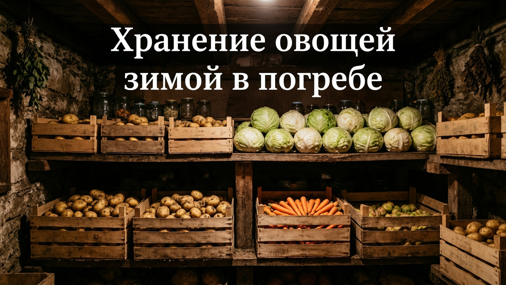
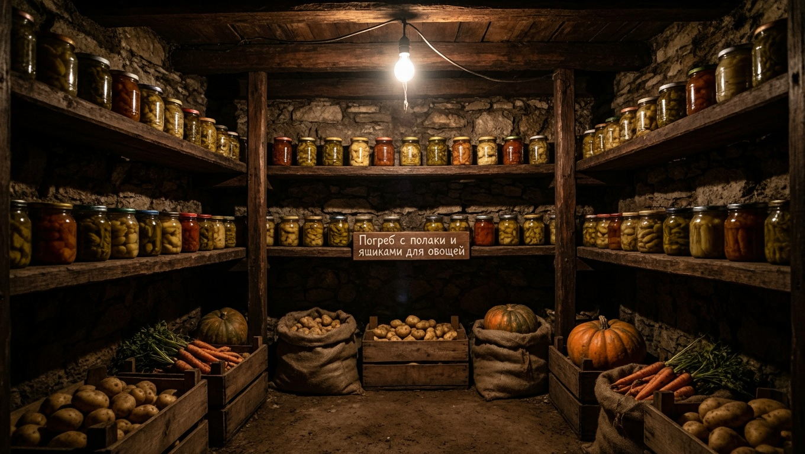
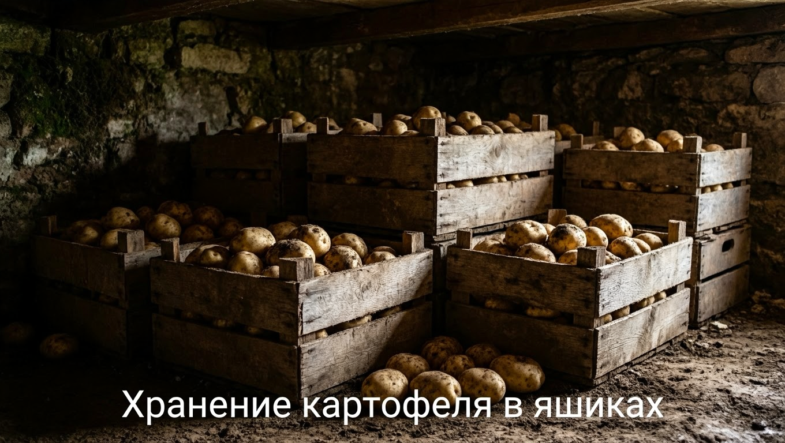
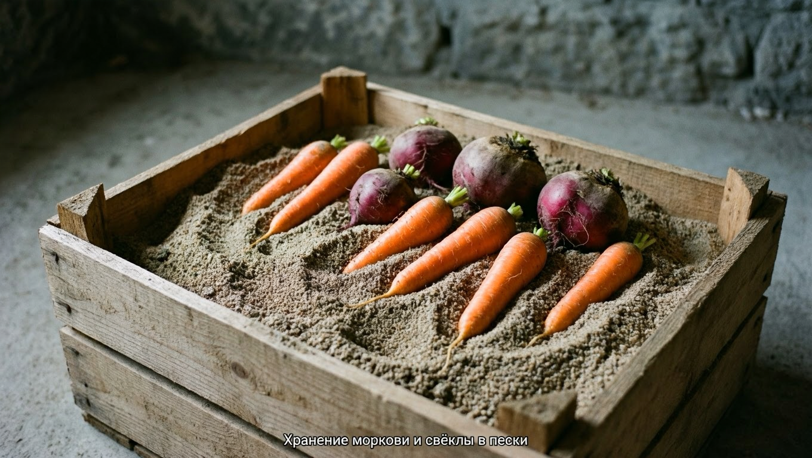
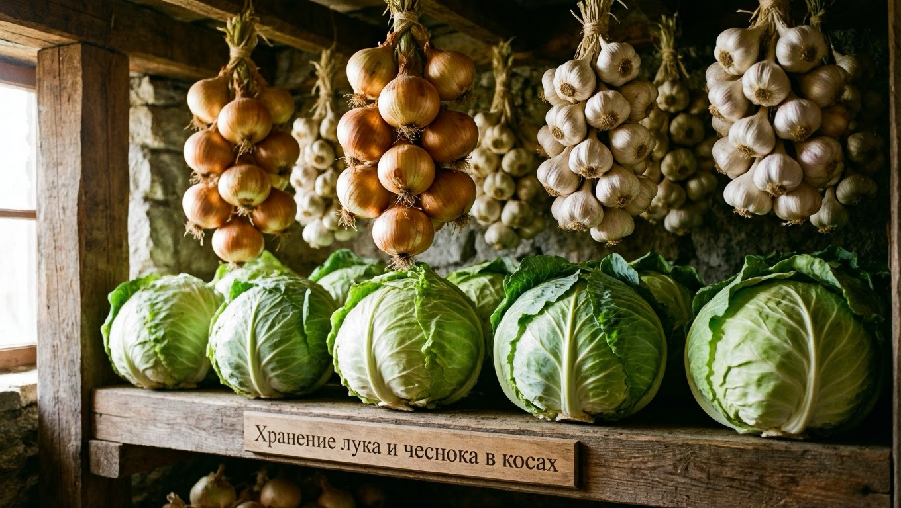
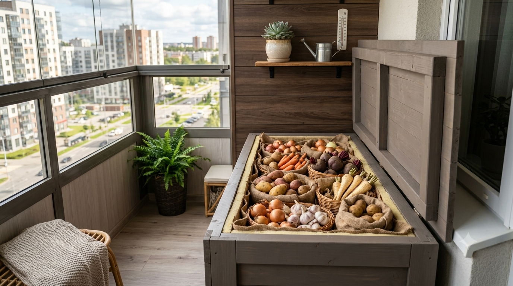

Вырастить хороший урожай — это половина дела, вторая половина — сохранить его до весны. Неправильное хранение сводит на нет все труды: картофель прорастает, морковь вянет, капуста гниёт. Но стоит соблюсти несколько простых условий — и овощи пролежат свежими всю зиму, будь то погреб, балкон или обычная квартира. В этой статье разберём, как хранить овощи зимой: какие нужны условия, где и как хранить картофель, морковь, свёклу, капусту, лук и другие овощи, и каких ошибок избегать.

## ❄️ Условия хранения овощей

У большинства овощей требования к хранению схожи, и главное — создать правильный микроклимат:

- **Температура** — для корнеплодов и картофеля около 0…+2…+5 °C; для лука и чеснока может быть суше и теплее.
- **Влажность** — высокая (85–95%) для корнеплодов и капусты, чтобы они не вяли; низкая (60–70%) для лука и чеснока.
- **Темнота** — свет вызывает прорастание и позеленение (особенно у картофеля).
- **Вентиляция** — свежий воздух не даёт скапливаться сырости и развиваться плесени.

Если эти условия соблюдены, овощи хранятся месяцами практически без потерь. Резкие перепады температуры так же вредны, как и неправильный уровень: от них на овощах образуется конденсат, и они начинают гнить. Поэтому важна стабильность микроклимата.

## 🏠 Где хранить овощи

Подходящих мест несколько, и выбор зависит от того, есть ли у вас частный дом:

- **Погреб или подвал** — идеальный вариант: там прохладно, темно и стабильная влажность.
- **Утеплённый балкон** — выручает в квартире, если оборудовать термоящик или «балконный погребок».
- **Холодильник** — для небольших запасов и овощей, которые едят в первую очередь.
- **Тёмная кладовка** — подходит для лука, чеснока и тыквы, которым нужно сухое место.

Перед закладкой урожая погреб проветривают, просушивают и при необходимости дезинфицируют — это защищает запасы от плесени и грызунов. И главное — убедитесь, что работает [вентиляция в погребе](https://mir-doma.pro/ventilyaciya-v-pogrebe/): без воздухообмена конденсат и плесень погубят урожай, каким бы качественным он ни был.

## 🥕 Как хранить разные овощи

У каждого овоща свои особенности хранения — разберём основные.

### Картофель

Картофель хранят в темноте (на свету он зеленеет и накапливает вредный соланин) при +2…+4 °C и влажности около 85–90%. Его держат в ящиках или закромах с вентиляцией, слоем не слишком высоким. Важно не хранить картофель рядом с яблоками — они выделяют этилен, из-за которого клубни быстрее прорастают. Перед закладкой картофель просушивают и перебирают, а на хранение отбирают только целые, здоровые клубни без повреждений. Поверх полезно положить несколько свёкл — они забирают лишнюю влагу.

### Морковь и свёкла

Эти корнеплоды любят прохладу (0…+2 °C) и высокую влажность (90–95%), иначе вянут. Лучший способ — уложить их в ящики, пересыпая влажным песком или опилками, которые сохраняют влагу и не дают им соприкасаться. Свёкла хранится легче моркови и хорошо лежит просто в ящиках, в том числе поверх картофеля. Морковь же самая капризная из корнеплодов, поэтому именно её чаще всего пересыпают песком или хранят в закрытых пакетах.

### Капуста

Капусту хранят при 0…+1 °C и высокой влажности. Кочаны раскладывают на полках, подвешивают за кочерыжку или оборачивают бумагой либо плёнкой. Для хранения оставляют плотные, неповреждённые кочаны поздних сортов, срезая их с несколькими кроющими листьями. Ранние и рыхлые сорта для длительного хранения не годятся — они быстро вянут и портятся.

### Лук и чеснок

Луку и чесноку, в отличие от корнеплодов, нужно сухое место с влажностью 60–70%. Их хранят в косах, сетках, капроновых чулках или ящиках в сухом проветриваемом помещении. Чеснок неплохо лежит и при комнатной температуре в квартире. Перед хранением лук и чеснок обязательно хорошо просушивают, иначе они начнут гнить; шейку луковицы оставляют подлиннее, а у чеснока не обрезают корешки слишком коротко.

### Тыква и кабачки

Тыкву и кабачки хранят в сухом месте при +10…+15 °C — им подходит комнатная кладовка. Раскладывают их на подстилке так, чтобы плоды не касались друг друга, с плодоножкой. В таких условиях тыква лежит несколько месяцев.

### Помидоры, огурцы и перец

Эти овощи долго не хранятся — их держат в прохладе или холодильнике и съедают в первую очередь. Бурые помидоры можно оставить дозревать при комнатной температуре, о чём мы рассказывали в статье, [почему помидоры не краснеют](https://mir-doma.pro/pomidory-ne-krasneyut/).

## 📦 Тара и способы хранения

Правильная тара помогает сохранить урожай:

- **Деревянные и пластиковые ящики** с отверстиями — для вентиляции.
- **Сетки и капроновые чулки** — для лука и чеснока.
- **Влажный песок и опилки** — для пересыпки моркови и свёклы.
- **Бумага и плёнка** — для оборачивания капусты и отдельных плодов.

Овощи перед закладкой не моют (только обсушивают), перебирают и закладывают только целые, здоровые экземпляры.

## 🧊 Как хранить овощи в квартире

Без погреба тоже можно сохранить урожай:

- **Утеплённый балкон** — оборудуйте термоящик («балконный погребок») с подогревом или без, где поддерживается прохлада, но нет мороза. Как собрать такой ящик своими руками и при какой температуре держать овощи — подробно в статье про [хранение овощей на балконе зимой](https://mir-doma.pro/hranenie-ovoshchey-na-balkone/).
- **Холодильник** — овощной отсек подходит для небольших запасов моркови, свёклы, капусты.
- **Тёмная кладовка** — для лука, чеснока и тыквы, которым нужно сухое место.

Запасы в квартире делают небольшими и регулярно перебирают, чтобы вовремя убрать начавшие портиться овощи. Часть урожая, который трудно сохранить в городских условиях, разумнее переработать — заморозить или закатать в банки.

## 🛡️ Частые ошибки

- **Моют овощи перед хранением.** Влага провоцирует гниль — овощи только обсушивают, а не моют.
- **Закладывают повреждённые овощи.** Один подгнивший экземпляр заражает соседние. Перебирайте урожай.
- **Хранят картофель на свету.** Он зеленеет и становится несъедобным. Нужна полная темнота.
- **Слишком сухо или тепло для корнеплодов.** Морковь и свёкла вянут. Им нужны прохлада и влажность.
- **Нет вентиляции.** В закрытой таре без воздуха скапливается сырость и плесень.
- **Соседство с яблоками.** Этилен от фруктов ускоряет прорастание и порчу овощей.

## ❓ Частые вопросы

### При какой температуре хранить овощи зимой?

Большинство корнеплодов и картофель хранят при 0…+5 °C и высокой влажности, капусту — около 0…+1 °C. Лук и чеснок держат в сухом месте, температура для них не так критична. Тыкве и кабачкам нужнее тепло — +10…+15 °C.

### Как хранить морковь, чтобы не вяла?

Морковь любит прохладу (0…+2 °C) и высокую влажность. Чтобы она не вяла, её укладывают в ящики, пересыпая влажным песком или опилками, либо держат в пакетах с отверстиями. Так корнеплоды не теряют влагу и остаются упругими до весны.

### Почему картофель нельзя хранить на свету?

На свету в картофеле образуется хлорофилл (клубни зеленеют) и накапливается соланин — вредное вещество. Позеленевший картофель есть нельзя. Поэтому его хранят в полной темноте, в погребе или закрытых ящиках.

### Можно ли хранить овощи в квартире без погреба?

Да. Морковь, свёклу и капусту в небольших количествах держат в холодильнике, лук, чеснок и тыкву — в сухой тёмной кладовке, а на утеплённом балконе можно оборудовать термоящик-«погребок». Главное — прохлада, темнота и регулярная переборка запасов.

### Как хранить капусту зимой?

Капусту хранят при температуре около 0…+1 °C и высокой влажности. Плотные кочаны поздних сортов раскладывают на полках, подвешивают за кочерыжку или оборачивают бумагой либо плёнкой. Периодически их осматривают и снимают загнившие верхние листья.

### Сколько хранятся овощи зимой?

При правильных условиях картофель, морковь, свёкла и капуста лежат до весны — 5–7 месяцев и дольше, лук и чеснок — всю зиму, тыква — несколько месяцев. Срок зависит от сорта, качества урожая и стабильности условий хранения.

### Нужно ли мыть овощи перед закладкой на хранение?

Нет, мыть овощи перед хранением нельзя — влага провоцирует гниение. Их лишь очищают от земли и обсушивают. Мыть овощи следует уже непосредственно перед употреблением.

### Почему овощи нельзя хранить рядом с яблоками?

Яблоки и груши выделяют газ этилен, который ускоряет созревание и прорастание. Из-за соседства с ними картофель быстрее прорастает, а другие овощи портятся. Поэтому фрукты хранят отдельно от овощей.

## Заключение

Сохранить овощи зимой несложно, если соблюдать основные условия: прохладу, нужную влажность, темноту и вентиляцию. Картофель и корнеплоды убирают в погреб или прохладный тёмный ящик, морковь пересыпают песком, капусту раскладывают на полках, а лук и чеснок держат в сухом месте. Не мойте овощи перед закладкой, перебирайте урожай и не соседствуйте с яблоками — и ваши труды не пропадут, а свежие овощи будут на столе всю зиму. А то, что не помещается на хранение или плохо лежит, всегда можно [заморозить](https://mir-doma.pro/chto-zamorozit-na-zimu/) или пустить в заготовки — так урожай сохранится в любом виде и ничего не пропадёт.

А как вы храните урожай зимой? Делитесь секретами в комментариях и подписывайтесь, чтобы не пропустить новые статьи о хранении и заготовках.
