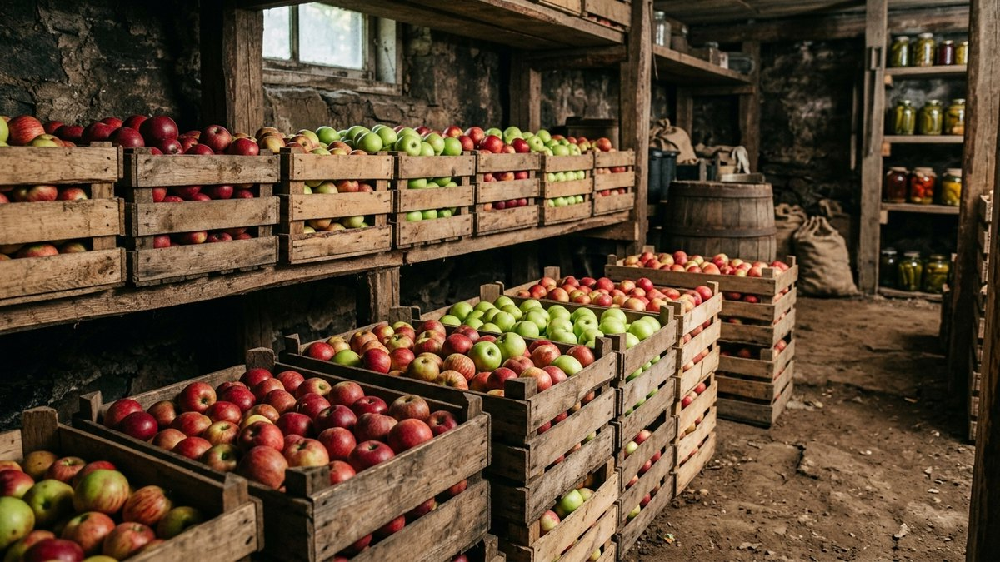
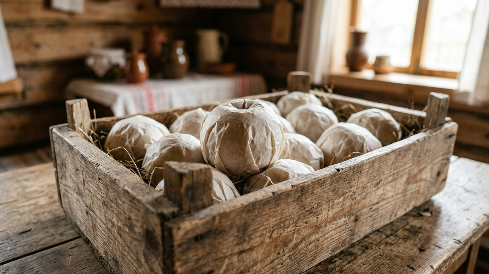
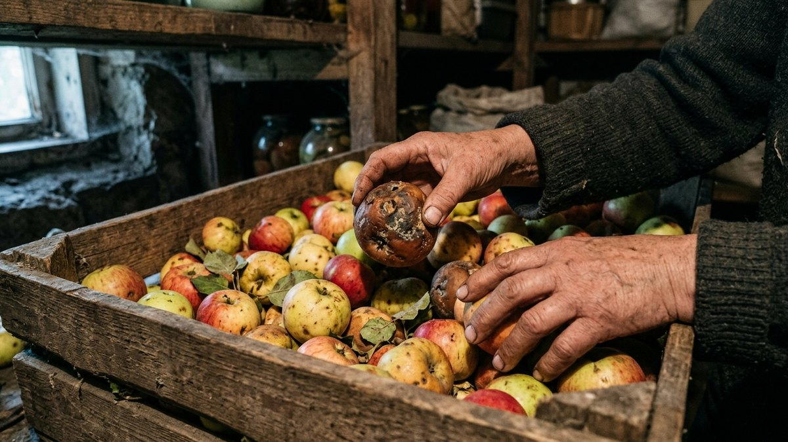
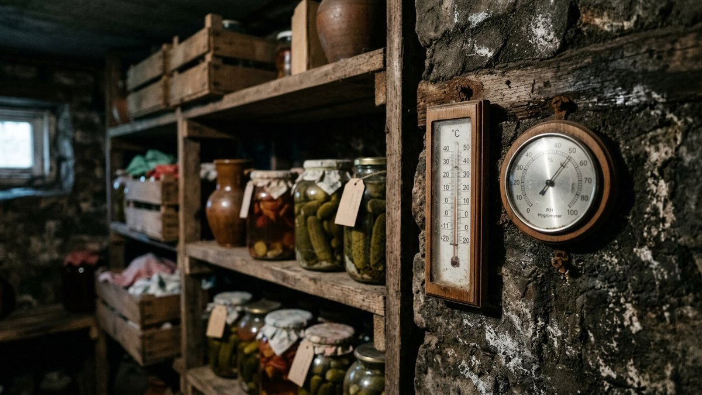
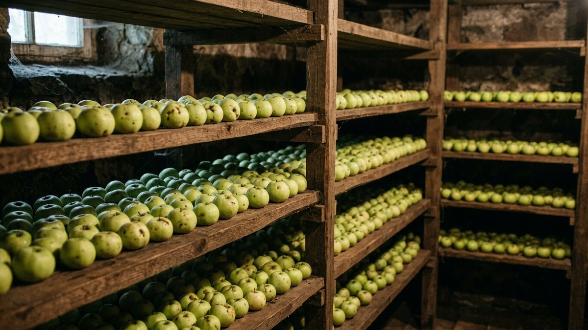
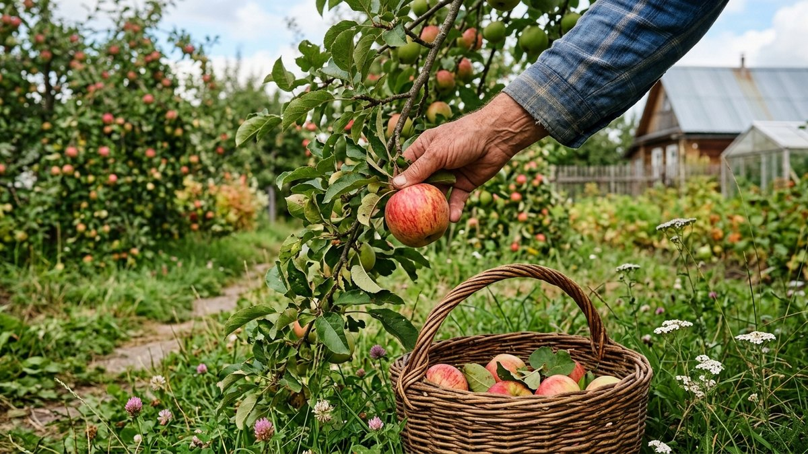

Собранный урожай яблок портится обидно быстро, если сложить его в первый
попавшийся ящик и забыть в чулане. К декабрю половина партии покрывается
мягкими бурыми пятнами, а к февралю в лучшем случае остаётся горстка. При
этом одни и те же сорта у соседей спокойно лежат до апреля-мая. Разбираем,
какие яблоки в принципе годятся для долгого хранения, какая температура и
влажность нужны и почему одно подгнившее яблоко способно испортить весь
ящик за неделю.

## Не все яблоки одинаково хорошо хранятся

Срок лёжкости определяется в первую очередь сортом, а не условиями
хранения — идеальный погреб не продлит жизнь летнему сорту дольше
трёх-четырёх недель.

- **Летние сорта** (Белый налив, Мельба) — хранятся 2–4 недели даже в
  лучших условиях, для длительного хранения не годятся в принципе.
- **Осенние сорта** (Штрейфлинг, Осеннее полосатое) — 1–2 месяца, до
  декабря-января при хорошем уходе.
- **Зимние сорта** (Антоновка, Богатырь, Синап, Джонатан) — от 3 до 6–7
  месяцев, именно они закладываются на длительное хранение до весны.

Собранные слишком рано зимние сорта хранятся хуже заявленного срока — им
нужно дозреть на дереве до технической зрелости, иначе плод начинает
портиться изнутри, даже выглядя снаружи целым.

## Температура и влажность

Оптимальные условия для длительного хранения яблок — температура 0…+4°C
и влажность воздуха 85–90%. При более высокой температуре плоды быстрее
теряют влагу и начинают вянуть, при отрицательной — подмерзают и
становятся рыхлыми и безвкусными после оттаивания.

Если яблоки хранятся вместе с овощами в общем погребе, важно помнить: они
выделяют этилен — газ, ускоряющий созревание и порчу соседних овощей и
других плодов. Картофель, капуста и морковь рядом с яблоками портятся
быстрее обычного — разбор того, как правильно организовать общее хранение
разных овощей, есть в статье
[как хранить овощи зимой](https://mir-doma.pro/kak-hranit-ovoshchi-zimoy/).

## В какой таре хранить

| Тара | Плюсы | Минусы |
|---|---|---|
| Деревянные ящики | Хорошая вентиляция, традиционный вариант | Нужно место, не штабелируются плотно |
| Картонные коробки | Дёшево, доступно | Впитывают влагу, быстро размокают в сыром погребе |
| Полиэтиленовые пакеты с отверстиями | Держат влажность, экономят место | Без отверстий яблоки быстро запревают |
| Стеллажи в один слой | Минимум контакта между плодами, удобный осмотр | Требует много места по площади |

Лучший вариант — деревянные ящики или лотки в один-два слоя, где яблоки не
давят друг на друга весом верхних рядов. Каждый плод можно дополнительно
переложить бумагой (не газетой с типографской краской) — так гниль от
одного испорченного яблока не переходит на соседние по прямому контакту.

## Почему одно гнилое яблоко портит весь ящик

Подгнивающий плод выделяет повышенное количество этилена и становится
источником спор плесени и гнилостных бактерий, которые быстро
распространяются на соседние яблоки при прямом контакте, особенно в
условиях высокой влажности погреба. Именно поэтому регулярная переборка —
не формальность, а единственный способ остановить цепную порчу партии.

## Порядок подготовки и закладки на хранение

1. **Собрать вручную, без потряхивания дерева.** Плоды с ушибами и
   вмятинами от падения хранятся значительно хуже — их стоит сразу
   отложить на переработку, а не в общий ящик.
2. **Не мыть перед закладкой.** Натуральный восковой налёт на кожуре
   защищает яблоко от испарения влаги и проникновения бактерий — мытьё
   перед хранением, а не перед едой, сокращает срок лёжкости.
3. **Отсортировать по размеру и состоянию.** Мелкие червоточины,
   вмятины и порезы кожуры — повод отложить яблоко в сторону для
   ближайшего употребления, а не в партию на хранение.
4. **Разложить в один-два слоя** в подготовленную тару, переложив бумагой
   между слоями.
5. **Убрать в погреб или подвал с нужной температурой** — если такого
   помещения нет, подойдёт застеклённый балкон при условии, что температура
   там не опускается ниже 0°C; принципы аналогичного балконного хранения
   для овощей разобраны в статье
   [хранение овощей на балконе](https://mir-doma.pro/hranenie-ovoshchey-na-balkone/).

## Как часто перебирать яблоки зимой

Первую переборку стоит сделать через 2–3 недели после закладки — именно
за это время проявляются скрытые повреждения, полученные при сборе.
Дальше партию проверяют раз в 3–4 недели, убирая подгнившие и
подвявшие плоды. Чем раньше замечен и убран испорченный экземпляр, тем
меньше соседних яблок пострадает от контакта с плесенью.

## Частые ошибки

- **Хранение вперемешку с картофелем и капустой без разделения.**
  Этилен от яблок ускоряет прорастание картофеля и порчу капусты — при
  общем хранении нужна хотя бы условная перегородка или отдельные ящики.
- **Мытьё яблок перед закладкой на хранение.** Смывается защитный
  восковой налёт, срок лёжкости падает в разы.
- **Хранение летних и осенних сортов наравне с зимними.** Летние сорта
  портятся первыми и заражают соседние плоды плесенью задолго до того, как
  подойдёт время проверять зимние сорта.
- **Слишком плотная закладка в глубокие ящики.** Нижние ряды давятся весом
  верхних и портятся быстрее — оптимально хранить не больше двух слоёв.
- **Редкая переборка или отсутствие переборки вовсе.** Одно испорченное
  яблоко за месяц способно заразить гнилью значительную часть ящика.

Если часть урожая всё равно не рассчитана на долгое хранение свежей —
летние и осенние сорта, мелкие и повреждённые плоды — их разумнее сразу
переработать, а не рисковать переборкой каждые три недели. Сушка яблок
дольками — самый простой способ, разобран в статье
[сушка овощей и фруктов](https://mir-doma.pro/sushka-ovoshchey-i-fruktov/),
а варенье, повидло и другие заготовки — по срокам хранения смотрите
[таблицу сроков хранения заготовок](https://mir-doma.pro/skolko-hranyatsya-zagotovki/).

## Частые вопросы

### Какие яблоки лучше всего хранятся зимой

Зимние сорта: Антоновка, Синап, Богатырь, Джонатан — при правильных
условиях лежат от 3 до 6–7 месяцев. Летние и осенние сорта для
длительного хранения не подходят в принципе.

### При какой температуре хранить яблоки зимой

0…+4°C и влажность воздуха 85–90%. Более высокая температура ускоряет
увядание, отрицательная — подмораживает плоды.

### Можно ли хранить яблоки вместе с картофелем и морковью

Не рекомендуется без разделения — яблоки выделяют этилен, ускоряющий
порчу и прорастание соседних овощей. Лучше держать в разных ящиках или с
плотной перегородкой.

### Почему яблоки портятся, даже если условия хранения соблюдены

Чаще всего причина в сорте (летние и осенние сорта не рассчитаны на
долгое хранение), повреждениях при сборе или контакте с уже подгнившим
плодом — одно испорченное яблоко заражает соседние.

### Нужно ли мыть яблоки перед закладкой на хранение

Нет, мыть яблоки нужно только перед употреблением. Восковой налёт на
кожуре защищает плод от испарения влаги и проникновения бактерий во время
хранения.

