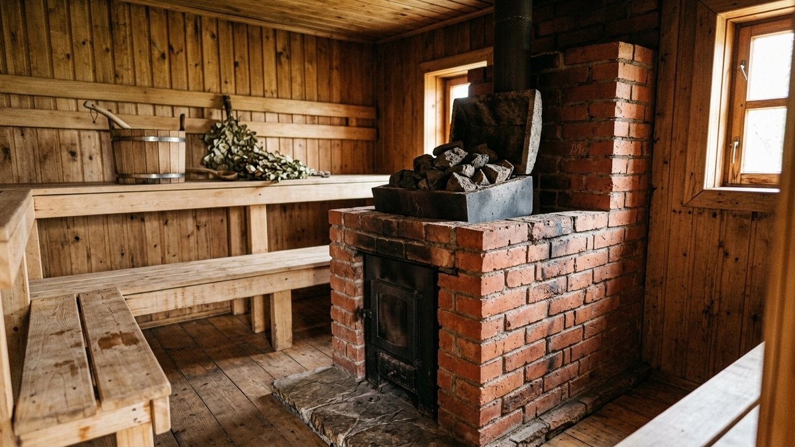
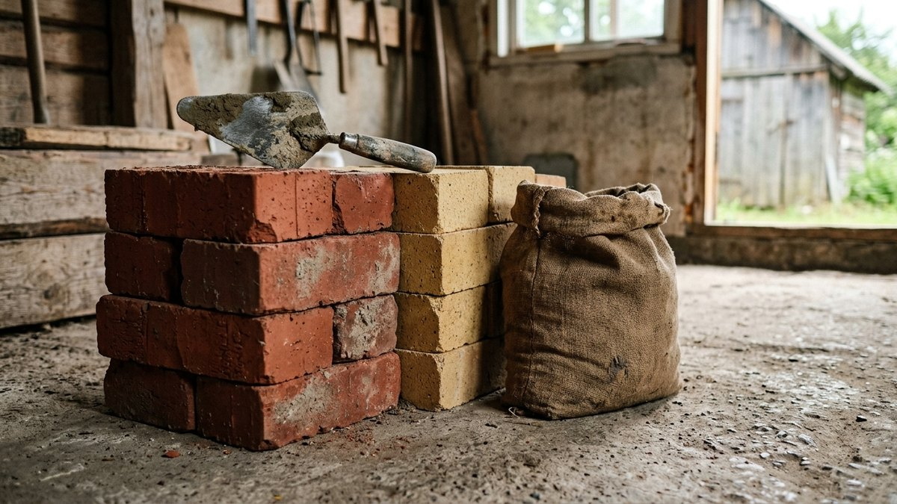
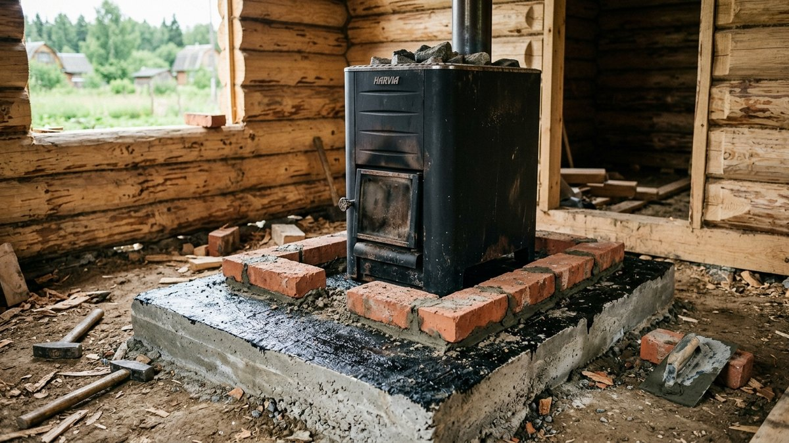
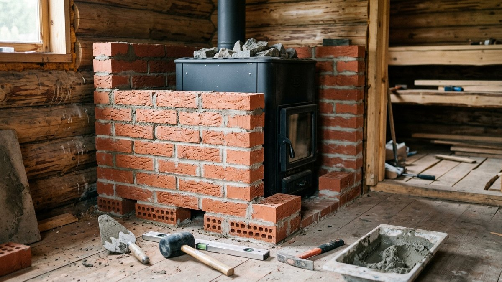
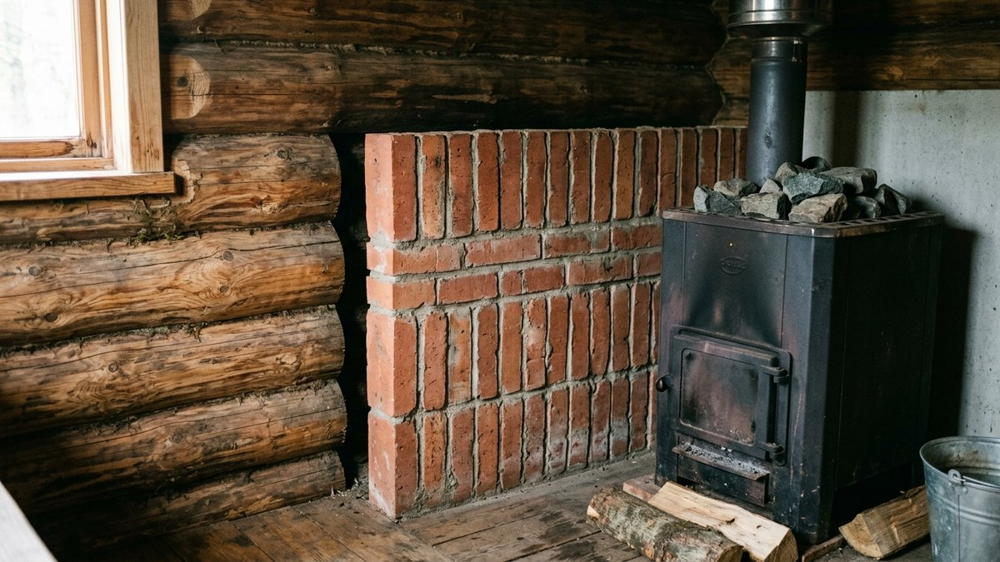
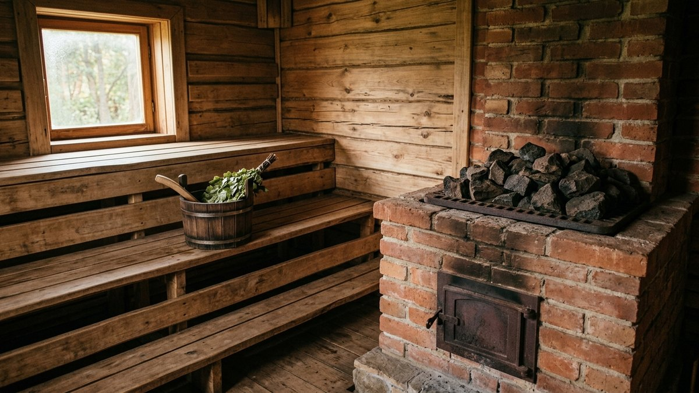

# Как обложить печь в бане кирпичом: какой кирпич, зазор, продухи и кладка

Металлическая печь в бане раскаляется за полчаса, но жар от неё
жёсткий: у стенок печи обжигает кожу, а остывает парилка быстро. Если
обложить печь кирпичом, жар становится мягче, баня дольше держит тепло,
а стены защищены от перегрева. Но кожух, сложенный вплотную и без
продухов, перегревает металл: печь прогорает за пару сезонов. Ниже —
какой кирпич и раствор брать, какой оставить зазор, зачем продухи, как
выдержать вес кладки и в каком порядке класть. В калькуляторе можно
посчитать кирпич, раствор и вес кожуха под вашу печь.

## Что даёт кирпичный кожух и чем за него платят

**Плюсы:**

- **Мягкий жар.** Кирпич поглощает жёсткое инфракрасное излучение от
  раскалённого металла и отдаёт тепло ровнее.
- **Баня дольше держит тепло.** Кирпич накапливает тепло и отдаёт его
  ещё 2–4 часа после протопки.
- **Защита стен.** Кожух работает как негорючий экран. По тем же
  правилам, что и для любой печи, с экраном отступ до горючих стен
  можно уменьшить с 50 до 30 см.
- **Безопасность.** Об раскалённый металл не обжечься случайным
  касанием.

**Минусы:**

- **Прогрев дольше.** Парилку приходится топить на 1–1,5 часа дольше,
  и дров уходит больше.
- **Вес.** Кожух в полкирпича вокруг средней печи весит 500–900 кг. На
  дощатый пол его не поставить.
- **Риск для печи.** Если сложить кожух вплотную и без продухов,
  металл перегревается и прогорает. Многие производители прямо
  оговаривают в паспорте, можно ли обкладывать их печь и с каким
  зазором. Прочитайте паспорт до покупки кирпича.

## Какой кирпич и раствор брать

| Материал | Где | Почему |
|---|---|---|
| Красный полнотелый керамический кирпич (М150 и выше) | Весь кожух | Выдерживает нагрев от металлической печи, держит тепло, недорогой |
| Шамотный (огнеупорный) кирпич | Ряды напротив топки, если металл там раскаляется докрасна | Выдерживает прямой жар свыше 1000 °C |
| Клинкерный облицовочный | Лицевой слой, если нужен декоративный вид | Плотный и красивый, но дороже |
| Силикатный и пустотелый кирпич | Нельзя | Силикатный разрушается от жара и влаги, пустотелый трескается и плохо держит тепло |

**Раствор — только печной:** глино-песчаный или готовая жаростойкая
смесь для кладки печей. Цементный раствор при нагреве трескается и
выкрашивается. Шов делают тонкий, 3–5 мм: в толстом шве глина
усыхает и даёт трещины.

## Зазор, продухи и верх кожуха

Это три условия, без которых кожух губит печь:

1. **Зазор между печью и кладкой — 5–10 см.** В нём движется воздух и
   снимает тепло с металла. Если у печи есть заводской кожух-конвектор,
   зазор считают от него. Точное значение берите из паспорта печи, если
   оно там указано.
2. **Продухи внизу.** В первом-втором ряду оставляют 2–4 отверстия
   размером в полкирпича или в целый кирпич на разных сторонах. Через
   них холодный воздух с пола затягивается в зазор.
3. **Открытый верх.** Нагретый воздух выходит из зазора сверху. Кожух
   доводят до уровня каменки или чуть ниже, но не перекрывают зазор
   наглухо. Сверху можно положить металлическую решётку или оставить
   щели между кирпичами последнего ряда.

Если печь стоит рядом со стеной, кожух со стороны стены оставляют, а
отступ до горючей стены всё равно соблюдают не меньше 30 см от кладки.
Остальные правила установки банной печи разобраны в статье [печь для
бани своими руками из металла](https://mir-doma.pro/pech-dlya-bani-iz-metalla/).

## Основание: кладка тяжелее печи

Кирпич весит около 3,5 кг. Квадратный метр кладки в полкирпича — это
около 50 кирпичей и 200 кг вместе с раствором. Поэтому:

- **Если пол бетонный**, кожух ставят прямо на него, проложив
  гидроизоляцию в два слоя.
- **Если пол деревянный**, под печь и кожух нужно отдельное основание:
  бетонная плита или кирпичный столб на собственном фундаменте, не
  связанный с фундаментом стен. Как его сделать и почему его нельзя
  жёстко соединять с фундаментом бани, разобрано в статье [фундамент под
  баню своими руками](https://mir-doma.pro/fundament-pod-banyu-svoimi-rukami/).
- **Если печь уже стоит на деревянном полу** и переносить её не
  хочется, ограничьтесь экраном из кирпича на ребро только со стороны
  стен. Он легче полного кожуха вдвое.

## Калькулятор кирпича для обкладки печи

Введите размеры печи по корпусу и зазор. Калькулятор посчитает
периметр кожуха, число кирпичей с учётом продухов и дверцы, раствор и
вес кладки.

<!-- wp:html -->

  
Обкладка печи кирпичом: кирпич, раствор, вес

  <label class="md-calc__label" for="mdObW">Ширина печи, см</label>
  <input type="number" id="mdObW" class="md-calc__input" min="20" step="1" value="45">
  <label class="md-calc__label" for="mdObD">Глубина печи (без выносной топки), см</label>
  <input type="number" id="mdObD" class="md-calc__input" min="20" step="1" value="70">
  <label class="md-calc__label" for="mdObH">Высота кожуха, см</label>
  <input type="number" id="mdObH" class="md-calc__input" min="30" step="5" value="90">
  <label class="md-calc__label" for="mdObG">Зазор от печи до кладки, см</label>
  <input type="number" id="mdObG" class="md-calc__input" min="0" step="1" value="7">
  <label class="md-calc__label" for="mdObS">Сколько сторон обкладываете</label>
  <select id="mdObS" class="md-calc__input">
    <option value="4">Все четыре (топка выходит через стену в предбанник — проём в кладке)</option>
    <option value="3" selected>Три (передняя сторона с дверцей открыта)</option>
    <option value="2">Две, только экраны со стороны стен</option>
  </select>
  <label class="md-calc__label" for="mdObT">Кладка</label>
  <select id="mdObT" class="md-calc__input">
    <option value="half" selected>В полкирпича (12 см)</option>
    <option value="edge">На ребро (6,5 см), облегчённый экран</option>
  </select>
  
Заполните поля

<!-- /wp:html -->

## Как обложить печь кирпичом: пошагово

1. **Проверьте основание** по уровню. Уложите гидроизоляцию в два слоя,
   если кладка идёт на бетон.
2. **Разметьте контур кожуха** мелом, отступив от корпуса печи на
   выбранный зазор.
3. **Замочите кирпич** в воде на 1–2 минуты перед укладкой: сухой
   кирпич вытягивает воду из глиняного раствора, и шов теряет прочность.
4. **Уложите первый ряд насухо**, без раствора, чтобы проверить
   раскладку и места продухов. Потом переложите его на раствор.
5. **Ведите кладку с перевязкой швов** в полкирпича. Каждые 3–4 ряда
   кладите в шов армирующую полосу из нержавеющей стали или кладочную
   сетку, особенно на углах.
6. **Оставьте продухи** в первом-втором ряду и **проём для дверцы
   топки**, если обкладываете переднюю сторону. Над проёмом положите
   металлический уголок.
7. **Проверяйте вертикаль и зазор** после каждого ряда. Кладка не должна
   касаться печи ни в одной точке.
8. **Доведите кожух до уровня каменки** и оставьте верх открытым или
   накройте решёткой со щелями.
9. **Расшейте швы** влажной губкой, пока раствор не схватился.
10. **Просушите кладку 1–2 недели** при открытых окнах и дверях. Первые
    3–4 протопки делайте слабыми, вполовину обычного: глиняный раствор
    должен высохнуть постепенно, иначе пойдут трещины.

## Экран вместо кожуха

Если печь стоит близко к деревянным стенам, а полный кожух не нужен или
пол его не выдержит, делают **экран**: стенку из кирпича на ребро,
только со стороны стен, с зазором 3–5 см от стены. Экран легче,
кладётся за день и тоже позволяет сократить отступ до стены. Только
сам экран должен быть шире печи на 10–15 см с каждой стороны и выше её
верха.

Если топка печи выходит в предбанник, экран вокруг дверцы и
металлический лист перед топкой нужны и там. Как оформить топочную
стену в предбаннике, разобрано в статье [предбанник своими
руками](https://mir-doma.pro/predbannik-svoimi-rukami/).

## Частые ошибки

- **Кожух вплотную к печи.** Металл перегревается и прогорает, особенно
  над топкой.
- **Нет продухов внизу.** Воздух в зазоре стоит, и кладка работает как
  термос вокруг печи.
- **Цементный раствор.** Трещины после первого же месяца протопок.
- **Силикатный или пустотелый кирпич.** Крошится и лопается от жара.
- **Кладка на дощатом полу.** Пол проседает под весом, кожух трескается,
  а доски под печью пересыхают и могут загореться.
- **Сразу топят на полную.** Мокрая глиняная кладка трескается от пара
  изнутри.

## Частые вопросы

### Каким кирпичом обложить железную печь в бане

Красным полнотелым керамическим кирпичом марки М150 и выше. Если металл
у топки раскаляется докрасна, нижние ряды напротив неё кладут из
шамотного кирпича. Силикатный и пустотелый кирпич не подходят.

### Какой зазор оставлять между печью и кирпичом

5–10 см, если в паспорте печи не указано другое. Внизу кладки
оставляют 2–4 продуха, а верх не перекрывают, чтобы воздух в зазоре
поднимался и охлаждал металл.

### Нужно ли обкладывать печь в бане кирпичом

Не обязательно. Кожух делает жар мягче и помогает бане дольше держать
тепло, но прогрев становится дольше, а кладка тяжёлая. Если важна
только защита стен, хватит экрана из кирпича на ребро со стороны стен.

### На какой раствор класть кирпич вокруг печи

На глино-песчаный раствор или готовую жаростойкую печную смесь. Шов —
3–5 мм. Цементный раствор при нагреве трескается.

### Сколько кирпича нужно, чтобы обложить печь

Для печи 45×70 см и кожуха высотой 90 см с трёх сторон в полкирпича
нужно около 130 кирпичей, это примерно полтонны вместе с раствором. Калькулятор в статье посчитает под ваши
размеры, зазор и тип кладки.
