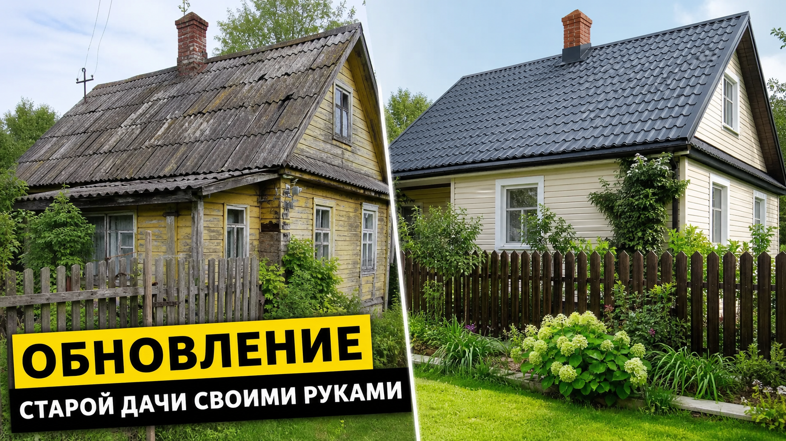
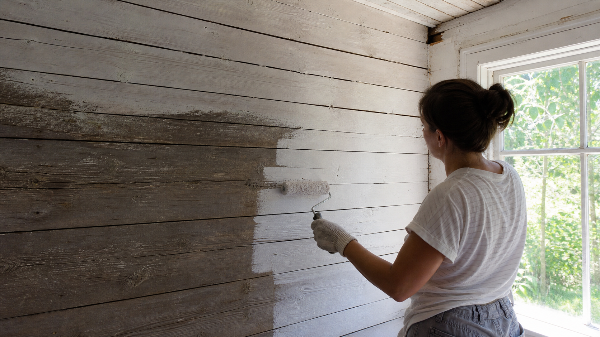
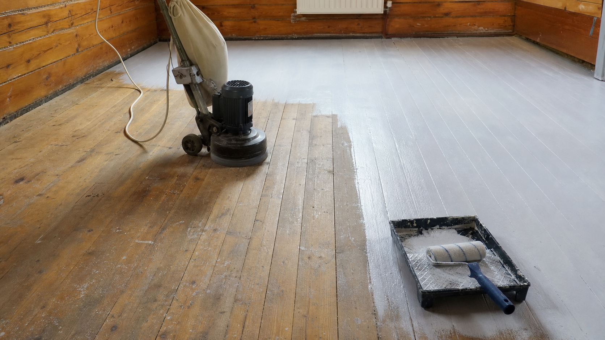
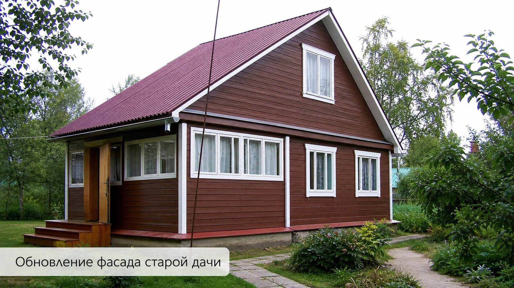
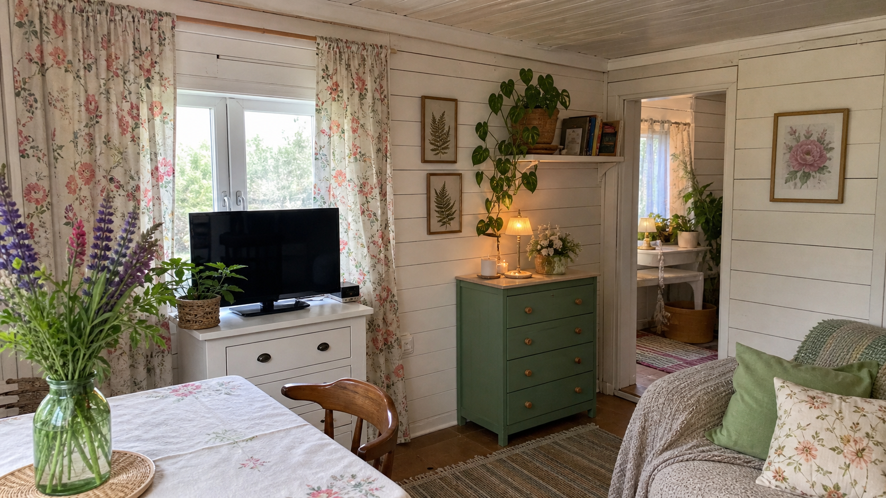
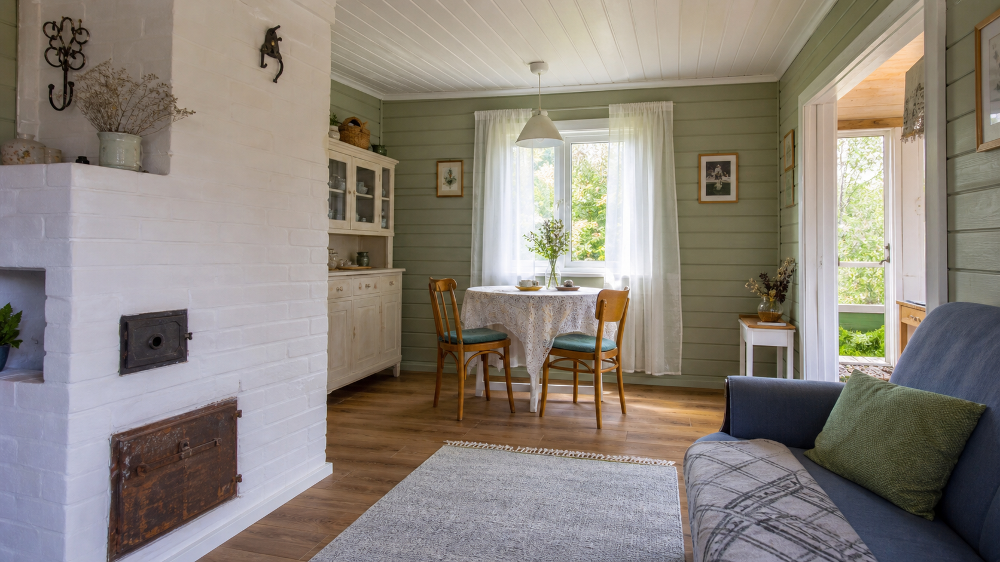

Старая дача, доставшаяся по наследству или купленная недорого, часто выглядит удручающе: облупившиеся стены, скрипучие полы, потемневший фасад. Но не спешите опускать руки — преобразить такой домик можно своими руками и без больших вложений. Главное — действовать по плану: сначала починить важное, а потом освежить внешний вид. В этой статье разберём, как обновить старую дачу недорого: с чего начать, что отремонтировать в первую очередь, как обновить стены, пол, окна и фасад и какими бюджетными приёмами добиться уюта.

## 🏚️ С чего начать обновление дачи

Прежде чем браться за кисть, оцените состояние дома и составьте план:

- **Осмотрите дачу** — крыша, фундамент, стены, полы, окна, электрика. Отметьте, что требует ремонта, а что достаточно освежить.
- **Расставьте приоритеты** — сначала то, что влияет на безопасность и надёжность, потом косметика.
- **Распределите бюджет** — решите, на чём можно сэкономить, а на чём нет.
- **Не беритесь за всё сразу** — двигайтесь поэтапно, комната за комнатой.

Такой подход бережёт и деньги, и силы, а результат будет продуманным, а не хаотичным. Полезно заранее представить, какой вы хотите видеть дачу в итоге, — это поможет выбирать материалы и цвета в едином стиле.

## 🔧 Что починить в первую очередь

Косметика бессмысленна, если течёт крыша или бьётся током проводка. Поэтому сначала проверяют и приводят в порядок главное:

- **Крыша** — устраняют протечки, при необходимости ремонтируют или перекрывают кровлю, например [профнастилом](https://mir-doma.pro/krysha-iz-profnastila-svoimi-rukami/).
- **Полы** — заменяют сгнившие доски и лаги, укрепляют скрипучие участки.
- **Окна и двери** — устраняют перекосы и щели, чтобы не дуло.
- **Электрика** — старую проводку обязательно проверяют, а лучше меняют: ветхая проводка на даче пожароопасна. Электромонтаж доверяют специалисту.
- **Фундамент и венцы** — осматривают на предмет разрушения и подгнивания.

Только убедившись, что дом крепкий и безопасный, переходят к обновлению внешнего вида. Если дача планируется для круглогодичного использования, на этом же этапе стоит задуматься об утеплении и отоплении — потом переделывать отделку будет жаль.

## 🎨 Обновление стен

Стены сильнее всего влияют на восприятие интерьера, а обновить их можно недорого:

- **Покраска или побелка** — самый бюджетный способ преобразить комнату. Старую вагонку особенно освежает светлая краска.
- **Обшивка вагонкой или имитацией бруса** — если стены неровные, обшивка скроет дефекты и придаст уюта.
- **Обои** — простой вариант для внутренних комнат; выбирают влагостойкие, ведь дача зимой не отапливается.

Светлые тона визуально расширяют пространство и делают старый домик свежее. Отличное решение — оформить дачу в уютном деревенском стиле, например [в стиле прованс](https://mir-doma.pro/interer-dachi-provans/): он как раз любит крашеное дерево и лёгкую старину.

## 🪵 Ремонт и обновление пола

Пол на старой даче обычно деревянный, и часто ему нужен лишь косметический ремонт:

- **Замените сгнившие доски** и закрепите скрипучие.
- **Отшлифуйте и покрасьте** или покройте лаком старые половицы — они заиграют по-новому.
- **Постелите линолеум или недорогой ламинат** поверх крепкого основания, если доски потеряли вид.

Крашеный деревянный пол в светлых тонах смотрится стильно и обходится совсем недорого. Перед покраской пол обязательно очищают, шлифуют и грунтуют — тогда покрытие ляжет ровно и прослужит дольше.

## 🪟 Окна, двери и фасад

Внешний вид дачи преображает обновление окон, дверей и фасада:

- **Окна и двери** покрасьте, замените уплотнители и фурнитуру или поставьте недорогие стеклопакеты (подойдут и б/у в хорошем состоянии).
- **Фасад** освежите покраской или обшивкой сайдингом либо вагонкой; обновите наличники.
- **Крыльцо и веранду** отремонтируйте и покрасьте — они первыми бросаются в глаза.

Даже простая покраска фасада и крыльца в свежие тона мгновенно молодит старый дом.

## 🛋️ Бюджетный декор и уют

Завершающий и самый приятный этап — навести уют, и здесь дорогие вложения не нужны:

- **Текстиль** — новые шторы, скатерти, чехлы и подушки преображают комнату за копейки.
- **Перекрашенная мебель** — старый комод или стол в пастельных тонах смотрятся как новые. Красиво и практично выглядит и [мебель из поддонов](https://mir-doma.pro/sadovaya-mebel-iz-poddonov/).
- **Освещение** — новые светильники и гирлянды создают атмосферу.
- **Растения и мелочи** — цветы, картины, плетёные корзины оживляют интерьер.

Именно детали и текстиль создают то самое ощущение обжитого, уютного дома, поэтому на финальном этапе не стоит спешить.

## 💡 Бюджетные лайфхаки

Сэкономить на обновлении дачи помогают простые хитрости:

- **Краска — лучший бюджетный апгрейд.** Покраска стен, пола, мебели и фасада преображает дачу с минимальными затратами.
- **Вторичные материалы.** Доски, поддоны, б/у окна и мебель с рук обходятся в разы дешевле новых.
- **Самодельный декор.** Полки, мебель и украшения своими руками экономят деньги и делают дачу особенной.
- **Находки с блошиных рынков.** Старая посуда, кружево, лампы придают даче душевный винтажный вид.
- **Единая цветовая гамма.** Если выдержать 2–3 основных цвета, даже разномастная мебель и декор будут смотреться гармонично.

## 🛡️ Частые ошибки

- **Начинают с косметики.** Красить стены, когда течёт крыша или ветхая проводка, — впустую. Сначала главное.
- **Красят по неподготовленной поверхности.** Без очистки и грунтовки краска быстро облезет. Поверхность готовят.
- **Берутся за всё сразу.** Это утомляет и распыляет бюджет. Двигайтесь поэтапно.
- **Экономят на электрике.** Старая проводка опасна — на безопасности не экономят.
- **Игнорируют план и бюджет.** Без них ремонт затягивается и дорожает.

## ❓ Частые вопросы

### С чего начать ремонт старой дачи?

С осмотра и плана: оцените состояние крыши, фундамента, полов, окон и электрики, расставьте приоритеты и распределите бюджет. Сначала чинят то, что влияет на безопасность и надёжность дома, и только потом занимаются косметическим обновлением.

### Как недорого обновить старую дачу?

Самый бюджетный способ — покраска: стен, пола, мебели и фасада. Добавьте новый текстиль, перекрашенную или самодельную мебель, освежите фасад и крыльцо. Используйте вторичные материалы и находки с блошиных рынков — так дачу можно преобразить с минимальными вложениями.

### Что отремонтировать на даче в первую очередь?

В первую очередь — то, что влияет на безопасность и функциональность: крышу (протечки), полы (гнилые доски), окна и двери (щели), электрику (ветхая проводка пожароопасна) и фундамент. Косметический ремонт делают уже после того, как дом стал крепким и безопасным.

### Как обновить стены на старой даче?

Стены проще всего покрасить или побелить — светлая краска особенно освежает старую вагонку. Неровные стены обшивают вагонкой или имитацией бруса, что скрывает дефекты и добавляет уюта. Для комнат подойдут и обои. Светлые тона делают старый домик свежее и просторнее.

### Стоит ли менять проводку на старой даче?

Да, старую проводку обязательно проверяют, а чаще всего меняют: со временем изоляция ветшает, и такая проводка становится пожароопасной. Это вопрос безопасности, поэтому на нём не экономят, а электромонтаж доверяют квалифицированному специалисту.

### Сколько стоит обновить старую дачу?

Всё зависит от объёма работ и выбранных материалов. Косметическое обновление — покраска, текстиль, мелкий ремонт — обходится совсем недорого, особенно если делать своими руками и использовать вторичные материалы. Серьёзный ремонт крыши, полов или проводки потребует больше средств, поэтому бюджет планируют заранее.

### Можно ли обновить дачу своими руками без опыта?

Да, большинство работ по обновлению дачи — покраска, поклейка обоев, укладка линолеума, обновление мебели и декор — вполне по силам новичку. Сложные и опасные работы, прежде всего электрику, лучше доверить специалисту, а остальное можно освоить постепенно.

### Как сделать старую дачу уютной?

Уют создаётся деталями: светлые крашеные стены, новый текстиль (шторы, подушки, скатерти), перекрашенная мебель, тёплое освещение, растения и милые винтажные мелочи. Всё это стоит недорого, а старую дачу превращает в тёплый и обжитой дом.

## Заключение

Обновить старую дачу своими руками и недорого вполне реально: начните с плана и ремонта важного — крыши, полов, окон и электрики, — а затем освежите стены, пол и фасад краской и обшивкой и наведите уют текстилем и декором. Бюджетные приёмы — краска, вторичные материалы и самодельный декор — творят чудеса даже с самым запущенным домиком. Действуйте поэтапно, не гонитесь за всем сразу — и старая дача превратится в уютное место, куда захочется приезжать снова и снова. А удовольствие от того, что всё сделано своими руками, станет приятным бонусом к обновлённому дому.

А как вы обновляли свою дачу? Делитесь идеями и результатами в комментариях и подписывайтесь, чтобы не пропустить новые статьи о ремонте и обустройстве дачи.
