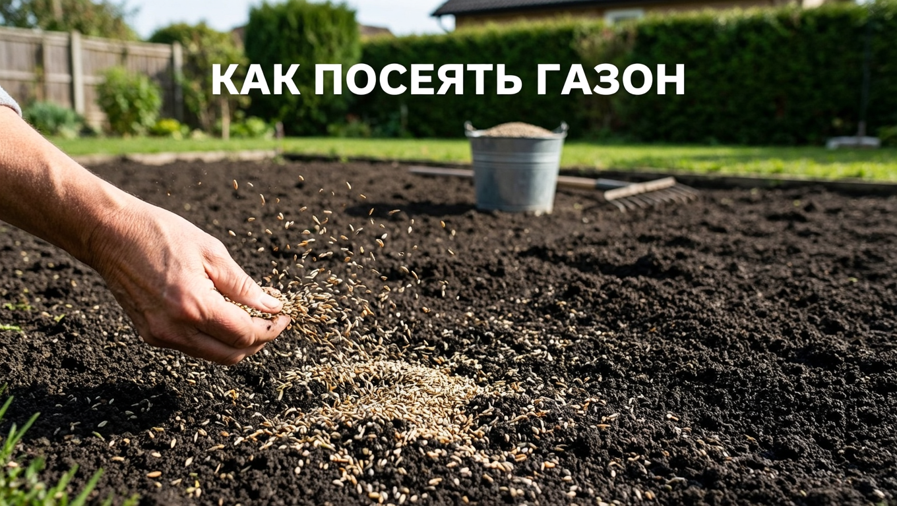
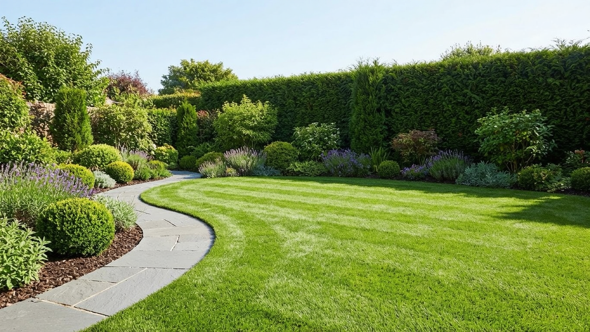
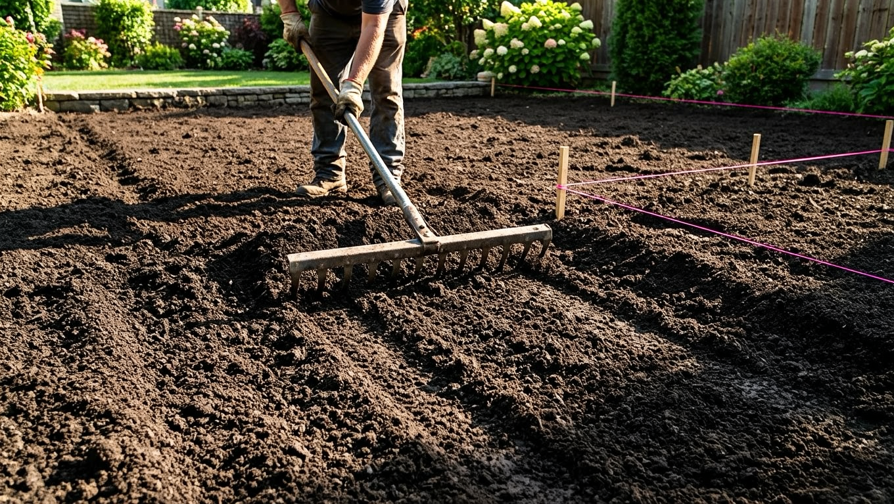
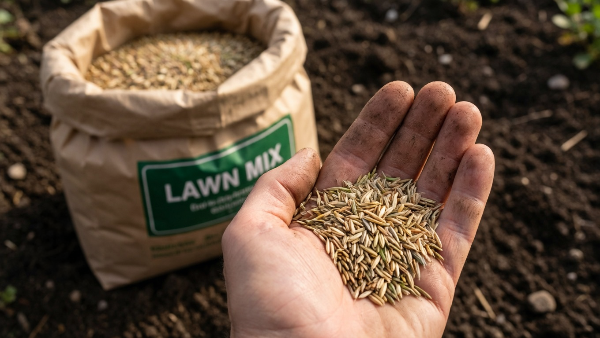
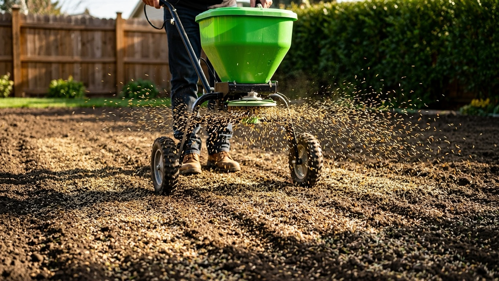
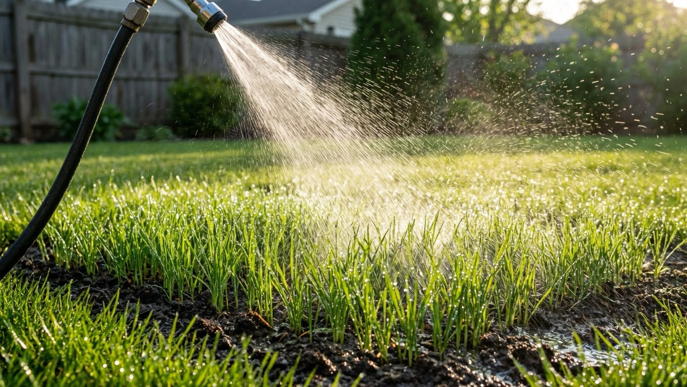

Ровный зелёный газон превращает участок в ухоженный сад и служит фоном для клумб, дорожек и зоны отдыха. И вырастить его своими руками вполне реально — важно лишь не спешить с подготовкой почвы и правильно ухаживать за молодыми всходами. Разберём по шагам, как посеять газон своими руками: когда сеять, как подготовить участок, выбрать травосмесь, посеять и вырастить плотный красивый газон.

## 🌱 Когда сеять газон

Газон сеют в тёплую погоду, когда есть время на укоренение до жары или морозов:

- **Весна** (конец апреля — май) — почва прогрелась, впереди целый сезон для развития.
- **Конец лета — начало осени** (август — начало сентября) — по многим отзывам, лучшее время: нет изнуряющей жары, почва тёплая и влажная, меньше сорняков, трава успевает окрепнуть до холодов.
- **Лето** — тоже можно, но потребуется частый полив, чтобы всходы не сгорели.

Главное — успеть, чтобы газон окреп минимум за 6–8 недель до устойчивых заморозков.

## 🌿 Посевной или рулонный газон

Прежде чем начинать, стоит решить, каким способом устраивать газон:

- **Посевной** — трава выращивается из семян прямо на участке. Дешевле, выбор травосмесей больше, но требует времени и терпения: полноценный газон формируется за сезон, а первый год за ним нужен внимательный уход.
- **Рулонный** — готовый газон, выращенный в питомнике и срезанный пластами с дерниной. Его раскатывают на подготовленную почву и получают ровный зелёный ковёр почти сразу. Дороже, зато быстро и без хлопот со всходами.

Подготовка почвы в обоих случаях одинакова — разница лишь в том, сеете вы семена или укладываете готовую дернину. Для большинства дачников посевной газон выгоднее и интереснее, а рулонный выбирают, когда результат нужен быстро. Дальше разберём именно посевной способ.

## 🧰 Что понадобится

Для работы пригодятся: лопата и грабли, каток (или самодельный тяжёлый валик), травосмесь, стартовое удобрение, шланг или лейка с рассеивателем и, по возможности, сеялка-разбрасыватель.

## 🚜 Шаг 1. Подготовка участка

Это самый важный этап — от него зависит, будет ли газон ровным. Подготовка занимает больше всего времени:

- **Очистить участок** от мусора, камней, корней и сорняков. Многолетние сорняки лучше извести заранее.
- **Перекопать** почву на штык лопаты, разбить комья.
- **Выровнять** поверхность граблями, срезая бугры и засыпая ямки — иначе газон будет кочковатым, а в низинах застоится вода.
- При бедной почве внести плодородный грунт и стартовое удобрение.

Как вписать газон в общий план участка вместе с дорожками и зонами отдыха — в статье про [планировку участка](https://mir-doma.pro/planirovka-uchastka-10-sotok/).

## 🌾 Шаг 2. Выбор травосмеси

Газоны различаются по составу трав и назначению:

- **Партерный** — идеально ровный «ковёр» для парадных зон, но капризный и не любит вытаптывания.
- **Садово-парковый (универсальный)** — самый практичный для дачи: устойчив к вытаптыванию, неприхотлив, теневынослив.
- **Спортивный** — прочный, для активных нагрузок и детских игр.
- **Для тени** — специальные смеси для участков под деревьями.

Для дачи чаще всего берут универсальную садово-парковую смесь — она прощает ошибки в уходе и хорошо переносит наш климат.

## ⚖️ Шаг 3. Финальное выравнивание и уплотнение

Перед посевом подготовленную почву **прикатывают катком** и дают ей осесть 1–2 недели — за это время проявляются неровности и всходят оставшиеся сорняки, которые удаляют. Затем поверхность ещё раз рыхлят граблями на пару сантиметров, создавая мелкую ровную «постель» для семян. Уплотнённая, но взрыхлённая сверху почва — залог дружных всходов.

## 🌱 Шаг 4. Посев

Теперь сам посев:

- Сеют в сухую безветренную погоду. Норму расхода семян смотрят на упаковке (обычно 30–50 г на 1 м²); по краям сеют чуть гуще.
- Для равномерности семена рассыпают **вдоль и поперёк** участка, разделив на две части, или используют сеялку.
- Заделывают семена веерными граблями на глубину около 1 см и **прикатывают катком** — так они плотно контактируют с почвой.
- Сверху можно замульчировать тонким слоем торфа, чтобы сохранить влагу.

## 💧 Шаг 5. Полив и всходы

После посева газон аккуратно поливают через мелкий распылитель, чтобы не размыть семена. До появления всходов почва должна быть постоянно влажной — в сухую погоду поливают ежедневно, лёгким дождеванием. Первые всходы появляются через 1–2 недели, полное задернение — за месяц-полтора. Пока трава не окрепла, по газону не ходят.

## ✂️ Уход за молодым газоном

Когда трава подрастёт до 8–10 см, проводят **первую стрижку**, срезая лишь верхушки (не короче 5 см) хорошо заточенной косилкой. Дальше газон стригут регулярно, поддерживая высоту 4–6 см. Через 3–4 недели после всходов дают первую подкормку — молодой траве нужно питание для загущения; общие принципы питания растений разбирали в статье про [летние подкормки](https://mir-doma.pro/letnie-podkormki-ovoshchey/). Регулярные полив, стрижка и подкормки быстро превращают редкие всходы в плотный ковёр.

## ❌ Частые ошибки

- **Плохо выровняли почву** — газон получается кочковатым, в ямах стоит вода.
- **Пропустили усадку** — посеяли сразу после перекопки, и грунт просел неровно.
- **Пересушили всходы** — при нерегулярном поливе молодая трава сгорает.
- **Слишком короткая или ранняя стрижка** — ослабляет неокрепший газон.
- **Ходьба по посевам** — вытаптывают всходы до укоренения.

## ❓ Частые вопросы

**Когда лучше сеять газон — весной или осенью?**
Хороши оба срока, но конец лета — начало осени часто удобнее: тепло, влажно, меньше сорняков и жары. Главное — чтобы трава окрепла до морозов.

**Какой расход семян на 1 м²?**
Обычно 30–50 г на квадратный метр — точную норму указывают на упаковке травосмеси. По краям газона сеют немного гуще.

**Нужно ли перекапывать участок под газон?**
Да, почву перекапывают, очищают от сорняков и камней и тщательно выравнивают. Именно от подготовки зависит, будет ли газон ровным.

**Через сколько всходит газон?**
Первые всходы появляются через 1–2 недели, а плотное задернение — примерно за месяц-полтора при регулярном поливе.

**Когда первый раз косить газон?**
Когда трава подрастёт до 8–10 см. Первую стрижку делают щадящей, срезая только верхушки и не короче 5 см.

**Можно ли сеять газон летом?**
Можно, но потребуется частый полив, чтобы всходы не сгорели на жаре. В сильную жару посев лучше отложить до конца лета.

---

Посеять газон своими руками несложно — успех решают тщательная подготовка почвы, правильный срок посева и регулярный уход за всходами. Наберитесь терпения на этапе выравнивания, и уже через сезон у вас будет плотный зелёный газон. Дополните его аккуратными [садовыми дорожками](https://mir-doma.pro/sadovye-dorozhki-svoimi-rukami/) — и участок преобразится.
