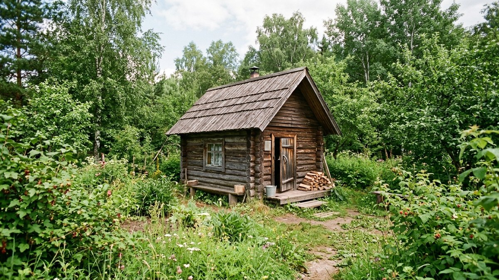
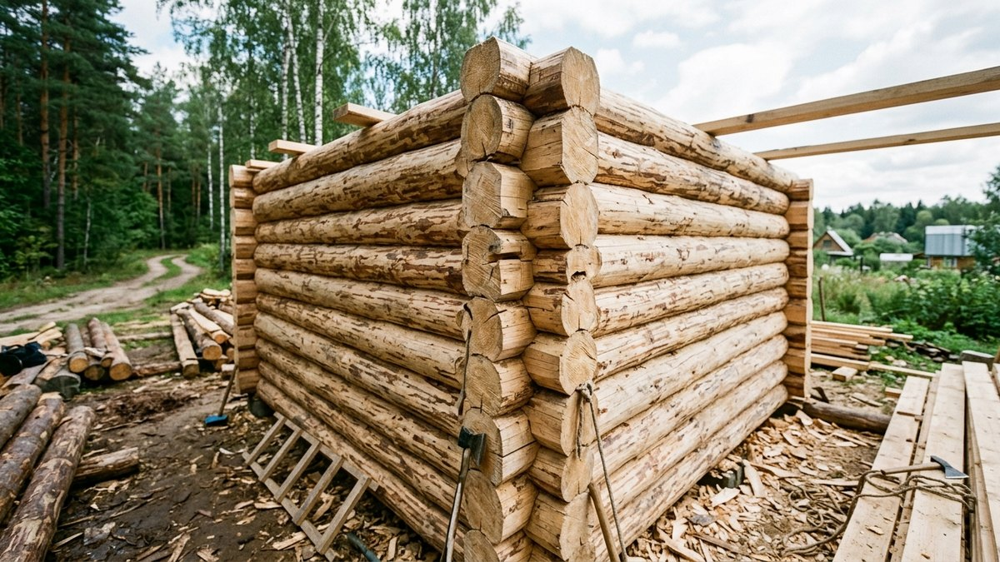
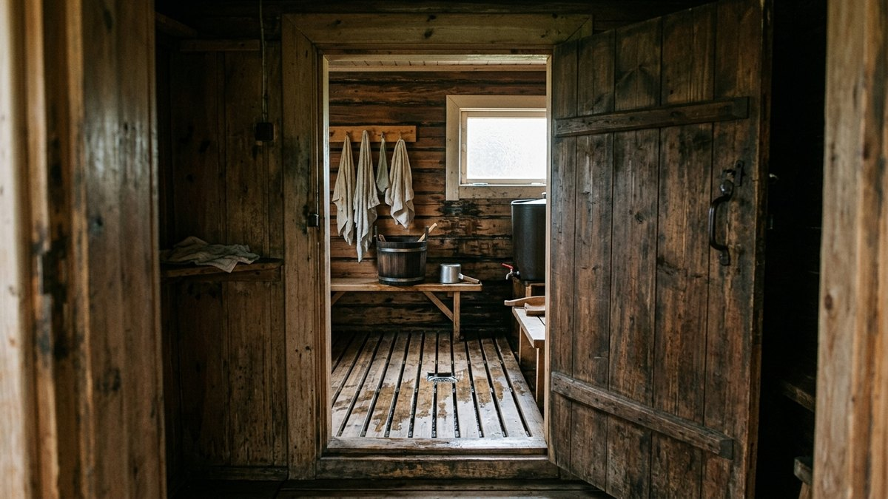
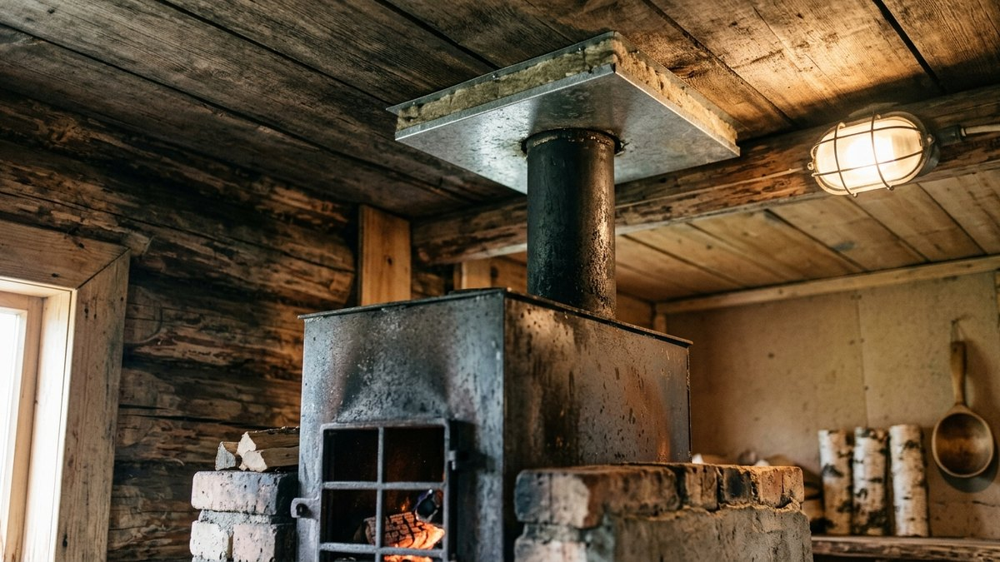
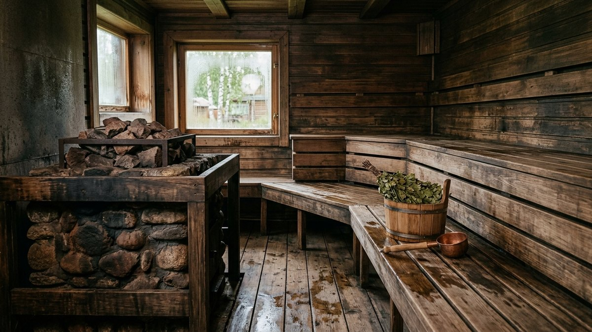
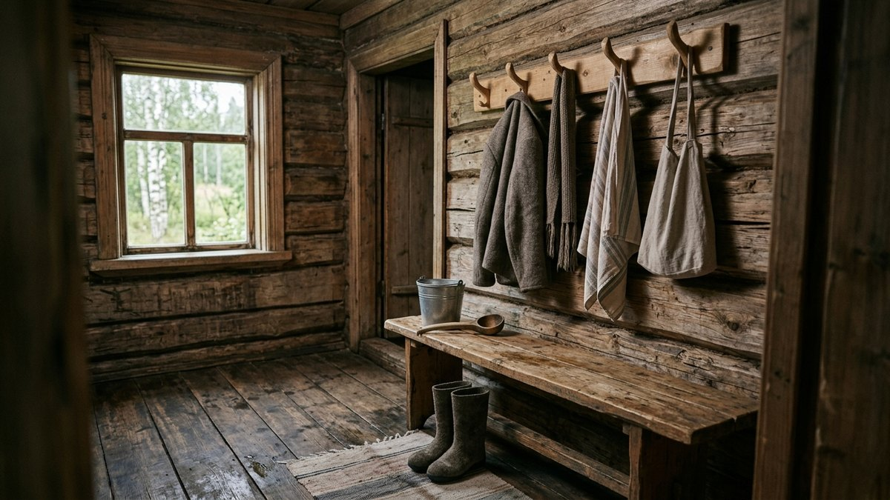

# Как построить баню на даче своими руками: от фундамента до печи

Баня — одна из немногих построек на участке, где ошибка в материале или
вентиляции не просто портит вид, а делает помещение неудобным или опасным
в эксплуатации: отсыревшие стены, дымящая печь, промерзающий пол зимой.
Разберём весь путь от выбора места и материала до внутренней отделки —
без глубокого погружения в плотницкие тонкости, но с ключевыми решениями,
которые нужно принять до начала стройки, а не по ходу дела.

## С чего начать: место и нормы

Баню с печью на дровах нельзя ставить где угодно — расстояние до соседского
участка и до жилого дома регулируется противопожарными и санитарными
нормами:

- **до границы соседнего участка** — не менее 1 метра, для деревянных
  построек с печью на практике безопаснее выдерживать 4–6 метров;
- **до жилого дома на своём участке** — от 8 метров при деревянных стенах
  обеих построек, меньше — при негорючих материалах;
- **до колодца или скважины** — не менее 8 метров, чтобы стоки от бани не
  попадали в источник воды.

Точные цифры зависят от материала стен вашей и соседской построек — перед
закладкой фундамента стоит свериться с актуальными нормативами для вашего
региона.

## Из чего строить: сравнение материалов

| Материал | Стоимость | Скорость стройки | Особенности |
|---|---|---|---|
| Брус (профилированный, клеёный) | Средняя-высокая | Средняя | Нужна усадка 6–12 месяцев (кроме клеёного), тёплые стены |
| Оцилиндрованное бревно | Высокая | Средняя | Классический вид, усадка обязательна |
| Каркасная технология | Низкая-средняя | Быстрая | Не требует усадки, нужен качественный утеплитель и пароизоляция |
| Газобетон, пеноблок | Средняя | Быстрая | Не требует усадки, нужна дополнительная гидроизоляция стен |

Для тех, кто не готов ждать усадку сруба, каркасная технология — самый
быстрый путь к готовой бане в тот же сезон: собрал коробку, утеплил, обшил
изнутри — и париться можно уже через один-два месяца, а не через год.

## Фундамент под баню

Тип фундамента зависит от веса стен и грунта:

- **Свайно-винтовой** — самый быстрый и бюджетный вариант, подходит для
  лёгкой каркасной бани и большинства грунтов, включая пучинистые.
- **Ленточный мелкозаглублённый** — для тяжёлых стен из бруса или блоков на
  устойчивом грунте.
- **Столбчатый** — компромисс по цене между свайным и ленточным, подходит
  для лёгких построек на непучинистых грунтах.

Для бани, в отличие от жилого дома, глубокий заглублённый фундамент обычно
не нужен: конструкция лёгкая, а зимой баню чаще не эксплуатируют постоянно,
что снижает требования к теплоизоляции фундамента.

## Планировка: три обязательные зоны

Минимальная баня делится на три помещения:

1. **Предбанник** — зона раздевания и отдыха, от 4–6 м² для комфортного
   использования компанией из 2–4 человек.
2. **Моечная** — помещение с полом на уклон и сливом, от 3–4 м².
3. **Парная** — самое маленькое, но самое утеплённое помещение, от 4–6 м²
   с учётом полков.

Экономить на площади предбанника — частая ошибка: именно там проводят
больше всего времени между заходами в парную, и тесное помещение быстро
надоедает даже при удачной парилке.

## Порядок строительства по этапам

1. **Фундамент** — заливка или установка свай, выравнивание по уровню.
2. **Нижняя обвязка и пол** — с обязательной гидроизоляцией между
   фундаментом и деревом.
3. **Стены** — сборка сруба, бруса или каркаса в зависимости от выбранной
   технологии.
4. **Кровля** — стропильная система и кровельное покрытие, с вентиляционным
   зазором для отвода влаги из подкровельного пространства.
5. **Печь и дымоход** — устанавливаются до финальной внутренней отделки,
   с соблюдением отступов от горючих конструкций. Похожие принципы пожарной
   безопасности и разделки дымохода разобраны в статье [печь для
   дачи](https://mir-doma.pro/pech-dlya-dachi/), хотя банная печь-каменка и
   отопительная печь дома — разные устройства.
6. **Пароизоляция и утепление парной** — фольгированный пароизолятор швом
   внутрь помещения, поверх — утеплитель, если баня каркасная.
7. **Внутренняя отделка** — вагонка из липы или осины в парной, устойчивой к
   влаге древесины — в моечной.
8. **Коммуникации** — подводка воды, слив, электрика с защитой от влаги.

## Вентиляция: не менее важна, чем печь

Баня без продуманной вентиляции быстро покрывается плесенью между
протопками, даже если стены утеплены правильно. Минимальная схема — приточное
отверстие у пола рядом с печью и вытяжное под потолком на противоположной
стене, оба с заслонками для регулировки. Без вытяжки пар после мытья
задерживается в парной на часы, а не уходит за 20–30 минут.

## Частые ошибки

- **Строить без нормального фундамента**, установив баню на блоках прямо на
  грунт — при пучении почвы зимой конструкцию перекашивает за одну-две
  зимы.
- **Экономить на пароизоляции парной** — без неё утеплитель отсыревает,
  теряет свойства и начинает гнить изнутри стены за несколько сезонов.
- **Ставить печь без противопожарных отступов от деревянных стен** —
  минимальное расстояние и разделка у прохода дымохода через кровлю
  прописаны в инструкции к печи не просто так.
- **Игнорировать вентиляцию**, полагаясь только на проветривание дверью
  после использования — этого недостаточно, из-за чего парная преет и
  портится изнутри.

## Частые вопросы

### Можно ли строить баню без опыта самостоятельно

Фундамент, каркасную коробку и внутреннюю отделку большинство дачников
осиливают своими силами при должной подготовке. Монтаж печи и дымохода —
единственный этап, где лучше привлечь специалиста: ошибки здесь напрямую
связаны с пожарной безопасностью.

### Сколько по времени строится баня своими руками

Каркасная баня силами двух человек по выходным — 2–4 месяца с учётом
внутренней отделки. Баня из бруса с необходимой усадкой растягивается на
год и больше, если усадку не пропускать.

### Нужно ли разрешение на строительство бани на даче

Отдельное разрешение на баню как хозяйственную постройку обычно не
требуется, но расстояния до границ участка и соседних построек всё равно
регулируются нормами и должны соблюдаться независимо от разрешительных
процедур.

### Какой фундамент дешевле всего для бани

Свайно-винтовой фундамент — самый быстрый и бюджетный вариант для лёгкой
каркасной бани, особенно на пучинистых или неровных грунтах, где ленточный
фундамент потребовал бы дополнительных затрат на подготовку основания.

## Заключение

Баня строится в понятной последовательности — фундамент, стены, крыша,
печь, пароизоляция, отделка, — но два места, где экономия обходится дороже
всего: пароизоляция парной и противопожарные отступы у печи. Если участок
для бани ещё выбирается заново или дача только покупается вместе с
существующими постройками, порядок оценки построек и грунта на участке
разобран в статье [покупка старого дома](https://mir-doma.pro/pokupka-starogo-doma/).
