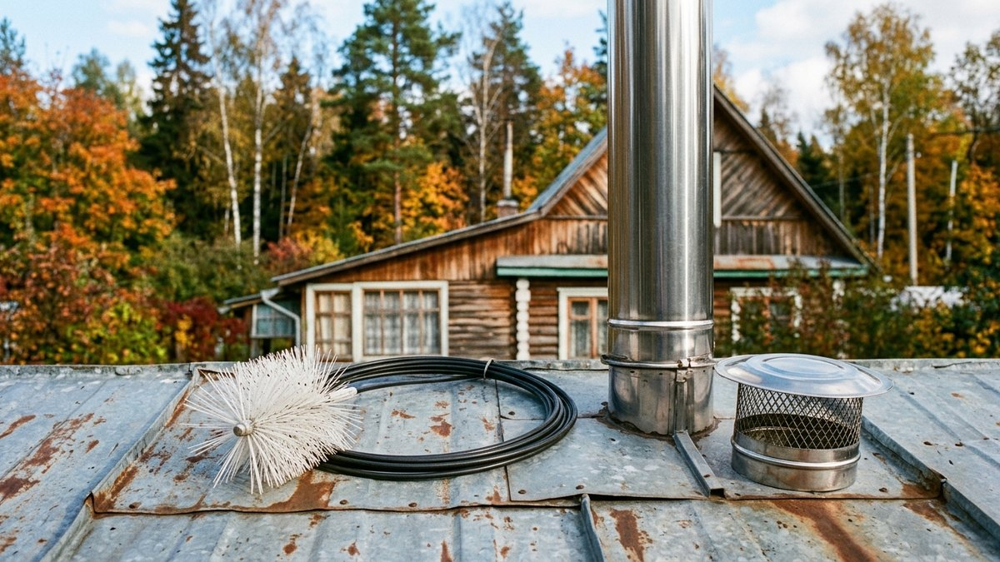
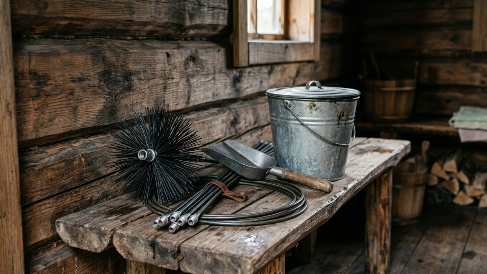
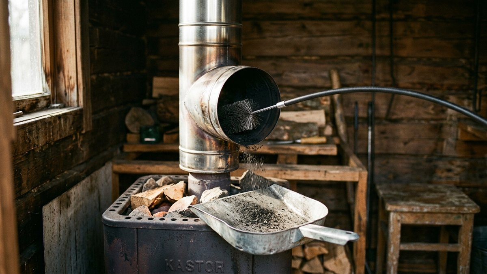
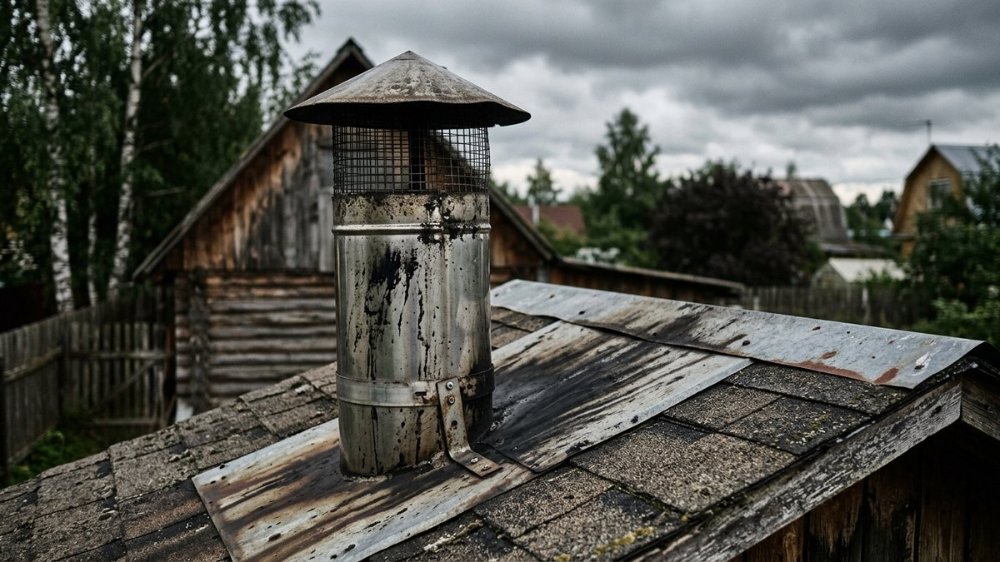
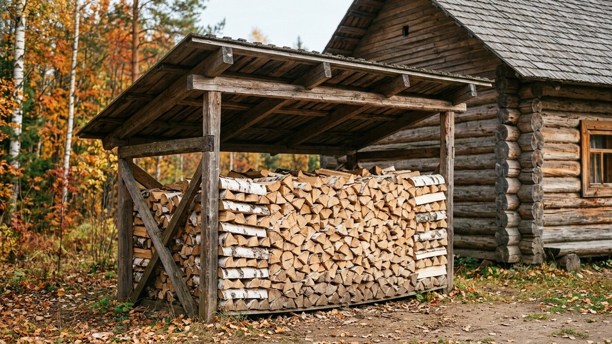
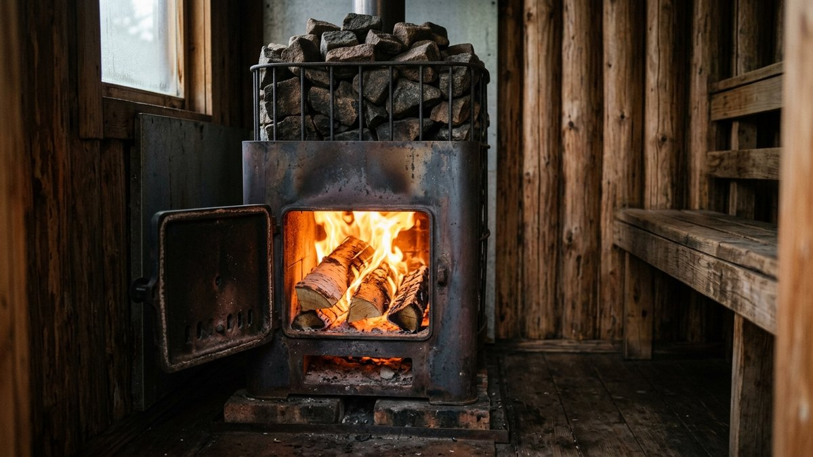

Как прочистить дымоход в бане, обычно задумываются, когда баня
начинает дымить в парную, а печь плохо разгорается. Банный дымоход
забивается быстрее домашнего: топят его редко, но жарко, труба между
топками остывает до уличной температуры, а сырой воздух парной даёт
конденсат, который вместе с сажей превращается в смолистый налёт.
Разберём, как понять, что пора чистить, какой ёрш нужен для стальной
трубы и сэндвича, как чистить через ревизию снизу и сверху с крыши,
что реально дают химические поленья и картофельные очистки и что
делать, если сажа в трубе загорелась. В середине статьи — чек-лист:
отметьте признаки, и он подскажет, пора ли браться за ёрш.

## Почему банный дымоход забивается быстрее

- **Холодная труба между топками.** Баню топят раз-два в неделю. Каждый
  раз первые полчаса дым идёт по холодной трубе, водяной пар из дров
  конденсируется на стенках и связывает сажу в липкий слой.
- **Одностенная труба на улице или на холодном чердаке.** Конденсата
  на ней в разы больше, чем на утеплённом сэндвиче. Если ещё выбираете
  трубу, почему сэндвич выше потолка обязателен, разобрано в статье о том,
  [какой дымоход лучше для бани](https://mir-doma.pro/kakoy-dymokhod-luchshe-dlya-bani/).
- **Сырые и смолистые дрова.** Дрова влажностью выше 20 % и хвойные
  с большим количеством смолы дают больше всего отложений.
- **Топка «на тлении».** Прикрытая заслонка и поддувало, чтобы печь
  дольше держала тепло, — самый быстрый способ закоксовать трубу.
- **Искрогаситель с мелкой сеткой.** Он забивается раньше трубы
  и выглядит как засор дымохода. Чистить его нужно отдельно — об этом
  в статье про [искрогаситель на дымоход](https://mir-doma.pro/iskrogasitel-na-dymokhod-dlya-bani/).

## Пора ли чистить: чек-лист

Отметьте всё, что замечали в последние несколько топок.

<!-- wp:html -->

  
Пора ли чистить дымоход бани

  <label class="md-chk"><input type="checkbox" id="mdChdA"> Дым идёт в парную, когда открываете дверцу топки</label>
  <label class="md-chk"><input type="checkbox" id="mdChdB"> Печь стала хуже разгораться, пламя ленивое, оранжевое</label>
  <label class="md-chk"><input type="checkbox" id="mdChdC"> Из трубы идёт густой чёрный или серый дым, летят хлопья сажи</label>
  <label class="md-chk"><input type="checkbox" id="mdChdD"> Слышно гудение или потрескивание в трубе при растопке</label>
  <label class="md-chk"><input type="checkbox" id="mdChdE"> По трубе или на стыках чёрные потёки смолы</label>
  <label class="md-chk"><input type="checkbox" id="mdChdF"> Последняя чистка была больше года назад или никогда</label>
  <label class="md-chk"><input type="checkbox" id="mdChdG"> Топите сырыми или хвойными дровами</label>
  <label class="md-chk"><input type="checkbox" id="mdChdH"> Сетка искрогасителя видимо забита</label>
  
Отметьте признаки

<!-- /wp:html -->

Регулярная профилактика — хотя бы раз в год перед зимним сезоном и после
каждых 30–40 топок, если дрова не идеально сухие. Плюс каждый раз, когда
баня стояла без дела всё лето: в трубе могут оказаться гнёзда и листья.

## Чем чистить: ёрш, штанга, инструмент

| Что | Какой | Зачем |
|---|---|---|
| Ёрш для нержавейки и сэндвича | Полипропиленовый, диаметр на 1–2 см больше трубы | Не царапает нержавейку, хорошо снимает рыхлую сажу |
| Ёрш для чёрной стали и кирпича | Металлический | Снимает плотный налёт, но царапает нержавейку |
| Гибкие штанги | Стеклопластиковые секции по 1–1,2 м на резьбе | Позволяют пройти трубу снизу через ревизию и колена |
| Ёрш с грузом на тросе | Груз 3–5 кг | Для чистки сверху с крыши по прямой трубе |
| Скребок, совок, ведро с крышкой | — | Сажу из ревизии и топки |
| Пылесос с фильтром для золы | Не обычный бытовой | Обычный забивается и может загореться от тлеющего угля |

Если ёрша нет, его можно собрать самому: пучок полипропиленовой
щётки-метёлки, нарезанной по диаметру, или нарезанная полосами
пластиковая бутылка на шпильке М8 с шайбами. Это рабочий вариант для
рыхлой сажи, но смолистый налёт он не возьмёт.

## Как прочистить дымоход в бане: по шагам

Чистят в сухую погоду, на холодной печи — после последней топки должно
пройти хотя бы 12 часов.

1. **Подготовьте парную.** Закройте полок и камни плёнкой, откройте
   окно. Выньте золу из зольника, закройте дверцу топки.
2. **Снимите искрогаситель и колпак** с трубы, если до них можно
   безопасно добраться. Сетку очистите металлической щёткой отдельно —
   часто именно она главная причина плохой тяги.
3. **Откройте ревизию.** У правильно собранного дымохода внизу, над
   печью или на тройнике, есть ревизия — заглушка или лючок. Через неё
   видно, сколько сажи в трубе, и через неё же сажа будет высыпаться.
4. **Пройдите трубу ершом.** Снизу — через ревизию на гибких штангах:
   вкручивайте секции по одной и продвигайте ёрш вверх с вращением
   по часовой стрелке, чтобы резьба штанг не раскручивалась. Сверху —
   ёрш с грузом на тросе, опускайте и поднимайте по 5–10 раз на каждом
   участке.
5. **Пройдите колена отдельно.** Если дымоход идёт через колено или
   тройник, ёрш через поворот на 90° не пройдёт — эти узлы разбирают
   и чистят руками.
6. **Уберите сажу** из ревизии, тройника и топки совком в ведро с
   крышкой. Сажа лёгкая и разлетается.
7. **Соберите всё обратно** и сделайте контрольную растопку с открытой
   заслонкой: дым должен уйти в трубу сразу, а из трубы — идти светлым.

**Одностенная труба в парной** часто проще разобрать: снять колена,
выбить сажу снаружи, простучав трубу деревянным бруском, и прочистить
ершом на земле. Перед сборкой осмотрите стыки — прогары и ржавчина
видны именно на них.

## Если налёт смолистый

Чёрный блестящий налёт, который не снимается ершом, — креозот. Его не
выскребают, а размягчают:

- **химические средства для чистки дымоходов** — полено или порошок,
  которые сжигают в хорошо прогретой печи. Они размягчают и пересушивают
  отложения, после чего налёт частично осыпается, а остальное снимает
  ёрш. Механическую чистку не заменяют, только облегчают;
- **жаркая топка сухими лиственными дровами** — берёза или ольха,
  1–2 закладки с открытой заслонкой. Налёт подсыхает и становится
  хрупким;
- **осиновые дрова** — народный способ с той же логикой: осина горит
  жарко, но смолы не даёт. Работает как профилактика, не как чистка.
- **картофельные очистки** — эффект слабый: крахмал при сгорании
  немного разрыхляет рыхлую сажу, смолистый налёт он не берёт.

После любой «жаркой» чистки труба наверху и проход через потолок сильно
греются: проверьте разделку, нет ли запаха горящего дерева.

## Если сажа в трубе загорелась

Признаки: гул в трубе, как от реактивного двигателя, искры и пламя
из оголовка, труба раскаляется докрасна.

1. **Закройте дверцу топки и поддувало**, чтобы перекрыть приток
   воздуха. Задвижку не закрывайте наглухо, если дым пойдёт в баню.
2. **Не лейте воду в трубу и на раскалённую печь.** Пар разрывает
   кирпич и стальные швы, а горящая сажа летит в лицо.
3. **Выведите людей** и проверьте чердак и кровлю у трубы: опасна не
   сама труба, а то, что вокруг неё.
4. **Звоните 101 или 112**, если огонь выходит из оголовка, пахнет
   горящим деревом на чердаке или искры летят на кровлю и траву.
5. **После возгорания** баню не топят, пока трубу не осмотрели: сталь
   после прогорания сажи часто ведёт, а швы и уплотнения прогорают.

Возгорание сажи — главная причина пожаров в банях, поэтому разделку
через потолок и кровлю делают с запасом. Как правильно обложить печь
и выдержать расстояния до горючих стен, разобрано в статье про то,
[как обложить печь в бане кирпичом](https://mir-doma.pro/kak-oblozhit-pech-v-bane-kirpichom/).

## Как топить, чтобы чистить реже

- **Сухие дрова** — влажность ниже 20 %, они год лежали под навесом
  с продувом. Сырые дают и меньше жара, и больше сажи.
- **Первые 15–20 минут — открытая заслонка и поддувало.** Труба должна
  прогреться быстро, тогда конденсат не успевает осесть.
- **Не держать печь на тлении** с прикрытой заслонкой.
- **Утеплённая труба** выше потолка — сэндвич, а не одностенка.
- **Хвоя и мусор — в меру.** Еловые дрова, ДСП, пакеты и обрезки
  с краской засоряют трубу быстрее всего.

Особенно это важно зимой: труба на морозе остывает быстрее, конденсата
больше. Как прогревать баню в холода, чтобы не застудить трубу и не
разморозить бак, разобрано в статье о том,
[как топить баню зимой](https://mir-doma.pro/kak-topit-banyu-zimoy/).

## Частые ошибки

- **Металлический ёрш в нержавейке.** Царапины становятся центрами
  коррозии. Для нержавейки — полипропилен.
- **Чистка на горячей печи.** Сажа может тлеть, ожоги и пыль в парной.
- **Обычный пылесос для золы.** Забивается, а тлеющий уголёк в мешке —
  пожар.
- **Только химическое полено вместо ерша.** Налёт размягчается, но
  остаётся в трубе.
- **Не разобрали колено.** Ёрш через 90° не проходит, сажа остаётся
  в самом узком месте.
- **Забыли про искрогаситель.** Труба чистая, а тяги нет, потому что
  забита сетка.

## Частые вопросы

### Как прочистить дымоход в бане своими руками

Снимите искрогаситель и откройте ревизию. Пройдите трубу ершом
на гибких штангах снизу или ершом с грузом сверху, колена разберите
и почистите отдельно. Сажу уберите из ревизии и топки, затем сделайте
контрольную растопку.

### Как часто чистить дымоход в бане

Минимум раз в год перед зимним сезоном и после каждых 30–40 топок,
если дрова не идеально сухие. Внепланово — при дыме в парной, ослабшей
тяге и тёмном дыме из трубы.

### Чем прочистить дымоход в бане без ерша

Одностенную трубу можно разобрать и выбить сажу, простучав её снаружи.
Для рыхлой сажи подойдёт самодельный ёрш из пластиковой бутылки на
шпильке. Химическое полено размягчает налёт, но без механической чистки
сажа останется в трубе.

### Помогают ли осиновые дрова от сажи

Как профилактика — да: осина горит жарко и почти не даёт смолы, налёт
подсыхает и частично осыпается. Чистку ершом она не заменяет.

### Что делать, если загорелась сажа в трубе бани

Закройте дверцу топки и поддувало, не лейте воду в трубу и на печь,
выведите людей и проверьте чердак и кровлю у трубы. Если огонь выходит
из трубы или пахнет горящим деревом, звоните 101 или 112.
