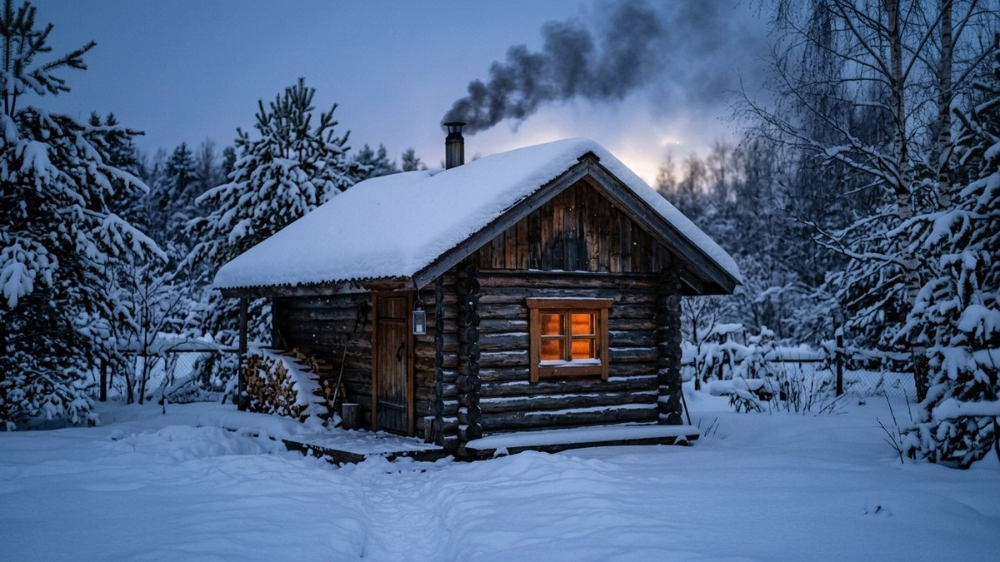
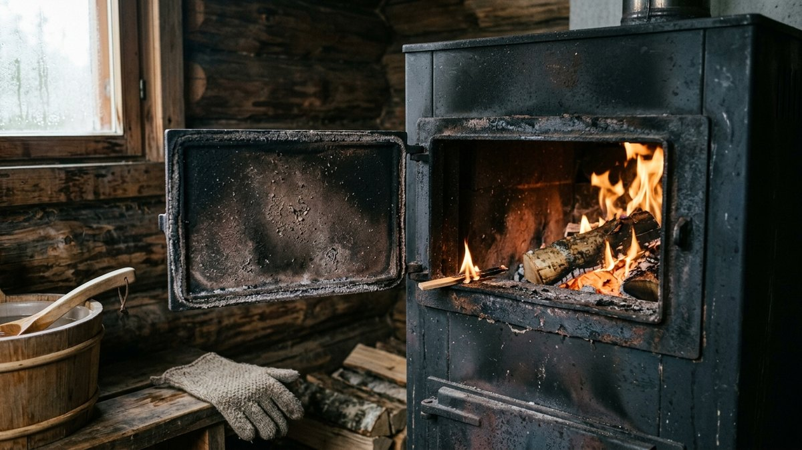
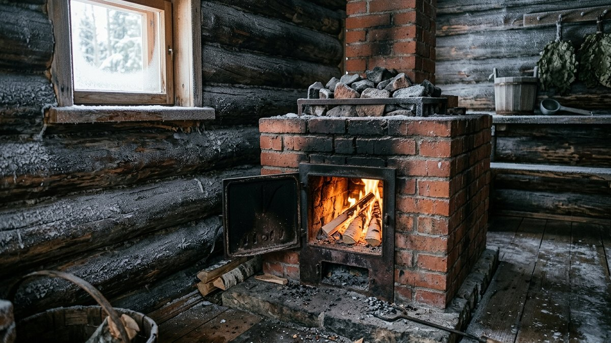
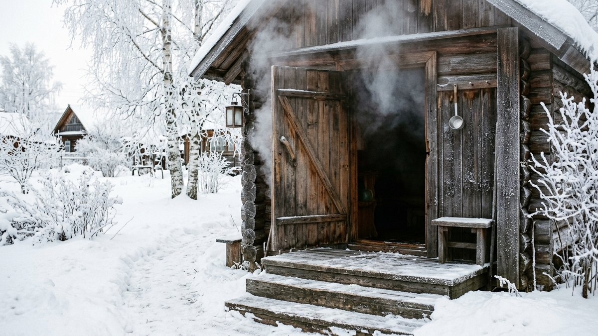
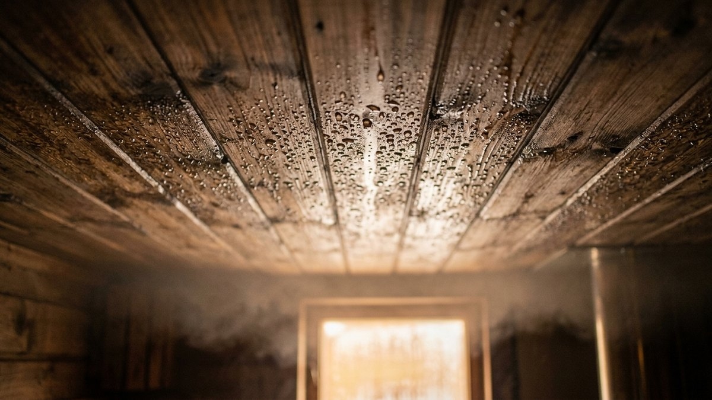
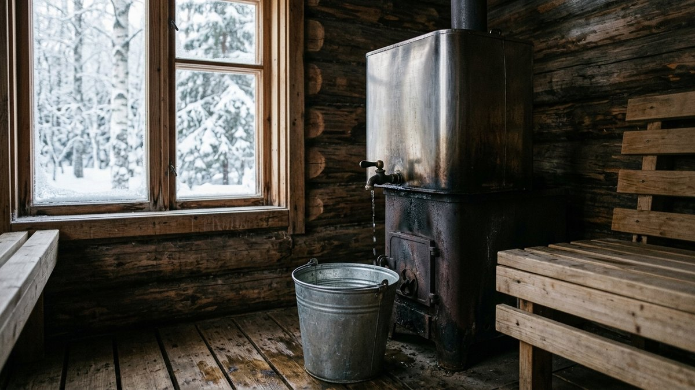

# Как топить баню зимой: первая протопка после простоя, вода и конденсат

Зимой баня стоит холодной неделями, и топить её приходится с
промёрзших стен, ледяных камней и дымохода, в который могло намести
снега. Летняя схема «заложил дрова, поджёг, через час парься» здесь не
работает. Ошибки зимней протопки — треснувшая кирпичная кладка,
лопнувший бак, угар из-за забитой трубы, сырость, которая к весне
превращается в плесень. Разберём по шагам, как топить баню зимой: что
проверить до розжига, как прогревать печь, когда заливать воду, как
всё слить и просушить после парилки. В конце — чек-лист, который
можно отмечать прямо в бане с телефона.

## Можно ли топить баню зимой

Можно, и для большинства бань это нормальный режим. Зимнюю эксплуатацию
отличают три вещи:

- **Всё промёрзло.** Кладка печи, камни, стены и полок имеют уличную
  температуру. Прогреваются они дольше, а кирпич при резком нагреве с
  мороза может треснуть.
- **Вода замерзает.** Всё, что осталось в баке, трубах и сливе после
  прошлой протопки, превращается в лёд и рвёт ёмкости.
- **Конденсат.** Горячий влажный воздух попадает на ледяные стены и
  потолок, и баня «плачет». Если после бани её не просушить, влага
  остаётся в дереве до весны.

Каждая из этих проблем решается порядком действий, а не какой-то
особенной печью. Если печь ещё только выбираете, для зимнего режима
важна скорость прогрева и то, как печь переносит простой на морозе.
Сравнение по этим пунктам и калькулятор стоимости протопки — в статье
[дровяная или электрическая печь для бани](https://mir-doma.pro/drovyanaya-ili-elektricheskaya-pech-dlya-bani/).

## До розжига: что проверить после простоя

Этот этап пропускают чаще всего, и он самый важный для безопасности.

1. **Дымоход и оголовок трубы.** После снегопада и оттепелей устье
   трубы может обмёрзнуть или забиться снегом, а в сезон простоя в
   трубе иногда селятся птицы. Посмотрите на трубу снаружи. Если есть
   возможность, проверьте тягу: поднесите к открытой дверце зажжённую
   лучину или бумажку, пламя должно тянуть внутрь.
2. **Вентиляция.** Откройте продухи и дверь, проветрите баню 10–15
   минут. За время простоя в закрытом помещении застаивается сырой
   воздух. Как должны работать приток и вытяжка в бане, разобрано в
   статье [вентиляция в бане своими руками](https://mir-doma.pro/ventilyaciya-v-bane-svoimi-rukami/).
3. **Бак и трубы.** Если с прошлого раза осталась вода и она замёрзла,
   не топите, пока не убедитесь, что ёмкость цела. Лёд в закрытом баке
   на печи при нагреве создаёт давление.
4. **Печь и кладка.** Осмотрите печь на свежие трещины, особенно
   кирпичную. Трещины в швах после морозов — повод для ремонта до
   протопки, а не после. Как заделать трещины в кладке и какую смесь
   взять, объяснено в статье
   [ремонт печи на даче](https://mir-doma.pro/remont-pechi-na-dache/).
5. **Камни.** Камни, которые впитали влагу, на морозе могут дать
   трещины. Раз в сезон их перебирают и убирают расколотые. Какие
   породы лучше переносят циклы нагрева и охлаждения, описано в статье
   [какие камни для банной печи](https://mir-doma.pro/kakie-kamni-dlya-bannoy-pechi/).

## Вода: когда заливать и как не порвать бак

Правило простое: **в холодной бане воды нет, а в топящейся печи не
бывает пустого бака.**

- **Бак на печи или на трубе** (самоварного типа) заливают **до
  розжига**. Пустой металлический бак на горящей печи перегревается,
  и сварные швы прогорают. Воду привозят с собой или набирают из
  утеплённой скважины перед протопкой, а не держат в бане между
  поездками.
- **Выносной бак с теплообменником** (регистр в топке, трубы к баку на
  стене) опаснее всего зимой. Если система не слита и замёрзла,
  теплообменник в топке закипит, а лёд в трубах не даст пару выйти.
  Зимой такую систему либо заливают незамерзающим теплоносителем по
  инструкции производителя, либо сливают полностью после каждой
  протопки.
- **Ёмкость для холодной воды** держат в бане только на время парения.
  Пластиковую бочку лёд рвёт так же, как металлическую.

## Прогрев: в два захода, а не одной закладкой

Промёрзшую печь, особенно кирпичную, прогревают постепенно. Большая
закладка дров в ледяную топку даёт резкий перепад температур: снаружи
кладка ещё на морозе, изнутри уже горячая. Отсюда трещины.

**Первый заход — малый огонь.** Две-три небольшие закладки мелких
поленьев, 40–60 минут. Задача — не нагреть парилку, а вывести
печь, трубу и камни из мороза и выгнать влагу из кладки. На первом
заходе нормальны запах сырости и пар от кладки.

**Второй заход — рабочий.** Когда корпус печи стал равномерно тёплым,
топят как обычно, полными закладками.

Сколько времени это займёт, зависит от печи, размера парилки и того,
насколько утеплена баня. Ориентиры:

| Печь и баня | Летом | Зимой с мороза |
|---|---|---|
| Металлическая печь, небольшая утеплённая баня | 1–1,5 ч | 2–3 ч |
| Металлическая печь, баня-бочка или тонкие стены | 1–1,5 ч | 2,5–4 ч |
| Кирпичная печь | 3–4 ч | 5–8 ч, лучше начать накануне |
| Электрокаменка | 40–60 мин | 1,5–2 ч |

Это не норматив, а порядок величин: баня из толстого бруса с хорошим
утеплением потолка прогревается заметно быстрее, чем щелевая. Если
зимой баня не набирает жар даже за 3–4 часа, причина обычно в
теплопотерях через потолок и пол, а не в печи.

## Угар: единственная по-настоящему опасная ошибка

Зимой больше соблазн «сберечь тепло» и закрыть заслонку пораньше.
**Заслонку закрывают только когда все угли прогорели полностью**: нет
синих огоньков, угли не светятся и не мерцают. Угарный газ не пахнет,
а в тесной парилке опасная концентрация набирается быстро.

Ещё два зимних фактора:

- **Обмёрзший оголовок** ухудшает тягу, и газы идут в помещение. Если
  при растопке дым пошёл в баню, топить нельзя, сначала чистить трубу.
  Если так бывает каждую зиму, дело часто в самой трубе: одностенная
  над кровлей быстро выстывает и обрастает конденсатом. Чем её заменить,
  разобрано в статье [«Какой дымоход лучше для бани»](https://mir-doma.pro/kakoy-dymokhod-luchshe-dlya-bani/).
- **Закрытые на зиму продухи.** Печи нужен приток воздуха для горения.
  Если продухи закрыты наглухо, тяга слабее даже при чистой трубе.

Датчик угарного газа в предбаннике стоит недорого и оправдан в любой
бане, особенно в той, куда зимой ходят с детьми.

## После бани: слить всё и просушить

То, что вы сделаете в последние полчаса, определяет, в каком состоянии
баня будет весной.

1. **Слейте всю воду**: бак, трубы, теплообменник, если он есть, ковши
   и тазы. Оставьте краны открытыми, чтобы в трубах не осталось
   пробок льда.
2. **Проверьте слив в полу.** Трап и сливная труба на морозе замерзают.
   Если вода стоит, не лейте больше и не пытайтесь пробить лёд
   кипятком из бака. Сливная труба должна идти с уклоном, ниже
   глубины промерзания или быть утеплена.
3. **Протопите на просушку.** Пока печь ещё горячая, откройте дверь
   и продухи на 30–60 минут: тёплый воздух заберёт влагу с полков,
   стен и потолка. Затем закройте продухи, когда угли полностью
   прогорели.
4. **Вынесите мокрое**: веники, полотенца, коврики. Мокрый веник на
   морозе промерзает и к следующему разу рассыпается. Как заготовить
   и хранить веники, чтобы хватило на всю зиму, описано в статье
   [как вязать веники для бани](https://mir-doma.pro/veniki-dlya-bani-kak-vyazat/).
5. **Приоткройте двери внутри бани** (парилка — моечная — предбанник),
   чтобы между поездками воздух циркулировал.

## Конденсат и плесень: почему баня «плачет» зимой

Первые полчаса протопки с мороза по потолку и стенам текут капли. Это
нормально: влага из воздуха оседает на поверхностях, которые ещё
холоднее точки росы. Проблема начинается, если эта влага не уходит:

- **Потолок без пароизоляции** намокает изнутри, и утеплитель теряет
  свойства. Если капает именно с потолка и после каждой бани, это
  повод проверить пирог потолка, а не усиливать топку. Чаще всего
  так «плачет» предбанник: его утепляют по остаточному принципу.
  Правильный пирог без лишней фольги и с вентзазором — в статье
  [предбанник своими руками](https://mir-doma.pro/predbannik-svoimi-rukami/).
- **Полок и стены без просушки** к весне темнеют и покрываются
  плесенью. Помогает только правильная просушка после каждой бани.
- **Слабая вытяжка.** Если воздух в бане не меняется, влага остаётся
  внутри даже при открытой двери.

## Чек-лист зимней протопки

Отмечайте пункты прямо в бане — отметки сохранятся в браузере на
этом устройстве до следующей поездки.

<!-- wp:html -->

  

    
Чек-лист: баня зимой

    

      

      0 из 0
    

  

  

  

    <button type="button" id="mdBcReset" class="md-cl__btn">Очистить отметки</button>
  

<!-- /wp:html -->

## Частые ошибки

- **Большая закладка в ледяную кирпичную печь.** Самый короткий путь к
  трещинам в кладке. Сначала малый огонь.
- **Вода, оставленная в бане «до следующего раза».** Лопнувший бак или
  разорванный теплообменник — самый частый зимний ремонт бани.
- **Растопка без проверки трубы после снегопада.** Обмёрзший оголовок
  даёт дым в помещение и риск угара.
- **Ранняя заслонка.** Закрывать можно только после полного
  прогорания углей, никакие «ещё чуть-чуть тепла» того не стоят.
- **Уехали, не просушив.** Влага в полках и стенах за зиму превращается
  в плесень и запах, от которого потом трудно избавиться.

## Частые вопросы

### Можно ли топить баню-бочку зимой

Можно, но у бочки тонкие стены, и она быстрее остывает. Прогрев с
мороза займёт больше времени, чем у бани из бруса, а конденсата в
первые полчаса будет заметно больше. Правила те же: вода только на
время протопки, после бани слить всё и просушить.

### Сколько топить баню зимой

С металлической печью в небольшой утеплённой бане — обычно 2–3 часа
с мороза, с кирпичной печью — 5–8 часов, её лучше начинать топить
накануне. Точнее зависит от утепления потолка и пола.

### Нужно ли топить баню зимой, если ею не пользуешься

Специально протапливать пустую баню не обязательно. Важнее, чтобы в
ней не осталось воды и она была просушена после последней протопки.
Бане, в которой нет воды, мороз не вредит.

### Почему зимой в бане капает с потолка

Горячий влажный воздух оседает на холодном потолке каплями. В первые
полчаса протопки это нормально. Если капает постоянно и после
прогрева, скорее всего, нарушена пароизоляция потолка или слабая
вытяжка. Как собрать пирог потолка парилки, чтобы пар не уходил
в утеплитель, разобрано в статье про [потолок в бане своими руками](https://mir-doma.pro/potolok-v-bane-svoimi-rukami/).

### Можно ли оставлять воду в бане зимой

Нет. Вода в баке, трубах, бочках и даже в ковшах за ночь замерзает и
рвёт ёмкости. Исключение — система, заправленная незамерзающим
теплоносителем по инструкции производителя.

## Итог

Зимой баню топят в том же порядке, что и летом, но с тремя
добавками: проверить трубу и тягу после простоя, прогревать печь в два
захода и после бани слить всю воду и просушить помещение. Если ваша
баня ещё только строится, зимнюю эксплуатацию стоит заложить сразу —
утеплённый потолок, слив ниже глубины промерзания, бак, который легко
слить. Как строят баню из бруса с расчётом на круглый год, разобрано
в статье [баня из бруса своими руками](https://mir-doma.pro/banya-iz-brusa-svoimi-rukami/).
