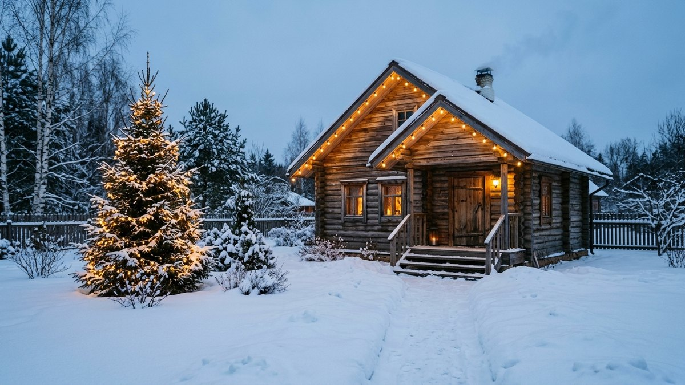
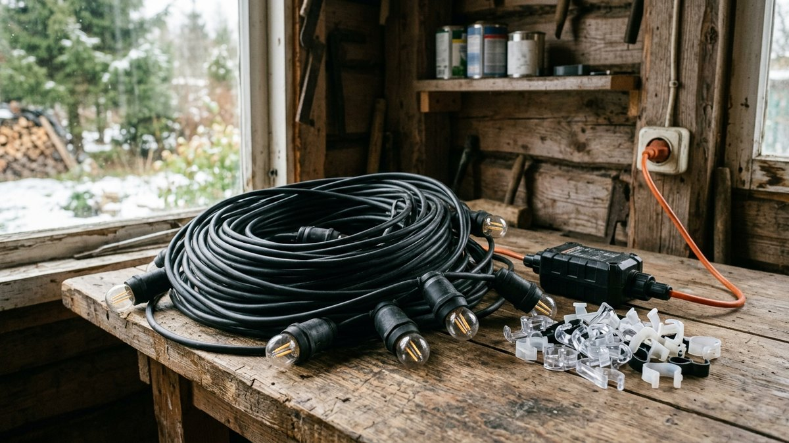
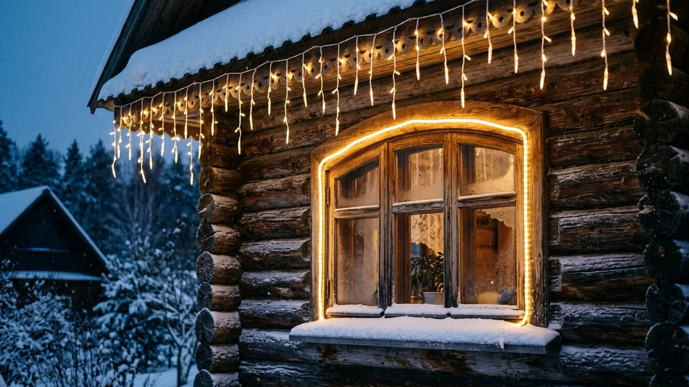
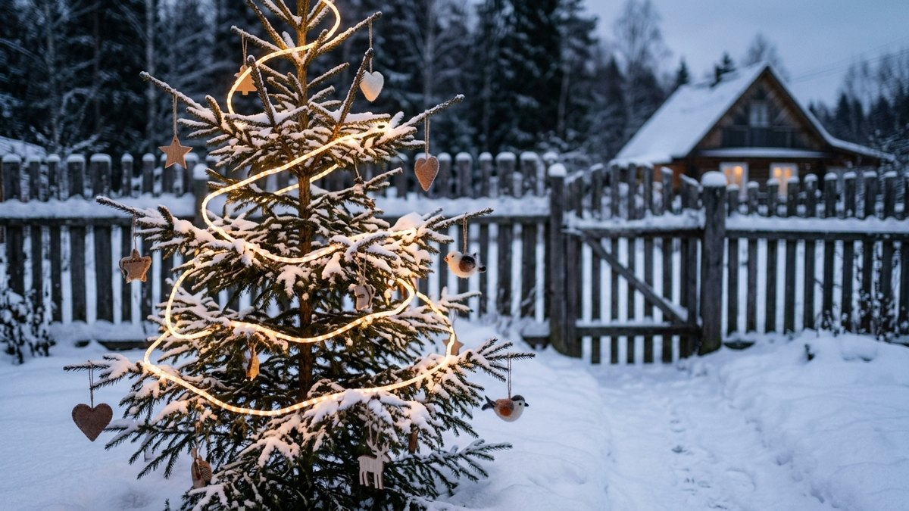
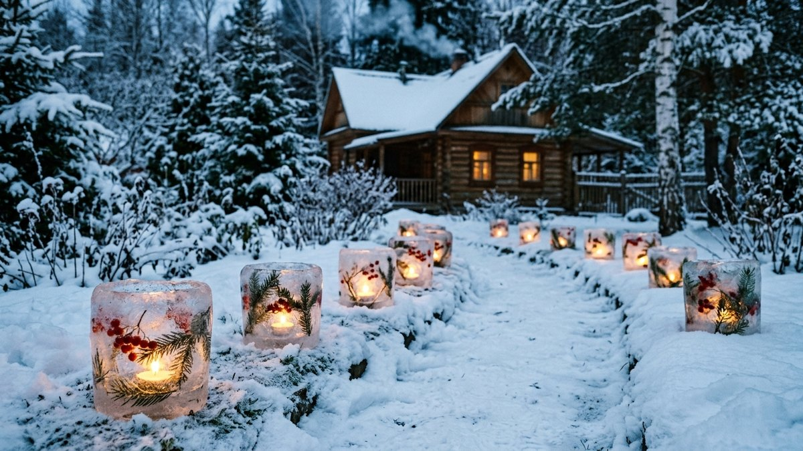
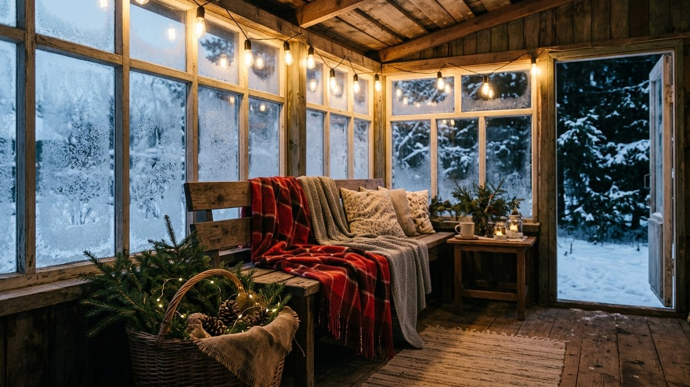

Встретить Новый год на даче хотят многие, но украшать загородный дом
сложнее, чем квартиру. Гирлянды висят на морозе и снегу, розетка
на улице одна или её нет вовсе, а дом между праздниками стоит пустым,
и всё, что светится, светится без присмотра. Ниже разберём, как украсить
дом снаружи на Новый год и как оформить двор и веранду так, чтобы
было красиво с дороги и безопасно для проводки: какие гирлянды
выдерживают мороз, как их подключить, как нарядить живую ель на
участке, не повредив её, и что сделать почти бесплатно из снега и льда.
Длину гирлянд на свой дом и деревья посчитает калькулятор.

## С чего начать: план от дороги к крыльцу

Новогоднее оформление дачи смотрится цельным, когда у него есть
композиция. Её проще всего строить по пути, которым гость идёт
к дому.

1. **Калитка и въезд.** Венок на калитку, пара фонарей у ворот.
   Это первое, что видно с дороги.
2. **Дорожка.** Светильники вдоль расчищенной дорожки или ледяные
   фонари. Освещённая дорожка нужна не только для красоты: зимой
   в темноте по участку легко оступиться.
3. **Главный акцент.** Одна ель или крупный куст, украшенный ярче
   всего. Если таких акцентов три, глаз не знает, куда смотреть.
4. **Дом.** Гирлянда по карнизу и фронтону, подсветка окон.
5. **Крыльцо и веранда.** Венок на дверь, фонари, еловые ветки,
   тёплый свет — то, что видно вблизи.

Выберите один цвет света на весь участок. Тёплый белый (около
2700–3000 К) на деревянном доме и снегу выглядит уютно, холодный
белый — эффектно, но на даче чаще кажется «офисным». Разноцветные
гирлянды оставьте для ели: на фасаде они дробят силуэт дома.

## Какие гирлянды подходят для улицы

Уличная гирлянда отличается от комнатной не яркостью, а тем, что
выдерживает влагу, мороз и ветер. Перед покупкой смотрите на три
вещи в маркировке.

| Параметр | Что брать для дачи | Почему |
|---|---|---|
| Степень защиты | IP44 и выше, на открытых местах — IP65 | IP20 — только для дома, первая оттепель закоротит контакты |
| Провод | каучуковый (резиновый) или силиконовый | обычный ПВХ на морозе дубеет и трескается при сматывании |
| Тип ламп | светодиоды | потребляют в разы меньше, почти не греются, не боятся вибрации |
| Напряжение на гирлянде | 24–36 В через блок питания | даже при повреждении провода на улице нет опасного напряжения |
| Соединение | гирлянды с коннекторами одной серии | можно собрать длинную линию с одним блоком питания |

Гирлянды бывают разных форм, и для дачи у каждой своё место:

- **Нить** — универсальная: карниз, перила, ветки деревьев.
- **Бахрома и сосульки** — для карниза и края крыши, создают
  эффект свисающих огней.
- **Сетка** — для кустов и живой изгороди: накинул, и куст
  равномерно светится.
- **Дюралайт (световой шнур)** — для контура окон, дверей,
  ограждений. Толстый, прочный, хорошо держит форму.
- **Белт-лайт** — провод с патронами и крупными лампами, для
  веранды и навеса.

Одна линия гирлянд не должна быть длиннее, чем разрешает производитель:
на упаковке указано, сколько секций можно соединить последовательно.
Если нужно больше, ставят второй блок питания или вторую линию.

## Подключение на улице: что нужно знать о безопасности

Гирлянда сама по себе потребляет мало, опасность — в подключении.
На даче три типичные проблемы: старая проводка, нет уличной розетки
и удлинители, брошенные по снегу.

- **Розетка.** Подключать уличные гирлянды лучше от уличной розетки
  с крышкой и защитой IP44 или выше. Если её нет, а провод идёт
  из дома через окно или дверь, его зажимает и перетирает —
  со временем изоляция повреждается.
- **УЗО или дифавтомат.** Уличные розетки подключают через защитное
  устройство на ток утечки 30 мА. Если на даче его нет, это первое,
  что стоит сделать до установки гирлянд. Как разделить проводку
  дома на группы и где ставить УЗО, разобрано в статье про
  [схему электропроводки на даче](https://mir-doma.pro/skhema-elektroprovodki-na-dache/).
- **Удлинители.** Только уличные, с резиновым проводом. Места
  соединений не оставляют на снегу: поднимают на крючки или убирают
  в герметичную коробку.
- **Без нагрузки на провод.** Гирлянду крепят на крючки и клипсы,
  а не тянут за провод. На ветру натянутый провод перетирается
  о кромку металлочерепицы или водостока.
- **Дымоход и печь — не трогать.** Гирлянды на трубу, у дымохода
  и рядом с топкой не вешают: даже холодная гирлянда у горячего
  металла плавится.

**Не оставляйте гирлянды включёнными в пустом доме.** Если на даче
вы бываете наездами, проще всего поставить гирлянду на таймер
или умную розетку: она включит свет вечером и выключит ночью,
а в будни отключит совсем. Что ещё умеет такая розетка на даче
и почему её стоит выбирать с запасом по нагрузке, описано в статье
про [умную розетку для дачи](https://mir-doma.pro/umnaya-rozetka-dlya-dachi/).

## Калькулятор длины гирлянд

Калькулятор считает гирлянды для карниза, фронтонов, окон и деревьев
на участке. Для дерева длина считается по спирали: чем меньше шаг
между витками, тем гуще свет и тем больше нужно метров.

<!-- wp:html -->

<h3 class="md-ng__title">Калькулятор гирлянд для дачи</h3>

Считает общую длину гирлянд для дома и деревьев, количество гирлянд выбранной длины и примерную мощность светодиодов.

<label class="md-ng__f">Длина карниза (все стороны, которые украшаете), м<input type="number" id="ngE" value="10" min="0" max="100" step="0.5"></label>
<label class="md-ng__f">Фронтонов (треугольников крыши)<input type="number" id="ngGn" value="1" min="0" max="6" step="1"></label>
<label class="md-ng__f">Длина ската фронтона, м<input type="number" id="ngGl" value="4" min="0" max="15" step="0.5"></label>
<label class="md-ng__f">Окон с подсветкой по контуру<input type="number" id="ngWn" value="2" min="0" max="20" step="1"></label>
<label class="md-ng__f">Размер окна (ширина + высота), м<input type="number" id="ngWs" value="2.4" min="0.5" max="6" step="0.1"></label>
<label class="md-ng__f">Деревьев для украшения<input type="number" id="ngTn" value="1" min="0" max="20" step="1"></label>
<label class="md-ng__f">Высота дерева (украшаемая часть), м<input type="number" id="ngTh" value="2" min="0.5" max="10" step="0.1"></label>
<label class="md-ng__f">Диаметр кроны внизу, м<input type="number" id="ngTd" value="1.2" min="0.3" max="6" step="0.1"></label>
<label class="md-ng__f">Шаг между витками на дереве
<select id="ngTs">
<option value="0.3">30 см — редко</option>
<option value="0.2" selected>20 см — средне</option>
<option value="0.12">12 см — густо</option>
</select></label>
<label class="md-ng__f">Длина одной гирлянды, м
<select id="ngL">
<option value="5">5</option>
<option value="10" selected>10</option>
<option value="20">20</option>
</select></label>
<label class="md-ng__f">Мощность гирлянды на 10 м, Вт<input type="number" id="ngP" value="6" min="1" max="100" step="1"></label>

Дом (карниз, фронтоны, окна)<b id="ngHouse">—</b>

Деревья<b id="ngTrees">—</b>

Всего с запасом 10%<b id="ngTotal">—</b>

Гирлянд выбранной длины<b id="ngCount">—</b>

Мощность всех гирлянд<b id="ngPow">—</b>

Длина на дерево — спираль по конусу: число витков (высота ÷ шаг) × средняя окружность кроны. Запас 10% — на спуск провода к розетке и обход препятствий. Мощность указана для светодиодных гирлянд; точную берите с упаковки.

<button type="button" id="ngCopy" class="md-ng__btn md-ng__btn--main">Скопировать результат</button>
<a id="ngVk" class="md-ng__btn md-ng__btn--vk" href="#" target="_blank" rel="noopener noreferrer">Поделиться ВКонтакте</a>
<a id="ngTg" class="md-ng__btn md-ng__btn--tg" href="#" target="_blank" rel="noopener noreferrer">Поделиться в Telegram</a>
<button type="button" id="ngShareNative" class="md-ng__btn" hidden>Поделиться…</button>
<button type="button" id="ngPrint" class="md-ng__btn">Печать</button>

<!-- /wp:html -->

Для ели высотой 2 м с кроной 1,2 м при среднем шаге витков выходит
около 19 м гирлянды. Это неожиданно много, поэтому на деревья обычно
не хватает «одной гирлянды из магазина» — посчитайте заранее.

## Как украсить дом снаружи

Дом — самая большая поверхность, и украшать его нужно сдержанно,
подчёркивая форму, а не закрывая её.

- **Карниз и фронтон.** Нить или бахрома по краю крыши рисует
  силуэт дома в темноте. Крепят на пластиковые клипсы для
  водостока или на крючки под свесом кровли. Скобы степлера через
  провод не забивают: так повреждается изоляция.
- **Окна.** Дюралайт по контуру окна или звезда на присосках
  изнутри стекла. Изнутри проще: не нужна уличная розетка,
  а свет виден с участка.
- **Входная дверь.** Венок из еловых веток, шишек и сухоцветов.
  На деревянную дверь его вешают на ленту через верх полотна,
  без гвоздей.
- **Крыльцо.** Гирлянда по перилам, фонари со свечами на ступенях
  сбоку (не посередине прохода), еловые ветки в кашпо.

Если на даче холодный дом и вы приезжаете на праздники, займитесь
украшениями во вторую очередь: сначала прогрейте дом, а потом
вешайте гирлянды, пока светло. Какой обогреватель быстрее всего
прогреет выстуженную дачу, сравнивается в статье [«Какой обогреватель
выбрать для дачи»](https://mir-doma.pro/kakoy-obogrevatel-vybrat-dlya-dachi/).

## Ёлка на участке: как нарядить живую ель и не навредить ей

Растущая на участке ель или туя — лучшая новогодняя ёлка: её не
нужно покупать и выбрасывать. Но дерево зимой хрупкое: ветки
промерзают и ломаются от лишнего веса.

- **Лёгкие игрушки.** Пластик, дерево, войлок. Стеклянные шары
  на морозе бьются при падении и оставляют осколки в снегу.
- **Гирлянда по спирали снаружи кроны,** а не внутрь веток.
  Провод не затягивают петлями: весной ветка растёт, и тугая
  петля её перетягивает.
- **Снег с веток стряхивать аккуратно** снизу вверх, постукивая
  по ветке, а не тряся дерево целиком.
- **Снять украшения до оттепели,** в крайнем случае в начале марта.
  Гирлянда, оставленная на всё лето, вросшая в кору и выгоревшая, —
  частая картина на дачах.

Если подходящего дерева нет, ель в кадке или ёлку на подставке
ставят у крыльца или в центре площадки. Срубленное дерево на улице
держится до весны: в морозе хвоя не осыпается.

## Двор без проводов: снег, лёд и огонь

Многое на даче можно сделать вообще без электричества, из того, что
лежит под ногами.

- **Ледяные фонари.** Ведро воды на ночь на мороз: стенки
  замерзают, середина остаётся жидкой. Утром воду выливают через
  отверстие сверху, ведро ошпаривают горячей водой и вынимают ледяной
  стакан. Внутрь — свеча в стеклянной банке. Можно вморозить ветки,
  ягоды рябины и шишки.
- **Снежные фигуры и снежные фонари.** Пирамида из снежков
  с полостью внутри, свеча в центре. Ставят вдоль дорожки.
- **Фонари со свечами.** Металлические или стеклянные, со свечой
  в стеклянной колбе. Оставлять горящими без присмотра нельзя.
- **Костровая чаша или мангал.** Живой огонь во дворе — центр
  праздника на даче. Ставят подальше от построек, деревьев и
  кровли, на расчищенной площадке, а рядом держат ведро с песком.
- **Кормушки для птиц.** Нарядная кормушка с семечками и салом
  на ветке у окна — украшение, которое работает всю зиму.

## Веранда и крыльцо: тёплый новогодний уголок

Веранда — переход от улицы к дому, и на Новый год её удобно
превратить в место для прогулочного чая или фотографий.

- **Текстиль.** Пледы, шерстяные подушки, домотканые дорожки.
  Он сразу делает холодную веранду уютной.
- **Свет.** Белт-лайт под потолком или нить по балкам, а не верхний
  яркий светильник.
- **Еловые ветки и шишки** в корзинах, на подоконниках, в высоких
  вазах. Пахнут, не требуют полива и стоят весь праздник.
- **Венок или гирлянда из веток** над входом в дом.

Если веранда холодная, не ставьте на неё живые цветы и мандарины
на всю ночь: замёрзнут. А сама веранда выглядит тем праздничнее,
чем лучше продуман её обычный интерьер — стили и приёмы оформления
собраны в статье про [дизайн веранды на даче](https://mir-doma.pro/dizayn-verandy-na-dache/).

После праздника на участке хорошо закончить день в бане. Если
она топится зимой впервые за долгое время, сначала проверьте трубу
и прогрейте печь в два захода — порядок описан в статье о том,
[как топить баню зимой](https://mir-doma.pro/kak-topit-banyu-zimoy/).

## Частые ошибки

- **Комнатная гирлянда на улице.** IP20 не выдерживает первой
  оттепели: контакты окисляются, гирлянда гаснет участками или
  выбивает автомат.
- **Удлинитель с соединением на снегу.** Влага в розетке удлинителя —
  утечка тока и срабатывание УЗО, а без УЗО — опасность удара током.
- **Провод через окно или дверь.** Пережатая изоляция со временем
  повреждается.
- **Гирлянды включены, пока на даче никого.** Без присмотра свет
  не нужен никому, а риск остаётся. Таймер или умная розетка решают
  это за копейки.
- **Гирлянда возле дымохода.** Металл трубы горячий даже там,
  где этого не ожидаешь.
- **Гирлянда на дереве до лета.** Провод врастает в кору, ветки
  перетягиваются.
- **Пять цветов света на одном участке.** Получается пёстро,
  дом теряет форму.

## Частые вопросы

### Как украсить дом снаружи на Новый год

Подчеркните силуэт дома: гирлянда по карнизу и фронтону, контур
окон дюралайтом или звёзды изнутри стекла, венок на двери, свет
на крыльце. Возьмите один цвет на весь дом — лучше тёплый белый.

### Какие гирлянды можно вешать на улице

Только уличные: со степенью защиты IP44 и выше, лучше IP65,
с каучуковым или силиконовым проводом. Светодиодные гирлянды
на 24–36 В через блок питания безопаснее, чем на 220 В.

### Как украсить двор на Новый год своими руками

Ледяные фонари из ведра воды, снежные фонари со свечами вдоль дорожки,
венок на калитку и одна главная ель с гирляндой. Почти всё это можно
сделать за выходные и без затрат.

### Сколько метров гирлянды нужно на ёлку

Зависит от высоты, ширины кроны и густоты витков. Для дерева высотой
2 м с кроной 1,2 м при витках через 20 см — около 19 м. Для своего
дерева посчитайте калькулятором выше.

### Можно ли оставлять гирлянды включёнными на ночь

Если вы на даче, уличные гирлянды на ночь лучше выключать или ставить
на таймер. В пустом доме гирлянды не оставляют включёнными: отключите
их или поставьте на таймер и умную розетку.
