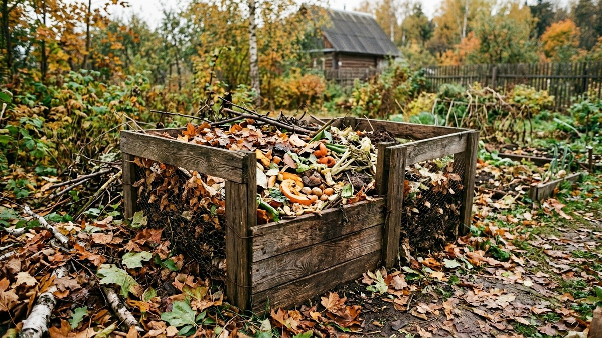
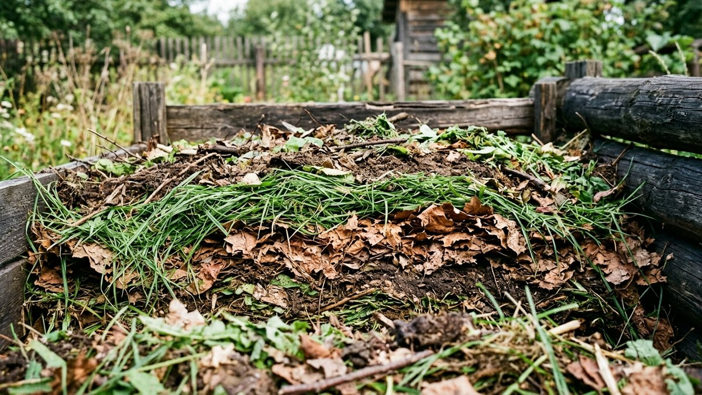
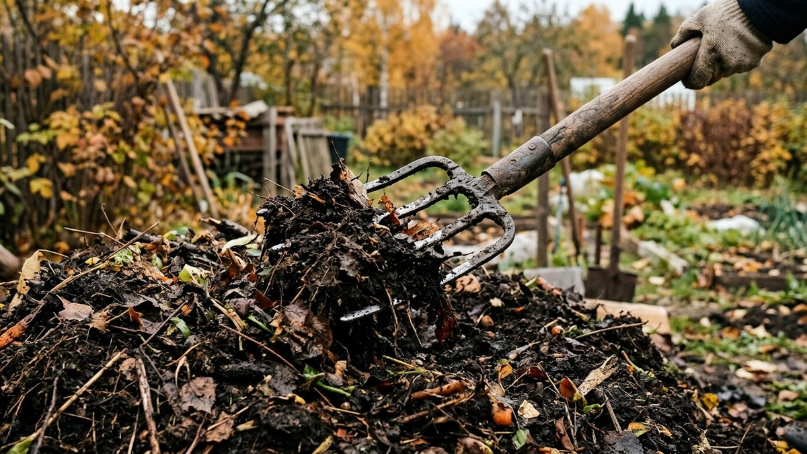
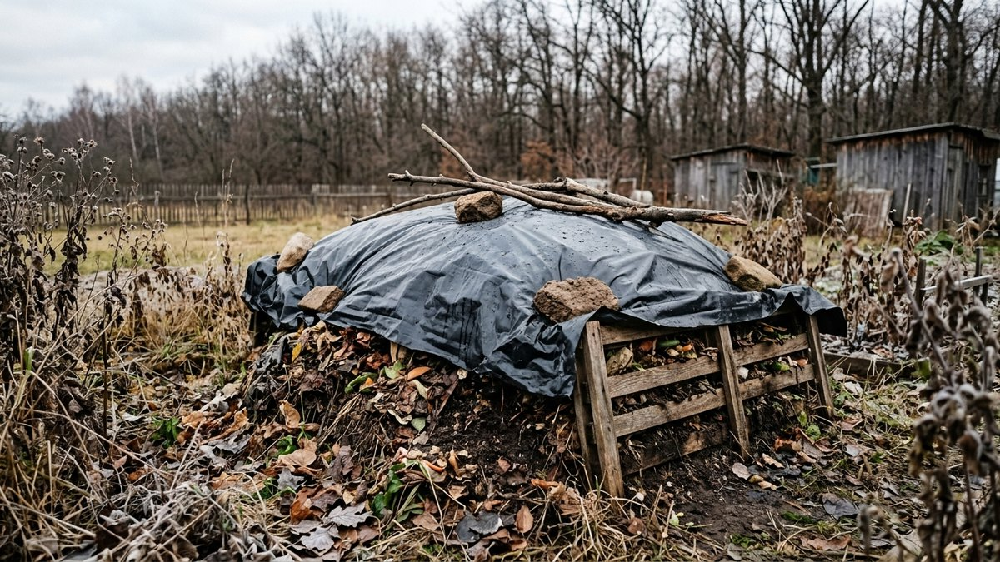
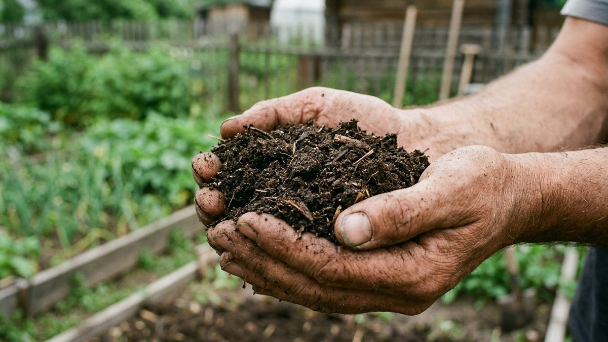
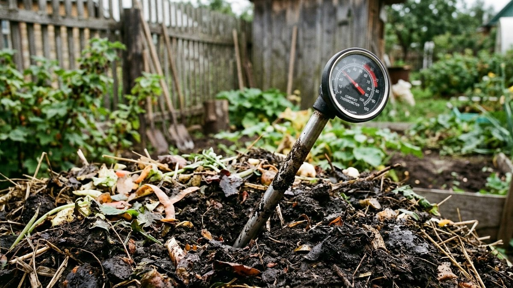

# Как ускорить созревание компоста осенью

Осенью в компостную кучу разом попадает больше материала, чем за всё лето:
ботва, опавшие листья, остатки урожая. Но чем ниже температура воздуха, тем
медленнее работают бактерии, которые это всё перерабатывают — если оставить
кучу как есть, она просто промёрзнет непереработанной и продолжит гнить
только следующей весной. Разберём, что реально ускоряет созревание компоста
именно в холодный сезон, а что — просто миф из советов «на глаз».

## Почему осенью компост созревает медленнее

Разложение органики — работа бактерий, а бактериям для активности нужно
тепло, влага и кислород. Осенью температура падает, и в первую очередь
страдает именно скорость реакции: та же куча, что летом разогревалась до
50–60 °C и созревала за 2–3 месяца, при +5…+10 °C на улице может почти не
греться и стоять полгода без видимого результата.

Ускорить процесс — значит компенсировать нехватку тепла за счёт остальных
факторов: правильного соотношения материалов, влажности, доступа воздуха и
измельчения сырья.

## Баланс зелёного и коричневого

Скорость разложения сильнее всего зависит от соотношения азотистых
(«зелёных») и углеродистых («коричневых») материалов:

| Тип | Примеры | Роль |
|---|---|---|
| Зелёное (азот) | Свежая трава, овощные очистки, навоз, помёт | Ускоряет разложение, разогревает кучу |
| Коричневое (углерод) | Сухие листья, солома, картон, ветки | Даёт структуру, не даёт куче слёживаться в кашу |

Оптимальное соотношение — примерно 1 часть зелёного на 2–3 части
коричневого по объёму. Осенью чаще перебор в другую сторону: только опавшие
листья без добавления зелёного дают медленный, почти не греющийся компост.
Добавление свежей травы, овощных очисток или навоза исправляет баланс и
заметно ускоряет разогрев кучи. Хороший источник зелёного материала осенью —
скошенные [сидераты](https://mir-doma.pro/sideraty-osenyu/), если часть
грядок под них уже отведена: свежая зелёная масса разогревает кучу не хуже
травы с газона.

## Пять приёмов, которые реально ускоряют компост

1. **Измельчите крупное сырьё.** Целые ветки и толстые стебли разлагаются
   месяцами — если пропустить их через измельчитель или порубить лопатой,
   площадь контакта с бактериями резко увеличивается.
2. **Следите за влажностью.** Куча должна быть влажной, как отжатая губка —
   не мокрой и не сухой. Пересохший осенний компост из одних листьев почти
   не работает, его нужно проливать водой при закладке.
3. **Перелопачивайте раз в 1–2 недели.** Перемешивание возвращает кислород в
   толщу кучи — без него в глубине начинается анаэробное гниение с запахом,
   которое идёт куда медленнее обычного компостирования.
4. **Добавьте источник азота.** Свежий навоз, куриный помёт, разведённые
   дрожжи или карбамид (мочевина) в небольшой дозе разгоняют бактериальную
   активность лучше любого покупного «ускорителя».
5. **Укройте кучу.** Тёмная плёнка или старый брезент поверх кучи удерживают
   тепло и влагу и защищают от осенних дождей, которые вымывают питательные
   вещества и переохлаждают верхний слой.

## Покупные ускорители: когда они оправданы

Готовые биодеструкторы и ЭМ-препараты добавляют в кучу нужные штаммы
бактерий и действительно ускоряют процесс — но только если в куче уже
достаточно влаги, воздуха и баланса материалов. На пересохшей или слишком
плотной куче без доступа воздуха даже самый сильный препарат не сработает:
бактериям просто негде размножаться. Сначала — влажность, структура и
перелопачивание, и только потом, при желании ускорить дальше, — покупной
активатор.

## Готовим кучу к зиме

Если куча не успевает полностью созреть до морозов, задача меняется: не
доработать компост за оставшиеся недели, а сохранить в куче максимум
бактериальной активности до весны.

1. Проверьте влажность в последний раз перед устойчивыми заморозками —
   промёрзшая сухая куча оттает медленнее влажной.
2. Добавьте финальный слой коричневого материала (солома, сухие листья)
   поверх кучи — он работает как утепление.
3. Укройте плотным материалом — плёнкой, шифером, старым ковром — чтобы
   куча не промокала под снегом и не промерзала на всю глубину.
4. Отложите перелопачивание до весны: зимой ворошить кучу бессмысленно,
   бактерии почти не активны при устойчивом минусе.

## Частые ошибки

- **Закладывать в кучу только опавшие листья** без зелёного компонента —
  получается медленный, почти не греющийся компост, который созреет
  только через год-два.
- **Не измельчать толстые стебли и ветки** — они тормозят созревание всей
  кучи, даже если остальное сырьё подобрано правильно.
- **Заливать кучу водой при первом же дожде и забывать про неё** —
  избыток влаги без перелопачивания приводит к анаэробному гниению и
  запаху, а не к ускорению.
- **Использовать в компосте больную ботву** — фитофтороз и другие болезни
  переживают компостирование при недостаточно высокой температуре кучи и
  возвращаются на грядки вместе с готовым компостом.

## Частые вопросы

### Сколько времени созревает компост осенью

При правильном балансе материалов и регулярном перелопачивании — 2–4
месяца до наступления устойчивых морозов. Если куча заложена поздно осенью
или без ухода, процесс останавливается на зиму и завершается только
весной.

### Можно ли ускорить компост дрожжами

Да, разведённые в воде пекарские дрожжи с сахаром работают как источник
активных микроорганизмов и заметно разогревают кучу на 1–2 недели, но
эффект временный — без правильного баланса материалов и влажности куча
снова замедлится.

### Нужно ли поливать компост осенью, если идут дожди

Нужно проверять, а не поливать по умолчанию. Дождевая вода промачивает
только верхний слой, а внутри кучи может оставаться сухо — влажность стоит
проверять рукой на глубине 20–30 см, а не ориентироваться на то, что на
улице сыро.

### Что делать, если компост не разогревается

Проверьте по порядку: достаточно ли зелёного материала (азота), не
пересохла ли куча, достаточно ли она большая по объёму (меньше 1 м³ в кубе
плохо держит тепло) и не слишком ли плотно утрамбован материал, перекрывая
доступ воздуха.

### Можно ли добавлять в компост осеннюю листву слоем без ничего другого

Можно, но такой слой будет разлагаться заметно дольше остальной кучи —
листья сами по себе бедны азотом. Лучше чередовать слои листьев с зелёным
материалом или свежим навозом, чтобы куча не «застревала» на одном
углеродистом сырье.

## Заключение

Осенний компост ускоряется тем же, чем и летний, — балансом зелёного и
коричневого, влажностью, воздухом и измельчением сырья, — просто с поправкой
на то, что бактериям холоднее и им нужно больше помощи. Если куча всё же не
успевает созреть до морозов, укройте её и оставьте до весны: сохранить
активность в куче важнее, чем гнаться за скоростью в последние недели
сезона. Готовый компост осенью удобно совмещать с
[известкованием почвы](https://mir-doma.pro/izvestkovanie-pochvy-osenyu/) —
только не вносите оба материала в одну грядку одновременно, между
процедурами нужен интервал в несколько недель. А сам план
[осенних подкормок](https://mir-doma.pro/osennie-podkormki/) на участке стоит
строить уже с учётом того, сколько готового компоста будет к весне.
