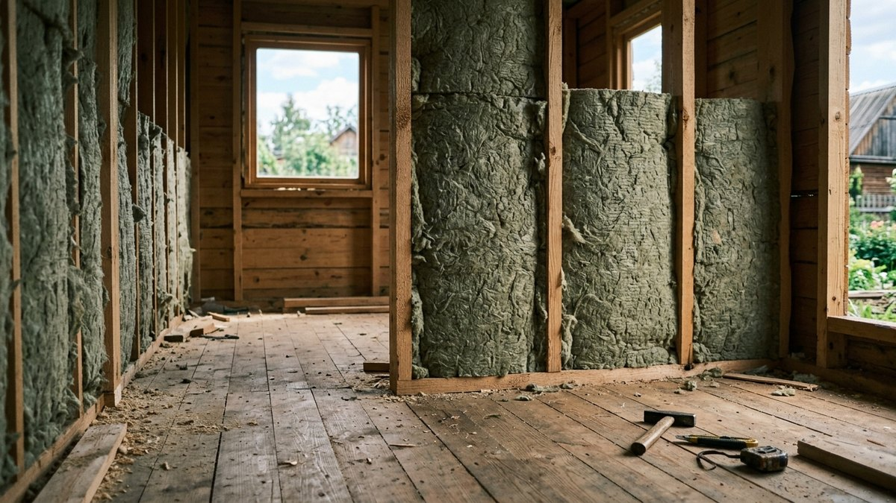
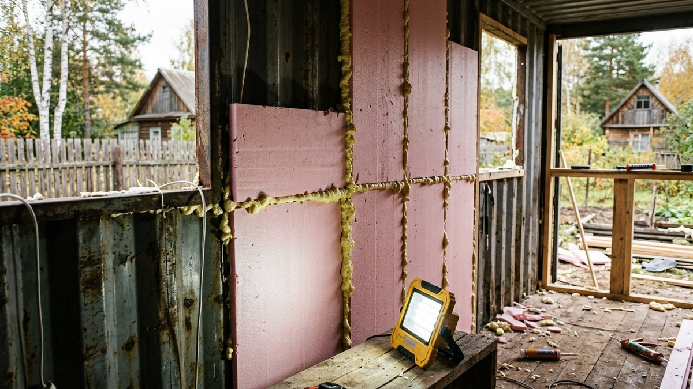
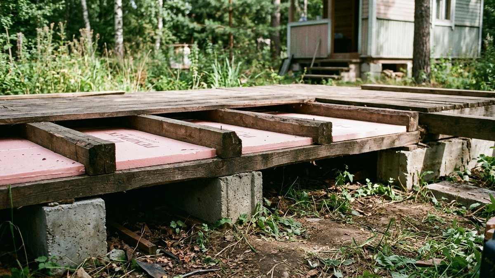
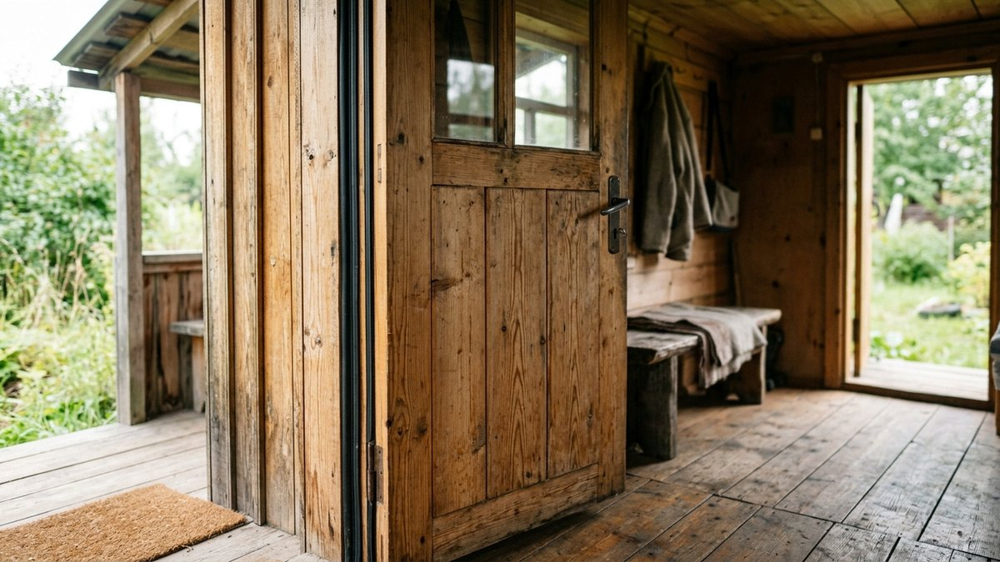
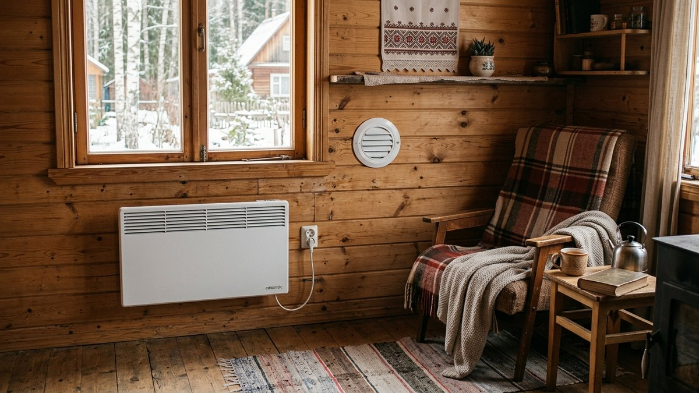
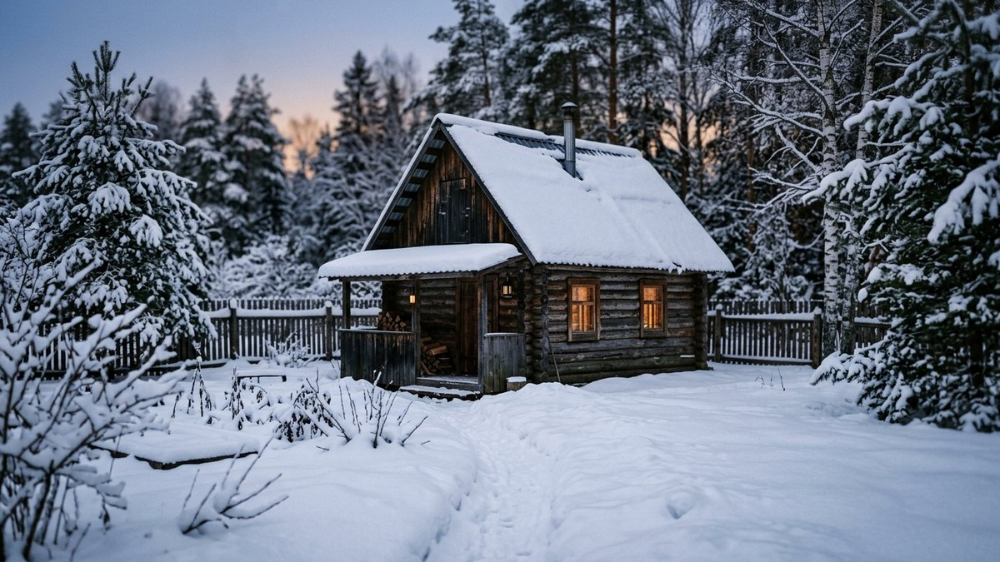

Как утеплить бытовку, зависит от того, из чего она сделана. В деревянной
каркасной бытовке всё как в маленьком каркасном доме: минвата между
стойками, плёнки с двух сторон. А металлическая бытовка, утеплённая той же
минватой, к первой весне превращается в мокрую коробку: на холодном
металле изнутри выпадает конденсат, и вата набирает воду. Разберём оба
случая, а также пол снизу, потолок, двери и окна и какая толщина нужна,
если в бытовке собираются жить зимой, а не только хранить инструмент.
Те же правила работают для хозблока, сарая-мастерской и летней кухни.
Калькулятор посчитает площади, объём утеплителя и плёнки по размерам
вашей бытовки.

## Сначала решите, зачем утеплять

| Сценарий | Стены | Пол | Потолок | Что важнее всего |
|---|---|---|---|---|
| Хранение инструмента, хозблок | 50 мм | 50 мм | 50 мм | Сухость: вентиляция и герметичная крыша |
| Мастерская, наездами зимой | 50–100 мм | 100 мм | 100 мм | Обогреватель на 1–2 кВт, быстро прогревается |
| Временное жильё на время стройки | 100 мм | 100–150 мм | 150 мм | Пароизоляция, окна, дверь |
| Постоянное зимнее проживание | 150 мм | 150 мм | 150–200 мм | Пол и цоколь, вентиляция, отопление |

Толщина — для минваты в средней полосе. Для ЭППС и ППУ берут примерно
на треть меньше: у них ниже теплопроводность.

## Металлическая бытовка: утепление без конденсата

Главная проблема металлической бытовки — точка росы на внутренней
поверхности металла. Тёплый влажный воздух, дошедший до холодной стенки,
отдаёт воду. Поэтому утеплитель должен прилегать к металлу вплотную
и не пропускать воздух.

**Лучший вариант — напыляемый пенополиуретан (ППУ)** слоем 50–80 мм.
Он прилипает к металлу без зазоров, закрывает рёбра и углы и сам является
пароизоляцией. Нужна бригада с установкой, своими руками его не сделать.
Подробнее о плюсах и ограничениях ППУ — в статье про
[утепление ППУ](https://mir-doma.pro/uteplenie-ppu/).

**Своими руками — ЭППС** (экструдированный пенополистирол):

1. **Очистите и загрунтуйте металл**: ржавчину — до металла,
   затем антикоррозийный грунт.
2. **Приклейте плиты ЭППС 50 мм** на клей-пену для пенополистирола
   прямо к стенке, по всей площади, без воздушных карманов.
3. **Все швы и примыкания** к полу, потолку, проёмам — пеной. Через щель
   в 2 мм влажный воздух доходит до металла.
4. **Второй слой**, если нужно толще, — со смещением швов.
5. **Каркас из бруска 20×40 мм** поверх ЭППС на дюбели или саморезы
   в металл — под отделку. Пароизоляционная плёнка поверх ЭППС
   не обязательна: он сам практически не пропускает пар.
6. **Отделка** — вагонка, ОСП, фанера.

**Минвата в металле** работает, только если изнутри сделана идеально
герметичная пароизоляция с проклейкой всех швов и примыканий. На
практике в бытовке с дверью, окном и проводкой это почти недостижимо,
поэтому для металла минвату не рекомендуем.

## Деревянная каркасная бытовка

Здесь работает классический пирог каркасной стены — изнутри наружу:

1. **Внутренняя отделка** — вагонка, ОСП, гипсоволокно.
2. **Пароизоляция** — плёнка с нахлёстом 10–15 см, швы проклеены
   двусторонним скотчем для плёнок, примыкания к полу и потолку —
   тоже на скотч.
3. **Минвата** плотностью 35–45 кг/м³ между стойками, распором,
   без щелей. Если стойки 100 мм, а нужно 150 — снаружи или изнутри
   добавляют поперечный брусок 50 мм и второй слой с перекрытием швов.
4. **Ветрозащитная мембрана** снаружи — паропроницаемая, чтобы влага
   из ваты уходила наружу.
5. **Вентзазор 20–40 мм** контррейкой.
6. **Наружная обшивка**.

Если в старой бытовке внутри только оргалит или ДВП, а под ним тонкая
вата без плёнок, — снимите внутреннюю обшивку, проверьте вату: мокрую
и слежавшуюся выбрасывают. Как подобрать утеплитель и сделать пирог
правильно для дома целиком, разобрано в статье о том,
[как утеплить дачный дом](https://mir-doma.pro/kak-uteplit-dachnyy-dom/).

## Пол бытовки: главное — снизу

Бытовка обычно стоит на блоках, и под полом гуляет ветер. Через пол
уходит больше тепла, чем через стены, а ноги мёрзнут даже при +20 °C
под потолком.

- **Утепление снизу.** Если под бытовку можно подлезть: ветрозащитная
  мембрана или ОСП снизу по лагам, между лагами минвата или ЭППС 50–100
  мм. Так пол внутри не трогают.
- **Утепление сверху.** Снимают покрытие, между лагами — утеплитель
  на черновой настил, пароизоляция, новое покрытие. Высота комнаты
  уменьшается на 3–5 см.
- **Цоколь.** Обшейте пространство под бытовкой профлистом или ЦСП
  по периметру, оставив продухи на лето. Ветер под полом — главный
  источник холода.

Подробно про утепление пола по лагам, снизу и для каркасного дома на
сваях — в статье о том, [как утеплить пол на даче](https://mir-doma.pro/uteplenie-pola-na-dache/).

## Калькулятор утеплителя для бытовки

Введите размеры бытовки и выберите, для чего она. Калькулятор посчитает
площади стен, пола и потолка за вычетом окон и двери, объём утеплителя,
плёнки и примерную мощность обогревателя.

<!-- wp:html -->

  
Калькулятор утепления бытовки

  <label class="md-calc__label" for="mdUbL">Длина, м</label>
  <input type="number" id="mdUbL" class="md-calc__input" min="1" step="0.1" value="6">
  <label class="md-calc__label" for="mdUbW">Ширина, м</label>
  <input type="number" id="mdUbW" class="md-calc__input" min="1" step="0.1" value="2.4">
  <label class="md-calc__label" for="mdUbH">Высота стен, м</label>
  <input type="number" id="mdUbH" class="md-calc__input" min="1.8" step="0.1" value="2.5">
  <label class="md-calc__label" for="mdUbO">Окна и дверь, м² (окно 0,8×0,8 — 0,64, дверь — около 1,6)</label>
  <input type="number" id="mdUbO" class="md-calc__input" min="0" step="0.1" value="2.9">
  <label class="md-calc__label" for="mdUbS">Сценарий</label>
  <select id="mdUbS" class="md-calc__input">
    <option value="store">Хранение, хозблок — 50 мм</option>
    <option value="work" selected>Мастерская наездами — стены 100, пол и потолок 100 мм</option>
    <option value="live">Жильё зимой — стены 150, пол 150, потолок 200 мм</option>
  </select>
  <label class="md-calc__label" for="mdUbM">Бытовка</label>
  <select id="mdUbM" class="md-calc__input">
    <option value="wood">Деревянная каркасная — минвата</option>
    <option value="metal">Металлическая — ЭППС на стены</option>
  </select>
  
Заполните поля

<!-- /wp:html -->

Пример: деревянная бытовка 6×2,4×2,5 м с окном и дверью, сценарий
«мастерская»: стены около 39 м², пол и потолок по 14,4 м². Минваты
100 мм нужно около 4,1 м³ на стены и по 1,5 м³ на пол и потолок,
обогреватель на 1,4–2,2 кВт.

## Потолок, двери и окна

**Потолок.** Тёплый воздух собирается под потолком, поэтому он должен
быть толще стен: 100–200 мм. Пароизоляция — изнутри, под отделкой.
Если сверху холодная металлическая крыша, между утеплителем и кровлей
оставляют вентзазор, иначе конденсат с кровли будет капать на вату.

**Дверь.** Штатная металлическая дверь бытовки — сплошной мостик холода.
Её утепляют изнутри ЭППС 30–50 мм с обшивкой, по периметру клеят
уплотнитель. Пороги и щели — пеной и наличниками.

**Окна.** Одинарное стекло в раме — самое холодное место. Варианты:
поставить стеклопакет, на зиму закрыть окно изнутри плёнкой на раме
или вторым стеклом. Как утеплить окна и двери без замены, разобрано
в статье про [утепление окон и дверей](https://mir-doma.pro/uteplenie-okon-i-dverey/).

## Вентиляция и обогрев

После утепления бытовка становится герметичной коробкой: без вентиляции
окна потеют, по углам появляется плесень, особенно если в ней спят
или сушат одежду.

- **Приточный клапан** в стене под окном и **вытяжка** под потолком
  на противоположной стороне. Сечение — от 100 мм.
- **Обогреватель** — конвектор или масляный радиатор с термостатом.
  Мощность ориентировочно 100–150 Вт на квадратный метр утеплённой
  бытовки. Как выбрать, разобрано в статье о том,
  [какой обогреватель выбрать для дачи](https://mir-doma.pro/kakoy-obogrevatel-vybrat-dlya-dachi/).
- **Газовые и керосиновые обогреватели** в маленькой бытовке без
  притока опасны: они сжигают кислород и дают угарный газ.

Если бытовку утепляют, чтобы обустроить её для жизни, план зонирования,
отделку и мебель для маленького пространства смотрите в статье про
[интерьер бытовки на даче](https://mir-doma.pro/interer-v-bytovke-na-dache/).

## Частые ошибки

- **Минвата в металлической бытовке без пароизоляции.** Через сезон
  вата мокрая, металл ржавеет изнутри.
- **Пенопласт с зазором к металлу.** В зазоре конденсат, утепление
  не работает.
- **Не утеплили пол и не закрыли цоколь.** Тёплый потолок и ледяной пол.
- **Пароизоляция снаружи, а ветрозащита изнутри.** Влага запирается
  в вате.
- **Нет вентиляции после утепления.** Плесень по углам за одну зиму.
- **Газовый обогреватель в закрытой бытовке.** Угарный газ.

## Частые вопросы

### Как утеплить металлическую бытовку изнутри

Лучше всего — напылением ППУ 50–80 мм. Своими руками — плитами ЭППС
50 мм, приклеенными к металлу вплотную на клей-пену, со всеми швами,
заполненными пеной. Минвату в металлической бытовке без идеальной
пароизоляции не используют: на металле выпадает конденсат.

### Чем утеплить деревянную бытовку

Минватой плотностью 35–45 кг/м³ между стойками каркаса, с пароизоляцией
изнутри и ветрозащитной мембраной снаружи. Для временного проживания
зимой — 100 мм, для постоянного — 150 мм.

### Как утеплить пол в бытовке

Снизу — между лагами минвата или ЭППС 50–100 мм с ветрозащитой или ОСП
снизу. Сверху — через снятое покрытие с пароизоляцией. Обязательно
закройте цоколь, чтобы под полом не гулял ветер.

### Можно ли жить в утеплённой бытовке зимой

Да, если стены утеплены на 100–150 мм, пол и потолок — на 150 мм
и больше, есть вентиляция, нормальные окна и обогреватель с термостатом.
Без утепления пола и цоколя жить в ней зимой тяжело.

### Как утеплить хозблок или сарай изнутри

Так же, как бытовку: для деревянного каркаса — минвата с плёнками, для
металла — ЭППС вплотную. Для хранения инструмента хватает 50 мм,
для мастерской — 100 мм и обогреватель.
