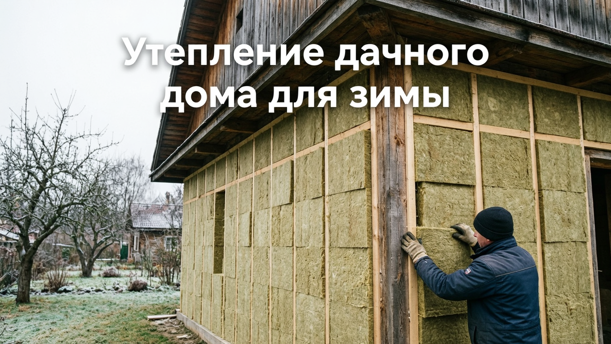
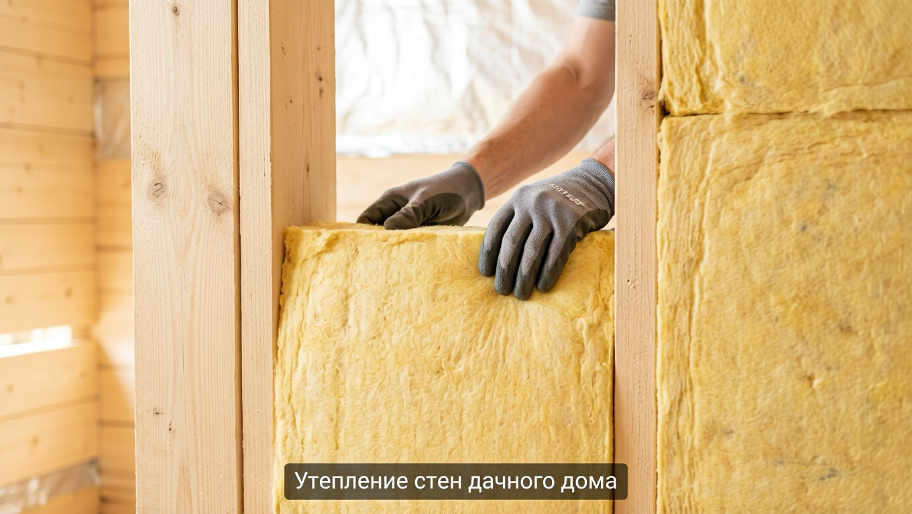
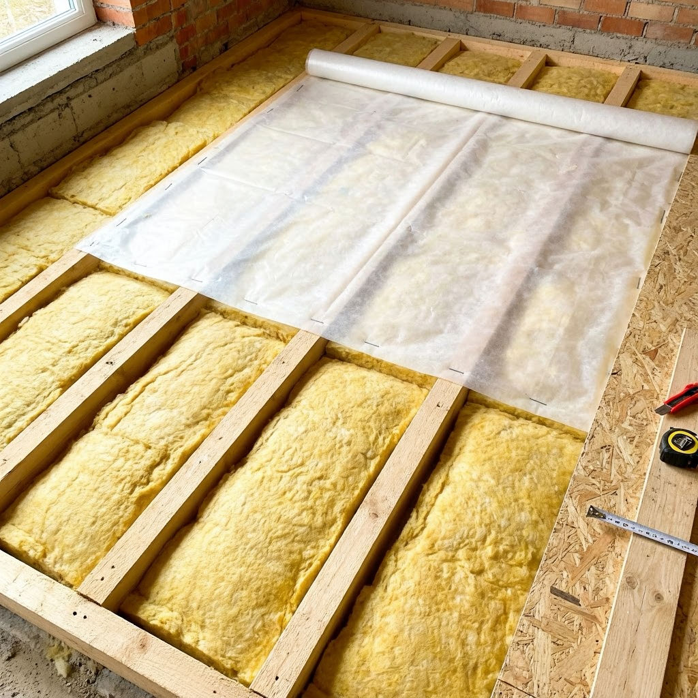
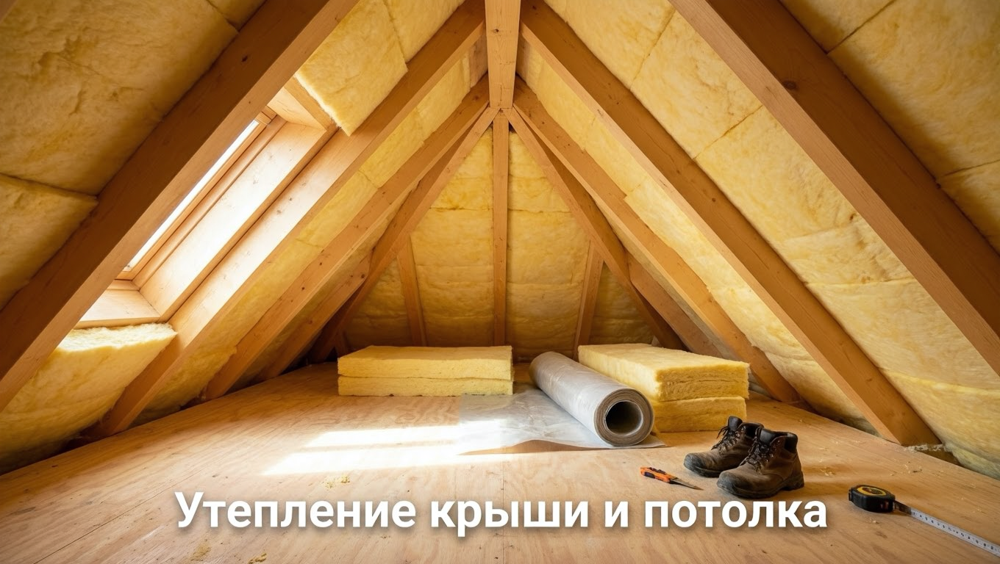
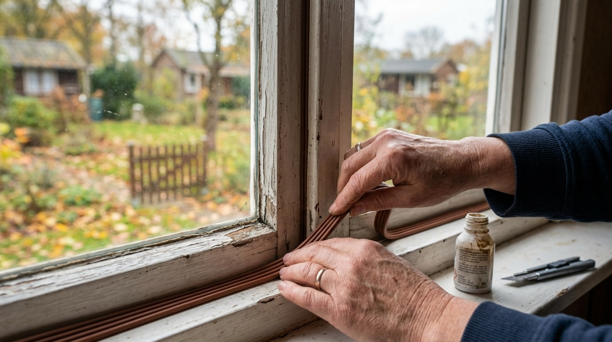
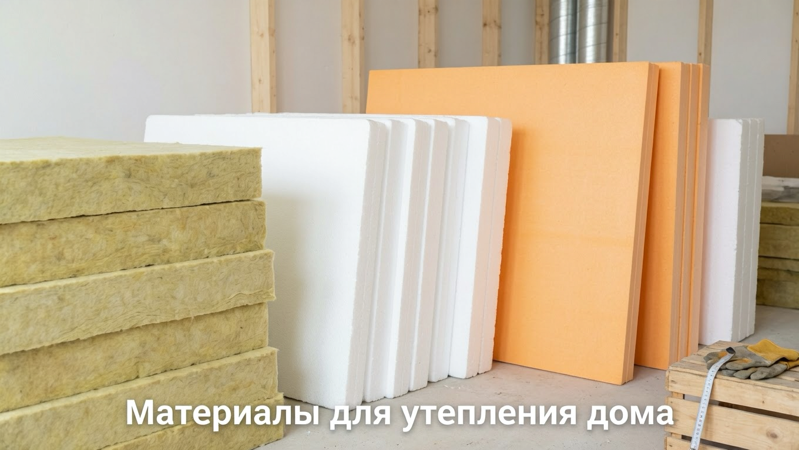

Всё больше дачников остаются за городом и зимой — работают удалённо, приезжают на выходные или живут постоянно. Но летний домик к холодам не приспособлен: без утепления в нём не удержать тепло, а отопление вылетает в трубу. Чтобы дача стала пригодной для зимнего проживания, её нужно грамотно утеплить — комплексно, а не только стены. В этой статье разберём, как утеплить дачный дом для зимнего проживания: где уходит тепло, как утеплить стены, пол, потолок, окна и фундамент и какой утеплитель выбрать.

## 🏠 Зачем утеплять дачу для зимы

Утепление превращает летний домик в тёплый дом и решает сразу несколько задач:

- **Сохраняет тепло** — в утеплённом доме комфортно даже в мороз.
- **Снижает расходы на отопление** — не нужно топить «на улицу».
- **Убирает сырость и промерзание** — стены не отсыревают, нет плесени и конденсата.
- **Продлевает срок службы дома** — защищённые от перепадов конструкции служат дольше.

Утеплённая дача — это ещё и уют: в тёплом доме приятно обустроить [интерьер](https://mir-doma.pro/interer-dachi-v-stile-provans/) и проводить в нём выходные круглый год.

Главное правило: утеплять нужно **комплексно**. Толку от утеплённых стен мало, если тепло уходит через холодный пол или чердак.

## 🔍 Где уходит тепло

Прежде чем утеплять, важно понять, через что дом теряет тепло. Основные пути таковы:

- **Крыша и потолок** — тёплый воздух поднимается вверх, и через неутеплённый чердак уходит значительная часть тепла.
- **Стены** — самая большая площадь, через которую теряется тепло.
- **Окна и двери** — щели и одинарные стёкла выпускают тепло наружу.
- **Пол** — снизу тянет холодом, особенно если под домом продуваемое подполье.
- **Фундамент и цоколь** — промерзают и охлаждают пол.

Поэтому утепляют дом со всех сторон — только тогда он станет по-настоящему тёплым. Если утеплить, например, лишь стены, тепло всё равно будет уходить через холодный потолок и пол, и эффект окажется скромным.

## 🧱 Утепление стен

Стены дают самые большие потери тепла, и утеплять их **лучше снаружи**. При наружном утеплении «точка росы» (где образуется конденсат) выносится за пределы стены, сама стена не промерзает и не сыреет, а полезная площадь внутри сохраняется.

Технология наружного утепления такая: на стену крепят каркас (обрешётку), между стойками укладывают утеплитель (минвату, пенопласт или ЭППС), закрывают его ветрозащитной плёнкой, оставляют вентиляционный зазор и обшивают сайдингом, вагонкой или другим фасадным материалом.

Утепление изнутри применяют только когда снаружи утеплить нельзя: оно крадёт площадь и требует тщательной пароизоляции, иначе внутри стены будет скапливаться конденсат. Толщину утеплителя для стен подбирают под климат региона — для средней полосы это обычно 10–15 см минеральной ваты.

Какой утеплитель выбрать под ваш тип стен (для дерева и камня они разные!), какая нужна толщина и чем вентилируемый фасад отличается от штукатурного — подробно в статье [чем утеплить стены дачи снаружи](https://mir-doma.pro/uteplenie-sten-snaruzhi/).

## 🔽 Утепление пола

Через холодный пол уходит много тепла, а ногам всегда холодно. Пол на даче чаще всего утепляют по лагам: между ними укладывают утеплитель (минвату или пенопласт), снизу подшивают ветро- и влагозащиту, а сверху настилают пароизоляцию и чистовой пол. Важно защитить утеплитель от влаги снизу, особенно если под домом продуваемое подполье. Для пола удобен влагостойкий ЭППС — он не боится сырости и хорошо держит форму под нагрузкой. Подробный разбор — какой утеплитель выбрать, как утеплить по лагам и как сделать это снизу, не вскрывая пол, — в отдельной статье про [утепление пола на даче](https://mir-doma.pro/uteplenie-pola-na-dache/).

## 🔼 Утепление потолка и крыши

Поскольку тёплый воздух поднимается вверх, утепление потолка и крыши — одно из самых важных. Есть два варианта:

- **Утепление потолка (перекрытия чердака)** — если чердак холодный и нежилой. Утеплитель укладывают на пол чердака поверх пароизоляции.
- **Утепление скатов крыши** — если чердак жилой (мансарда). Утеплитель кладут между стропилами, снизу — пароизоляция, сверху — гидроизоляция и вентзазор. Для перекрытия холодного чердака слой утеплителя делают побольше — тепло уходит вверх активнее всего, и на потолке экономить не стоит.

Кровельный «пирог» с утеплением устроен по тем же принципам, что и при монтаже кровли, — подробнее в статье о [крыше из профнастила](https://mir-doma.pro/krysha-iz-profnastila-svoimi-rukami/).

## 🪟 Окна и двери

Через старые окна и двери уходит до пятой части тепла. Что делать:

- **Окна** — заменить старые деревянные рамы на стеклопакеты либо утеплить имеющиеся: заклеить щели, установить уплотнители, на зиму использовать теплосберегающую плёнку.
- **Двери** — поставить утеплённую входную дверь с уплотнителями, а лучше обустроить тамбур или сени, которые создают воздушную «прослойку».

Даже простое устранение щелей и сквозняков заметно уменьшает потери тепла.

## 🧊 Фундамент и цоколь

Холодный фундамент выстуживает пол первого этажа, поэтому утепляют и его: цоколь снаружи закрывают влагостойким утеплителем (ЭППС), делают утеплённую отмостку по периметру, а продухи в подполье на зиму прикрывают. Это защищает пол от промерзания и убирает холод снизу. Если под домом есть подвал или погреб, утепление цоколя заодно поддерживает в нём более стабильную температуру.

## 🧰 Какой утеплитель выбрать

Выбор материала зависит от того, что именно утепляют:

- **Минеральная вата** — негорючая, «дышит», хорошо утепляет стены, потолок и крышу; боится влаги, поэтому нужна пароизоляция.
- **Пенопласт** — дешёвый и лёгкий, но горючий и не пропускает пар; подходит для стен снаружи и цоколя.
- **Экструдированный пенополистирол (ЭППС)** — прочный и влагостойкий, идеален для пола, цоколя и фундамента.
- **Эковата** — экологичный задувной утеплитель для стен и перекрытий.
- **Пенополиуретан (ППУ)** — напыляемая пена: ложится бесшовно, без щелей и мостиков холода, но требует бригады с оборудованием. Плюсы, минусы и из чего складывается цена — в статье про [утепление ППУ](https://mir-doma.pro/uteplenie-ppu/).

Толщину утеплителя подбирают под климат: чем холоднее зимы, тем толще слой. Экономить на толщине не стоит — доложить утеплитель потом гораздо сложнее и дороже, чем сразу сделать нужный слой.

## 🛡️ Частые ошибки

- **Утепляют только стены.** Тепло продолжает уходить через крышу, пол и окна. Утепляйте комплексно.
- **Нарушают пароизоляцию.** Без неё утеплитель намокает от пара из дома и перестаёт работать, появляется конденсат.
- **Мостики холода.** Незакрытые стыки и щели в утеплении промерзают и дают сырость. Утепляют без разрывов.
- **Тонкий слой утеплителя.** Недостаточная толщина не спасает от холода. Слой рассчитывают под климат.
- **Утепление изнутри без расчёта.** Ведёт к конденсату и плесени в стене. Предпочтительнее наружное утепление.

## ❓ Частые вопросы

### Как утеплить дачный дом для зимнего проживания?

Утеплять нужно комплексно: стены (лучше снаружи), пол по лагам, потолок или крышу, окна и двери, а также цоколь и фундамент. Для каждой конструкции подбирают подходящий утеплитель и обязательно предусматривают пароизоляцию. Только утепление всего дома целиком делает его по-настоящему тёплым.

### Чем лучше утеплять стены дома?

Для стен чаще всего используют минеральную вату (негорючую и «дышащую») или пенопласт и ЭППС. Утеплять стены предпочтительнее снаружи — тогда точка росы выносится за пределы стены, она не промерзает и не сыреет, а площадь комнат сохраняется.

### Где дом теряет больше всего тепла?

Основные потери идут через стены (самая большая площадь), крышу и потолок (тёплый воздух уходит вверх), окна и двери, а также пол и фундамент. Поэтому утеплять нужно все конструкции, а не только стены.

### Утеплять дом снаружи или изнутри?

Предпочтительнее снаружи: наружное утепление выносит точку росы за пределы стены, защищает её от промерзания и сохраняет площадь помещений. Изнутри утепляют, только когда снаружи это невозможно, и обязательно с тщательной пароизоляцией, иначе в стене образуется конденсат.

### Какой утеплитель самый тёплый и практичный?

Универсального ответа нет: для стен, потолка и крыши хороша минеральная вата, для пола, цоколя и фундамента — влагостойкий ЭППС, бюджетный вариант для стен снаружи — пенопласт. Выбор зависит от конструкции, а толщину подбирают под климат.

### С чего начать утепление дачного дома?

Начинать логично с тех мест, где теряется больше всего тепла, — с крыши (потолка) и стен, а затем переходить к полу, окнам, дверям и фундаменту. Сначала оценивают состояние дома и продумывают материалы, а работы по возможности ведут в сухую тёплую погоду.

### Можно ли жить на даче зимой после утепления?

Да, грамотно утеплённый дом вместе с системой отопления вполне пригоден для зимнего проживания. Важно утеплить его комплексно, устранить сквозняки и обеспечить отопление, соответствующее площади дома. Тогда на даче будет тепло и комфортно даже в сильные морозы.

### Нужна ли пароизоляция при утеплении?

Да, для минеральной ваты и подобных «дышащих» утеплителей пароизоляция обязательна: она защищает утеплитель от влажного пара, идущего из дома. Без неё утеплитель намокает, теряет свойства, а в конструкции появляется конденсат и плесень.

## Заключение

Утепление дачного дома для зимнего проживания — это комплексная работа: стены, пол, потолок, окна, двери и фундамент. Начните с того, где теряется больше всего тепла — с крыши и стен, — утепляйте предпочтительно снаружи, не забывайте про пароизоляцию и правильную толщину слоя. Подберите утеплитель под каждую конструкцию, устраните щели и мостики холода — и дача станет тёплой и уютной даже в мороз, а расходы на отопление заметно снизятся. Готовьте дом к зиме заранее, летом или в начале осени, пока стоит сухая погода и есть время сделать всё аккуратно. Один раз хорошо утеплив дом, вы будете годами экономить на отоплении и наслаждаться теплом.

А как вы утепляли свою дачу для зимы? Делитесь опытом в комментариях и подписывайтесь, чтобы не пропустить новые статьи об утеплении и обустройстве дома.
