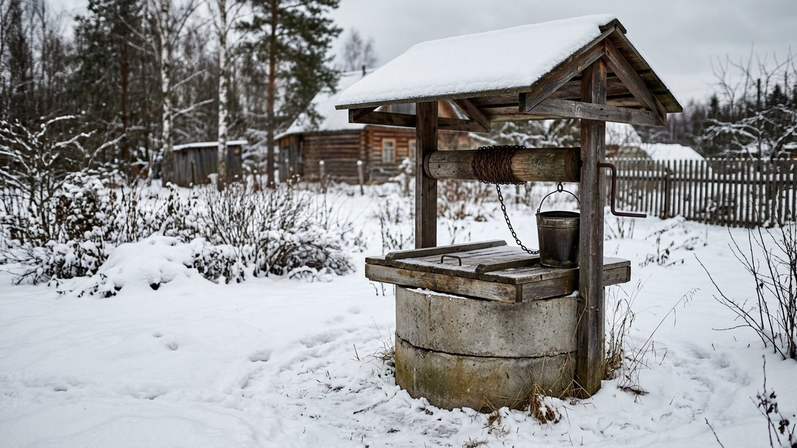
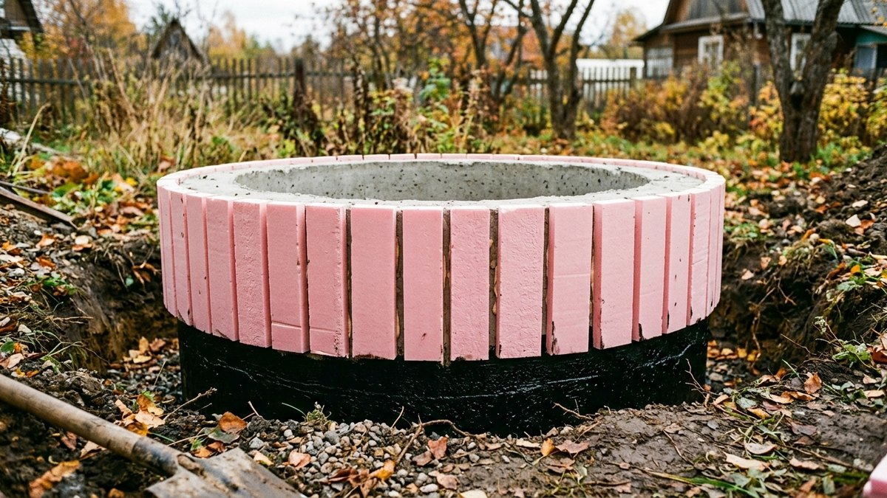
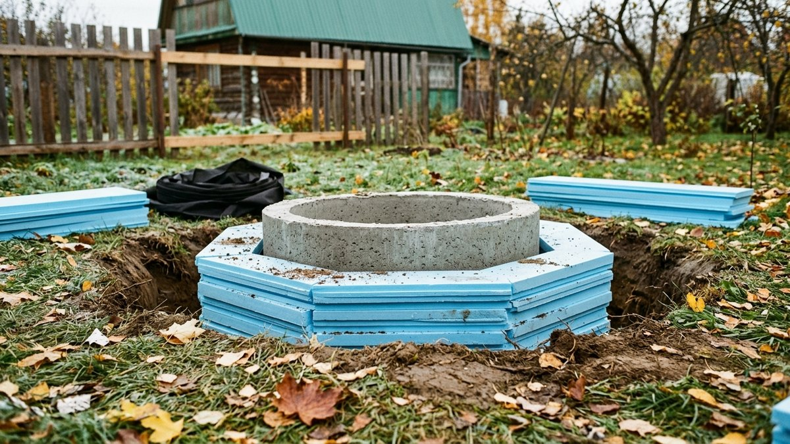
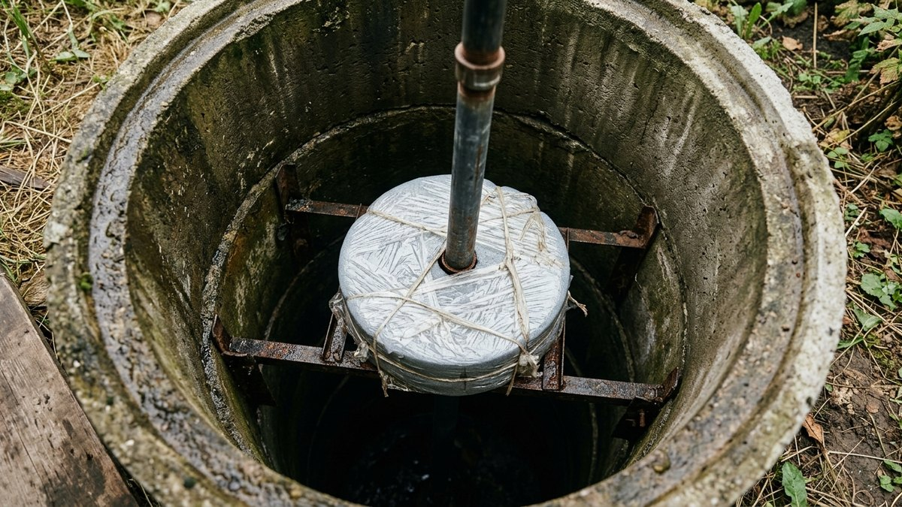
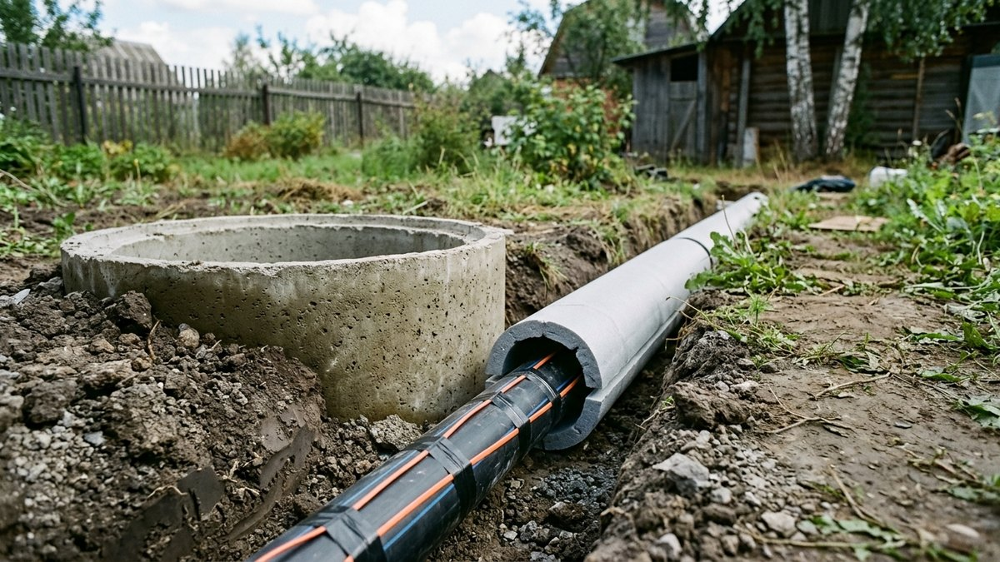
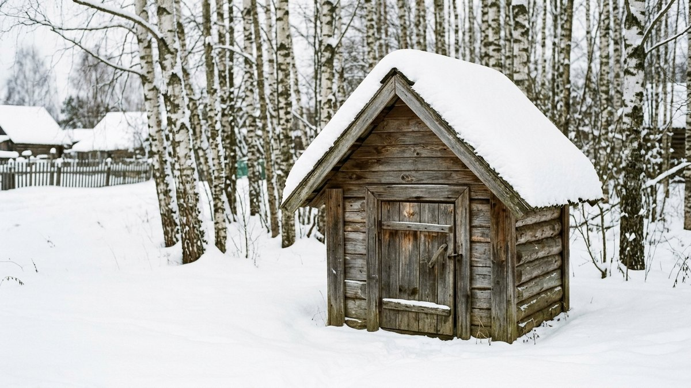

Как утеплить колодец, чтобы зимой была вода, — вопрос не про то, чтобы
колодец не замёрз целиком. Вода на глубине 3–10 м не замерзает даже
в сильные морозы. Замерзают верхний метр шахты, крышка, насос, труба
к дому и шов между верхними кольцами, который пучение грунта
раздвигает каждую зиму. Разберём, что именно промерзает и почему,
чем утеплить кольца снаружи, как сделать утеплённую крышку и внутреннюю
«диафрагму», как защитить трубу и насос. Калькулятор посчитает, сколько
плит ЭППС нужно на ваш колодец.

## Что промерзает в колодце на самом деле

- **Верхние кольца.** Бетон хорошо проводит холод: стенка кольца
  промерзает на глубину промерзания грунта, в средней полосе это
  1,2–1,6 м, на севере больше. Внутри шахты на этом уровне зимой
  иней и наледь.
- **Поверхность воды**, если уровень высокий — 1–2 м от земли весной
  и осенью. Тогда за неделю морозов сверху образуется корка льда.
- **Шов между кольцами.** Пучинистый грунт зимой вспучивается и тянет
  верхнее кольцо вверх. Шов раскрывается, туда затекают верховодка
  и грязь, весной кольцо не всегда встаёт обратно.
- **Насос, шланг и труба к дому.** Всё, что выше глубины промерзания
  и с водой внутри, разорвёт первым же морозом.
- **Крышка.** Тонкая деревянная крышка без утеплителя пропускает
  холод прямо в шахту.

Поэтому утепление колодца — это не один материал, а четыре узла:
кольца снаружи, крышка, внутренняя диафрагма и трубопровод.

## Чем утеплять: что работает в земле, а что нет

| Материал | В земле у колец | В крышке | Комментарий |
|---|---|---|---|
| ЭППС (пеноплекс и аналоги), 50 мм | ✅ Лучший выбор | ✅ | Не впитывает воду, держит нагрузку грунта |
| Напыляемый пенополиуретан | ✅ | ✅ | Без швов, но нужна бригада с установкой |
| Пенопласт ПСБ | ⚠️ Хуже | ✅ | Набирает влагу, в земле крошится, любят мыши |
| Минеральная вата | ❌ | ❌ | Намокает и перестаёт греть |
| Опилки, солома, листва | ❌ | ⚠️ Временно | Гниют, отсыревают, заводят грызунов |
| Керамзит засыпкой | ⚠️ | — | Работает, только если сухой, — в земле так не бывает |

Для колодца с питьевой водой: утеплитель внутри шахты, в диафрагме,
заворачивают в плёнку, чтобы крошка не попадала в воду.

## Утепление колец снаружи: по шагам

Работу делают в сухую погоду, лучше в сентябре–октябре, до заморозков.

1. **Откопайте траншею** вокруг кольца шириной 50–60 см на глубину
   промерзания — 1,2–1,5 м для средней полосы. Глубже нет смысла,
   ниже грунт не промерзает.
2. **Проверьте и загерметизируйте швы** между кольцами: старый раствор
   выбить, шов заделать гидроизоляционной смесью или герметиком для
   бетона. Если колец два-три сверху и они «гуляют», поставьте скобы
   из полосы 4×40 мм на анкеры, по 3–4 на шов.
3. **Обмажьте кольцо** битумной мастикой снаружи — это гидроизоляция,
   утеплитель её не заменяет.
4. **Приклейте плиты ЭППС** 50 мм на битумную мастику или клей для
   пенополистирола. Плиты круг не облегают, поэтому их режут на полосы
   шириной 15–20 см и клеят вертикально, как бочарные доски. Швы —
   монтажной пеной.
5. **Обмотайте плёнкой** или геотекстилем, чтобы грунт не забивал швы.
6. **Засыпьте песком** послойно, с проливкой, а сверху сделайте
   глиняный замок — слой мятой глины 20–30 см с уклоном от колодца.
7. **Утеплённая отмостка.** Вокруг колодца горизонтально уложите ЭППС
   50 мм кольцом шириной 0,8–1 м на глубине 20–30 см и засыпьте. Она
   работает как «юбка»: грунт под ней промерзает намного меньше,
   и пучение не тянет верхнее кольцо.

Если колодец ещё только копают, то же самое делают дешевле: верхнее
кольцо сразу утепляют снаружи, а пазуху засыпают песком, не глиной.

## Калькулятор утеплителя для колодца

Выберите размер колец, глубину утепления и высоту оголовка над землёй.
Калькулятор посчитает площадь утепления колец снаружи, отмостки и
крышки и переведёт в плиты ЭППС 1185×585 мм.

<!-- wp:html -->

  
Калькулятор утепления колодца

  <label class="md-calc__label" for="mdUkR">Кольца</label>
  <select id="mdUkR" class="md-calc__input">
    <option value="1160">КС-10 (внутри 1 м, снаружи 1,16 м)</option>
    <option value="1680">КС-15 (внутри 1,5 м, снаружи 1,68 м)</option>
    <option value="2200">КС-20 (внутри 2 м, снаружи 2,2 м)</option>
  </select>
  <label class="md-calc__label" for="mdUkH">Глубина утепления в земле, м</label>
  <input type="number" id="mdUkH" class="md-calc__input" min="0" step="0.1" value="1.4">
  <label class="md-calc__label" for="mdUkA">Высота кольца над землёй, м</label>
  <input type="number" id="mdUkA" class="md-calc__input" min="0" step="0.1" value="0.6">
  <label class="md-calc__label" for="mdUkO">Ширина утеплённой отмостки, м (0 — без неё)</label>
  <input type="number" id="mdUkO" class="md-calc__input" min="0" step="0.1" value="0.8">
  
Заполните поля

<!-- /wp:html -->

Пример для колодца КС-10, утепление на 1,4 м в землю плюс 0,6 м
оголовка и отмостка 0,8 м: около 7,3 м² по кольцам (12 плит), 4,9 м²
отмостки (9 плит) и 5 плит на крышку с диафрагмой. Всего около 26 плит
ЭППС 50 мм — сверьтесь с числом плит в пачке у вашего производителя.

## Утеплённая крышка и внутренняя диафрагма

Через крышку уходит больше тепла, чем через стенки: воздух в шахте
теплее и поднимается вверх.

**Крышка.** Каркас из бруска 40×40 мм, внутрь — ЭППС 50 мм, с двух
сторон — доска или влагостойкая фанера. Края крышки выходят за кольцо
на 5–10 см, по периметру уплотнитель, чтобы не дуло в щель. Сверху
можно домик или навес — он защищает от снега и солнца и даёт ещё
одну воздушную прослойку.

**Внутренняя диафрагма** — вторая крышка внутри шахты, на глубине
1,2–1,5 м, ниже зоны промерзания. Её делают из ЭППС в плёнке с рамкой
по диаметру кольца, укладывают на 3–4 упора, вбитых в швы, или на трос.
В диафрагме — отверстие под трубу или вырез под ведро с крышечкой.
Холод сверху останавливается на диафрагме, под ней в шахте держится
плюс всю зиму, даже если верхнее кольцо промерзает.

Если воду берут ведром каждый день, диафрагма неудобна: тогда хватит
утеплённой крышки, домика и утепления колец снаружи.

## Труба к дому и насос

Самое уязвимое место зимой — не колодец, а всё, что к нему подключено.

- **Выход трубы из кольца — ниже промерзания.** Через стенку кольца на
  глубине 1,5–1,8 м, в гильзе, с герметизацией. Если труба выходит
  через верх шахты, её участок от воды до земли промерзает первым.
- **Труба в траншее тоже ниже промерзания.** Если глубоко не закопать —
  траншея 0,5–0,8 м, ЭППС сверху трубы П-образным коробом и греющий
  саморегулирующийся кабель на трубе в зоне от колодца до дома.
- **Погружной насос** на зиму не вынимают, если колодцем пользуются:
  он стоит в воде, которая не замерзает. Обратный клапан у насоса
  и сливной кран в доме позволяют опустошить трубу, если уезжаете.
- **Поверхностный насос или насосная станция** — только в доме,
  в утеплённом кессоне или техническом колодце. Как устроен утеплённый
  приямок под оборудование, разобрано в статье про
  [кессон для скважины своими руками](https://mir-doma.pro/kesson-dlya-skvazhiny-svoimi-rukami/):
  те же правила подходят и для колодца.

Если на зиму дачу закрываете и водой не пользуетесь, надёжнее слить
систему полностью. Что и в каком порядке сливать, чтобы трубы и насос
пережили зиму, — в статье про
[консервацию полива и водопровода на зиму](https://mir-doma.pro/konservaciya-poliva-na-zimu/).

## Домик над колодцем: защищает ли от мороза

Деревянный домик с дверцей сам по себе почти не утепляет: стенки тонкие,
а под ним те же −20 °C, что и снаружи, только без ветра. Но в паре
с утеплённой крышкой он даёт заметный эффект — снег не ложится прямо
на крышку, дверца закрывает щели. Если хотите домик утеплённым — стенки
изнутри обшивают ЭППС 30–50 мм, а пол домика делают на уровне крышки.
Как построить такой домик над скважиной, разобрано в статье про
[домик для скважины на даче](https://mir-doma.pro/domik-dlya-skvazhiny-na-dache/):
для колодца размеры просто увеличивают под диаметр колец.

## Частые ошибки

- **Минвата или опилки вокруг колец.** Намокают за первую осень и
  перестают работать, а ещё гниют рядом с питьевой водой.
- **Утеплитель без гидроизоляции.** Верховодка уходит по шву внутрь.
  Мастика на бетон — до утеплителя.
- **Утепление на 50 см «чтобы не промёрзло».** Ниже утеплителя кольцо
  всё равно промерзает. Нужна вся глубина промерзания.
- **Глина вплотную к кольцу без песка.** Мокрая глина пучит сильнее всего
  и тянет кольцо вверх. Глиняный замок — сверху, а у стенки песок.
- **Труба выходит через верх шахты.** Промерзает первой. Выход — через
  стенку ниже промерзания.
- **Насосная станция в неутеплённом домике.** Разморозит в первую ночь
  с −10 °C.

## Частые вопросы

### Как утеплить колодец на зиму от замерзания

Утеплите верхние кольца снаружи плитами ЭППС 50 мм на глубину
промерзания, сделайте утеплённую отмостку и крышку с утеплителем.
Внутри шахты ниже 1,2–1,5 м можно положить вторую крышку-диафрагму.
Трубу к дому выводите через стенку кольца ниже промерзания.

### Чем утеплить колодец из бетонных колец

Снаружи — экструдированным пенополистиролом 50 мм поверх битумной
мастики или напыляемым пенополиуретаном. Минвата, опилки и обычный
пенопласт в земле быстро теряют свойства.

### Как утеплить крышку колодца

Сделайте крышку из двух слоёв доски или фанеры с ЭППС 50 мм между ними,
с выпуском 5–10 см за кольцо и уплотнителем по периметру. Сверху
дополнительно защищает домик или навес.

### Нужно ли утеплять колодец, если вода глубоко

Сама вода на глубине 3 м и больше не замёрзнет. Но верхние кольца,
шов между ними, насос и труба к дому промерзают при любом уровне
воды. Если колодцем пользуются зимой, их нужно утеплять.

### Замерзнет ли колодец без утепления

Целиком — нет. Но при высоком уровне воды на поверхности появится
лёд, а пучение может сдвинуть верхнее кольцо. Без утепления трубы
зимой без воды останетесь почти наверняка.
