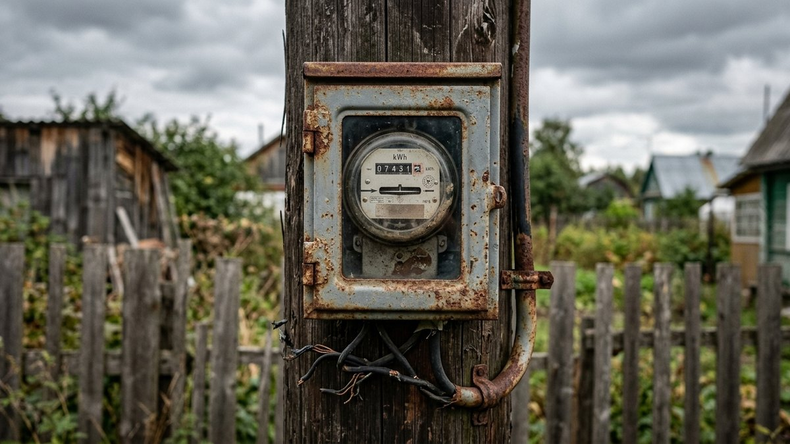
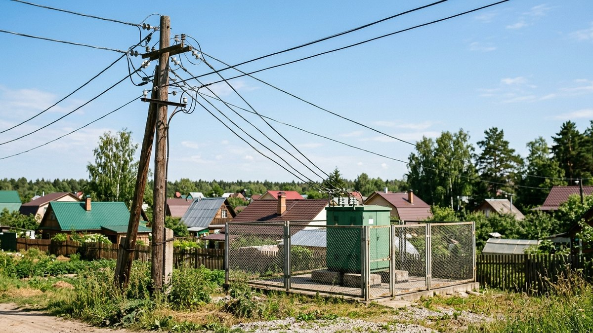
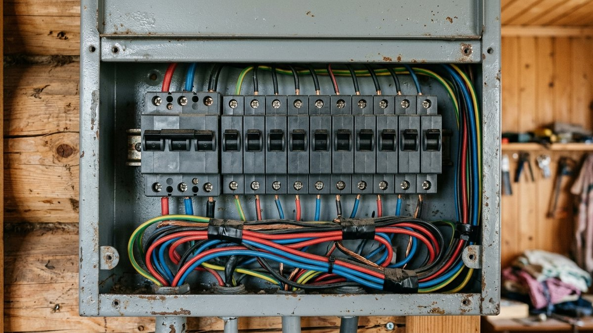
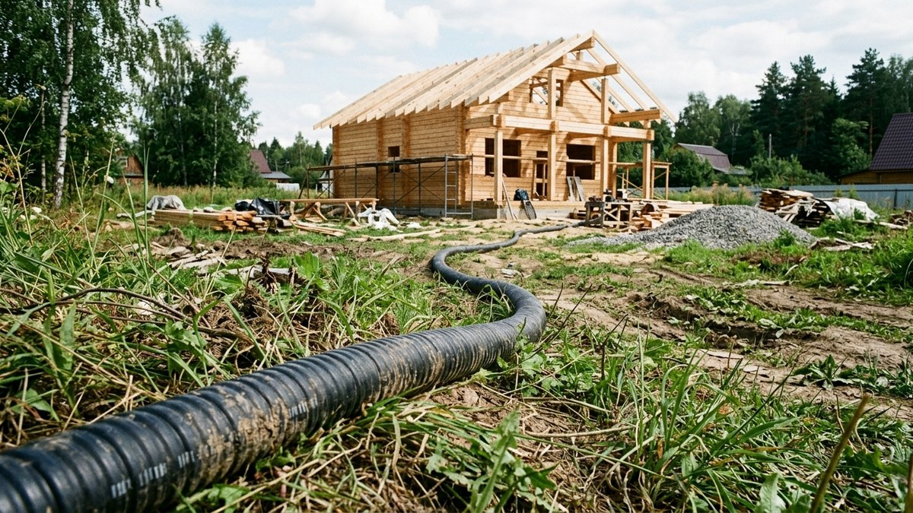
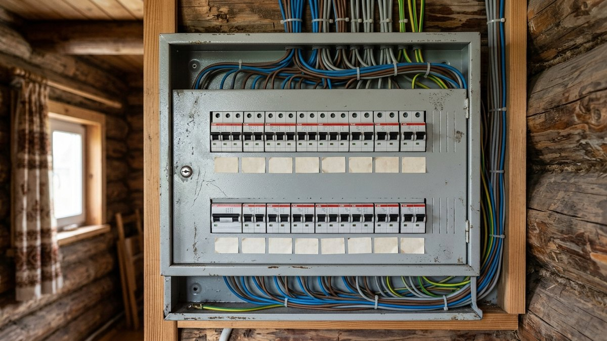

Частая ситуация при покупке участка: прежние хозяева там толком не жили и на вопрос «сколько киловатт выделено» отвечают «вроде около трёх, но точно не скажем». Формальность превращается в квест на несколько недель: сначала выясняется, что счётчик всё ещё числится на прежнего владельца, потом — что старой однофазной линии на серьёзную мощность просто не хватит. Разберём по шагам, куда обращаться и чего ждать по деньгам и срокам.

## Шаг 1. Переоформить лицевой счёт в ЕИРЦ

Пока участок не ваш юридически по документам энергосбытовой компании, узнать точную выделенную мощность официально не получится — счётчик и лицевой счёт числятся на прежнего собственника. Первым делом нужно ехать в ЕИРЦ (единый информационно-расчётный центр) или напрямую в сбытовую компанию своего региона (например, «Мосэнергосбыт» для Московской области) и переоформить счёт на себя.

С собой нужны: выписка из ЕГРН или свидетельство о праве собственности, паспорт, показания счётчика на момент покупки. После переоформления сбытовая компания выдаёт данные по лицевому счёту — и в них, как правило, указана официально выделенная мощность.

Здесь же стоит один раз разобраться в путанице, которая отнимает больше всего времени: энергосбытовая компания (та, что в ЕИРЦ) продаёт электроэнергию и выставляет счета, а вот сети, провода, трансформаторы и разрешённая мощность подключения — это зона ответственности сетевой организации, в большинстве регионов это «Россети» соответствующего филиала. Это два разных юридических лица, и решать вопрос мощности нужно именно во втором.

## Шаг 2. Найти или восстановить акт технологического присоединения

Реальная разрешённая мощность участка официально зафиксирована в акте о технологическом присоединении — документе, который выдаётся при первом подключении объекта к сетям. Именно в нём написано число киловатт, а не в устных заверениях продавца.

Если акта нет — обычная история для старых дачных участков, которые десятилетиями не переоформлялись, — его можно восстановить, подав заявление в сетевую организацию по адресу участка. В заявлении указывается адрес, кадастровый номер участка и данные текущего собственника; ответ обычно приходит в виде копии акта или официальной справки с указанием мощности по архивным данным сетевой организации.

Частая причина, почему прежние владельцы называют мощность «на глаз»: для старых дачных подключений типовой была цифра 3, 4,5 или 6 кВт — этого хватало на свет и чайник, и вопросом больше никто не занимался десятилетиями.

## Шаг 3. Если мощности не хватает — заявка на увеличение

Когда фактическая мощность известна и её мало для дома с электрокотлом, насосом или баней, дальше нужно подавать заявку на увеличение технологического присоединения — уже не в ЕИРЦ, а в сетевую организацию: через личный кабинет на сайте регионального филиала «Россетей», Госуслуги или лично в офисе. К заявлению прикладывают правоустанавливающие документы на участок и, если он сохранился, старый акт технологического присоединения.

Здесь важно понимать техническое ограничение, о которое чаще всего и упираются: старый однофазный ввод (то есть питание по одной фазе, 220 В) физически не «расширяется» до трёхфазного (380 В) — надстроить его нельзя, добавление фаз означает по сути новую точку подключения к сети: новый провод от опоры или трансформатора, новый прибор учёта, часто и новую опору. Формально это оформляется как новое технологическое присоединение, а не апгрейд старого, даже если участок и так был подключён раньше.

## Сколько это стоит и почему 10 кВт и 15 кВт — одна цена

Стоимость увеличения мощности зависит от региона и тарифа конкретного филиала сетевой организации — его публикуют на официальном сайте «Россетей» вашего региона или можно запросить точный расчёт вместе с заявкой. Ориентир из практики: переход с однофазного ввода на трёхфазный с новым технологическим присоединением обошёлся примерно в 70 тысяч рублей.

Логика, которая на первый взгляд удивляет: заявка на 10 кВт и на 15 кВт в пределах одной заявки может стоить одинаково. Дело в том, что тарифы на технологическое присоединение обычно устанавливаются не за каждый киловатт отдельно, а по диапазонам мощности — и 15 кВт исторически один из главных пороговых значений в этих диапазонах. Если пороговая мощность всё равно оплачивается целиком, практический вывод простой: подавать заявку сразу на максимум диапазона, а не пытаться сэкономить, запросив меньше, — переплаты не будет, а запас мощности на будущее (баня, тёплый пол, электромобиль) появится.

Пока вопрос с сетевой организацией решается — а это может занять от нескольких недель до пары месяцев — при слабой сети и просадках напряжения выручает стабилизатор; как выбрать мощность под конкретный дом, разобрано в статье [«Какой стабилизатор напряжения выбрать»](https://mir-doma.pro/kakoy-stabilizator-napryazheniya-vybrat/). Если на площадке идёт стройка и электричества пока нет вообще или его категорически не хватает на инструмент, на время выручит генератор — какой нужен под конкретные задачи, в статье [«Какой генератор нужен для дачи»](https://mir-doma.pro/kakoy-generator-nuzhen-dlya-dachi/).

## Как не попасть в эту же историю в следующий раз

Если участок или дом ещё только выбираете, акт технологического присоединения и точную выделенную мощность стоит запросить у продавца ещё на этапе документов — до задатка, а не после переезда. Это входит в общий чек-лист проверки земли, разобранный в статье [«Как выбрать земельный участок для дачи»](https://mir-doma.pro/kak-vybrat-zemelnyy-uchastok-dlya-dachi/), и в раздел про коммуникации в статье [«Покупка старого дома: на что обратить внимание»](https://mir-doma.pro/pokupka-starogo-doma/) — там же разобрано, на что смотреть в остальной части дома при осмотре.

Когда мощность подтверждена и увеличена, имеет смысл сразу пересмотреть и саму разводку по дому — какая схема электропроводки и сколько групп нужно под реальную нагрузку, разобрано в статье [«Схема электропроводки на даче»](https://mir-doma.pro/skhema-elektroprovodki-na-dache/).

## Частые ошибки

- **Тянуть с переоформлением лицевого счёта.** Пока счёт числится на прежнего владельца, официальную мощность узнать нельзя, а платёжки продолжают приходить на чужое имя.
- **Не запрашивать акт технологического присоединения у продавца при покупке.** Восстановление задним числом — это то же самое заявление, только с потерей нескольких недель.
- **Путать сетевую организацию со сбытовой компанией.** В ЕИРЦ решается вопрос счёта и оплаты, а не мощности — за неё отвечает «Россети».
- **Просить увеличение впритык под текущие приборы.** Если тариф всё равно бьётся по диапазону до 15 кВт, разумнее сразу заложить запас, чем подавать повторную заявку через пару лет.

## Частые вопросы

### Что такое ЕИРЦ и зачем туда ехать при покупке участка?

ЕИРЦ — единый информационно-расчётный центр, через который энергосбытовая компания ведёт лицевые счета и начисления за электроэнергию. Туда обращаются, чтобы переоформить счёт на нового собственника после покупки участка или дома — без этого официально узнать выделенную мощность не получится.

### Чем Россети отличаются от энергосбытовой компании?

Энергосбытовая компания продаёт электроэнергию и выставляет счета по показаниям счётчика. Сетевая организация («Россети» в большинстве регионов) владеет проводами, опорами и трансформаторами и отвечает за техническое подключение и мощность. Это разные юридические лица, и вопрос увеличения мощности решается только через вторую.

### Как узнать, сколько кВт выделено на участок, если акта нет?

Подать заявление в сетевую организацию по адресу участка с указанием кадастрового номера и данных собственника — она поднимает архивные данные и выдаёт копию акта технологического присоединения или официальную справку с цифрой мощности.

### Сколько стоит увеличить мощность электричества на участке?

Точная цена зависит от региона и тарифа конкретного филиала сетевой организации, его публикуют на официальном сайте «Россетей» региона. Переход с однофазного ввода на трёхфазный с новым технологическим присоединением на практике обходится в десятки тысяч рублей — например, около 70 тысяч рублей.

### Почему увеличение до 10 кВт и до 15 кВт стоит одинаково?

Потому что тариф на технологическое присоединение обычно установлен не за каждый киловатт отдельно, а по пороговым диапазонам мощности, и 15 кВт — стандартная верхняя граница одного из таких диапазонов. Если платёж всё равно фиксирован в пределах диапазона, выгоднее сразу запрашивать максимум.

### Можно ли перейти с однофазного счётчика на трёхфазный без новой линии?

На практике — нет. Однофазный ввод физически ограничен одной фазой 220 В, и переход на 380 В требует нового провода от опоры или трансформатора и нового прибора учёта. Формально это оформляется как новое технологическое присоединение, даже если участок уже был подключён раньше.
