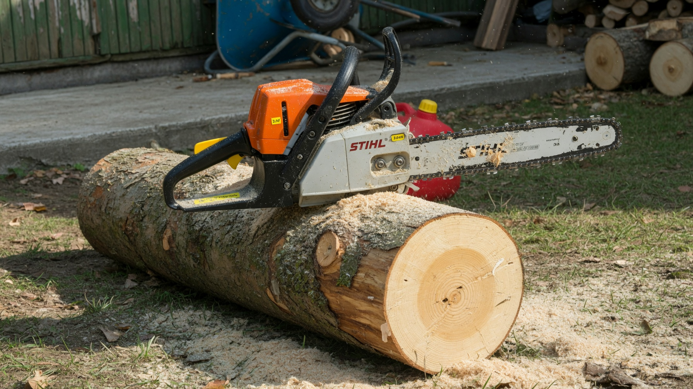
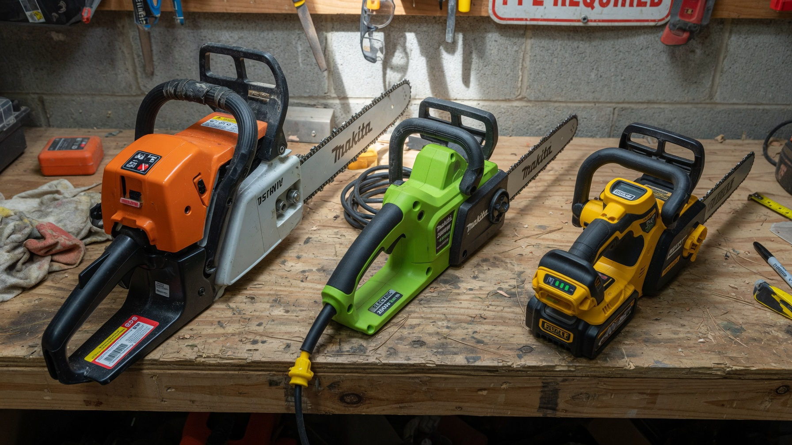
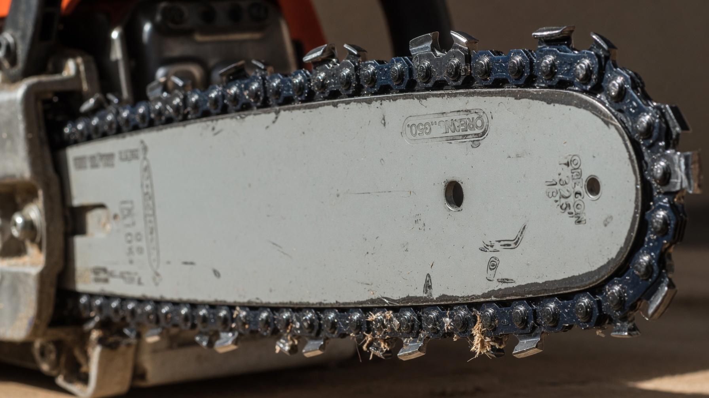
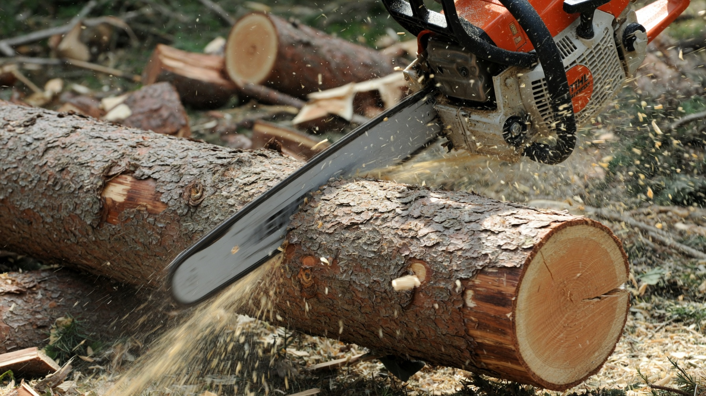
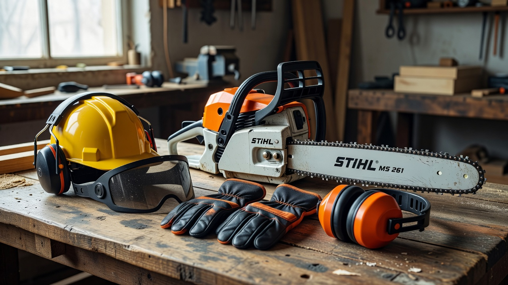
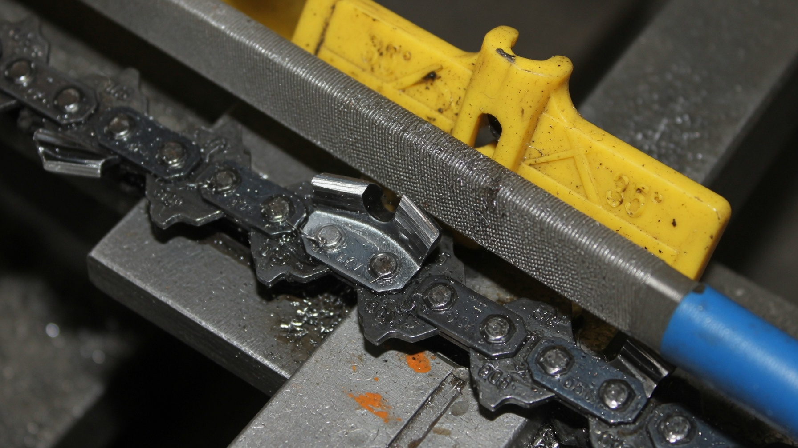

Бензопила на даче быстро становится незаменимой: ею пилят дрова, спиливают старые деревья, режут ветки после обрезки и заготавливают материал для стройки. Но моделей на прилавке десятки, и легко переплатить за ненужную мощность или, наоборот, купить слабый инструмент. Разберём, как выбрать бензопилу для дачи: чем отличаются виды, на что смотреть при покупке и какая пила подойдёт именно под ваши задачи.

## 🪚 Зачем нужна пила на даче

Прежде чем выбирать, определите, что вы будете пилить — от этого зависит нужная мощность и класс инструмента. Типичные дачные задачи:

- заготовка и распиловка дров;
- спил старых и сухих деревьев;
- обрезка толстых веток (в том числе осенью — см. [подготовку сада к зиме](https://mir-doma.pro/podgotovka-sada-k-zime/));
- распил досок и бруса для построек;
- расчистка участка от поросли и валежника.

Если задачи разовые и лёгкие — хватит простой пилы, если пилить придётся много и подолгу — нужен инструмент помощнее.

## ⚡ Бензиновая, электрическая или аккумуляторная

Первый выбор — тип питания. У каждого свои сильные стороны:

| Тип | Плюсы | Минусы |
|---|---|---|
| Бензиновая | Мощная, автономная, для тяжёлых работ | Шумная, тяжёлая, нужен бензин и обслуживание |
| Электрическая | Тихая, лёгкая, дешевле, не нужен бензин | Привязана к розетке, кабель мешает |
| Аккумуляторная | Мобильная, тихая, лёгкая | Ограниченное время работы, дороже |

**Бензиновая** — универсальный выбор для дачи, где нужна автономность и мощность (дрова, спил деревьев). **Электрическая** удобна для работ рядом с домом (обрезка, распил досок). **Аккумуляторная** хороша для лёгкой обрезки в саду, где не дотянуть провод.

## 🔧 На что смотреть при выборе

Ключевые характеристики, которые определяют удобство и возможности пилы:

- **Мощность.** Чем выше, тем толще брёвна по силам и тем легче пила идёт в древесине. Для дачи обычно достаточно средней мощности.
- **Длина шины.** Определяет максимальный диаметр реза. Короткая шина (30–35 см) — для веток и тонких брёвен, средняя (40 см) — универсал, длинная — для толстых стволов. Длиннее не всегда лучше: под большую шину нужна и большая мощность.
- **Вес и эргономика.** Тяжёлой пилой быстро устаёшь. Подержите инструмент в руках, оцените баланс и удобство рукоятей.
- **Натяжение цепи без инструмента.** Удобная функция — подтянуть цепь можно быстро, без ключа.
- **Антивибрационная система** — снижает усталость рук при долгой работе.
- **Тормоз цепи** — обязательная защита, мгновенно останавливающая цепь при отдаче.

## 🎯 Какую бензопилу выбрать под задачу

Сориентироваться проще по сценарию использования:

- **Изредка напилить дров, спилить пару веток** — простая бытовая пила с шиной 30–35 см. Недорогая и лёгкая.
- **Много дров, регулярный спил деревьев** — полупрофессиональная пила средней-высокой мощности с шиной 40 см: выносливее и производительнее.
- **Лёгкая обрезка сада** — аккумуляторная или электрическая пила: тихие, лёгкие, быстро включаются.
- **Стройка и распил бруса** — надёжная бытовая или полупрофессиональная бензопила с запасом мощности.

Не гонитесь за профессиональными моделями «на вырост» — они тяжёлые и дорогие, а их ресурс на даче не нужен.

## 🛡️ Безопасность и уход

Бензопила — травмоопасный инструмент, поэтому безопасность и обслуживание не менее важны, чем выбор модели:

- **Средства защиты.** Работайте в защитных очках или маске, перчатках, наушниках и прочной обуви; удобны специальные защитные штаны.
- **Тормоз цепи и правильная стойка.** Держите пилу двумя руками, не пилите концом шины (риск отдачи), не поднимайте пилу выше плеч.
- **Смазка цепи.** Следите за уровнем масла для смазки цепи — без него шина и цепь быстро изнашиваются.
- **Заточка цепи.** Тупая цепь пилит медленно, «горит» и опасна. Цепь регулярно затачивают напильником или на станке.
- **Обкатка и хранение.** Новую бензопилу обкатывают по инструкции, а на хранение убирают чистой, в сухое место — например, в [сарай](https://mir-doma.pro/saray-svoimi-rukami/).

## 🧰 Что купить вместе с бензопилой

Чтобы пила сразу была готова к работе и служила дольше, к ней стоит взять расходники и аксессуары:

- **Масло для смазки цепи** — расходуется постоянно, без него шина и цепь быстро изнашиваются;
- **Масло для топливной смеси** (для бензиновых) — двухтактное, для приготовления смеси в точной пропорции;
- **Запасная цепь** — чтобы не простаивать, пока основная тупится или на заточке;
- **Напильник или станок для заточки** — цепь нужно регулярно подтачивать;
- **Канистра для топливной смеси** и воронка;
- **Средства защиты** — очки, перчатки, наушники;
- **Чехол на шину** — для безопасного хранения и переноски.

Эти мелочи стоят недорого, но избавляют от простоев и продлевают жизнь инструменту.

## ❌ Частые ошибки

- **Покупка избыточно мощной пилы** — тяжело, дорого и не нужно для дачных задач.
- **Слишком длинная шина при малой мощности** — пила «не тянет» и застревает.
- **Работа тупой цепью** — медленно, опасно и вредно для двигателя.
- **Пренебрежение защитой** — бензопила не прощает беспечности.
- **Заливка неправильного топлива** — для двухтактных двигателей нужна смесь бензина с маслом в точной пропорции.

## ❓ Частые вопросы

**Какая бензопила лучше для дачи?**
Для большинства дачных задач оптимальна бытовая или полупрофессиональная бензопила средней мощности с шиной 35–40 см. Она справится и с дровами, и с обрезкой, и с распилом досок.

**Бензиновая или электрическая пила — что выбрать?**
Бензиновая мощнее и автономна — для дров и спила деревьев. Электрическая тише и легче — для работ у дома. Выбор зависит от того, есть ли рядом розетка и насколько тяжёлые задачи.

**Какой длины шина нужна для дачи?**
Универсальный вариант — 35–40 см: хватает и для веток, и для брёвен средней толщины. Более длинная шина требует более мощной пилы.

**Как выбрать бензопилу для дров?**
Для регулярной заготовки дров берите пилу средней-высокой мощности с шиной 40 см и антивибрацией — она выносливее и меньше утомляет при долгой работе.

**Сколько мощности достаточно для дачной бензопилы?**
Для бытовых задач хватает средней мощности. Высокая нужна только при частом спиле толстых деревьев и больших объёмах дров.

**Как ухаживать за цепью бензопилы?**
Следить за смазкой (масло для цепи), вовремя натягивать и регулярно затачивать цепь. Тупая цепь пилит медленно, перегревается и опасна.

---

Правильно подобранная бензопила служит годами и экономит массу сил на даче. Отталкивайтесь от своих задач, не переплачивайте за лишнюю мощность и не забывайте про защиту и уход за цепью. А какие ещё инструменты пригодятся на участке — в статье про [инструменты для дачи](https://mir-doma.pro/instrumenty-dlya-dachi/).
