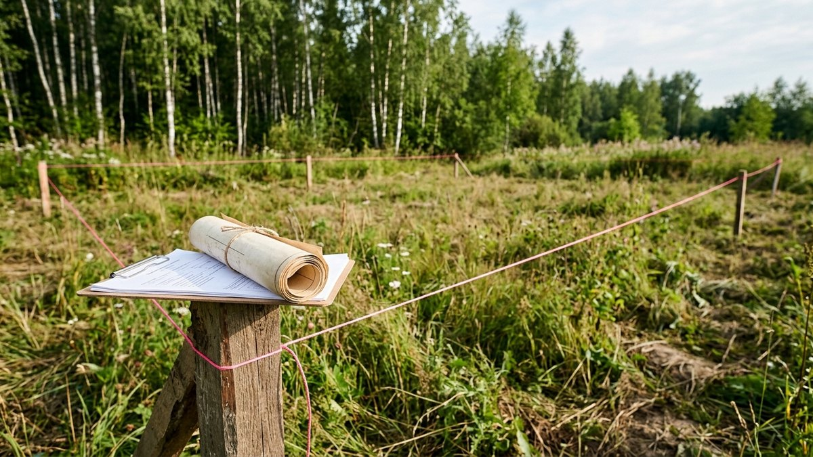
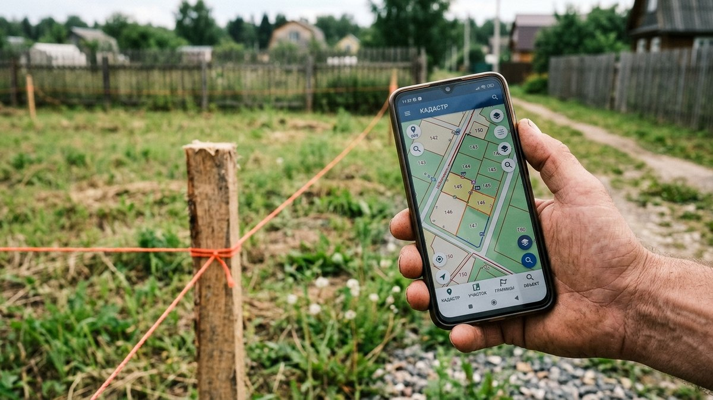
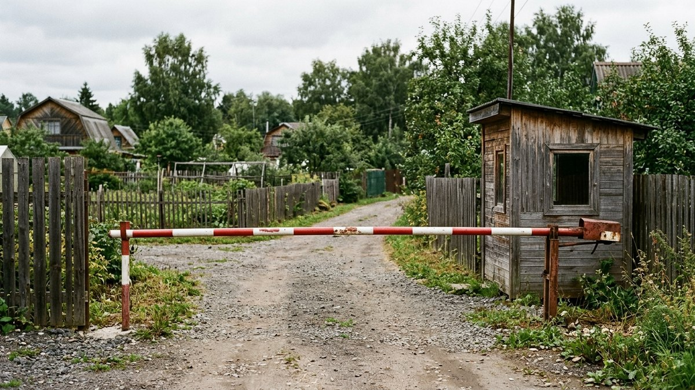
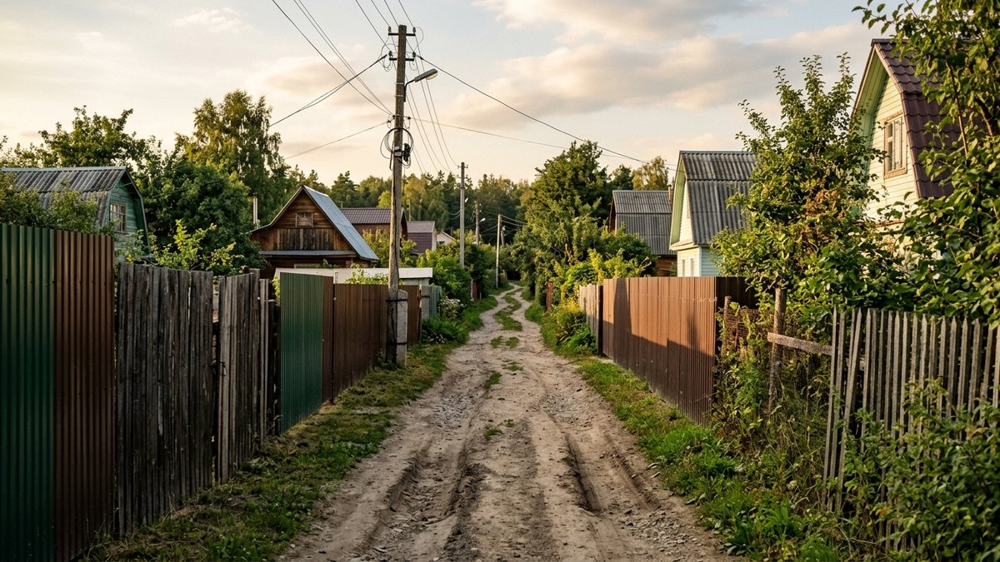
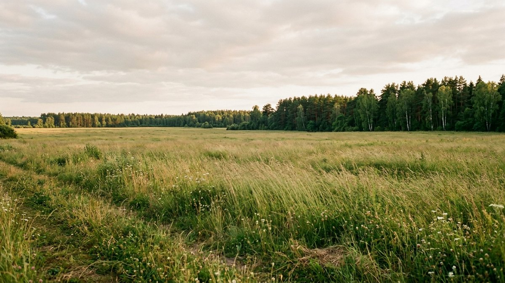
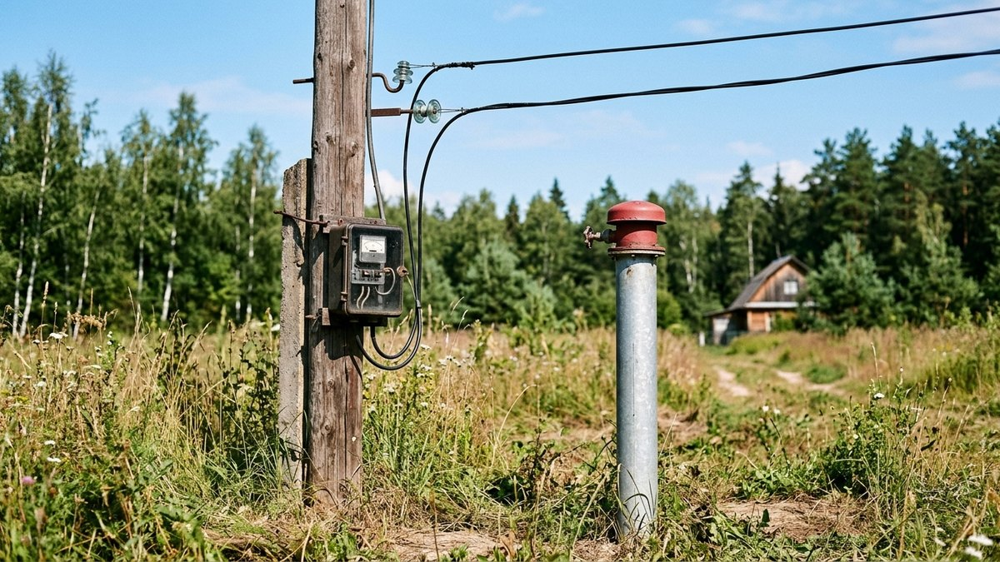

Дом можно перестроить, забор — перенести, а вот местоположение участка, статус его земли и то, кто управляет посёлком, изменить нельзя. Ошибка на этапе выбора обходится в годы судов или в дорогу, за проезд по которой вдруг начинают требовать деньги. В этой статье — как разобраться в документах на землю, на что смотреть в СНТ или ДНП до подписания договора, зачем разговаривать с соседями и как проверить, что происходит вокруг участка, прежде чем отдавать задаток.

## Категория земель и вид разрешённого использования

Первое, что определяет, что вообще можно делать с участком, — это не описание в объявлении, а два юридических параметра: категория земель и вид разрешённого использования (ВРИ). Их не обсуждают с продавцом на словах — их смотрят в выписке из ЕГРН.

- **Земли населённых пунктов с ВРИ «для ИЖС»** — можно строить капитальный жилой дом, получить в нём постоянную регистрацию, участок обычно подключён к сетям населённого пункта.
- **Садовый земельный участок** (бывшие СНТ, ДНП, дачные объединения — с 2019 года по закону всё это юридически «садоводческие товарищества») — дом строить можно, регистрация в нём тоже возможна, если дом признан жилым, но инфраструктура и дороги обычно на балансе самого товарищества, а не муниципалитета.
- **Земли сельхозназначения без права на постройку** — на таком участке капитальный дом законно не поставить, а самострой рано или поздно приходится сносить по решению суда.

Разница на бумаге выглядит как одна строчка, а на практике — это вопрос, будет ли у дома почтовый адрес, пропишут ли в нём и подключат ли газ по программе для ИЖС. Смотреть нужно именно ВРИ в выписке ЕГРН, а не то, что написано в объявлении или что говорит собственник: категорию словами не подтвердить.

## Документы, которые проверяются до задатка

Деньги передаются только после того, как документы совпали с тем, что показывают на местности.

- **Свежая выписка из ЕГРН** (не старше месяца) — кто собственник, есть ли обременения: ипотека, арест, сервитут, аренда в пользу третьих лиц. Продавец может не знать об аресте по старому долгу — выписка покажет это точно.
- **Границы участка на публичной кадастровой карте** (pkk.rosreestr.ru) — сверяются с забором на местности. Если в выписке границы «не установлены», это означает, что участок не межёван: сосед может провести межевание первым и по документам «прирезать» себе часть вашей земли, а спорить придётся уже вам.
- **Основание права собственности продавца** — договор купли-продажи, дарения, свидетельство о наследстве. Участок, полученный по наследству меньше трёх лет назад, — это риск: другие наследники могут заявить права на него уже после сделки.
- **Срок владения** — если участок перепродаётся третий раз за два года, стоит спросить прямо, почему.

Если на участке уже стоит дом и вопрос не только в земле, а в самом строении — фундаменте, стенах, коммуникациях, — отдельный подробный разбор в статье [«Покупка старого дома: на что обратить внимание»](https://mir-doma.pro/pokupka-starogo-doma/): там разобрано, как осматривать сам дом и какие документы запрашивать именно по строению.

## СНТ или ДНП: в каком состоянии посёлок и кто им управляет

Если участок в садовом товариществе, вместе с землёй покупается ещё и членство в организации со своими финансами, инфраструктурой и, нередко, внутренними конфликтами. Это тот раздел проверки, который чаще всего пропускают — а зря: от него зависит, во сколько обойдётся жизнь на участке уже после покупки.

**Устав и протоколы последних собраний.** Попросите у продавца или напрямую у председателя устав товарищества и протоколы 2–3 последних общих собраний. По ним видно размер взносов, принятые решения о крупных тратах (например, ремонт дороги вскладчину) и то, есть ли у товарищества судебные споры — как с внешними подрядчиками, так и с собственными членами.

**Размер и назначение взносов.** Членские и целевые взносы — не формальность, а реальная статья расходов на годы вперёд. Стоит спросить финансовый отчёт: на что именно идут деньги, есть ли задолженности товарищества перед энергетиками или подрядчиками.

**Земли общего пользования — самый скрытый риск.** По закону дороги, проезды, земля под шлагбаумом, воротами, детской площадкой и охраной должны принадлежать товариществу как юридическому лицу — это общее имущество всех собственников. На практике встречаются посёлки, где эта земля годами не оформлена на баланс товарищества, а зарегистрирована в частную собственность — иногда на самого председателя или связанных с ним людей. Формально это уже не общее имущество, а частный участок, и его владелец может по своему усмотрению взимать плату за проезд по «своей» дороге, отключать шлагбаум или выставлять условия, которых нет ни в одном уставе. Разобраться с этим после покупки — это годы судов, а не разговор с соседями.

Как проверить до покупки:
- попросите у председателя кадастровые номера земель общего пользования (дорога, КПП, площадка перед шлагбаумом) и посмотрите на публичной кадастровой карте или в выписке ЕГРН, на кого они зарегистрированы;
- если ответ уклончивый, а собственник в выписке — физическое лицо, а не товарищество, это повод насторожиться и уточнять дальше, а не списывать на формальность;
- спросите у нескольких соседей (не у того, кого привёл продавец) и в местных чатах посёлка, были ли конфликты вокруг проезда, шлагбаума или дополнительных поборов сверх официальных взносов.

**История смены председателя.** Частая смена руководства или явные конфликты между правлением и членами товарищества — тоже сигнал. Название СНТ и его судебные дела можно поискать в картотеке арбитражных дел или на сайте районного суда.

## Соседи — то, что не купишь и не исправишь

Место и соседей изменить нельзя, в отличие от дома. Поговорите с двумя-тремя соседями отдельно от продавца — постоянно живущие расскажут о зиме, реальном состоянии дороги и о том, что не попадает в объявление. Полезные вопросы: почему продают участок, были ли споры о границах, есть ли в округе заброшенные или спорные участки, шумные соседи, животные на вольном выгуле, самострой у самой границы. Это тот же принцип due diligence, что и при покупке готового дома, — просто здесь он касается не стен, а окружения.

## Экология и что находится рядом

Свалка или производство в паре километров не видны на фото участка в объявлении, но напрямую влияют на воздух, грунтовые воды и будущую цену перепродажи. Мы не публикуем свою карту таких объектов: единственный источник, которому здесь можно доверять, — официальные реестры, а не список, собранный вручную. Ниже — рабочие ссылки на них, проверьте участок по адресу или кадастровому номеру перед покупкой.

<!-- wp:html -->

  
Проверьте участок по официальным реестрам — бесплатно, без регистрации

  <a class="md-eco__link" href="https://nspd.gov.ru/map?thematic=PKK" target="_blank" rel="noopener">
    Публичная кадастровая карта (НСПД)
    Слой «Зоны и территории» показывает санитарно-защитные зоны предприятий рядом с участком
  </a>
  <a class="md-eco__link" href="https://rpn.gov.ru/activity/regulation/kadastr/groro/" target="_blank" rel="noopener">
    ГРОРО — реестр объектов размещения отходов
    Официальный список легальных полигонов ТКО, ведёт Росприроднадзор
  </a>
  <a class="md-eco__link" href="https://onvos.rpn.gov.ru/" target="_blank" rel="noopener">
    Реестр объектов НВОС
    Поиск предприятий I–II категории опасности по названию, ИНН или коду объекта
  </a>

<!-- /wp:html -->

Дополнительно помогают свежие спутниковые снимки в Яндекс.Картах или 2ГИС: расчищенные площадки и скопления техники рядом с лесом часто выдают стихийную свалку или начало стройки промышленного объекта раньше, чем об этом узнают жители. И отдельно стоит приехать на участок в разное время суток и, если получится, при разном направлении ветра — тихое утром место может ощутимо пахнуть или гудеть от трассы и производства вечером.

## Почему одно направление вдвое дешевле другого

Цена сотки в Подмосковье отличается не только удалённостью от МКАД — направление имеет значение само по себе. По данным аналитического центра «Мир квартир» (сентябрь 2023 года), разброс между самым доступным и самым дорогим направлением — в 36 раз, и восток с юго-востоком стабильно держат нижнюю границу: это исторически промышленная часть области. В Воскресенске, например, с 1931 года работает крупный химический комбинат («Воскресенские минеральные удобрения», сейчас в составе «Уралхима») — подобные производства десятилетиями формировали репутацию направления и, соответственно, цену земли.

<!-- wp:html -->

  
Цена сотки по направлениям от Москвы — нажмите на направление, чтобы увидеть города

  

  
Снимок рынка на конкретную дату — ориентир для сравнения направлений, а не цена вашего участка. Источники и точные ссылки — под таблицей.

<!-- /wp:html -->

Цена — не единственный сигнал, но она честно отражает десятилетия репутации направления: инфраструктуру, транспорт и промышленную историю места. Причины на востоке и юго-востоке — не только заводы: это ещё и более загруженные трассы и в среднем более скромная социальная инфраструктура. Но подменять этим проверку конкретного участка нельзя: дешёвое направление не значит, что рядом обязательно вредное производство, а дорогое — что его точно нет. Единственный надёжный способ — проверить конкретный адрес по реестрам из раздела выше, а не полагаться на репутацию всего направления целиком.

*Источники: «Мир квартир», аналитика цен на землю по направлениям Подмосковья, 16.09.2023; «Коммерсантъ. Недвижимость», обзор цен на землю в Подмосковье, май 2026. Цены — среднерыночные на дату публикации, меняются из года в год; актуальные цифры по конкретному направлению стоит сверять в свежих обзорах Авито Недвижимости, Циан или Домофонда.*

## Коммуникации, которых ещё нет на плане

То, что в объявлении написано «свет, вода по границе», не значит, что участок к ним фактически подключён.

- **Электричество.** Важно, сколько киловатт реально выделено по техническим условиям, а не сколько «можно провести» на словах — и попросить у продавца акт технологического присоединения, а не верить на слово: если его нет, узнавать реальную мощность придётся уже после покупки через ЕИРЦ и сетевую организацию, весь путь и стоимость увеличения — в статье [«Как увеличить мощность электричества на участке»](https://mir-doma.pro/kak-uvelichit-moshchnost-elektrichestva-na-uchastke/). Если сеть в посёлке слабая и напряжение проседает, до решения вопроса с энергетиками выручает стабилизатор — подробнее в статье [«Какой стабилизатор напряжения выбрать»](https://mir-doma.pro/kakoy-stabilizator-napryazheniya-vybrat/).
- **Вода.** Центральный водопровод в посёлке или только своя скважина и колодец — и какая в этом месте реальная глубина скважины у соседей. Разница между скважиной и колодцем и что выбрать под конкретный участок — в статье [«Скважина или колодец»](https://mir-doma.pro/skvazhina-ili-kolodec/).
- **Канализация.** Если центральной канализации нет, под септик нужна отдельная площадь и определённый тип грунта — это стоит прикинуть ещё на этапе выбора участка, а не после покупки. Виды септиков и как выбрать подходящий — в статье [«Септик для дачи»](https://mir-doma.pro/septik-dlya-dachi/).
- **Газ.** Магистральный газ рядом или только привозной баллонный — это ощутимая разница в будущих расходах на отопление.
- **Дорога зимой.** Кто чистит дорогу до участка и за чей счёт — тот же вопрос об инфраструктуре товарищества, что и с землями общего пользования.

Если участок в итоге устраивает и по земле, и по посёлку, следующий шаг — уже планировка самого участка под дом, подъезд и коммуникации: как расставить приоритеты, разобрано в статье [«Планировка участка 10 соток под строительство дома»](https://mir-doma.pro/planirovka-uchastka-10-sotok-pod-stroitelstvo/). А чтобы дом на этом участке простоял без трещин, тип фундамента тоже стоит прикинуть заранее по грунту — в статье [«Какой фундамент выбрать для дома»](https://mir-doma.pro/kakoy-fundament-vybrat-dlya-doma/).

## Когда лучше ехать смотреть участок

Лучший момент — после дождя: сразу видно, где скапливается вода и как участок стоит относительно соседних по уровню. Если есть возможность, стоит приехать дважды — в будний день и в выходной, чтобы оценить и дорогу без пробок дачников, и реальную заполненность посёлка. Разговаривать с соседями лучше в выходной день во второй половине дня — именно тогда постоянные жители чаще всего дома.

## Частые ошибки

- **Верить объявлению и словам продавца вместо выписки ЕГРН.** Категория земли, границы и обременения проверяются только по документам.
- **Не заезжать в СНТ до покупки.** Устав, взносы и состояние земель общего пользования узнаются заранее, а не постфактум от соседей.
- **Пропускать разговор с соседями.** Один короткий разговор экономит месяцы разбирательств после покупки.
- **Считать, что забор = граница участка.** Без межевания фактический забор и кадастровые границы могут не совпадать.
- **Не проверять экологию рядом.** Санитарно-защитные зоны и реестр отходов открыты и бесплатны — этим стоит воспользоваться до, а не после покупки.

## Чек-лист перед задатком

Тот же принцип, что и в чек-листе осмотра дома: отмечайте пункты прямо на месте — в СНТ у правления, на встрече с соседями, за столом с документами. Всё сохранится в браузере телефона, а в конце можно отправить готовый отчёт себе в мессенджер одной кнопкой.

<!-- wp:html -->

  

    <h3 class="md-cl__title">Чек-лист выбора участка</h3>
    
Отмечайте пункты прямо на месте — всё сохранится в браузере на этом устройстве.

    <input type="text" id="mdAddrLand" class="md-cl__addr" placeholder="Адрес или кадастровый номер участка (например: СНТ «Ромашка», уч. 42)">
    

      

      0 из 0
    

  

  

  

    <label for="mdNotesLand" class="md-cl__nlabel">Общие заметки по участку</label>
    <textarea id="mdNotesLand" class="md-cl__textarea" rows="4" placeholder="Что смутило, о чём уточнить у председателя, что спросить у соседей..."></textarea>
  

  

    <button type="button" id="mdShareLand" class="md-cl__btn md-cl__btn--main">Сохранить отчёт</button>
    <button type="button" id="mdCopyLand" class="md-cl__btn">Скопировать</button>
    <button type="button" id="mdPrintLand" class="md-cl__btn">Печать</button>
    <button type="button" id="mdResetLand" class="md-cl__btn md-cl__btn--ghost">Очистить</button>
  

  

<!-- /wp:html -->

## Частые вопросы

### Можно ли строить жилой дом на садовом участке?

Да, с 2019 года на садовом земельном участке можно законно строить жилой дом и получить в нём постоянную регистрацию — при условии, что дом признан пригодным для проживания. Земли сельхозназначения без права на постройку для этого не подходят.

### Что делать, если границы участка не установлены?

Заказать межевание до покупки или сразу после неё, до того как соседи проведут его первыми. Без установленных границ участок юридически уязвим для споров с соседями и муниципалитетом.

### Как узнать, кому принадлежат земли общего пользования в СНТ?

Запросить у председателя кадастровые номера дороги, проезда и территории у шлагбаума и проверить собственника по публичной кадастровой карте Росреестра или заказать выписку ЕГРН на эти участки. Собственник — физическое лицо вместо товарищества — повод разбираться дальше до покупки, а не после.

### Обязательно ли платить взносы, если участком почти не пользуешься?

Да, членские и целевые взносы обязательны для всех собственников участков в границах товарищества независимо от того, как часто вы там бываете, — они идут на содержание общей инфраструктуры: дорог, сетей, вывоза мусора.

### Как проверить, нет ли рядом свалки или вредного производства?

Посмотреть слой санитарно-защитных зон на публичной кадастровой карте Росреестра, проверить реестр объектов, оказывающих негативное воздействие на окружающую среду (ведёт Росприроднадзор), и государственный реестр объектов размещения отходов. Дополнительно — свежие спутниковые снимки участка в Яндекс.Картах или 2ГИС и личный выезд в разное время суток.

### Почему земля в одних районах Подмосковья дешевле, чем в других?

Разница в разы объясняется в основном не удалённостью от МКАД, а направлением: восток и юго-восток исторически промышленная часть области с более загруженными трассами, запад и север — обычно дороже за счёт лучшей инфраструктуры и репутации. Но это статистика по направлению в целом, а не гарантия для конкретного участка — его всё равно проверяют по реестрам отдельно.

### Сколько стоит проверка участка перед покупкой у юриста?

Разброс большой и зависит от региона и объёма проверки, но самостоятельно бесплатно доступны выписка ЕГРН, публичная кадастровая карта и реестры Росприроднадзора — уже они закрывают большую часть чек-листа из этой статьи без затрат.
