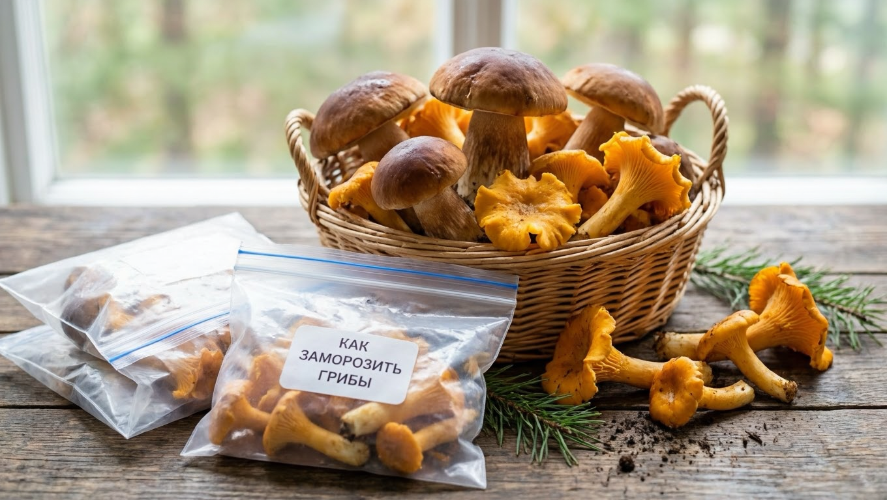
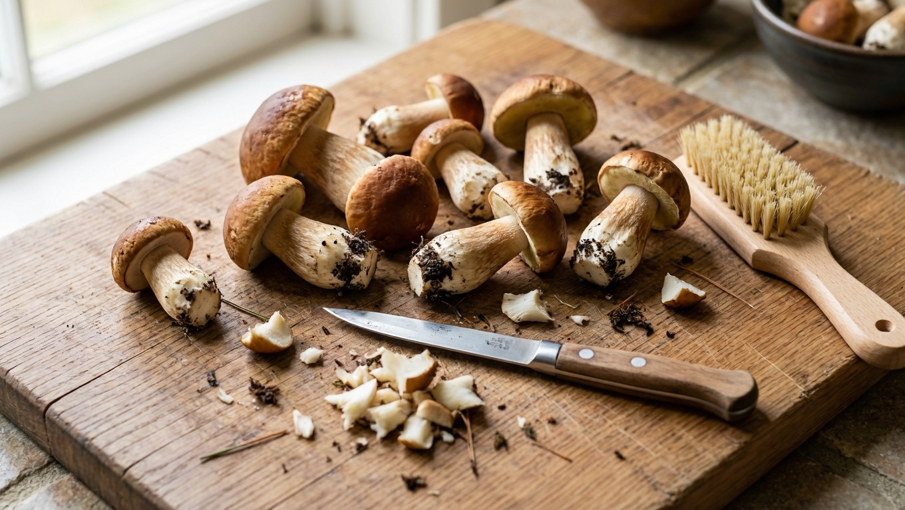
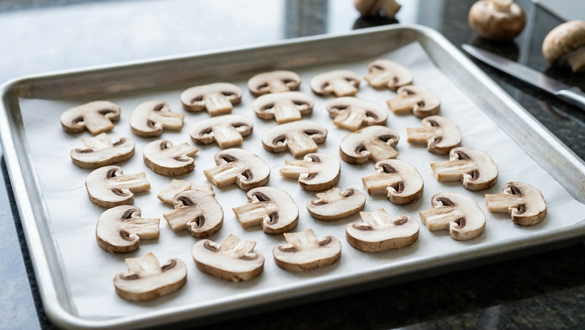
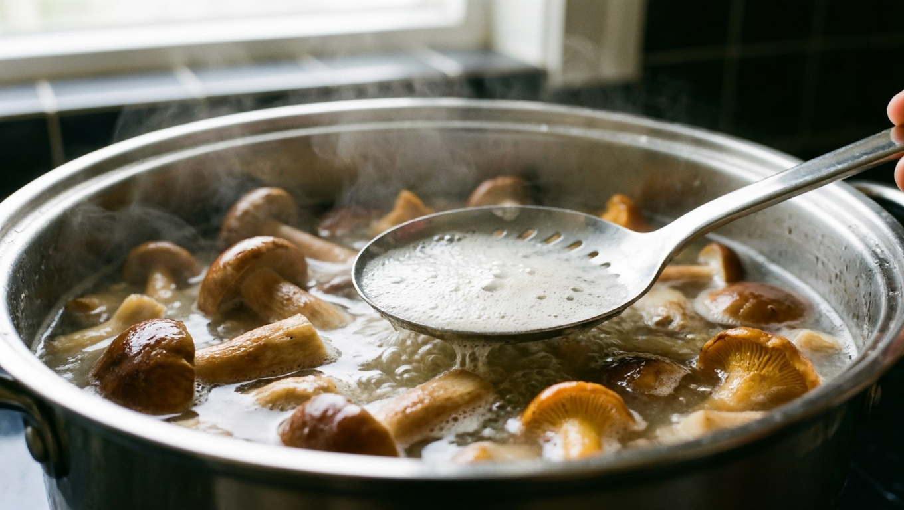
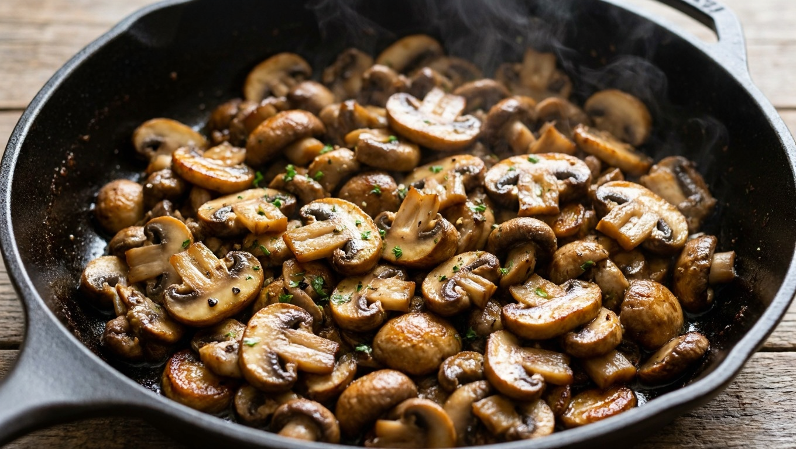
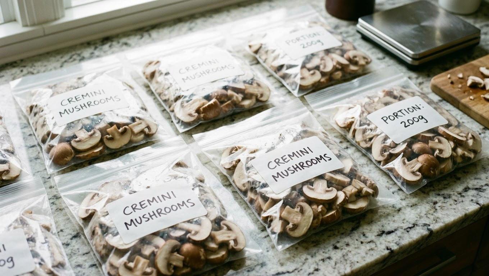

Главный вопрос при заморозке грибов звучит просто: варить или не варить. И универсального ответа на него нет — **для белых один подход, для лисичек другой, для опят третий**. Ошибка стоит дорого: замороженные сырыми лисички зимой горчат, а недоваренные опята могут вызвать расстройство. Разберём по видам, что можно морозить сырым, что нужно отварить и сколько именно, как расфасовать порциями и что делать с грибами после разморозки.

## ⚠️ Сначала о безопасности

Заморозка не обезвреживает грибы — она только сохраняет то, что вы положили в морозилку. Поэтому базовые правила действуют в полной мере:

- **Замораживайте только те грибы, в которых уверены на сто процентов.** Сомневаетесь в виде — не берите. Заморозка, варка и жарка не убирают токсины ядовитых грибов.
- **Условно-съедобные грибы** (грузди, волнушки, валуи и подобные) требуют предварительного вымачивания и обязательного отваривания — сырыми их не морозят.
- **Не собирайте грибы вдоль дорог, у промзон и свалок** — они накапливают тяжёлые металлы независимо от способа заготовки.
- **Не замораживайте старые, дряблые и червивые грибы.** Морозилка не улучшит их состояние, а испорченный гриб испортит всю порцию.
- **Перерабатывайте в день сбора**, максимум на следующий день из холодильника. Грибы портятся быстро.
- **Списки съедобности пересматриваются** — некоторые грибы, которые раньше считались условно-съедобными, сегодня признаны опасными. Если сомневаетесь в старом «дедовском» рецепте, проверьте актуальные данные.

## 🍄 Сырыми или отварными: таблица по видам

Общее правило: **плотные трубчатые грибы хорошо переносят сырую заморозку, пластинчатые и условно-съедобные — требуют отваривания.**

| Гриб | Как замораживать | Время варки | Срок хранения |
|---|---|---|---|
| **Белый** | Сырым или отварным | 10–15 мин | 10–12 мес сырым |
| **Подберёзовик, подосиновик** | Сырым или отварным | 10–15 мин | 8–10 мес |
| **Маслята** | Лучше отварными | 10–15 мин | 8–10 мес |
| **Лисички** | **Только отварными** | 15–20 мин | 6–8 мес |
| **Опята** | **Только отварными** | 20–25 мин | 6–8 мес |
| **Шампиньоны** | Сырыми | не требуется | 8–10 мес |
| **Вешенки** | Сырыми или бланшированными | 5–10 мин | 8–10 мес |
| **Грузди, волнушки** (условно-съедобные) | **Только после вымачивания и отваривания** | 20–30 мин, вымачивание 1–2 суток | 6–8 мес |

Время варки — ориентировочное, для грибов среднего размера. Крупные экземпляры варят дольше, готовность видна по тому, что грибы **опускаются на дно кастрюли**.

## 🧡 Почему лисички горчат после сырой заморозки

Это самая частая претензия к домашней заморозке, и объяснение у неё вполне понятное.

Лисички имеют плотную, почти резинистую структуру и содержат горьковатые соединения, которые в свежем грибе почти не чувствуются. При замораживании вода внутри клеток превращается в кристаллы льда и **разрушает клеточные стенки**. После разморозки содержимое клеток выходит наружу — и горечь, которая была связана внутри тканей, проявляется во вкусе. Чем дольше грибы лежат в морозилке, тем заметнее эффект.

**Отваривание решает проблему:** часть горьких веществ переходит в отвар, а клеточная структура уже изменена термически, и лёд не рвёт её так разрушительно.

**Практический вывод:** лисички отваривают 15–20 минут, откидывают на дуршлаг, дают полностью стечь и остыть, и только потом замораживают. Отвар выливают — именно в нём горечь.

То же касается и других пластинчатых грибов с плотной мякотью. А вот белые и подберёзовики после сырой заморозки горечи не дают.

## ❄️ Три способа заморозки

### Способ 1. Сырыми

**Кому подходит:** белые, подберёзовики, подосиновики, шампиньоны, вешенки.

1. Грибы очистить, при необходимости быстро промыть и **тщательно обсушить**.
2. Нарезать крупные экземпляры пластинами или кубиками, мелкие оставить целыми.
3. Разложить **в один слой** на поддоне или доске.
4. Подморозить несколько часов до твёрдости.
5. Пересыпать в пакеты или контейнеры и вернуть в морозилку.

**Плюсы:** сохраняется вкус, аромат и текстура, гриб остаётся «как свежий». **Минусы:** занимают больше места, подходят не для всех видов.

### Способ 2. Отварными

**Кому подходит:** лисички, опята, маслята, условно-съедобные, а также любые грибы, если хочется сэкономить место.

1. Очистить и промыть грибы.
2. Отварить в подсоленной воде по времени из таблицы, снимая пену.
3. Откинуть на дуршлаг и **дать полностью стечь** — минимум 20–30 минут.
4. Остудить до комнатной температуры.
5. Разложить порциями по пакетам или контейнерам, выпустив воздух.

**Плюсы:** занимают в разы меньше места, безопаснее для пластинчатых видов, зимой сразу готовы к употреблению. **Минусы:** часть аромата уходит в отвар, текстура мягче.

**Важно:** грибы должны быть максимально сухими перед заморозкой. Лишняя вода превратится в лёд и смёрзнет всё в один ком.

### Способ 3. Жареными

**Кому подходит:** любым грибам, если хочется зимой получить готовый продукт.

1. Очистить, нарезать, обжарить на сковороде до испарения влаги (15–20 минут).
2. Солить **минимально** или не солить вовсе — досолите при подаче.
3. Полностью остудить.
4. Расфасовать порциями, лучше в контейнеры.

**Плюсы:** зимой достаточно разогреть — готовая начинка для пирогов, добавка в картошку или суп. **Минусы:** самый короткий срок хранения (**3–4 месяца**), поскольку жир со временем окисляется и появляется прогорклый привкус.

## 🧽 Мыть или не мыть

Вопрос спорный, и ответ зависит от способа заморозки:

- **Для сырой заморозки — лучше не мыть.** Грибы впитывают воду как губка, а лишняя влага в морозилке превращается в лёд и портит текстуру. Очищайте сухой щёткой, ножом или влажной тряпочкой: снимите плёнку с маслят, срежьте загрязнённые места, отрежьте нижнюю часть ножки.
- **Для отварной и жареной заморозки — мыть можно и нужно**, вода всё равно уйдёт при термообработке.
- **Если гриб сильно загрязнён** и без мытья не обойтись — промойте быстро, не замачивая, и **тщательно обсушите** на полотенце, разложив в один слой. На это уйдёт от получаса.

**Никогда не замачивайте грибы надолго** (кроме условно-съедобных, где вымачивание — часть технологии): они наберут воду и потеряют вкус.

## 📦 Фасовка: как не получить один ком

Правила те же, что и для [заморозки ягод](https://mir-doma.pro/kak-zamorozit-yagody/), но с грибной спецификой:

- **Фасуйте порциями на одно приготовление.** Это не удобство, а необходимость: повторно замораживать грибы нельзя.
- **Плоские пакеты удобнее контейнеров** — занимают меньше места и быстрее промерзают. Разровняйте содержимое в тонкий пласт.
- **Выпускайте воздух** из пакета — он сушит продукт и даёт «морозный ожог».
- **Подписывайте:** вид гриба, способ (сырые / отварные / жареные) и дата. Зимой все брикеты выглядят одинаково, а способ определяет, что с ними делать.
- **Сырые грибы сначала подморозьте россыпью**, а уже потом ссыпайте в пакет — иначе смёрзнутся.
- **Отварные грибы должны полностью стечь и остыть.** Тёплые грибы дадут конденсат, а он — лёд.

## 🍳 Как размораживать и использовать

Здесь есть принципиальная разница по способам:

- **Отварные и жареные — размораживать не нужно.** Их кладут прямо из морозилки в сковороду, суп или начинку. Так они не потеряют форму и сок.
- **Сырые для жарки** — тоже можно сразу на сковороду, но огонь сначала делают сильным, чтобы влага быстро испарилась, иначе грибы будут тушиться.
- **Сырые для супа** — кладут замороженными в кипящий бульон.
- **Если нужна разморозка** (например, для начинки) — только в холодильнике, медленно. В тёплой воде и микроволновке грибы превращаются в кашу.
- **Размороженные грибы используют сразу** — они портятся очень быстро.
- **Повторно замораживать нельзя** ни в каком виде.

**Сроки хранения** по способам: сырые — до 10–12 месяцев, отварные — 6–8 месяцев, жареные — 3–4 месяца. Общие сроки для всех домашних заготовок собраны в статье про [сроки хранения заготовок](https://mir-doma.pro/skolko-hranyatsya-zagotovki/).

## ❌ Частые ошибки

- **Заморозили лисички и опята сырыми** — зимой получили горечь и неприятную текстуру.
- **Не обсушили грибы** — смёрзлись в один ледяной ком, который не разделить.
- **Заложили тёплые отварные грибы** — конденсат превратился в лёд.
- **Одна большая упаковка на всю зиму** — придётся размораживать целиком, а повторно замораживать нельзя.
- **Не подписали способ заморозки** — зимой непонятно, варёные они или сырые.
- **Разморозили в тёплой воде** — грибы расползлись.
- **Заморозили старые или червивые грибы** — испортили всю порцию.
- **Пересолили жареные грибы** — солить лучше при подаче, соль усиливает выделение влаги.

## ❓ Частые вопросы

**Какие грибы можно замораживать сырыми?**
Плотные трубчатые — белые, подберёзовики, подосиновики, а также культивированные шампиньоны и вешенки. Лисички, опята, маслята и условно-съедобные грибы перед заморозкой обязательно отваривают.

**Сколько варить грибы перед заморозкой?**
Белые, подберёзовики и маслята — 10–15 минут, лисички — 15–20, опята — 20–25, условно-съедобные (грузди, волнушки) — 20–30 минут после вымачивания. Готовность видна по тому, что грибы опускаются на дно кастрюли.

**Почему лисички горчат после заморозки?**
При замораживании кристаллы льда разрушают клеточные стенки, и горьковатые соединения, связанные внутри тканей, проявляются во вкусе. Чем дольше хранение, тем заметнее. Решение — отварить лисички 15–20 минут перед заморозкой и слить отвар.

**Нужно ли мыть грибы перед заморозкой?**
Для сырой заморозки лучше не мыть — грибы впитывают воду, которая превращается в лёд. Очищайте сухой щёткой или влажной тряпочкой. Перед отвариванием и жаркой мыть можно: вода всё равно уйдёт при готовке.

**Сколько хранятся замороженные грибы?**
Сырые — 10–12 месяцев, отварные — 6–8 месяцев, жареные — 3–4 месяца при стабильных –18 °C. Жареные хранятся меньше всего, потому что жир со временем окисляется.

**Надо ли размораживать грибы перед готовкой?**
Нет. Отварные и жареные кладут прямо из морозилки в сковороду или суп, сырые — тоже, но на сильный огонь, чтобы влага быстро испарилась. Медленная разморозка в холодильнике нужна только для начинки.

**Можно ли заморозить грибы повторно?**
Нет. После повторной заморозки грибы теряют вкус и текстуру, а риск порчи резко возрастает. Поэтому фасовать нужно сразу порциями на одно приготовление.

---

Заморозка грибов сводится к одной развилке: белые и подберёзовики уходят в морозилку сырыми, лисички и опята — только после отваривания. Дальше всё просто — сухие грибы, порционные пакеты, подписанная дата. И помните главное правило, которое не отменяет никакая технология: замораживать стоит только те грибы, в которых вы уверены.

**Куда идти дальше:**

- Что ещё стоит отправить в морозилку в конце сезона и какие продукты замораживать нельзя — обзорный гид: [что заморозить на зиму](https://mir-doma.pro/chto-zamorozit-na-zimu/).
- Ягоды морозят по другим правилам — там своя специфика с мытьём и сохранением формы: [как заморозить ягоды](https://mir-doma.pro/kak-zamorozit-yagody/).
- Если места в морозилке не хватает, грибы отлично сушатся — и в сушёном виде они даже ароматнее: [сушка овощей, фруктов и грибов](https://mir-doma.pro/sushka-ovoshchey-i-fruktov/).
- А сроки для всех остальных домашних заготовок собраны в отдельной таблице: [сколько хранятся заготовки](https://mir-doma.pro/skolko-hranyatsya-zagotovki/).
