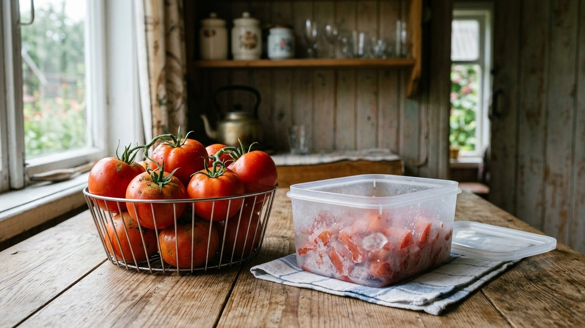
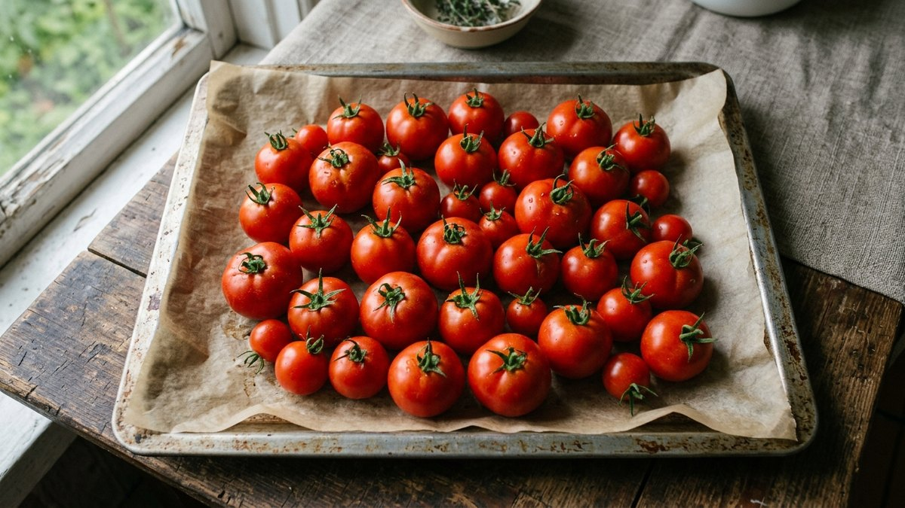
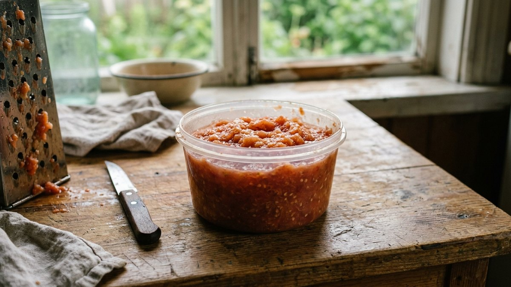
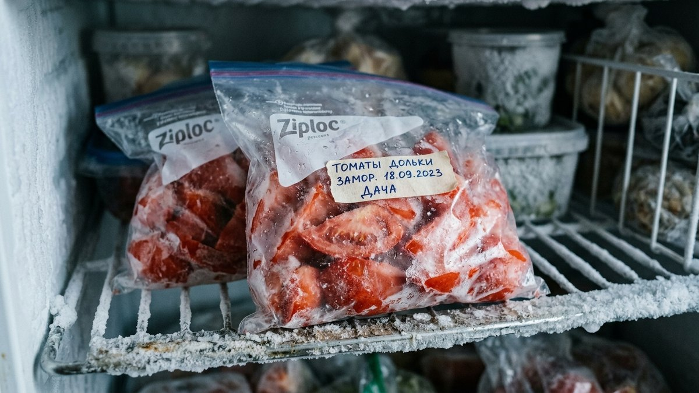
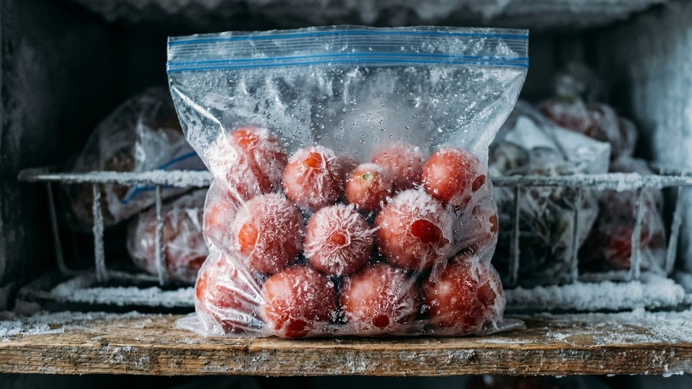
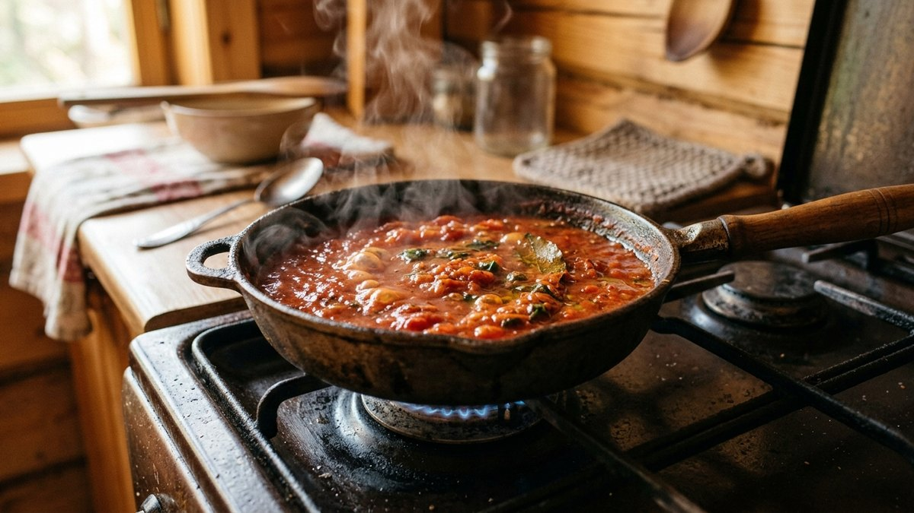

# Как заморозить помидоры на зиму: способы и частые ошибки

Морозилка — самый быстрый способ сохранить урожай помидоров, когда варить
очередную партию соуса или пасты уже нет ни сил, ни банок. Многие сомневаются,
стоит ли вообще замораживать помидоры: после разморозки они действительно
теряют упругость и не годятся для салата. Но для супов, соусов и рагу это
не имеет значения — там помидоры всё равно проходят термообработку. Разберём
рабочие способы заморозки и как выбрать подходящий под свои зимние блюда.

## Какие помидоры подходят для заморозки

Для заморозки берут плотные, спелые, но не перезревшие помидоры без вмятин
и трещин. Перезревшие водянистые плоды после разморозки превращаются в кашу
даже быстрее, чем обычно, и дают лишнюю жидкость в блюде. Мясистые сорта
(сливовидные, «сливка», «бычье сердце») переносят заморозку лучше водянистых
салатных сортов.

## Способ 1: целиком

Самый быстрый вариант без предварительной обработки:

1. Вымойте и обсушите помидоры полотенцем.
2. Уберите плодоножку.
3. Разложите на подносе в один слой и уберите в морозилку на 3–4 часа.
4. Переложите замороженные помидоры в пакет или контейнер для постоянного
   хранения.

Такая предварительная заморозка россыпью (без пакета) не даёт плодам
слипнуться в один ком — потом можно доставать по одному, сколько нужно для
рецепта.

## Способ 2: дольками или кубиками

Для рагу, пиццы и заправок удобнее замораживать нарезанными:

1. Нарежьте помидоры дольками или кубиками, по желанию удалите семена с
   жидкой частью, чтобы уменьшить количество лишней влаги.
2. Разложите в один слой на подносе, застеленном пергаментом, и заморозьте
   3–4 часа.
3. Пересыпьте в пакет с застёжкой, выпустив воздух.

## Способ 3: без кожицы, тёртые или пюре

Для соусов и супов удобнее заготовка без кожицы:

1. Сделайте на помидорах крестообразный надрез, опустите на 30 секунд в
   кипяток, затем сразу в ледяную воду — кожица снимется легко.
2. Натрите очищенные помидоры на крупной тёрке или пробейте блендером до
   состояния пюре.
3. Разлейте по формочкам для льда или небольшим контейнерам и заморозьте —
   удобно доставать порциями для соуса или заправки супа.

## Как использовать замороженные помидоры

После разморозки текстура становится мягче, а часть сока отделяется — это
нормально и не портит вкус. Замороженные помидоры не годятся для свежих
салатов, зато отлично подходят для:

- супов и борщей — кладут прямо замороженными, без предварительной
  разморозки;
- соусов, подлив, лечо;
- пиццы и запеканок;
- рагу и тушёных овощных блюд.

Если для заготовок на зиму вы предпочитаете не заморозку, а консервацию —
классические рецепты собраны в статье [помидоры на зиму](https://mir-doma.pro/pomidory-na-zimu-recepty/).

## Сроки хранения

| Способ заморозки | Срок хранения |
|---|---|
| Целиком | 6–8 месяцев |
| Дольками, кубиками | 8–10 месяцев |
| Пюре, тёртые без кожицы | 10–12 месяцев |

Чем меньше воздуха осталось в пакете или контейнере, тем медленнее образуется
иней и тем дольше сохраняется вкус.

## Частые ошибки

- **Замораживать перезревшие водянистые помидоры** — после разморозки они
  превращаются в почти жидкую массу, непригодную даже для соуса без
  дополнительного уваривания.
- **Класть свежие помидоры в пакет плотной кучей без предварительной
  заморозки россыпью** — плоды слипаются в один ком, и достать нужное
  количество без разморозки всей партии не получится.
- **Не подписывать пакеты датой заморозки** — через 2–3 месяца сложно
  вспомнить, что заморожено раньше и должно уйти в дело первым.
- **Ждать полной разморозки перед готовкой супа** — для супов и соусов
  замороженные помидоры кладут сразу, без разморозки, иначе часть сока и
  вкуса теряется впустую.

## Частые вопросы

### Можно ли замораживать помидоры целиком, не нарезая

Можно, это самый быстрый способ. Единственный минус — после разморозки
целый помидор придётся сразу пускать в дело: нарезать замороженным неудобно,
а после оттаивания он становится очень мягким.

### Нужно ли снимать кожицу перед заморозкой

Не обязательно, но если планируете использовать помидоры в соусах и супах,
снятая кожица избавит от лишнего шага при готовке зимой — после разморозки
кожица легко отделяется сама, но её всё равно придётся убирать вручную.

### Можно ли заморозить помидоры с зеленью или чесноком

Можно, если планируете использовать эту порцию для соуса или заправки —
заранее заморозить помидоры с базиликом, чесноком и оливковым маслом
удобно для быстрого соуса к пасте. Для супов и рагу лучше замораживать
помидоры отдельно, без добавок.

### Почему замороженные помидоры водянистые после разморозки

Вода в клетках помидора при заморозке превращается в кристаллы льда,
которые разрушают клеточную структуру. При разморозке эта вода выходит
наружу — отсюда лишняя жидкость и мягкая текстура. Это нормальное свойство
любых замороженных овощей с высоким содержанием воды, а не признак
неправильной заморозки.

## Заключение

Заморозка помидоров не заменяет консервацию, а дополняет её: не нужно варить
и стерилизовать, а результат отлично идёт в любое блюдо, где помидоры всё
равно проходят термообработку. Выбор способа — целиком, дольками или пюре —
зависит только от того, для каких блюд заготовка предназначена. Общие
принципы заморозки овощей и то, что замораживать не стоит вовсе, разобраны в
статье [что заморозить на зиму](https://mir-doma.pro/chto-zamorozit-na-zimu/) —
там же собраны и другие заготовки, включая [заморозку
грибов](https://mir-doma.pro/kak-zamorozit-griby/), если урожай сезона не
ограничивается одними помидорами.
