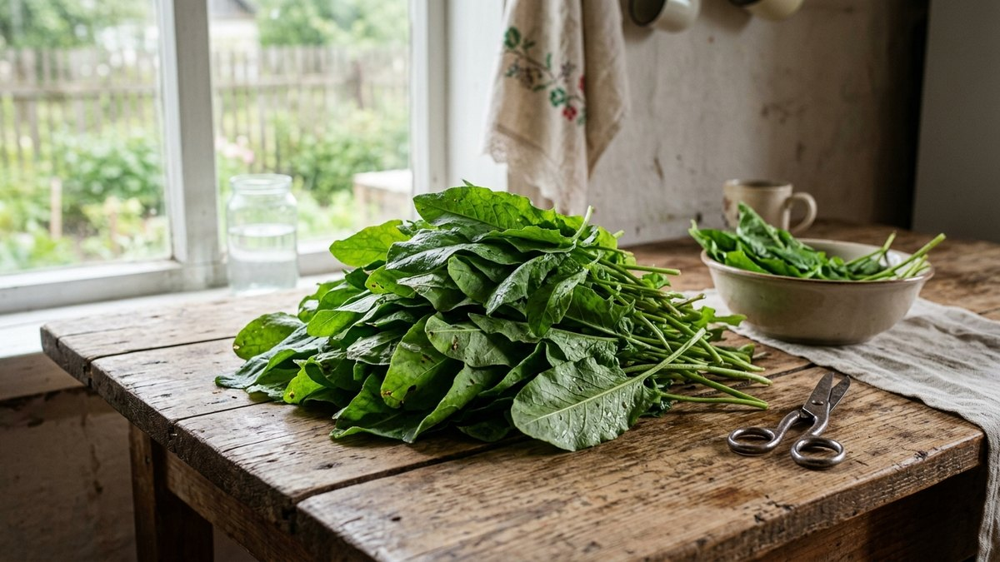
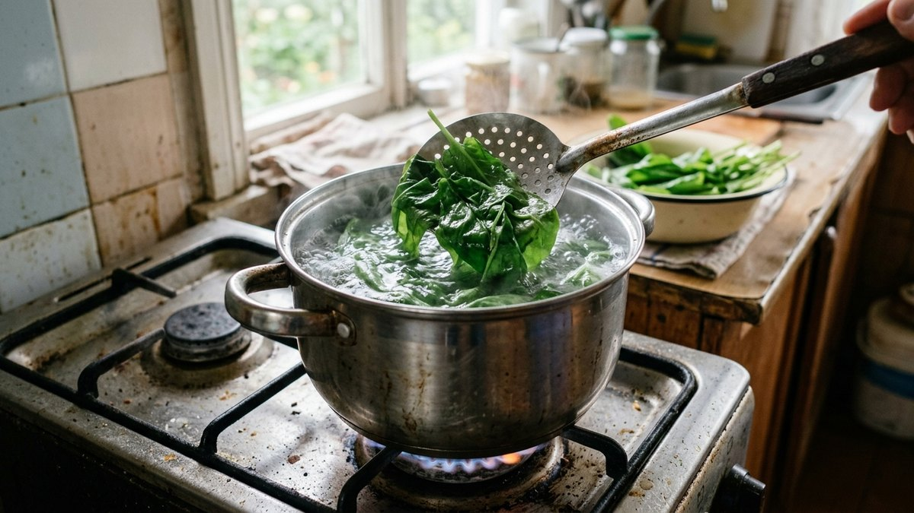
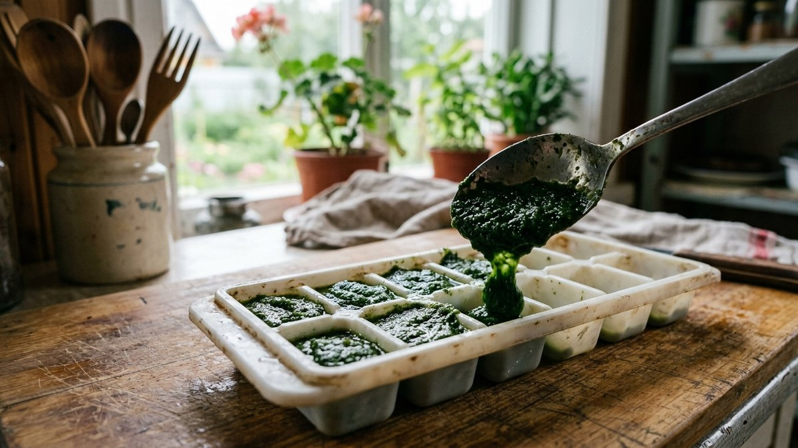
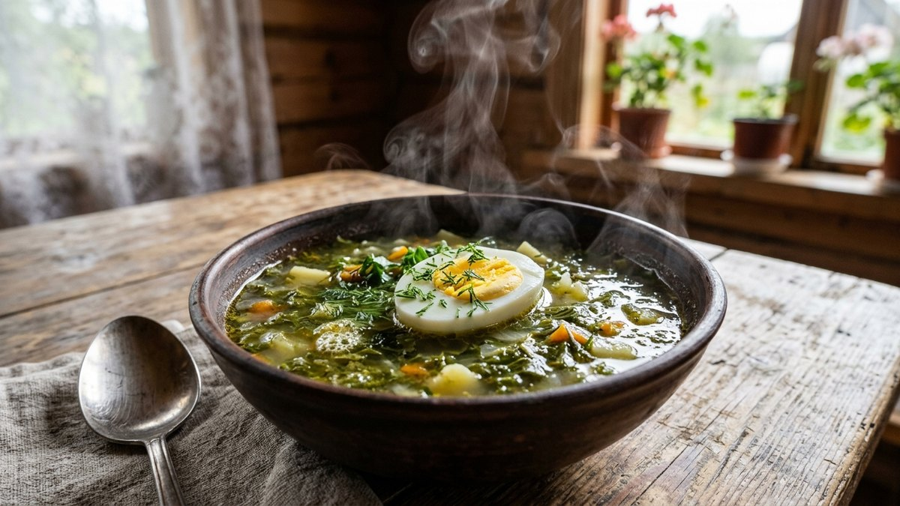
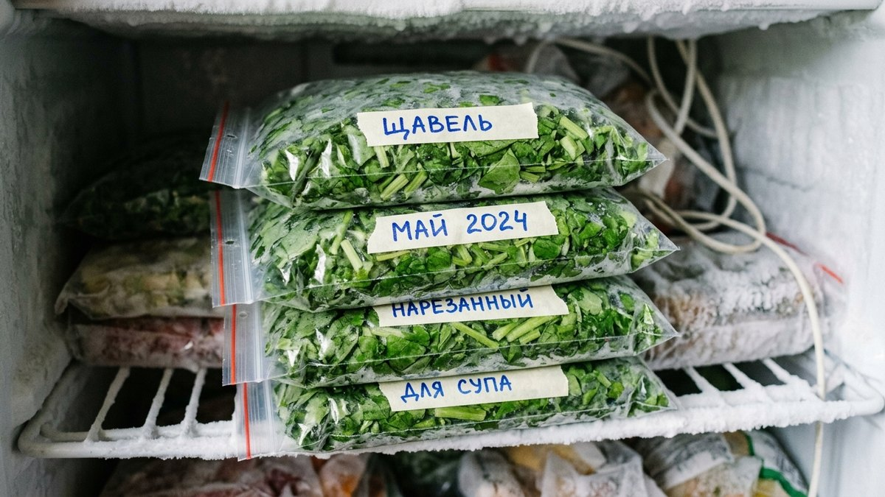
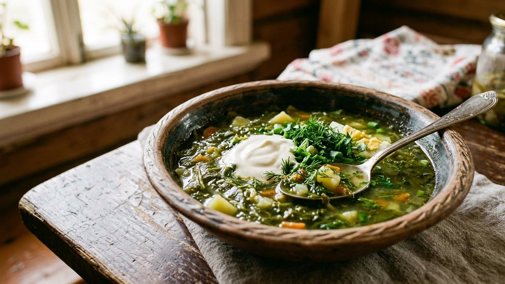

# Как заморозить щавель на зиму: чтобы не потемнел и не потерял вкус

Щавель — одна из самых удобных зеленей для заморозки: не размокает и не
превращается в кашу, как многие другие листовые. Но кислота в его листьях
даёт свой нюанс — без правильной подготовки щавель темнеет на срезе и
теряет часть яркого цвета уже в морозилке, хотя вкус для супа это почти не
портит. Разберём, бланшировать щавель перед заморозкой или нет, и как
разложить его порциями, удобными для зелёных щей зимой.

## Подготовка

Щавель перебирают, удаляя пожелтевшие и повреждённые листья, обрывают
грубые части черешков — в заморозку идут только листья и нежные части
стебля. Моют в нескольких водах, чтобы смыть песок, который на щавеле
часто прячется в прожилках, и обязательно тщательно обсушивают: лишняя
влага при заморозке смерзается в общий ледяной ком, а не остаётся рассыпчатой.

## Бланшировать или нет

- **Без бланшировки (сырая заморозка).** Быстрее и сохраняет больше
  витамина С, но после разморозки щавель заметнее темнеет — на вкус супа
  это не влияет, но цвет получается более тусклым.
- **С бланшировкой.** Щавель на 30–60 секунд опускают в кипяток, затем сразу
  в ледяную воду, чтобы остановить нагрев, и обсушивают. Цвет после
  разморозки ярче и ближе к свежему, кислотность чуть смягчается. Более
  трудоёмкий способ, но лучше подходит, если варите щи не только на вкус, но
  и на вид — для наваристого зелёного супа разница заметна.

Общий принцип, что из зелени и овощей вообще стоит бланшировать перед
заморозкой, а что нет, разобран в статье [что заморозить на
зиму: полный гид](https://mir-doma.pro/chto-zamorozit-na-zimu/).

## Способ 1: целыми или крупно нарезанными листьями

Подготовленный щавель (бланшированный или сырой) раскладывают по пакетам
с зип-замком, выпускают воздух и разравнивают тонким слоем — так проще
отламывать нужную порцию, не размораживая весь пакет целиком.

## Способ 2: пюре в формочках для льда

Бланшированный щавель измельчить блендером до пюре, разложить по формочкам
для льда и заморозить, затем переложить кубики в пакет для компактного
хранения. Удобно тем, что порция уже готова закладке в бульон без
досмотра и лишней нарезки.

## Способ 3: с небольшим количеством воды или масла

Щавель мелко нарезать, плотно уложить в формочки, залить небольшим
количеством воды или растительного масла и заморозить — масляная версия
удобна как заправка сразу в сковороду при обжарке лука для щей.

## Тара и сроки хранения

Плотные пакеты с зип-замком или жёсткие контейнеры с крышкой, каждая
порция подписана датой и способом заготовки (сырой или бланшированный) —
зимой в морозилке всё выглядит одинаково. Хранится замороженный щавель
около 8–10 месяцев при стабильной температуре без частых оттаиваний.

## Как использовать после разморозки

Щавель не размораживают заранее — закладывают прямо замороженным в
кипящий бульон за 3–5 минут до готовности супа, он расходится сам от
температуры. Для начинки в пироги или к рыбе тоже подходит без
предварительной разморозки, просто добавляют чуть больше времени
готовки.

## Частые ошибки

- **Заморозка невысушенного щавеля.** Листья смерзаются в плотный ком,
  из которого потом неудобно отламывать порцию.
- **Долгая бланшировка.** Больше минуты в кипятке — и щавель теряет и цвет,
  и часть той самой кислинки, ради которой его добавляют в щи.
- **Хранение в неплотно закрытом пакете.** Щавель быстро впитывает
  посторонние запахи морозилки и подсыхает по краям (морозный ожог).
- **Повторная заморозка после разморозки.** Текстура становится совсем
  водянистой, а часть вкуса теряется безвозвратно.

## Частые вопросы

### Нужно ли бланшировать щавель перед заморозкой

Не обязательно — щавель можно замораживать и сырым, вкус супа от этого не
меняется. Бланшировка даёт более яркий цвет после разморозки, но требует
дополнительного шага и чуть смягчает характерную кислинку.

### Почему щавель темнеет после заморозки

Кислота в листьях щавеля вступает в реакцию с воздухом при контакте с
металлом или долгом хранении на срезе — потемнение не портит вкус и
безопасно, просто меняет внешний вид зелени.

### Сколько хранится замороженный щавель

Около 8–10 месяцев при стабильной температуре в морозилке без частых
оттаиваний и повторных заморозок.

### Можно ли замораживать щавель вместе со шпинатом

Можно, если планируете использовать смесь именно вместе — но раздельная
заморозка удобнее: щавель даёт заметную кислинку, а шпинат — нет, и порцию
проще дозировать по вкусу супа, когда зелень заморожена отдельно.

