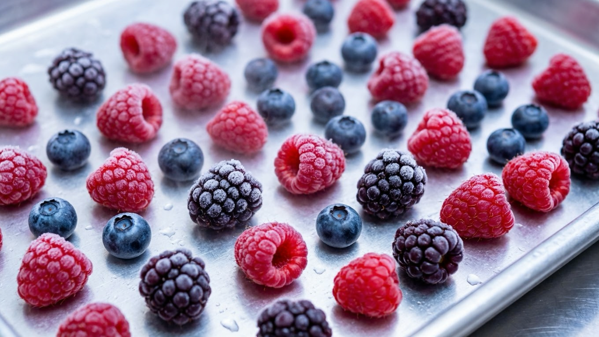
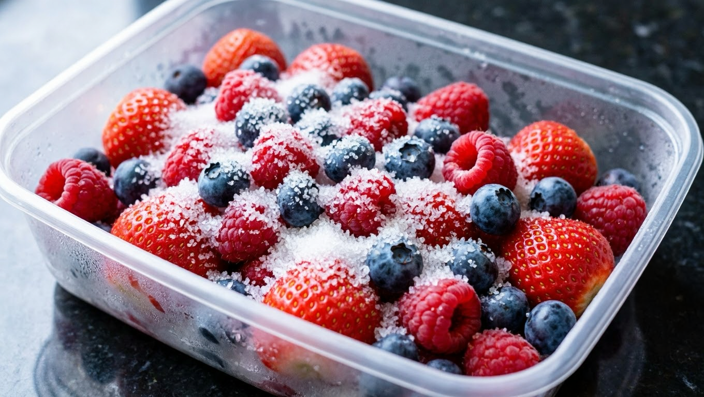
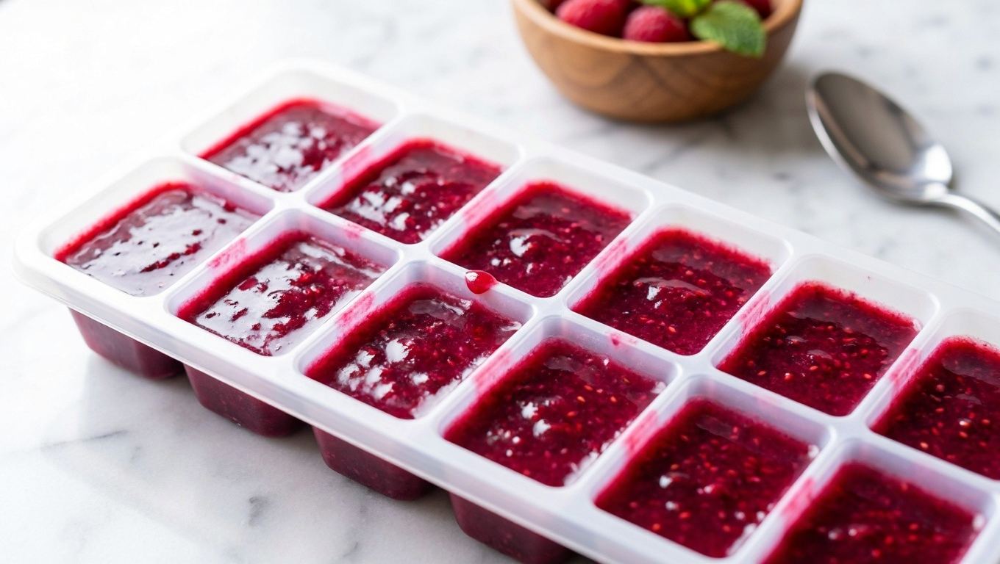
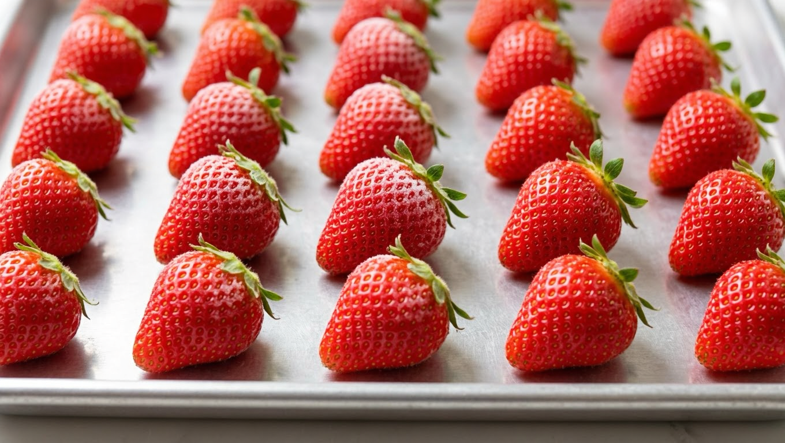
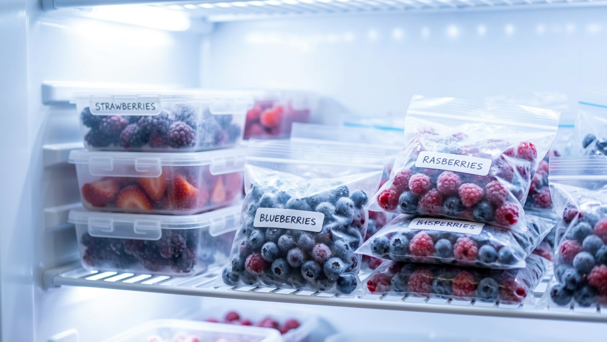

Заморозка — лучший способ сохранить ягоды: в отличие от варенья, в них остаются и витамины, и настоящий вкус, а сахар не нужен вовсе. Но у многих ягоды после морозилки превращаются в бесформенную кашу, и виновата обычно не техника, а пара нарушенных правил. Разберём, как заморозить ягоды на зиму правильно: мыть или нет, как сохранить форму, какие есть способы и что подходит для каждой ягоды.

## 🍓 Подготовка: мыть или не мыть

Главный спорный вопрос. Ответ зависит от ягоды:

- **Плотные ягоды** (смородина, крыжовник, вишня, черника) — можно и нужно мыть, но обязательно **тщательно обсушить** на полотенце. Оставшаяся вода превратится в лёд и склеит ягоды в комок.
- **Нежные ягоды** (малина, ежевика, земляника) — **лучше не мыть вообще**: они впитывают воду, раскисают и теряют форму. Если ягоды с собственного участка и чистые, их просто перебирают.
- Если малину всё же нужно вымыть — делают это очень быстро, в холодной воде, и сушат, разложив в один слой.

Перед заморозкой ягоды перебирают, убирают мятые и подпорченные, обрывают плодоножки и веточки. Мокрые ягоды — главная причина слипшегося кома в пакете.

## ❄️ Способ 1: россыпью (сухая заморозка)

Классика, при которой ягоды остаются отдельными и держат форму:

1. Разложить сухие ягоды **в один слой** на плоском поддоне, разносе или доске, застеленной плёнкой или пергаментом.
2. Поставить в морозилку на несколько часов (до полного промерзания).
3. Пересыпать замороженные ягоды в пакет или контейнер и вернуть в морозилку.

Смысл предварительной заморозки в один слой — ягоды **не склеиваются** между собой, и потом можно отсыпать хоть горсть. Если ссыпать свежие ягоды сразу в пакет, они смёрзнутся единым комом.

## 🍬 Способ 2: с сахаром

Подходит для кислых и нежных ягод, а также если планируете использовать их для десертов:

- ягоды укладывают в контейнер **слоями, пересыпая сахаром** (примерно 200–300 г сахара на 1 кг ягод);
- или смешивают с сахаром и раскладывают по контейнерам.

Сахар вытягивает сок, ягоды дают сироп и после разморозки получаются как готовая начинка или добавка к каше и мороженому. Форму они держат хуже, чем при сухой заморозке, зато вкус ярче.

## 🥣 Способ 3: пюре

Отличный вариант для мятых, переспевших или очень нежных ягод, которые целиком заморозить не выйдет:

- ягоды пробить блендером или протереть через сито (по желанию с сахаром);
- разлить по контейнерам, стаканчикам или силиконовым формам;
- удобно морозить **порционно** — в формах для льда: потом легко достать нужное количество.

Такое пюре зимой идёт в морсы, смузи, соусы и начинку для выпечки.

## 🫐 По каждой ягоде

- **Клубника и земляника** — мыть быстро и обязательно обсушить, оборвать чашелистики. Крупные ягоды можно разрезать. Лучше морозить россыпью; для десертов — с сахаром.
- **Малина и ежевика** — самые нежные, **не мыть**, морозить только россыпью в один слой, аккуратно ссыпать в контейнер (в пакете помнутся).
- **Смородина** (чёрная, красная) — плотная, легко переносит заморозку россыпью, мыть и сушить можно смело. Красная хороша и в виде пюре.
- **Вишня и черешня** — с косточкой ароматнее, без косточки удобнее и хранится дольше. Морозить россыпью.
- **Черника, голубика** — держат форму отлично, морозятся россыпью без проблем.
- **Крыжовник** — плотный, морозится легко; для компота можно целиком.
- **Виноград** — снять с гроздей, морозить россыпью.

Клубнику и малину лучше держать в **жёстких контейнерах**, а не в пакетах: под весом других продуктов они сминаются.

## 📦 Тара, сроки и хранение

- **Тара:** контейнеры с крышкой (для нежных ягод) или плотные пакеты с зип-замком. Из пакетов выпускают воздух — он сушит ягоды и даёт «морозный ожог».
- **Порции:** фасуйте сразу на один раз — повторно замораживать ягоды нельзя.
- **Подпишите** дату и вид ягоды: зимой в морозилке всё выглядит одинаково.
- **Срок хранения:** около 8–12 месяцев при стабильной температуре.
- **Температура:** чем ниже и стабильнее, тем лучше сохраняются вкус и структура; частые оттаивания губительны.

## 🍨 Как размораживать и использовать

- **Для компота, морса, выпечки, смузи** — размораживать не нужно: ягоды кладут прямо замороженными, так они не потеряют сок и форму.
- **Для десертов и украшения** — размораживать медленно, в холодильнике, тогда ягоды меньше текут.
- **Не размораживать в тёплой воде и микроволновке** — получится каша.
- **Повторно замораживать нельзя** — ягоды теряют и вкус, и структуру.

Зимой из замороженных ягод отлично получаются [компот](https://mir-doma.pro/kompot-na-zimu/) и [варенье](https://mir-doma.pro/varene-na-zimu/) — их варят прямо из морозилки, порциями.

## ❌ Частые ошибки

- **Заморозили мокрые ягоды** — смёрзлись в один ком.
- **Помыли малину и землянику** — раскисли и потеряли форму.
- **Ссыпали сразу в пакет** без предварительной заморозки россыпью — слиплись.
- **Нежные ягоды в мягком пакете** — смялись под другими продуктами.
- **Большая порция на всю зиму** — придётся размораживать целиком, а повторно замораживать нельзя.
- **Не выпустили воздух из пакета** — «морозный ожог» и потеря вкуса.

## ❓ Частые вопросы

**Нужно ли мыть ягоды перед заморозкой?**
Плотные (смородину, вишню, чернику, крыжовник) моют и тщательно обсушивают. Нежные (малину, ежевику, землянику) лучше не мыть — они впитывают воду и раскисают, теряя форму.

**Как заморозить ягоды, чтобы они не слиплись?**
Разложить сухие ягоды в один слой на поддоне, подморозить несколько часов, а уже потом ссыпать в пакет или контейнер. Если ссыпать свежие ягоды сразу, они смёрзнутся комом.

**Как заморозить клубнику, чтобы она не превратилась в кашу?**
Быстро вымыть, тщательно обсушить, оборвать чашелистики и заморозить россыпью в один слой. Хранить в жёстком контейнере, а не в пакете, и размораживать медленно в холодильнике.

**Можно ли замораживать ягоды с сахаром?**
Да, кислые и нежные ягоды часто морозят слоями с сахаром (200–300 г на 1 кг) — получается готовая десертная заготовка. Форму они держат хуже, но вкус ярче.

**Сколько хранятся замороженные ягоды?**
Около 8–12 месяцев при стабильной температуре в морозилке. Главное — не допускать оттаиваний и не замораживать повторно.

**Надо ли размораживать ягоды перед варкой компота?**
Нет, для компота, морса и выпечки их кладут прямо замороженными — так они сохраняют сок и не расползаются.

**Можно ли заморозить ягоды повторно?**
Нет. После повторной заморозки ягоды теряют вкус и структуру и становятся водянистой кашей, поэтому их сразу фасуют порциями на один раз.

---

Заморозка ягод — самый простой способ сохранить лето: без сахара, варки и банок. Запомните три правила — сухие ягоды, заморозка россыпью в один слой и порционная фасовка — и зимой у вас будут ягоды, которые выглядят и пахнут как свежие. Что ещё стоит отправить в морозилку, собрано в статье [что заморозить на зиму](https://mir-doma.pro/chto-zamorozit-na-zimu/), а из ягод помимо заморозки получаются отличные [варенье из смородины](https://mir-doma.pro/varene-iz-smorodiny/) и [компот](https://mir-doma.pro/kompot-na-zimu/).
