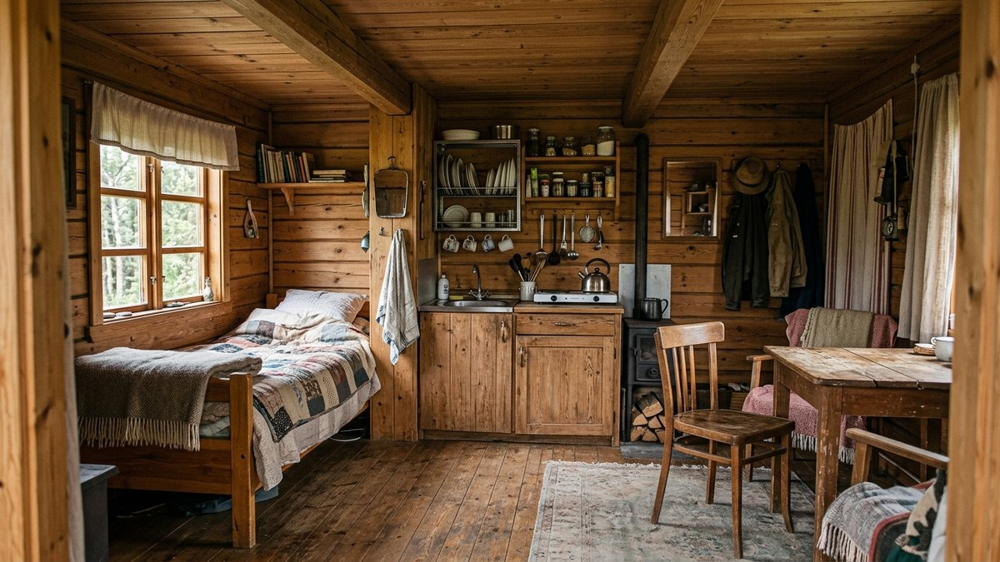
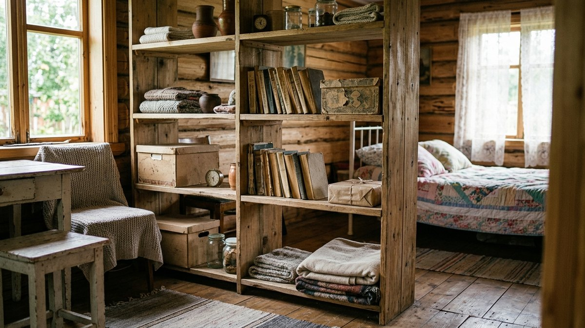
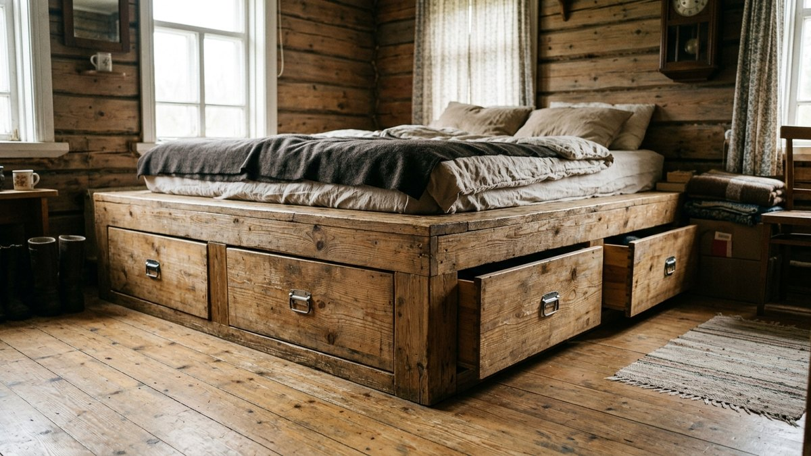
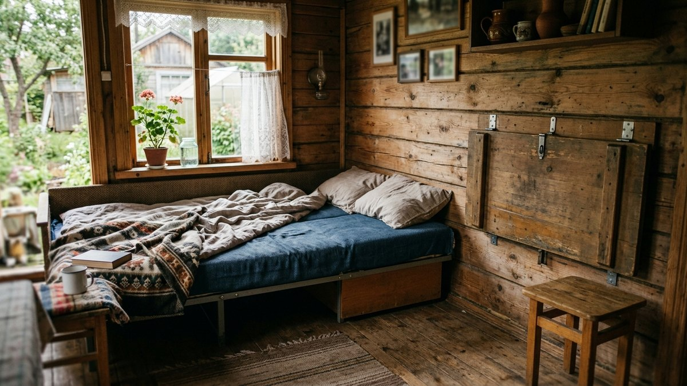
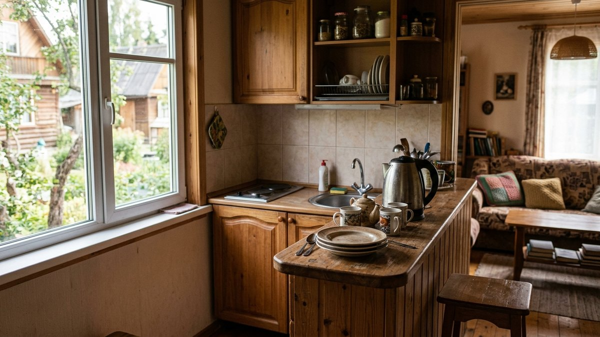
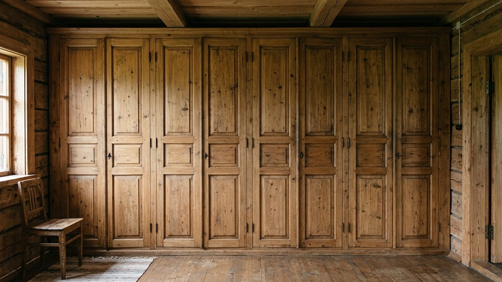

Дачный домик на 20–30 м² часто должен вместить спальню, кухонный уголок, место для отдыха и хранение вещей — и всё это без капитальной перепланировки. Разберём, как разбить одно помещение на функциональные зоны без потери площади: какие перегородки не крадут метры, куда девать спальное место и какая мебель экономит больше всего пространства.

## С чего начать: сколько функций нужно совместить

Прежде чем расставлять мебель, честно перечислите зоны, которые реально нужны:

- **Сон** — кровать или раскладной диван, обязательно с местом для белья под ней.
- **Кухня** — плита или мангал, стол, минимум хранения для посуды.
- **Отдых** — место, где сидеть вечером, необязательно диван — подойдёт пара кресел.
- **Работа или хранение инвентаря** — рабочий стол, полки под инструмент, если домик используется и для дачных дел.

На 20–30 м² уместить все четыре зоны как отдельные комнаты не получится — вместо этого зоны накладываются друг на друга или разносятся по высоте (см. ниже). Начинайте план с самой требовательной по площади зоны — обычно это спальная, — а остальные достраивайте вокруг неё. Если домик ещё меньше — 15–20 м² без отдельной кухонной зоны, — там работают немного другие приёмы, разобранные в статье про [интерьер в бытовке на даче](https://mir-doma.pro/interer-v-bytovke-na-dache/).

## Перегородки, которые не крадут площадь

Глухая капитальная перегородка в маленьком домике почти всегда ошибка: она блокирует свет и режет и без того тесное пространство на две ещё более тесные части. Работают решения, которые разделяют зону, но не перекрывают её полностью:

- **Стеллаж без задней стенки**, не доходящий до потолка — разделяет пространство и одновременно служит хранением с двух сторон.
- **Раздвижная перегородка** (дверь-купе или ширма на треке) — открывается полностью, когда нужно объединить пространство для гостей, и закрывается на ночь.
- **Штора на потолочном карнизе** — самый дешёвый и обратимый вариант, подходит для спальной зоны в углу.
- **Барная стойка или высокий стол** — разграничивает кухню и зону отдыха, не блокируя обзор и свет.

## Второй уровень: спальное место наверху

Если высота потолка позволяет (от 2,8 м), спальное место выносят на подиум или антресоль под потолком — классическое решение для маленьких домов, которое освобождает весь пол под другие зоны.

- **Подиум** высотой 40–50 см — спальное место поднимается над полом, а под ним размещаются выдвижные ящики для хранения или встроенный диван.
- **Антресоль (спальный чердак)** — полноценный второй уровень над кухней или прихожей, где потолок ниже; лестницу делают приставной или встроенной с ящиками-ступенями.

Второй уровень требует расчёта нагрузки на перекрытие и обычно закладывается ещё на этапе строительства каркаса — если домик уже готов, вариант с подиумом переделать проще, чем полноценную антресоль.

## Мебель-трансформер экономит больше всего места

| Предмет | Что экономит |
|---|---|
| Диван-кровать | Убирает отдельную спальную зону днём, освобождая пол под гостиную |
| Раскладной или откидной стол | Складывается к стене, когда обеденная зона не используется |
| Кровать-шкаф (мурфи) | Полностью убирает кровать в нишу днём, освобождая всю площадь пола |
| Встроенные шкафы до потолка | Используют высоту вместо площади пола под хранение |
| Табуреты, вставленные под стол | Не занимают отдельное место, когда не нужны |

Мебель-трансформер стоит дороже обычной, но именно она чаще всего решает проблему совмещения зон без перепланировки — особенно кровать-трансформер, которая одна освобождает больше всего пола. Ещё один способ снять нагрузку с внутренней площади — вынести зону отдыха наружу, на застеклённую [веранду](https://mir-doma.pro/letnyaya-veranda-na-dache/): тогда внутри домика остаются только сон и кухня.

## Кухонная зона в общем пространстве

Кухонный уголок в маленьком домике обычно ставят у окна (для естественной вентиляции и света) или у входной двери (проще вывести вытяжку наружу). Если готовите на газовой плите или мангале, кухонную зону желательно отделить от спальной хотя бы стеллажом или барной стойкой — запахи и жар от готовки иначе доходят до спального места. Планировку летней кухни отдельно от домика разбирали в статье про [интерьер летней кухни на даче](https://mir-doma.pro/interer-letney-kuhni-na-dache/) — это решение снимает вопрос зонирования вовсе, вынося готовку за пределы жилой зоны.

## Частые ошибки

- **Ставить глухую перегородку через всю комнату.** Она блокирует единственное окно и превращает маленький домик в два ещё более тесных помещения.
- **Экономить на стеллаже-разделителе и брать шкаф с задней стенкой.** Глухой шкаф работает как та же капитальная перегородка — блокирует свет и визуально режет пространство.
- **Забывать про нагрузку на пол при подиуме.** Ящики для хранения под подиумом должны выдерживать вес спального места плюс людей — конструкцию считают, а не собирают на глаз.
- **Совмещать кухню и спальную зону без разделителя.** Запах готовки и конденсат от плиты быстро делают спальную зону некомфортной.

## Частые вопросы

### Как разделить одну комнату на зону сна и зону отдыха в маленьком домике

Проще всего — стеллажом без задней стенки или раздвижной шторой на карнизе: оба варианта разделяют пространство визуально и физически, но не блокируют свет и легко убираются, когда нужно объединить пространство.

### Стоит ли делать антресоль в дачном домике

Стоит, если высота потолка от 2,8 м и домик используется постоянно, а не пару выездов летом — тогда антресоль под спальню окупает себя, освобождая весь первый этаж. Для домика, где бывают редко, чаще достаточно подиума или дивана-кровати.

### Какая мебель лучше всего экономит место в маленьком домике

Кровать-трансформер (мурфи) или диван-кровать освобождают больше всего площади, потому что убирают спальное место полностью на день. На втором месте — встроенные шкафы до потолка, использующие высоту вместо площади пола.

### Как отделить кухонную зону от жилой в одной комнате

Барной стойкой, высоким стеллажом или стойкой с подвесными полками — они разделяют зоны визуально и частично физически, не перекрывая свет и не занимая много места, в отличие от полноценной стены.

### Нужно ли согласовывать антресоль или подиум при строительстве домика

Капитальная антресоль как часть несущей конструкции закладывается в проект и требует расчёта нагрузки, как и любое дополнительное перекрытие. Съёмный подиум высотой до полуметра — это мебель, а не конструкция, согласования не требует.

## Заключение

Зонирование маленького дачного домика решается не капитальными стенами, а разделителями, которые не блокируют свет: стеллажами, раздвижными перегородками, вторым уровнем под спальню и мебелью-трансформером. Комбинация этих решений позволяет уместить сон, кухню и отдых на 20–30 м² без ощущения тесноты.
