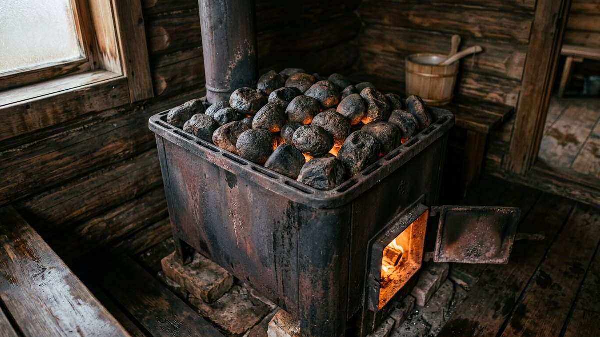
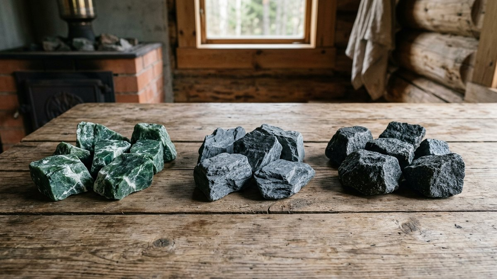
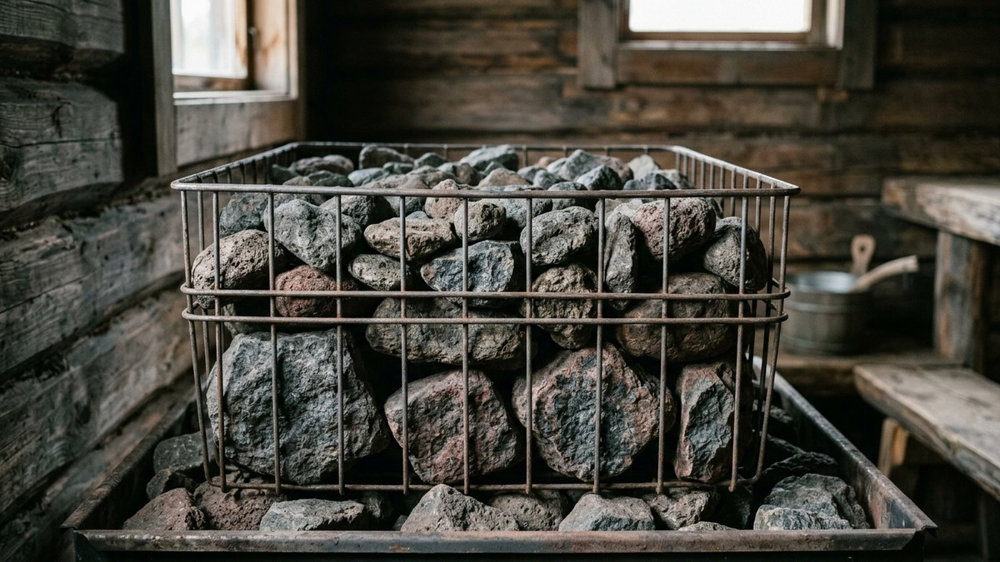
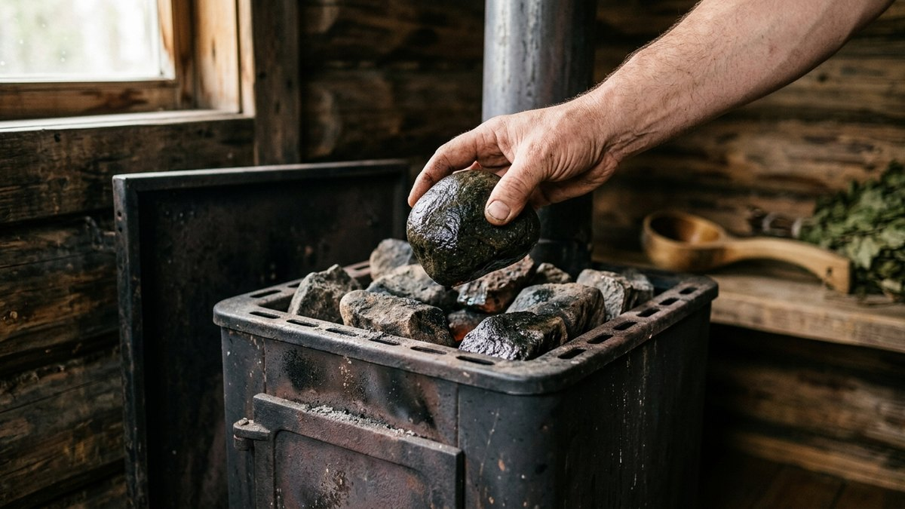
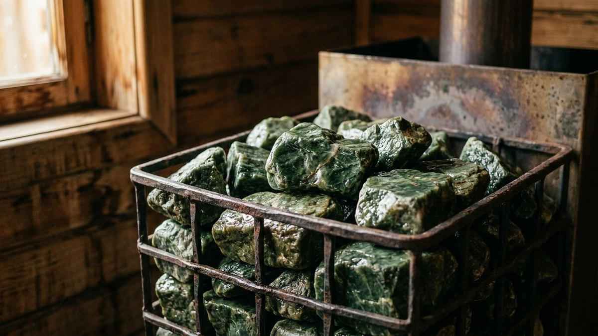
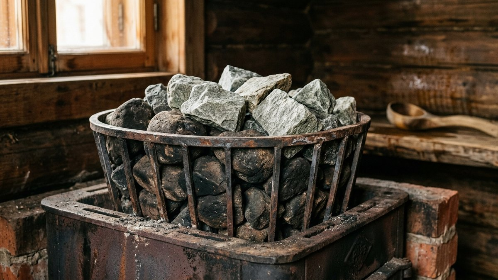

Печь куплена, дымоход выведен, а на полке в магазине — шесть разных видов
камней с разбросом цены в пять раз: от 40 рублей до 200 рублей за килограмм.
Разница не только в цене. Одни камни держат жар и дают мягкий пар час за
часом, другие трескаются от первого же ковша воды. Разбираем, чем жадеит
отличается от талькохлорита и обычного колотого булыжника, сколько камней
нужно на конкретную каменку и как часто их менять.

## Зачем вообще разбираться в видах камней

Задача камня в каменке — накопить тепло от печи и медленно отдавать его
при подаче воды, превращая её в мягкий, а не обжигающий пар. От породы
камня зависит три вещи: как долго он держит температуру, как быстро
трескается от перепада при поддавании воды и какой запах даёт при
нагреве — некоторые породы содержат примеси, которые при 300–400°C начинают
пахнуть при контакте с водой.

Дешёвый колотый булыжник с ближайшего карьера тоже можно использовать, но
служит он в 3–4 раза меньше специализированного камня и требует замены
каждый сезон вместо одного раза в 3–5 лет.

Камни нужны и в дровяную, и в электрическую каменку — если печь ещё не
выбрана, сравнение обоих вариантов по паре, деньгам и монтажу — в статье
[«Дровяная или электрическая печь для бани»](https://mir-doma.pro/drovyanaya-ili-elektricheskaya-pech-dlya-bani/).

Пар от камней — только половина банного ритуала, вторая половина — веник:
когда его заготавливать, как вязать и запаривать, разобрано в статье
[«Веники для бани»](https://mir-doma.pro/veniki-dlya-bani-kak-vyazat/).

## Сравнение видов камней для каменки

| Порода | Теплоёмкость | Стойкость к растрескиванию | Цена за кг | Срок службы |
|---|---|---|---|---|
| Жадеит | Высокая | Очень высокая | 150–250 ₽ | 5–7 лет |
| Талькохлорит (стеатит) | Очень высокая | Высокая | 120–200 ₽ | 4–6 лет |
| Дунит | Высокая | Высокая | 80–130 ₽ | 3–5 лет |
| Габбро-диабаз | Средняя | Средняя | 40–70 ₽ | 1–2 года |
| Кварцит малиновый | Средняя, декоративный эффект | Средняя | 60–100 ₽ | 2–3 года |
| Обычный колотый булыжник (гранит, базальт) | Низкая | Низкая | 15–30 ₽ | до 1 сезона |

### Жадеит

Самый дорогой, но и самый долговечный вариант. Плотный, почти не
растрескивается даже при резкой подаче холодной воды на раскалённые камни,
хорошо держит тепло 40–60 минут после протопки. Оптимален для верхнего
слоя засыпки, куда попадает вода при поддавании пара.

### Талькохлорит

Чуть дешевле жадеита, при этом теплоёмкость выше — талькохлорит способен
накопить больше тепловой энергии на килограмм массы. Из минуса — чуть более
мягкий на распил, из-за чего его чаще делают в форме шаров или ровных
блоков, а не колотым.

### Дунит

Средний по цене и характеристикам вариант, разумный компромисс для тех,
кому жадеит не по бюджету. Держит температуру немного хуже, но
растрескивание тоже редкое при аккуратном использовании.

### Габбро-диабаз

Бюджетный, доступен почти в любом строительном магазине. Годится для
нижнего слоя засыпки, который прогревается, но прямого контакта с водой
почти не получает — так камень служит дольше, а верхний более дорогой слой
берёт на себя парообразование.

### Кварцит малиновый

Декоративная порода с характерным цветом, часто используется как верхний
видимый слой в открытых каменках. По характеристикам средний, ближе к
габбро-диабазу, переплата идёт за внешний вид.

### Колотый булыжник без сортировки

Смесь случайных пород без проверки на трещины и включения — самый дешёвый,
но и самый недолговечный вариант. При нагреве отдельные камни могут
расколоться со звуком выстрела и разлететься осколками — для закрытой
каменки это не критично, но для открытой представляет реальную опасность.

## Сколько камней нужно на каменку

Объём засыпки считается по мощности печи, а не на глаз:

- **До 8 кВт (печь на маленькую парилку до 8 м³)** — 15–20 кг камней.
- **8–12 кВт** — 20–35 кг.
- **12–18 кВт** — 35–50 кг.
- **От 18 кВт (большая парилка, коммерческая баня)** — от 50 кг, часто с
  разделением на два слоя разных пород.

Точный объём каменки для вашей модели печи обычно указан в паспорте —
недогруз ухудшает теплоотдачу и качество пара, перегруз создаёт лишнюю
нагрузку на колосники и корпус печи. Если паспорта под рукой нет, точную
массу по площади и высоте парной с учётом типа каменки (открытая или
закрытая) считает калькулятор в статье
[печь для бани из металла](https://mir-doma.pro/pech-dlya-bani-iz-metalla/) —
таблица выше нужна не вместо него, а чтобы прикинуть заранее, до расчёта.
Мощность печи, в свою очередь, подбирается под объём самой парилки — как
его посчитать по срубу, разобрано в статье
[баня из бруса своими руками](https://mir-doma.pro/banya-iz-brusa-svoimi-rukami/). Если печь ещё не выбрана, конструкция
топки и материал корпуса напрямую влияют на то, сколько камня она способна
держать — сравнение разобрано в статье
[печь для бани из металла](https://mir-doma.pro/pech-dlya-bani-iz-metalla/).

## Как правильно укладывать камни

1. **Промыть.** Даже покупные камни из магазина промываются от каменной
   пыли — она оседает на раскалённой печи и даёт неприятный запах гари при
   первой протопке.
2. **Проверить на трещины.** Каждый камень простукивается — глухой звук
   без дребезжания говорит о наличии внутренней трещины, такой камень
   в засыпку не идёт.
3. **Уложить по размеру.** Крупные камни — вниз, ближе к топке, чтобы не
   перекрывать тягу и доступ жара к колосникам. Мелкие и средние — сверху,
   именно они первыми получают воду при поддавании.
4. **Оставить зазоры.** Камни не трамбуются плотно — между ними должны
   оставаться зазоры для свободной циркуляции горячего воздуха, иначе печь
   работает на прогрев с перекосом и часть камней остаётся холодной.
5. **Не мешать со сколами кирпича или бетона.** Строительные материалы не
   рассчитаны на такой нагрев и разрушаются, засоряя каменку крошкой.

## Когда менять камни

Признаки, что пора менять засыпку целиком или частично:

- на камнях появился белёсый налёт — соли, которые не смылись водой и
  забивают поры, снижая теплоотдачу;
- при простукивании звук стал глуше — микротрещины накопились по всему
  объёму;
- камни визуально потрескались или раскололись больше чем на треть от
  исходного объёма;
- пар стал резче, суше и менее приятным без изменений в подаче воды —
  верный признак, что порода выработала ресурс.

Дешёвый булыжник обычно нуждается в частичной замене уже через сезон,
жадеит и талькохлорит — раз в 4–7 лет при аккуратной эксплуатации. Если же
вместе с камнями меняете и полки́ в парилке — оба ресурса стоит обновлять
не по расписанию, а по факту износа, разбор материалов для полка́ есть в
статье [лавки и полки в бане своими руками](https://mir-doma.pro/lavki-v-bane-svoimi-rukami/).

## Частые ошибки

- **Смешивание случайных пород без разбора.** Разные камни трескаются с
  разной скоростью, и по мере разрушения слабой породы вся засыпка теряет
  равномерность прогрева.
- **Игнорирование паспортного объёма печи.** Недогруз каменки уменьшает
  теплоотдачу и качество пара сильнее, чем экономия на цене камня оправдывает.
- **Плотная трамбовка камней друг к другу.** Без зазоров для воздуха печь
  прогревает засыпку неравномерно, а верхние камни остаются холодными.
- **Использование колотого камня без предварительной проверки на трещины.**
  Один камень с трещиной может расколоться с разлётом осколков при первой
  подаче воды.
- **Полная замена только при полном разрушении.** Частичную замену верхнего,
  самого нагруженного слоя стоит делать раз в 1–2 года даже у дорогих пород
  — это дешевле, чем менять всю засыпку сразу.
- **Печь установлена без учёта притока воздуха для горения.** Каменка
  прогревается неравномерно, если печи не хватает тяги — правильная схема
  притока и вытяжки в парилке разобрана в статье
  [вентиляция в бане своими руками](https://mir-doma.pro/ventilyaciya-v-bane-svoimi-rukami/).

## Частые вопросы

### Какие камни лучше всего подходят для бани

Жадеит и талькохлорит — по совокупности теплоёмкости, стойкости к
растрескиванию и сроку службы. Разница между ними в цене и структуре, а не
в принципиальном качестве пара.

### Можно ли использовать обычные камни с реки или из карьера для каменки

Не рекомендуется. Речные камни могут содержать внутреннюю влагу и трещины,
которые при резком нагреве приводят к растрескиванию или взрывному
раскалыванию камня.

### Сколько кг камней нужно на печь мощностью 10 кВт

Для печи 8–12 кВт нужно 20–35 кг камней — точный объём уточняется по
паспорту конкретной модели, поскольку разные производители рассчитывают
каменку под разную геометрию топки.

### Как часто нужно менять камни в бане

Бюджетный колотый камень — ежесезонно или через сезон. Жадеит и
талькохлорит при аккуратной эксплуатации служат 4–7 лет, но верхний слой
стоит частично обновлять каждые 1–2 года.

### Почему камни в бане трескаются и лопаются

Чаще всего из-за резкого перепада температуры при подаче холодной воды на
сильно раскалённый камень, скрытых внутренних трещин, не выявленных при
покупке, или использования породы с низкой стойкостью к термоударам —
например, обычного гранитного булыжника без проверки.
