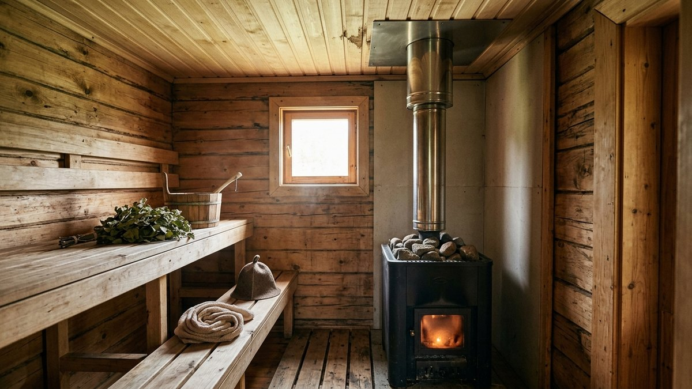
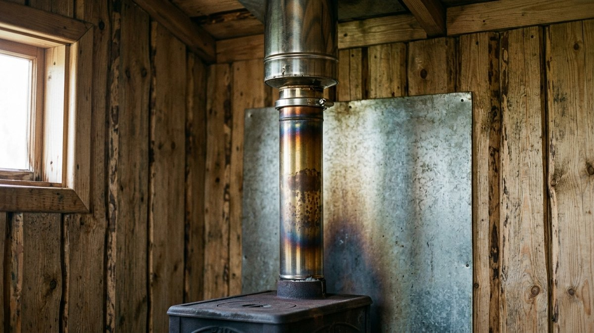
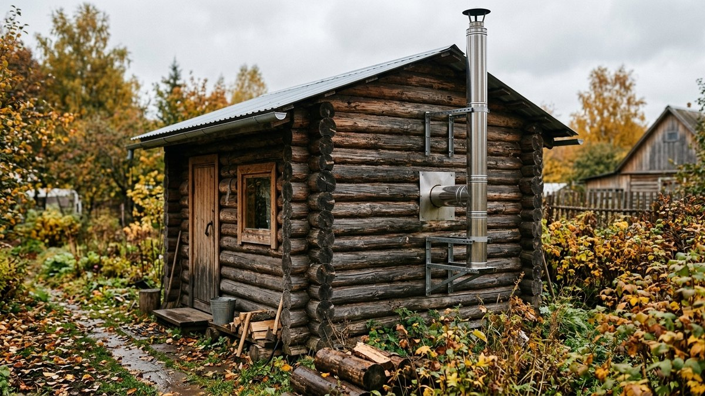
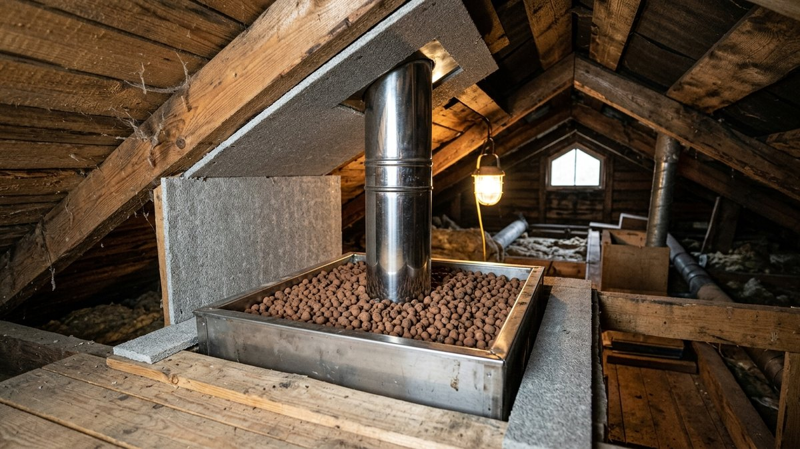
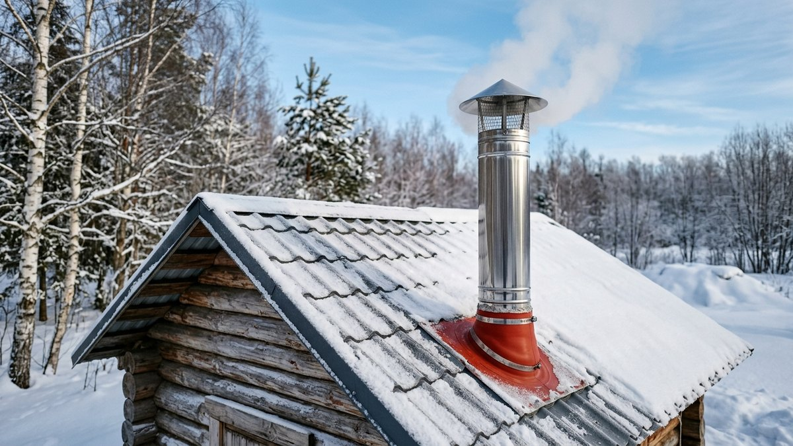
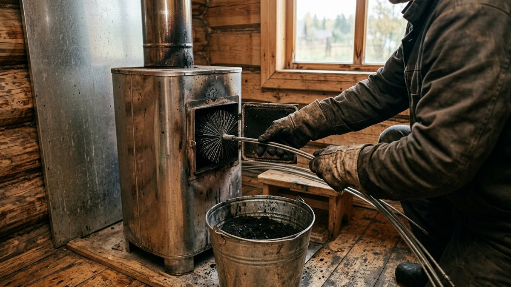

Какой дымоход лучше для бани, обычно решают в последний момент: печь
уже стоит, потолок зашит, и в строительном магазине берут ту трубу, что
подходит по диаметру. Через пару сезонов выясняется, что одностенная
труба на морозе течёт конденсатом с сажей, потолок вокруг неё темнеет,
а тяга пропадает при каждой оттепели. Банная печь отличается от домашней:
её топят быстро и жарко, температура дыма на выходе доходит до 600–700 °C,
а потом баня неделю стоит холодной. Ниже сравним материалы, разберём марки
стали, схему прохода через потолок и кровлю, а высоту трубы над крышей
посчитаем калькулятором по нормам пожарной безопасности.

## Чем дымоход бани отличается от дымохода дома

Дымоход дачного дома работает в ровном режиме: печь или котёл топят
часами, труба прогревается равномерно. В бане всё наоборот, и это
определяет выбор материала.

- **Резкий нагрев.** Печь бани разгоняют за 30–60 минут до максимума.
  Первый метр трубы над печью раскаляется докрасна, поэтому металл
  на этом участке нужен толще и жаростойкий.
- **Резкое остывание.** После парения баню оставляют, труба остывает
  до уличной температуры. На холодных стенках оседает влага из дыма,
  смешивается с сажей и стекает обратно — это конденсат, который
  разъедает дешёвую сталь и пачкает потолок.
- **Влажный воздух вокруг.** Труба проходит через парную, где
  влажность и температура выше, чем в любой комнате. Обычная
  оцинковка и чёрная сталь здесь ржавеют за пару лет.
- **Деревянные конструкции рядом.** Потолок, стропила и кровля бани
  почти всегда горючие, поэтому узлы прохода решают больше, чем
  материал самой трубы.

Если печь ещё не выбрана, начните с неё: от типа печи зависит диаметр
и температура дыма. В статье [дровяная или электрическая печь для бани](https://mir-doma.pro/drovyanaya-ili-elektricheskaya-pech-dlya-bani/)
есть сравнение по стоимости протопки, а у электрической каменки дымохода
нет вовсе — вопрос снимается сам.

## Сравнение материалов: что выбрать

| Дымоход | Цена | Плюсы | Минусы | Когда брать |
|---|---|---|---|---|
| Сэндвич из нержавейки (труба в трубе с базальтовой ватой) | средняя | мало конденсата, безопасен у дерева, собирается за день | нельзя ставить первым элементом на печь, утеплитель портится от перегрева | основной вариант для бани с металлической печью |
| Одностенная труба из нержавейки | низкая | дёшево, отдаёт тепло в парную, выдерживает высокую температуру | много конденсата на улице, опасна у горючих конструкций | только первый метр над печью и участок в парной |
| Комбинированный: моно над печью + сэндвич дальше | средняя | лучший баланс тепла и безопасности | нужен переходник «моно — сэндвич» правильной ориентации | рекомендуемая схема для большинства бань |
| Кирпичная труба | высокая | долговечна, держит тепло | тяжёлая, нужен свой фундамент, медленно прогревается, тяга появляется не сразу | для кирпичной печи |
| Керамический модульный дымоход | высокая | не боится конденсата и высоких температур, служит десятилетиями | дорогой, тяжёлый, монтаж сложнее | для капитальной бани, где печь стоит годами |
| Асбестоцементная труба | низкая | дёшево | растрескивается выше 300 °C, может разорваться | не брать для бани |
| Оцинковка и чёрная сталь | низкая | дёшево | быстро прогорает и ржавеет во влажной парной | не брать |

Для большинства бань с металлической печью ответ на вопрос «какой
дымоход лучше» короткий: **комбинированный**. Первый метр — одностенная
труба из жаростойкой нержавейки, дальше — сэндвич. Голый участок
в парной работает как дополнительный радиатор и быстрее прогревает
помещение, а сэндвич безопасно проходит через потолок и не даёт
конденсату образовываться на холодном чердаке и улице.

Сэндвич нельзя ставить прямо на патрубок печи. Внутренняя труба там
нагревается так сильно, что базальтовая вата внутри спекается
и теряет свойства, а наружный кожух темнеет. Производители сэндвичей
прямо пишут в инструкциях, что перед первым утеплённым элементом
нужна одностенная труба длиной около метра.

## Какая сталь нужна и какой толщины

Нержавейка бывает разной, и в бане разница заметна быстрее, чем дома.
Марку стали ищите на маркировке трубы или в паспорте, по внешнему виду
её не отличить.

| Марка (AISI) | Жаростойкость | Где ставить в бане |
|---|---|---|
| 430 | низкая, боится конденсата и высокой температуры | только наружный кожух сэндвича |
| 439 | средняя, с титаном, лучше держит конденсат | внутренняя труба сэндвича на удалении от печи |
| 304 | средняя, устойчива к коррозии | внутренняя труба сэндвича, бюджетный вариант |
| 316, 321 | высокая, рассчитаны на сильный нагрев | первая одностенная труба над печью и внутренняя труба сэндвича |

Толщина стали важнее марки на первом метре. Тонкая труба 0,5 мм
над банной печью прогорает за несколько сезонов, особенно если
печь регулярно разгоняют докрасна. Для первой трубы берите 0,8–1 мм,
для внутренней трубы сэндвича — от 0,5 мм. Наружный кожух
испытывает мало нагрузки, на нём экономить можно.

Утеплитель в сэндвиче — базальтовая вата толщиной 25–50 мм. Для
бани в средней полосе лучше 50 мм: дым дольше остаётся горячим,
конденсата меньше, а наружный кожух в местах прохода через
дерево остаётся тёплым, а не горячим.

## Диаметр трубы

Диаметр дымохода не выбирают, а **берут по патрубку печи**. Производитель
рассчитал его под объём топки, и любое сужение снижает тягу: дым
пойдёт в парную при открытой дверце. Расширять тоже не стоит: в слишком
широкой трубе дым остывает быстрее, конденсата больше.

Самые частые диаметры у банных печей — 115 и 120 мм по внутренней трубе.
Если печь сварена самостоятельно, как в инструкции про [печь для бани
из металла своими руками](https://mir-doma.pro/pech-dlya-bani-iz-metalla/),
патрубок обычно делают под стандартный диаметр 115 мм, чтобы купить
к нему готовые элементы сэндвича без переходников.

Переходник «одностенная труба — сэндвич» продаётся отдельно и
ставится по ходу дыма: верхний элемент вставляется внутрь нижнего,
чтобы конденсат стекал по трубе, а не просачивался в стык и в утеплитель.

## Через потолок или через стену

У бани есть две схемы вывода дымохода, и для печи в парной лучше первая.

**Через потолок и кровлю.** Труба идёт вертикально без поворотов.
Это лучшая тяга, минимум сажи, весь горячий участок остаётся внутри
и греет помещение. Сложность — два узла прохода (потолок и кровля),
каждый из которых нужно сделать правильно.

**Через стену.** Труба выходит горизонтально через тройник и поднимается
по фасаду. Кровлю не трогают, поэтому схема удобна для готовой бани
с хорошей крышей. Минусы: горизонтальный участок собирает сажу, по
улице труба остывает сильнее, нужен утеплённый сэндвич на всю наружную
высоту и крепления к стене. Горизонтальный участок по нормам — не
длиннее 1 м.

Если баню только проектируете, закладывайте проход через потолок:
печь ставится так, чтобы труба вышла между стропилами, а не упиралась
в балку перекрытия.

## Проход через потолок: как собрать узел

Место, где дымоход проходит через деревянный потолок, — главная
причина пожаров в банях. Узел собирают так, чтобы горячая труба
нигде не касалась дерева, а зазор был заполнен негорючим материалом.

1. **Определить точку прохода.** Опустите отвес с потолка на центр
   патрубка печи. Проверьте, что с отступом не попадаете в балку
   перекрытия или стропило. Если попадаете, ставьте печь в другое
   место — смещать трубу коленами хуже.
2. **Вырезать проём.** Размер проёма должен обеспечить отступ от
   трубы до дерева. Для сэндвича проём обычно 350×350–400×400 мм
   под стандартный потолочно-проходной узел (ППУ). Края проёма
   обрамляют брусом, чтобы потолок не провисал. Проём удобнее
   всего предусмотреть до подшивки — порядок работ и пирог
   потолка парилки описаны в статье про [потолок в бане](https://mir-doma.pro/potolok-v-bane-svoimi-rukami/).
3. **Защитить дерево.** Торцы проёма закрывают негорючей плитой
   (минерит, суперизол) или базальтовым картоном. Голую доску
   рядом с трубой оставлять нельзя.
4. **Установить ППУ.** Это короб из нержавейки с отверстием под
   трубу, который крепится к потолку снизу. Короб заполняют
   негорючим материалом: керамзитом, базальтовой ватой без связующего
   или вермикулитом. Полиэтилен, монтажную пену и обычную минвату
   с битумным связующим не используйте.
5. **Стык элементов — не в перекрытии.** Соединение двух секций
   сэндвича не должно попадать внутрь ППУ: стык там не проверить
   и не подтянуть хомутом. Подберите длины элементов так, чтобы
   сквозь потолок шла цельная труба.
6. **Закрыть узел сверху.** На чердаке короб засыпают до верха и
   закрывают крышкой или фартуком из нержавейки, чтобы засыпка
   не выдувалась.

Нормы пожарной безопасности (СП 7.13130) задают отступ от внутренней
поверхности дымового канала до горючих конструкций в перекрытии —
разделку: не менее 500 мм без защиты или 380 мм при защите дерева
негорючим материалом. Для заводских сэндвичей производитель указывает
своё допустимое расстояние в паспорте — ориентируйтесь на него, но
не меньше, чем требуется по нормам для вашей конструкции.

## Проход через кровлю и высота трубы

На кровле решают две задачи: не дать воде попасть под трубу и вывести
оголовок на высоту, при которой тяга не зависит от ветра.

Проход через кровлю делают мастер-флешем — эластичной манжетой из
силикона или EPDM-резины, которую подбирают под диаметр наружного
кожуха и кровельный материал. Манжета обжимает трубу, а фланец
крепится к кровле на герметик и саморезы. На мягкой кровле и шифере
вокруг трубы дополнительно ставят металлический фартук.

Высота трубы считается от колосниковой решётки до верха оголовка,
и по нормам она **не меньше 5 м**. Над кровлей правила такие:

- труба в пределах 1,5 м от конька по горизонтали — не ниже 0,5 м
  над коньком;
- от 1,5 до 3 м от конька — не ниже конька;
- дальше 3 м от конька — не ниже линии, проведённой от конька вниз
  под углом 10° к горизонту;
- на плоской кровле — не ниже 0,5 м над ней.

Если кровля сделана из горючих материалов (мягкая черепица, рубероид,
деревянная дранка), на трубу обязательно ставят искроуловитель из
металлической сетки с ячейкой не больше 5×5 мм. Без него искры от
сухих берёзовых дров падают прямо на крышу. Заводской подходит не
к каждой трубе и часто забивается; как сделать [искрогаситель на
дымоход бани своими руками](https://mir-doma.pro/iskrogasitel-na-dymokhod-dlya-bani/) с запасом площади сетки, чтобы
он не душил тягу, разобрано отдельно, с калькулятором размеров.

Калькулятор ниже считает, на сколько трубу нужно вывести над кровлей
и какая получится общая высота от колосника. Введите размеры по
своей бане: расстояние от колосника до потолка, высоту чердачного
участка до выхода на кровлю, уклон кровли и расстояние от трубы
до конька.

<!-- wp:html -->

<h3 class="md-dh__title">Калькулятор высоты дымохода бани</h3>

Считает минимальную высоту трубы над кровлей по правилам СП 7.13130 и проверяет общую высоту от колосника (не меньше 5 м). Для двускатной кровли.

<label class="md-dh__f">От колосника до потолка, м<input type="number" id="dhA" value="1.7" min="0.5" max="4" step="0.05"></label>
<label class="md-dh__f">От потолка до выхода трубы на кровлю, м<input type="number" id="dhB" value="1.2" min="0" max="6" step="0.05"></label>
<label class="md-dh__f">Уклон кровли, градусов<input type="number" id="dhAng" value="30" min="0" max="60" step="1"></label>
<label class="md-dh__f">От трубы до конька по горизонтали, м<input type="number" id="dhD" value="1.2" min="0" max="10" step="0.1"></label>
<label class="md-dh__f">Длина секции дымохода, м
<select id="dhSec">
<option value="1" selected>1 м</option>
<option value="0.5">0,5 м</option>
</select></label>

Конёк выше выхода трубы<b id="dhRidge">—</b>

Труба над кровлей, не меньше<b id="dhAbove">—</b>

Общая высота от колосника<b id="dhTotal">—</b>

Секций по выбранной длине<b id="dhSecN">—</b>

Правило над кровлей зависит от расстояния до конька: до 1,5 м — на 0,5 м выше конька, 1,5–3 м — не ниже конька, дальше 3 м — не ниже линии под 10° от конька. Высоту патрубка печи и длину первой одностенной трубы уточняйте по паспорту печи.

<button type="button" id="dhCopy" class="md-dh__btn md-dh__btn--main">Скопировать результат</button>
<a id="dhVk" class="md-dh__btn md-dh__btn--vk" href="#" target="_blank" rel="noopener noreferrer">Поделиться ВКонтакте</a>
<a id="dhTg" class="md-dh__btn md-dh__btn--tg" href="#" target="_blank" rel="noopener noreferrer">Поделиться в Telegram</a>
<button type="button" id="dhShareNative" class="md-dh__btn" hidden>Поделиться…</button>
<button type="button" id="dhPrint" class="md-dh__btn">Печать</button>

<!-- /wp:html -->

Если труба выходит выше 1,5 м над кровлей, её крепят растяжками
из троса к кровле или кронштейнами к стене: сэндвич парусит на ветру
и со временем расшатывает мастер-флеш, через который потом течёт.

## Как дымоход влияет на тягу и топку зимой

Правильный дымоход заметен прежде всего зимой. Холодная одностенная
труба над крышей работает как пробка: столб остывшего воздуха в ней
тяжелее уличного, и при розжиге дым идёт в парную. В утеплённом
сэндвиче воздух охлаждается медленнее, тяга появляется через минуту-две
после розжига.

Если тяга всё равно слабая, проверьте три вещи по порядку: нет ли
наледи и сажи на сетке искроуловителя, хватает ли притока воздуха
в парную, не ниже ли труба конька. Приток и вытяжка в бане связаны
с тягой печи напрямую — как их устроить, разобрано в статье про
[вентиляцию в бане своими руками](https://mir-doma.pro/ventilyaciya-v-bane-svoimi-rukami/).
А как разжечь печь в выстуженной бане, не напустив дыма, и сколько
её греть в мороз, подробно описано в материале о том, [как топить
баню зимой](https://mir-doma.pro/kak-topit-banyu-zimoy/).

Конденсат на холодной трубе — норма первых минут топки, но если он
течёт постоянно и оставляет на стыках чёрные потёки, значит дым
остывает слишком рано: труба не утеплена на улице или стыки собраны
«по дыму» вместо «по конденсату». Сэндвич собирают так, чтобы верхний
элемент входил внутрь нижнего, тогда влага стекает по внутренней трубе
обратно в печь и испаряется.

Чистят дымоход бани обычно раз в сезон, а при топке сырыми или
хвойными дровами чаще. Признак засора — ослабшая тяга и запах дыма
в парной при закрытой дверце.

## Частые ошибки

- **Сэндвич сразу на патрубке печи.** Утеплитель спекается, внутренняя
  труба прогорает. Первый метр — только одностенная труба.
- **Дешёвая сталь 430 на внутренней трубе.** Конденсат съедает её
  за несколько сезонов, особенно над банной печью.
- **Стык секций внутри потолочного узла.** Его не видно и не
  подтянуть, а именно стыки чаще всего начинают пропускать дым.
- **Пена и полиэтилен вокруг трубы.** Монтажная пена и плёнки
  горят и плавятся. В проходе — только негорючая засыпка и плиты.
- **Сужение диаметра «под имеющуюся трубу».** Тяги не хватает,
  дым идёт в парную.
- **Труба ниже конька.** При ветре со стороны ската тягу задувает
  обратно, и печь дымит при каждом порыве.
- **Нет искроуловителя на горючей кровле.** Для мягкой черепицы
  и рубероида это не рекомендация, а требование норм.

## Частые вопросы

### Какой дымоход лучше для бани на дровах

Для металлической дровяной печи — комбинированный: первый метр
одностенной трубы из жаростойкой нержавейки 0,8–1 мм, дальше
утеплённый сэндвич. Для кирпичной печи — кирпичная или керамическая
труба на собственном основании.

### Можно ли сделать дымоход в бане из одностенной трубы

Внутри парной — да, это даже полезно: голая труба отдаёт тепло.
Но через потолок, на чердаке и над кровлей одностенная труба опасна
у дерева и даёт много конденсата, поэтому там нужен сэндвич.

### Какого диаметра нужен дымоход для бани

Такого же, как патрубок печи, без сужений. У большинства банных
печей это 115 или 120 мм по внутренней трубе.

### Какая высота дымохода должна быть в бане

Не меньше 5 м от колосниковой решётки до верха трубы. Над кровлей
высоту определяет расстояние до конька: вблизи конька труба
должна быть на 0,5 м выше него. Точную цифру для своей бани
посчитайте калькулятором выше.

### Нужен ли искрогаситель на дымоход бани

Если кровля горючая (мягкая черепица, рубероид, дранка) — нужен
обязательно, с сеткой ячейкой не больше 5×5 мм. На металлочерепице
и профнастиле он тоже полезен: искры прожигают полимерное покрытие
кровли и оставляют ржавые точки.
