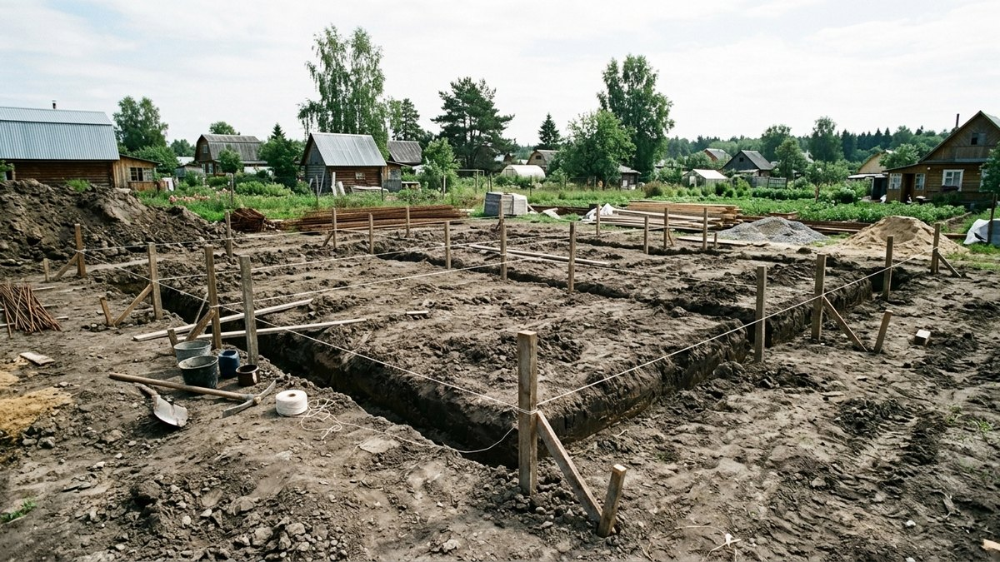
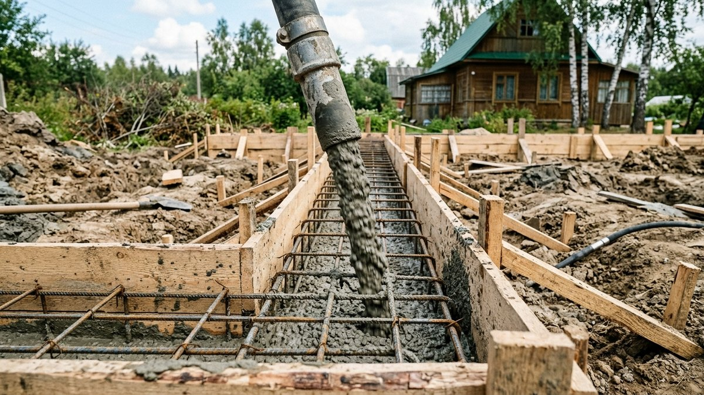
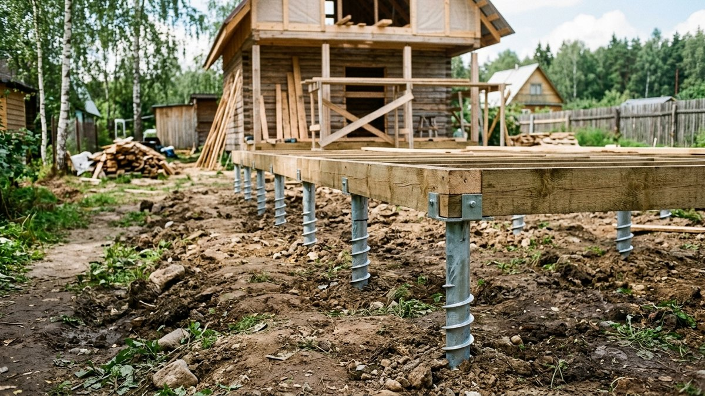
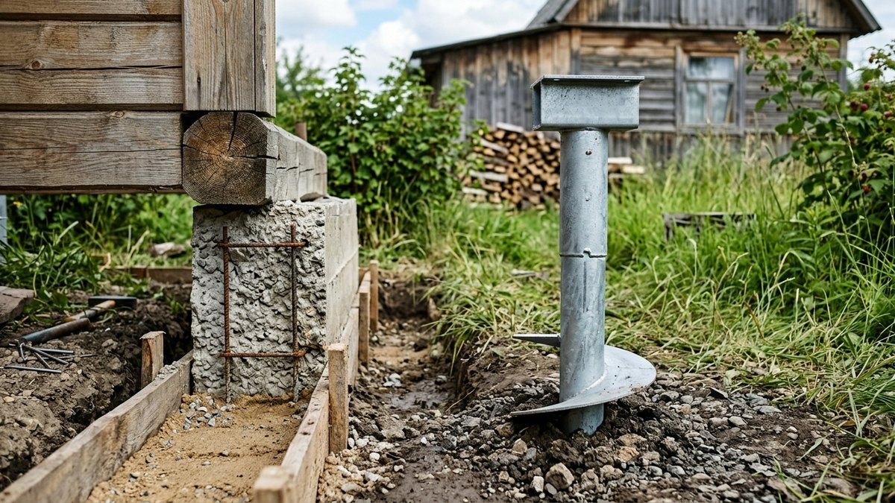
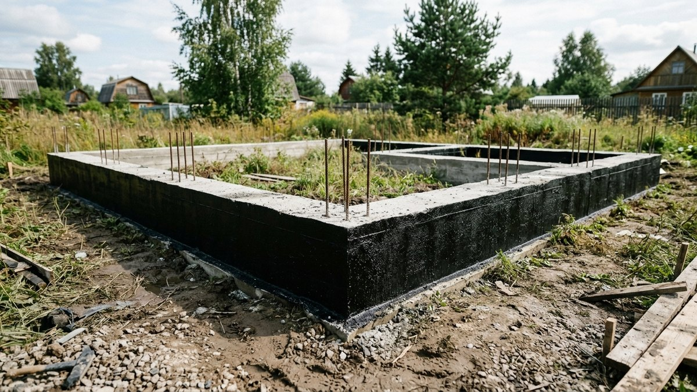
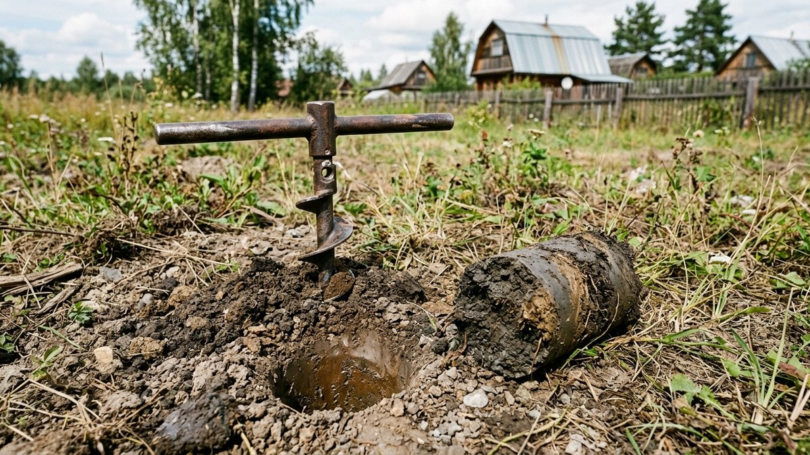

Прежде чем заказывать проект дома, приходится решить более приземлённый вопрос: на что его ставить. Ленточный фундамент и свайный (винтовые сваи) — два самых частых варианта для дачи, и оба стоят разумных денег, но подходят для разных условий. Разберём, чем они отличаются и как понять, какой вариант не подведёт именно на вашем участке.

## От чего зависит выбор фундамента

- **Тип грунта.** Пучинистые грунты (глина, суглинок с высоким уровнем грунтовых вод) при промерзании выдавливают лёгкий фундамент неравномерно — это главная причина трещин в стенах через пару зим.
- **Вес дома.** Тяжёлый кирпичный или газобетонный дом требует фундамента с большей несущей способностью, чем лёгкий каркасный или брусовой.
- **Рельеф участка.** На уклоне ленточный фундамент требует земляных работ и подсыпки, свайный выравнивает перепад высоты сваями без лишнего грунта.
- **Бюджет и сроки.** Свайный фундамент почти всегда дешевле и монтируется за 1–2 дня, ленточный требует земляных работ, опалубки и минимум 3–4 недель на набор прочности бетона.
- **Подвал или погреб под домом.** Если планируется полноценный подвал, ленточный фундамент — фактически единственный вариант, свайный подвала не даёт.

## Ленточный фундамент: плюсы и минусы

Железобетонная лента заливается по периметру дома и под несущими стенами. Подходит для тяжёлых домов и участков, где нужен подвал или высокий цоколь.

**Плюсы:** высокая несущая способность, устойчивость на разных грунтах при правильном заглублении, возможность сделать подвал, долговечность 50+ лет.

**Минусы:** высокая цена (земляные работы, опалубка, арматура, много бетона), долгий срок — от заливки до начала кладки стен нужно выждать набор прочности бетона (минимум 28 дней), сложнее строить на сильно пучинистых и болотистых грунтах без дополнительного дренажа.

## Свайный фундамент: плюсы и минусы

Винтовые сваи вкручиваются в грунт ниже глубины промерзания и обвязываются металлическим или деревянным ростверком. Быстрый и предсказуемый по бюджету вариант для лёгких домов.

**Плюсы:** низкая цена, монтаж за 1–2 дня без земляных работ и техники, подходит для болотистых, торфяных грунтов и участков с уклоном, можно строить в любой сезон, включая зиму.

**Минусы:** ограниченная несущая способность — не годится под тяжёлый кирпичный дом без расчёта и увеличения числа свай, нет возможности сделать полноценный подвал, требует пароизоляции и утепления пола первого этажа из-за продуваемого пространства под домом, качество монтажа сильно зависит от подрядчика — неровно вкрученные сваи не выправить.

## Сравнение: что выбрать

| Критерий | Ленточный | Свайный (винтовые сваи) |
|---|---|---|
| Цена | Выше в 1,5–2 раза | Ниже |
| Срок монтажа | 3–4 недели с учётом набора прочности | 1–2 дня |
| Тяжёлый дом (кирпич, газобетон) | Подходит | Требует расчёта, часто не годится |
| Лёгкий дом (каркас, брус, СИП) | Подходит, но избыточен по цене | Оптимален |
| Болотистый, торфяной грунт | Сложно и дорого | Хорошо подходит |
| Уклон участка | Земляные работы и подсыпка | Выравнивание без лишнего грунта |
| Подвал под домом | Возможен | Невозможен |
| Сезонность работ | Летний сезон | Круглый год |

## Сценарии: какой фундамент подойдёт именно вам

**Каркасный или брусовой домик для сезонного проживания, участок ровный или с небольшим уклоном** — свайный фундамент даёт нужную несущую способность за меньшие деньги и время. Такой же выбор подходит для [беседки](https://mir-doma.pro/besedka-svoimi-rukami/) или другой лёгкой постройки на участке.

**Кирпичный или газобетонный дом для постоянного проживания** — ленточный фундамент почти безальтернативен: он даёт запас несущей способности и возможность утеплить дом капитально, как описано в статье про [утепление дачного дома для зимнего проживания](https://mir-doma.pro/kak-uteplit-dachnyy-dom/).

**Участок с высоким уровнем грунтовых вод или на торфянике** — свайный фундамент обходит проблему пучения и подтопления, которую ленточному фундаменту придётся решать дренажом и заглублением ниже точки промерзания — это ощутимо удорожает проект.

**Нужен подвал или тёплый цоколь под баней с печью** — только ленточный: свайное поле не даёт заглублённого пространства, а вес печи и котла для [бани](https://mir-doma.pro/kak-postroit-banyu-na-dache/) требует надёжной опоры.

## Частые ошибки

- **Выбирать фундамент по цене, не проверив грунт.** Дешёвые сваи на тяжёлом доме или на грунте с высокой несущей нагрузкой могут просесть неравномерно за 2–3 года.
- **Экономить на геологии.** Пробное бурение на 2–3 точках участка стоит в разы дешевле, чем переделка фундамента под просевшим домом.
- **Игнорировать глубину промерзания в регионе.** И ленточный, и свайный фундамент должны учитывать эту глубину — недозаглублённый вариант "гуляет" при промерзании грунта.
- **Экономить на числе свай при тяжёлом доме.** Несущая способность считается по проекту, а не "на глазок" — при недооценке нагрузки ростверк начинает трещать.

## Частые вопросы

### Какой фундамент дешевле: ленточный или свайный

Свайный фундамент обычно дешевле в 1,5–2 раза за счёт отсутствия земляных работ, опалубки и меньшего расхода бетона. Разница особенно заметна на сложном грунте, где ленточному фундаменту нужны дополнительные меры от пучения.

### Можно ли поставить кирпичный дом на свайный фундамент

Можно, но потребуется точный расчёт несущей способности и, как правило, увеличенное число свай с усиленным ростверком. Для тяжёлого дома это часто получается дороже и сложнее, чем сразу заложить ленточный фундамент.

### Какой фундамент лучше на глинистом грунте

На пучинистом глинистом грунте с высоким уровнем грунтовых вод свайный фундамент обычно надёжнее и дешевле — сваи проходят пучинистый слой и опираются на более стабильный грунт ниже. Ленточному фундаменту на такой почве нужны дренаж и заглубление ниже точки промерзания.

### Сколько служит свайный фундамент из винтовых свай

При качественном монтаже и оцинкованных сваях — от 50 лет для сезонного дома. Срок службы сильно зависит от качества антикоррозийного покрытия свай и правильности расчёта нагрузки.

### Нужен ли фундамент под лёгкие хозяйственные постройки на даче

Да, но не обязательно капитальный: под сарай, навес или беседку часто достаточно столбчатого фундамента или тех же свай меньшего диаметра — полноценная лента здесь избыточна.

## Заключение

Ленточный фундамент — выбор для тяжёлого дома, подвала и капитального утепления под круглогодичное проживание. Свайный — быстрее, дешевле и надёжнее на сложном грунте под лёгкий сезонный дом. Финальное решение стоит принимать после пробного бурения на участке — оно занимает один день, а ошибка в выборе фундамента исправляется годами.
