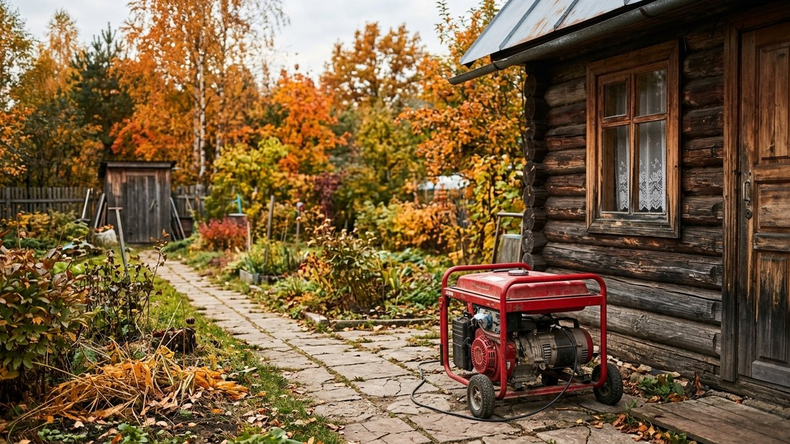
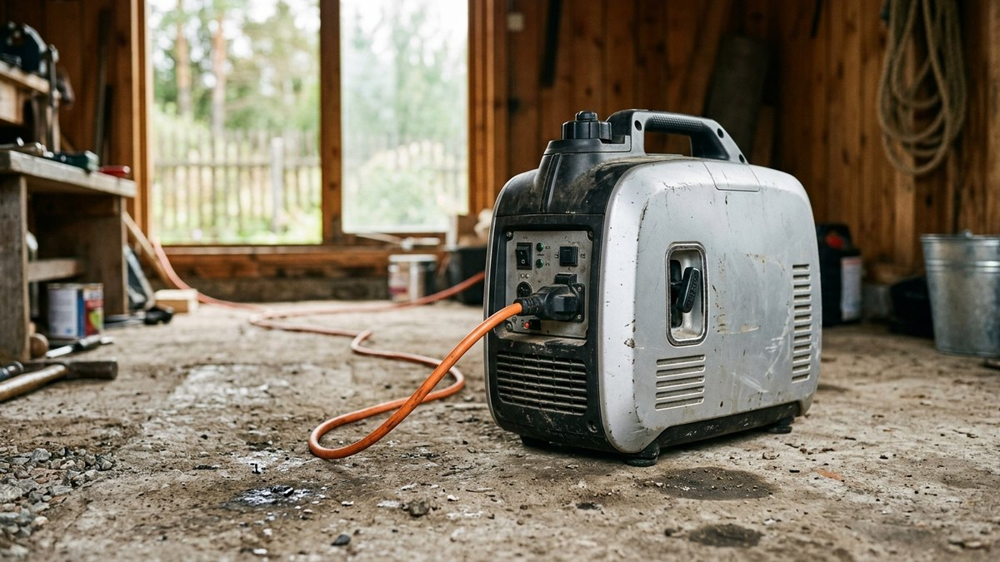
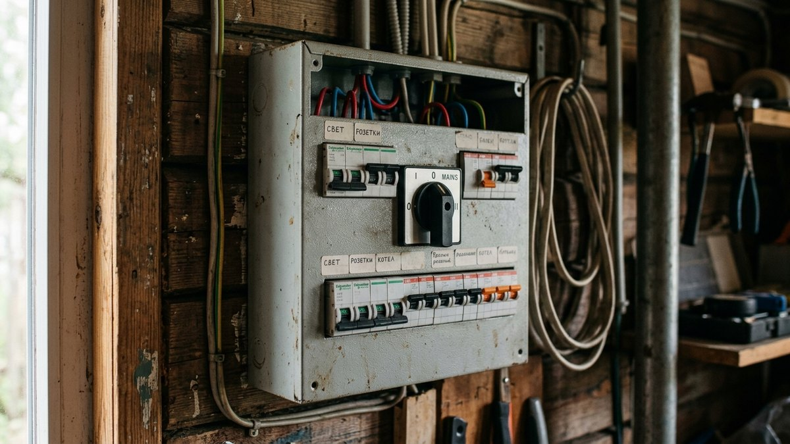
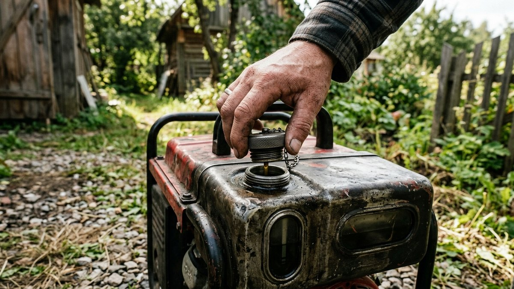
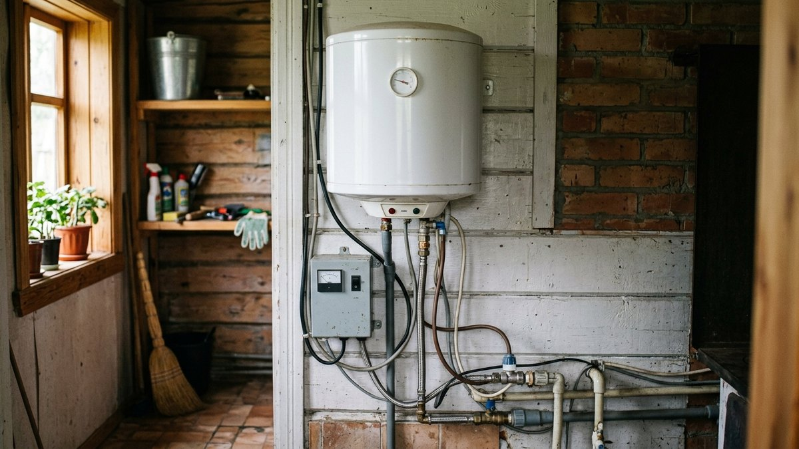
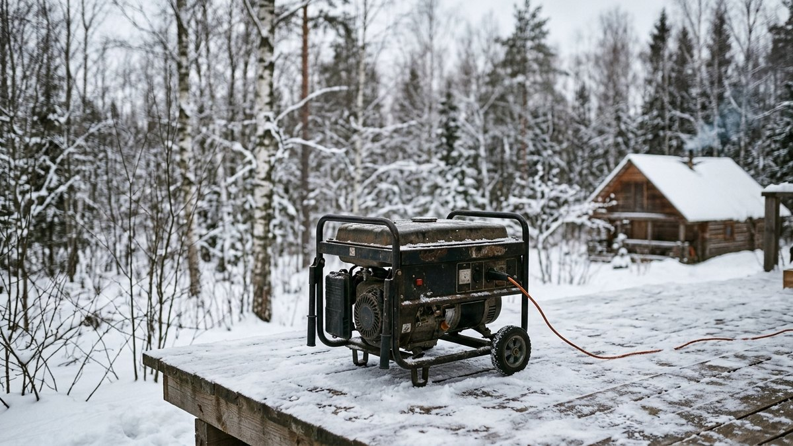

# Какой мощности генератор нужен для дачи: расчёт по своим приборам

Осенью и зимой отключения на дачных линиях случаются чаще: ветер валит ветки на
провода, снег обрывает старую проводку, подстанции перегружены обогревателями
соседей. Купленный наугад генератор — частая ошибка: либо переплата за киловатты,
которые никогда не понадобятся, либо мигание и отключение защиты в тот момент,
когда одновременно завелись холодильник и насос. Разберём, как посчитать нужную
мощность по своим приборам, а не по общим советам «берите с запасом», и какой тип
генератора подойдёт под разные сценарии использования.

## Зачем считать мощность, а не брать «с запасом»

Продавцы часто советуют мощность про запас — 5–6 кВт «на всякий случай». Это
не бесплатно: разница между генератором на 2 и на 6 кВт — это разница и в цене
самого агрегата, и в расходе топлива на холостом ходу, и в весе, который придётся
таскать к щитку. Правильный подход — посчитать реальную нагрузку по своим
приборам и добавить обоснованный запас 20–30%, а не удвоить цифру на глаз.

## Считаем суммарную мощность приборов

Возьмите список того, что должно работать одновременно при отключении света,
и сложите номинальную мощность (указана на приборе или в паспорте):

| Прибор | Типичная мощность |
|---|---|
| Холодильник | 150–400 Вт |
| Скважинный насос | 500–1500 Вт |
| Циркуляционный насос отопления | 60–100 Вт |
| Электрокотёл (только циркуляция, не нагрев) | 100–150 Вт |
| Освещение (LED, весь дом) | 100–300 Вт |
| Телевизор, роутер, зарядки | 100–200 Вт |
| Микроволновка | 800–1200 Вт |
| Электрочайник | 1500–2000 Вт |
| Болгарка, дрель | 800–1500 Вт |

Для типичного дачного дома с холодильником, насосом, освещением и розетками
набегает 1,5–2,5 кВт суммарной нагрузки без учёта мощной техники вроде чайника
или болгарки, которую обычно включают по очереди, а не одновременно с остальным.
Если кроме генератора вы только собираете набор для дачи с нуля, полный
[список необходимых инструментов](https://mir-doma.pro/instrumenty-dlya-dachi/)
поможет прикинуть, что ещё будет претендовать на розетку от генератора помимо
базовой нагрузки дома.

## Пусковые токи: где чаще всего ошибаются

Главная причина, по которой генератор «нужной» по паспорту мощности не тянет
нагрузку, — пусковой ток. У приборов с электродвигателем (холодильник, насос,
болгарка) ток при запуске в 3–7 раз выше номинального и держится доли секунды.
Генератор должен покрывать именно этот пиковый скачок, а не только рабочую
мощность.

Пример: скважинный насос на 750 Вт при запуске может кратковременно потребовать
3–4 кВт. Если в этот момент уже работает холодильник, а генератор рассчитан
впритык под сумму рабочих мощностей, защита сработает или двигатель насоса
попытается запуститься на пониженном напряжении и быстрее выйдет из строя.

**Правило:** к сумме рабочих мощностей прибавляйте не 20%, а разницу между
пусковым и номинальным током самого мощного электродвигателя в списке —
обычно это насос. По той же причине электроинструмент с мощным двигателем
(болгарка, циркулярка) лучше не включать одновременно с насосом: если работы
на участке всё равно требуют бензинового инструмента, для спила деревьев
проще сразу взять [бензопилу](https://mir-doma.pro/kak-vybrat-benzopilu/) и не
нагружать генератор лишним пусковым током.

## Бензиновый, дизельный или инверторный

| Тип | Плюсы | Минусы | Когда выбирать |
|---|---|---|---|
| Бензиновый обычный | Дешевле, проще в ремонте | Нестабильное напряжение, шумный | Разовые отключения, простая техника без электроники |
| Дизельный | Экономичнее на долгой работе, ресурс выше | Дороже, тяжелее, менее удобен для редкого использования | Частые и длительные отключения, отопление на электричестве |
| Инверторный | Стабильное напряжение, тихий, лёгкий | Дороже бензинового той же мощности | Есть насос, котёл, электроника, компьютер, роутер |

Для дачи с насосом, [электрокотлом](https://mir-doma.pro/kotel-dlya-dachi/) или
другой техникой с электронным управлением инверторный генератор — не роскошь,
а страховка от поломки этой техники: обычный бензиновый агрегат даёт
нестабильную синусоиду, от которой электроника чувствительных приборов
деградирует быстрее. Если резервным контуром отопления служит
[печь на дровах](https://mir-doma.pro/pech-dlya-dachi/), зависимость от
генератора ниже — остаётся запитать только циркуляционный насос и освещение.

## Пошаговый расчёт

1. Составьте список приборов, которые должны работать одновременно при
   отключении света.
2. Сложите их номинальную мощность — это базовая нагрузка.
3. Найдите среди них прибор с электродвигателем и определите его пусковой ток
   (обычно указан в паспорте как «пусковой ток» или «поправочный коэффициент»).
4. К базовой нагрузке прибавьте разницу между пусковой и номинальной мощностью
   этого прибора.
5. Округлите результат в большую сторону до ближайшей серийной мощности
   генератора (2, 3, 5, 6,5, 8 кВт).

Пример: холодильник 200 Вт + освещение 150 Вт + насос 750 Вт (пусковой —
3000 Вт) = база 1100 Вт + разница пускового и номинального насоса (2250 Вт) =
около 3,3 кВт. Берём генератор на 3,5–5 кВт с запасом на будущее подключение.

## Частые ошибки

- **Считать только сумму паспортных мощностей**, не учитывая пусковые токи
  насоса и холодильника — генератор «тянет по паспорту», но не тянет на деле.
- **Экономить на инверторном генераторе**, если на даче стоит электрокотёл
  или скважинный насос с частотным преобразователем — нестабильное напряжение
  сажает электронику за один-два сезона.
- **Подключать генератор напрямую в розетку дома** без ручного переключателя
  ввода — это опасно для ремонтников на линии и запрещено правилами.
- **Не проверять генератор до отключения света.** Первый запуск должен быть
  плановым, а не в темноте и мороз.

## Частые вопросы

### Хватит ли генератора на 2 кВт для дачи с насосом и холодильником

Зависит от пускового тока насоса. Если насос слабый (до 500 Вт номинала),
скорее всего хватит с запасом. Для насоса от 750 Вт и выше безопаснее брать
от 3 кВт — иначе пуск насоса на фоне работающего холодильника может выбить
защиту.

### Можно ли запитать электрокотёл от обычного бензинового генератора

Циркуляцию и автоматику — да, если генератор инверторный или со стабильным
напряжением. С нестабильной синусоидой обычного бензинового генератора плата
управления котла может работать некорректно или выйти из строя быстрее.

### Сколько топлива расходует генератор на 3 кВт за ночь

При нагрузке 50–70% от номинала бензиновый генератор на 3 кВт расходует
примерно 1–1,5 литра в час, то есть 8–12 литров за ночь непрерывной работы.
Дизельный при той же нагрузке расходует на 30–40% меньше.

### Нужен ли генератору стабилизатор напряжения

Для обычного бензинового генератора без функции инвертора — да, если к нему
подключается чувствительная электроника (котёл, насос с частотником,
холодильник с электронным управлением). Инверторные генераторы уже дают
стабильную синусоиду и отдельный стабилизатор не нужен.

### Какой генератор выбрать, если на даче нет насоса и котла — только свет и холодильник

Для такого минимального набора хватит бытового бензинового генератора на
2–2,5 кВт без переплаты за инверторную схему: чувствительной к перепадам
напряжения техники нет.

## Заключение

Мощность генератора для дачи считается не «на глаз с запасом», а по сумме
рабочих мощностей приборов плюс поправка на пусковой ток самого мощного
электродвигателя в доме — обычно насоса. Если в доме есть насос, электрокотёл
или другая чувствительная электроника, инверторный генератор окупает разницу
в цене тем, что не сажает эту технику за один сезон нестабильного напряжения.
Для расчёта мощности [бензопилы или мотоблока](https://mir-doma.pro/kakoy-motoblok-vybrat/),
которые тоже иногда запитывают от генератора при работах на участке,
действует тот же принцип: смотреть не паспортную, а пусковую нагрузку.
