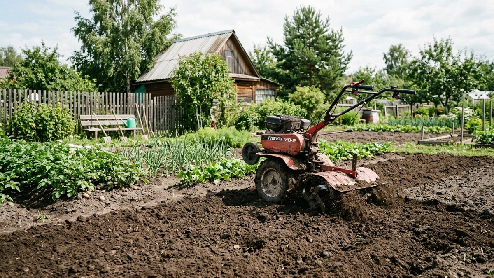
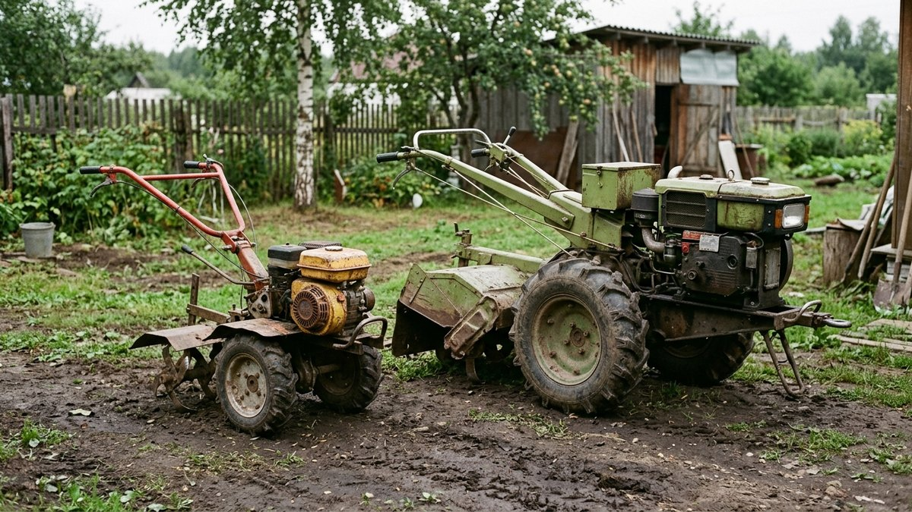
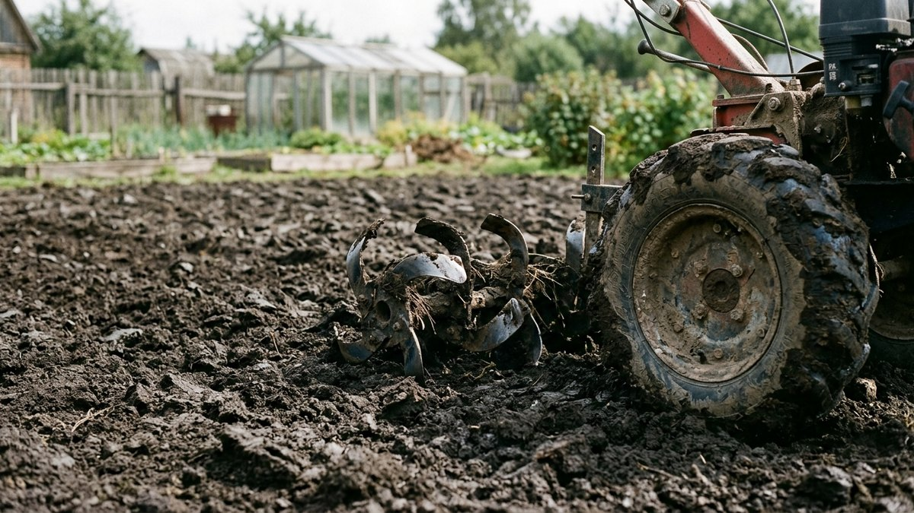
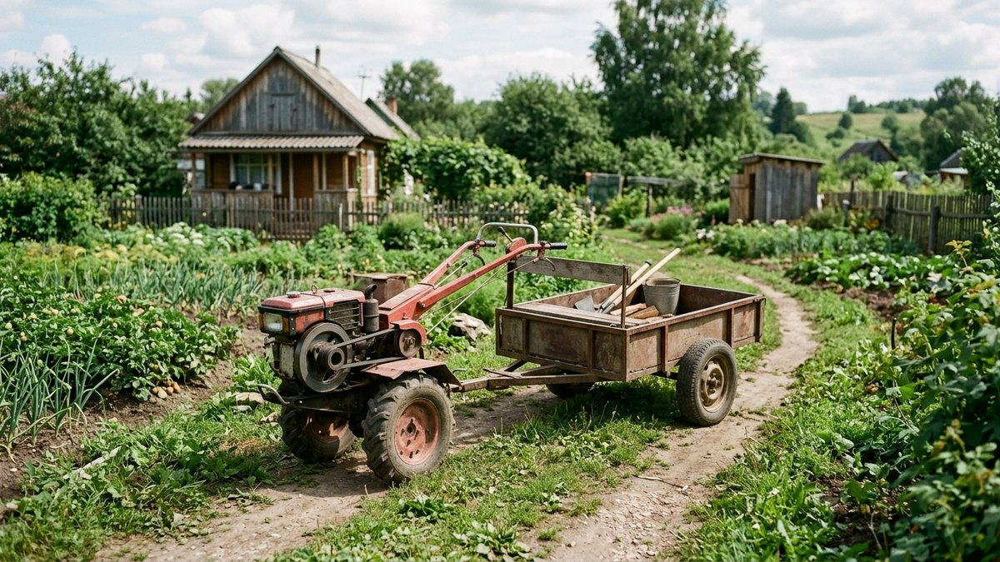
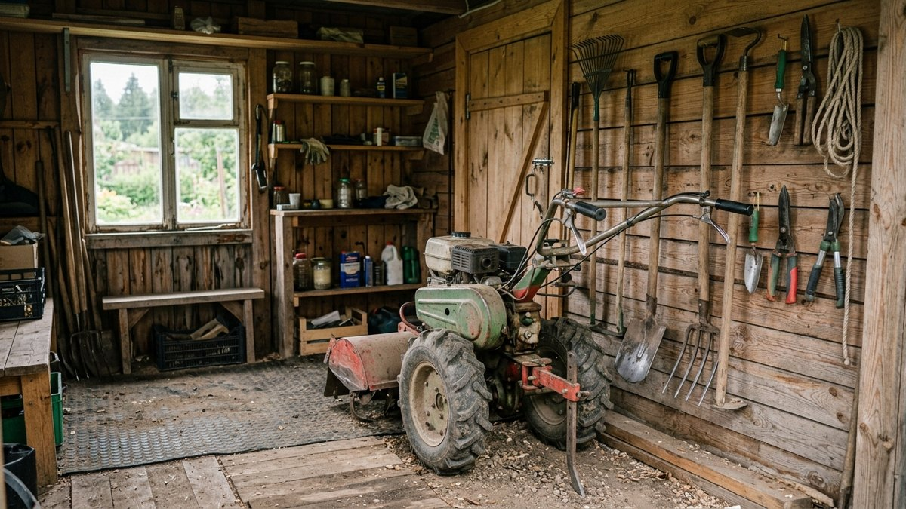
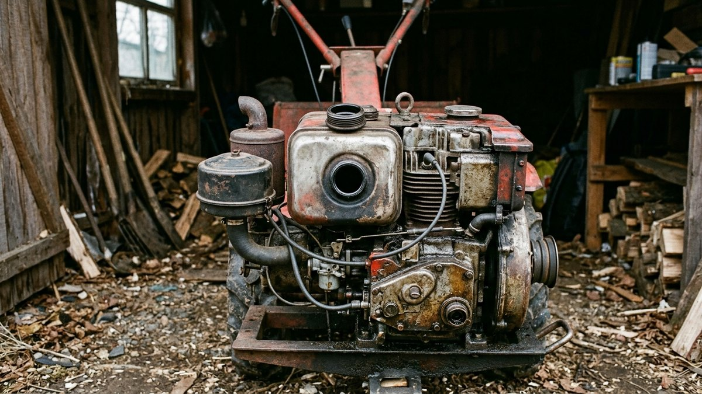

# Какой мотоблок выбрать для дачи

Мотоблок покупают на десятилетие, поэтому ошибка при выборе обходится
дорого: лёгкая модель захлёбывается на тяжёлой глинистой почве, а тяжёлая
пылится в сарае, если участок — шесть соток огорода. Разберём, как выбрать
класс мотоблока по площади и типу почвы, какой двигатель практичнее и на
какие параметры смотреть, кроме мощности в лошадиных силах.

## Для чего нужен мотоблок

Базовая задача — перекопка и рыхление почвы фрезами, но с навесным
оборудованием мотоблок закрывает гораздо больше: окучивание картофеля,
нарезку борозд, перевозку грузов на тележке, покос травы, а зимой —
уборку снега. Чем шире планируемый список задач, тем больше смысла брать
модель с запасом мощности под навесное, а не только под перекопку.

## Лёгкий, средний или тяжёлый класс

| Класс | Мощность | Площадь участка | Почва |
|---|---|---|---|
| Лёгкий (культиваторный) | до 4–5 л.с. | до 10–15 соток | Лёгкая, окультуренная, без целины |
| Средний | 5–8 л.с. | 15–30 соток | Средняя плотность, редкая целина |
| Тяжёлый | от 8 л.с. | от 30 соток | Плотная глина, целина, регулярная тяжёлая нагрузка |

Ошибка «возьму помощнее про запас» имеет обратную сторону: тяжёлый
мотоблок неудобно разворачивать на узких грядках, а весит он в 2–3 раза
больше лёгкого — работа с ним физически тяжелее на маленьком участке.

## Бензиновый или дизельный двигатель

- **Бензиновый** — легче заводится в холод, сам мотоблок легче, дешевле в
  обслуживании. Подходит для лёгкого и среднего класса.
- **Дизельный** — тяговитее на низких оборотах, экономичнее при большом
  объёме работ, но тяжелее и дороже. Оправдан на тяжёлом классе и
  больших площадях, где мотоблок работает часами подряд.

Логика выбора между типами двигателя похожа на выбор бензопилы — там
тоже решает объём и регулярность работы, а не абстрактная «мощность
получше»; подробнее это разобрано в статье [как выбрать бензопилу для
дачи](https://mir-doma.pro/kak-vybrat-benzopilu/). Тот же принцип «дизель
для частой нагрузки, бензин для редкой» работает и при выборе резервного
[генератора для дачи](https://mir-doma.pro/kakoy-generator-nuzhen-dlya-dachi/) —
только там дополнительно считают ещё и пусковые токи подключаемых приборов.

## На что смотреть, кроме мощности

- **Тип трансмиссии.** Цепная — дешевле и проще в ремонте своими руками,
  шестерёнчатая — надёжнее и живёт дольше, но обслуживание сложнее и
  дороже.
- **Ширина захвата фрезы.** Больше ширина — быстрее перекопка, но хуже
  манёвренность между грядками. Для узких грядок берут регулируемые
  фрезы или модель с меньшим захватом.
- **Вес.** Определяет и проходимость (тяжёлому легче резать плотную
  почву), и физическую нагрузку на оператора — тяжёлый мотоблок сложнее
  развернуть в одиночку на тесном участке.
- **Наличие реверса.** Задний ход экономит силы при развороте в конце
  грядки, особенно на среднем и тяжёлом классе.

## Навесное оборудование

Сам мотоблок — это база, реальная универсальность строится на навесном:

- **Плуг** — для целины и глубокой вспашки.
- **Окучник** — для картофеля, экономит часы ручной работы.
- **Картофелекопалка** — для уборки урожая на большой площади.
- **Тележка-прицеп** — для перевозки грузов по участку.
- **Роторная косилка** — для покоса травы вместо триммера на больших
  площадях.
- **Снегоуборщик или отвал** — зимнее применение мотоблока, экономит
  покупку отдельной техники.

Перед покупкой стоит свериться, что мощности выбранного класса хватит на
нужное навесное — плуг и снегоуборщик требуют больше тяги, чем базовая
перекопка фрезами.

## Мотоблок или культиватор

Культиватор — упрощённая версия для рыхления верхнего слоя без глубокой
вспашки и тяжёлого навесного. Если участок маленький, почва лёгкая и
задача — только прополка и рыхление между посадками, культиватор дешевле
и легче в хранении. Мотоблок оправдан, когда в планах глубокая
перекопка, окучивание и хотя бы часть списка навесного оборудования
выше.

## Уход и хранение

Мотоблок хранят в сухом помещении, топливо на зиму сливают или
стабилизируют присадкой, фрезы и навесное чистят от земли перед
консервацией — иначе металл ржавеет за одну зиму. Общие принципы
хранения садовой техники и инструмента собраны в статье [какие
инструменты нужны на даче](https://mir-doma.pro/instrumenty-dlya-dachi/).
Чаще всего мотоблок нужен именно осенью, на финальной перекопке перед
зимой — сроки и очерёдность этих работ разобраны в статье [подготовка
сада к зиме](https://mir-doma.pro/podgotovka-sada-k-zime/).

## Частые ошибки

- **Берут мотоблок «с запасом» без учёта площади** — тяжёлой моделью
  неудобно и физически тяжело работать на маленьком участке.
- **Экономят на навесном при покупке** — без окучника и картофелекопалки
  половина пользы от мотоблока не реализуется.
- **Не проверяют мощность под конкретное навесное** — плуг и
  снегоуборщик требуют больше тяги, чем кажется по паспортной мощности
  базовой перекопки.
- **Не сливают топливо на зиму** — застоявшийся бензин портит карбюратор
  к следующему сезону.

## Частые вопросы

**Какой мотоблок выбрать для участка 10 соток?**
Лёгкого класса, до 4–5 л.с., хватит для регулярной перекопки и рыхления
на небольшой площади с окультуренной почвой.

**Чем мотоблок отличается от культиватора?**
Мотоблок мощнее, тяжелее и работает с широким навесным оборудованием —
плугом, окучником, тележкой. Культиватор — только рыхление верхнего
слоя почвы, легче и дешевле.

**Бензиновый или дизельный мотоблок лучше для дачи?**
Бензиновый практичнее для лёгкого и среднего класса — легче заводится и
дешевле в обслуживании. Дизельный оправдан на большой площади с тяжёлой
регулярной нагрузкой.

**Какая мощность мотоблока нужна для целины?**
От 8 л.с. и выше, тяжёлый класс — лёгкие и средние модели захлёбываются
на плотной непаханой земле.

**Сколько стоит хороший мотоблок для дачи?**
Цена сильно зависит от класса и комплекта навесного — лёгкая модель без
дополнительного оборудования обойдётся заметно дешевле тяжёлой с полным
набором для вспашки, окучивания и перевозки грузов.
