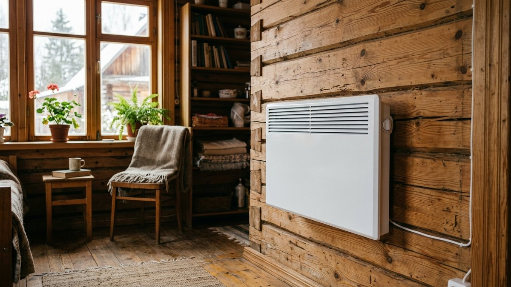
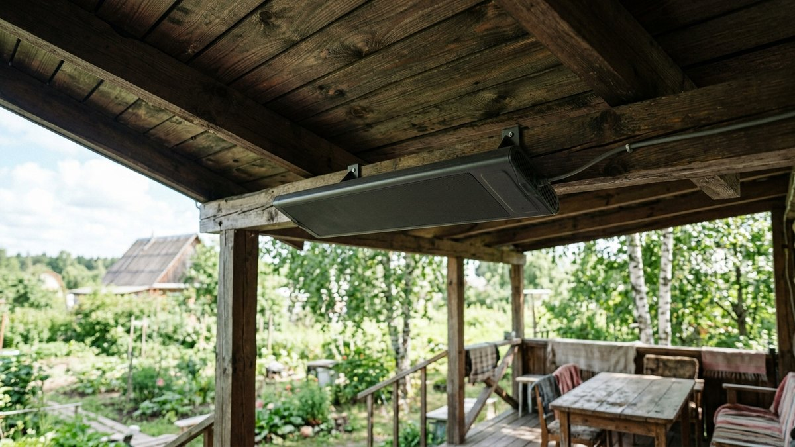
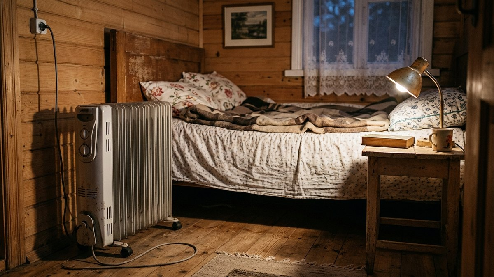
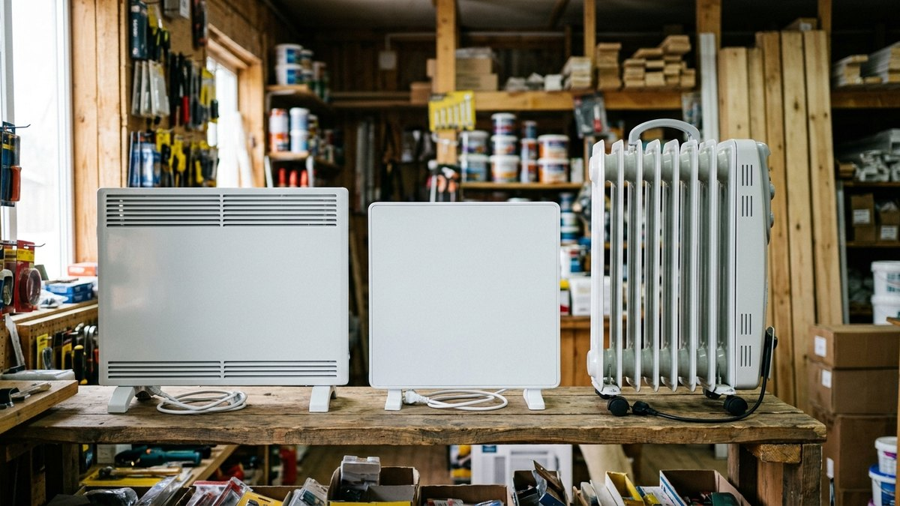
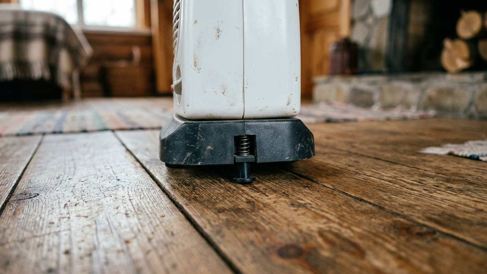
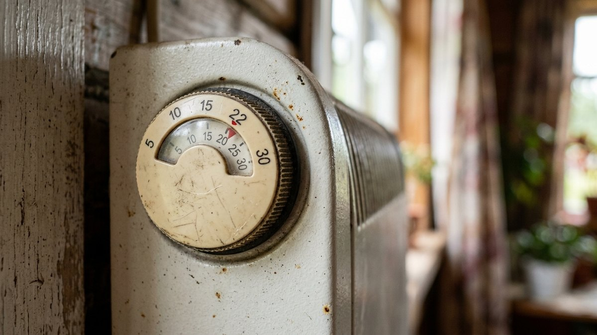

# Какой обогреватель выбрать для дачи: конвектор, инфракрасный или масляный

Это не статья про то, чем топить дачу всю зиму, — расчёт экономики
постоянного электроотопления целого дома разобран отдельно, в статье
[электроотопление дачи](https://mir-doma.pro/elektricheskoe-otoplenie-dachi/).
Здесь — про другую, куда более частую задачу: выбрать переносной
обогреватель для конкретного сценария — прогреть дом к приезду на
выходные, досушить веранду после дождя или спасти рассаду в теплице от
неожиданного заморозка. Разберём, чем конвектор, инфракрасный и масляный
обогреватель отличаются на практике и какой мощности прибор взять под
свою площадь.

## Чем отличаются конвектор, инфракрасный и масляный обогреватель

- **Конвектор** гонит через себя воздух: холодный заходит снизу, тёплый
  выходит сверху и поднимается к потолку, постепенно прогревая всю
  комнату. Быстрее реагирует на термостат, чем масляный радиатор, но пока
  воздух не прогреется, в комнате ощутимо холоднее у пола.
- **Инфракрасный обогреватель** греет не воздух, а предметы и людей в
  зоне действия — как солнце сквозь окно. Тепло чувствуется мгновенно,
  но стоит выйти из зоны обогрева или зайти за угол — согревающего
  эффекта нет, хотя термометр на стене покажет ту же комнатную
  температуру, что и до включения.
- **Масляный радиатор** нагревает залитое внутрь масло, которое долго
  отдаёт тепло уже после выключения прибора. Греет медленнее всех трёх,
  зато без сквозняков и шума и держит тепло дольше при кратковременных
  перебоях с электричеством.

## Сравнение: что выбрать под сценарий

| Критерий | Конвектор | Инфракрасный | Масляный радиатор |
|---|---|---|---|
| Скорость ощутимого тепла | Средняя (5–10 мин) | Мгновенная | Медленная (15–30 мин) |
| Прогревает всю комнату | Да | Нет, только зону действия | Да |
| Шум | Бесшумный | Бесшумный | Бесшумный |
| Безопасность поверхности | Корпус тёплый | Корпус может быть горячим | Корпус горячий |
| Держит тепло после выключения | Нет | Нет | Да, долго |
| Лучший сценарий | Постоянный обогрев комнаты с термостатом | Точечный обогрев веранды, мастерской, зоны у рабочего стола | Спальня на ночь, помещение без сквозняков |

## Как рассчитать нужную мощность

Упрощённый ориентир, которым пользуются при выборе бытового обогревателя, —
**около 100 Вт на 1 м² площади** при стандартной высоте потолка 2,5–2,7 м;
это оценка с запасом, а не точный теплотехнический расчёт (он учитывает
ещё и материал стен, число окон, утепление). Чем выше потолки и хуже
утепление, тем больше нужно взять с запасом.

<!-- wp:html -->

<h3 class="md-ob__title">Калькулятор мощности обогревателя</h3>

Ориентировочный расчёт по площади, высоте потолка и утеплению помещения.

<label class="md-ob__f">Площадь комнаты, м²<input type="number" id="obArea" value="18" min="4" max="150" step="1"></label>
<label class="md-ob__f">Высота потолка, м<input type="number" id="obHeight" value="2.5" min="2" max="4" step="0.1"></label>
<label class="md-ob__f">Утепление помещения
<select id="obIns">
<option value="0.8">Хорошее (утеплённый дом для зимнего проживания)</option>
<option value="1" selected>Среднее (обычная дачная веранда/комната)</option>
<option value="1.3">Слабое (тонкие стены, старые окна)</option>
</select></label>

Нужная мощность<b id="obWatt">1800 Вт</b>

Рекомендация<b id="obRec">—</b>

<button type="button" id="obCopy" class="md-ob__btn md-ob__btn--main">Скопировать результат</button>
<a id="obVk" class="md-ob__btn md-ob__btn--vk" href="#" target="_blank" rel="noopener noreferrer">Поделиться ВКонтакте</a>
<a id="obTg" class="md-ob__btn md-ob__btn--tg" href="#" target="_blank" rel="noopener noreferrer">Поделиться в Telegram</a>
<button type="button" id="obShareNative" class="md-ob__btn" hidden>Поделиться…</button>

<!-- /wp:html -->

## Что выбрать под свою задачу

- **Дом на выходные, нужно быстро прогреть к приезду** — инфракрасный
  обогреватель с таймером или Wi-Fi-розеткой, включённый заранее: он
  греет сразу, не тратя время на прогрев воздуха, которым никто ещё не
  пользуется. [Инфракрасные обогреватели в каталоге](aff:lm-obogrevateli-infrakrasnye)
- **Постоянный обогрев комнаты с контролем температуры** — конвектор с
  термостатом: держит заданную температуру без присмотра и не пересушивает
  воздух так, как тепловентилятор. [Конвекторы в каталоге](aff:lm-obogrevateli-konvektory)
- **Спальня на ночь или помещение без вентиляции** — масляный радиатор:
  греет медленно, но без запаха гари от пыли на спирали и без шума
  вентилятора. [Масляные радиаторы в каталоге](aff:vi-obogrevateli-maslyanye)

## Частые ошибки

- **Обогреватель без термостата в постоянном режиме.** Прибор греет на
  полную мощность даже тогда, когда в комнате уже тепло, — расход
  электричества выше, а разница в комфорте нулевая.
- **Инфракрасный обогреватель ждут как замену конвектору.** Он не
  прогревает комнату целиком — стоит выйти из зоны действия, и тепла нет,
  хотя по паспортной мощности прибор ничем не слабее.
- **Обогреватель без присмотра на ночь без защиты от опрокидывания.**
  Дешёвые модели без датчика опрокидывания и перегрева — частая причина
  бытовых пожаров именно от обогревателей, а не от электропроводки.
- **Один мощный обогреватель на весь дом вместо нескольких точечных.**
  Часто выгоднее и безопаснее прогреть конкретную комнату инфракрасным
  или небольшим конвектором, чем гонять по всему дому один мощный прибор
  на максимум.

## Частые вопросы

### Какой обогреватель лучше для дачи

Зависит от сценария: для быстрого точечного тепла — инфракрасный, для
равномерного прогрева комнаты с контролем температуры — конвектор, для
тихого прогрева спальни на ночь — масляный радиатор. Универсального
ответа нет, есть подходящий под конкретную задачу.

### Какой обогреватель самый экономичный и безопасный

По экономичности все три при одинаковой мощности потребляют одинаково —
электричество превращается в тепло без потерь независимо от типа
прибора. Разница не в экономичности, а в том, как быстро и куда именно
уходит это тепло. По безопасности выигрывают модели с датчиком
опрокидывания и защитой от перегрева — это критичнее типа обогревателя.

### Можно ли оставлять обогреватель на даче без присмотра

Только модели с термостатом, защитой от опрокидывания и перегрева, и
только в помещении без штор и мебели ближе рекомендованного
производителем расстояния. Дешёвые тепловентиляторы без этих защит на
ночь и без присмотра лучше не оставлять.

### Сколько мощности обогревателя нужно на дачный дом целиком

Для отопления всего дома, а не одной комнаты, отдельным обогревателем не
обойтись — это уже задача системы отопления с расчётом по каждому
помещению, разобранная в статье [электроотопление
дачи](https://mir-doma.pro/elektricheskoe-otoplenie-dachi/).

### Греет ли инфракрасный обогреватель на открытой веранде

Частично — на открытом воздухе или сквозняке конвектор и масляный радиатор
почти бесполезны (тепло сразу уносит), а инфракрасный продолжает греть
предметы и людей в зоне действия, как уличный обогреватель на летней
веранде кафе. Это единственный из трёх типов, для которого открытое
пространство не проблема.
