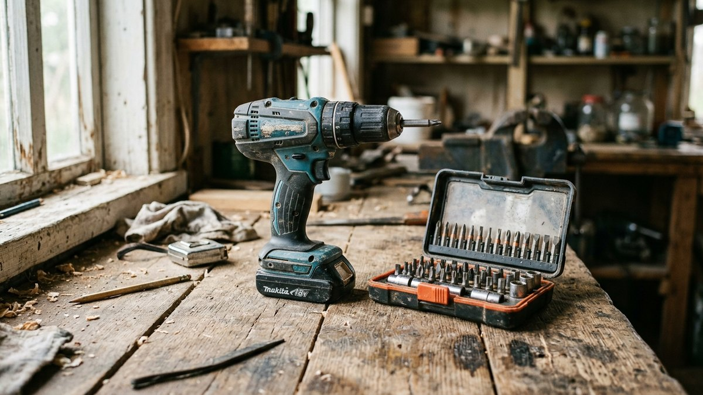
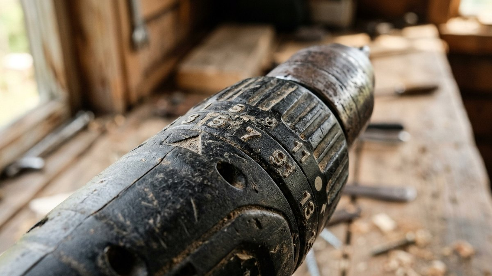
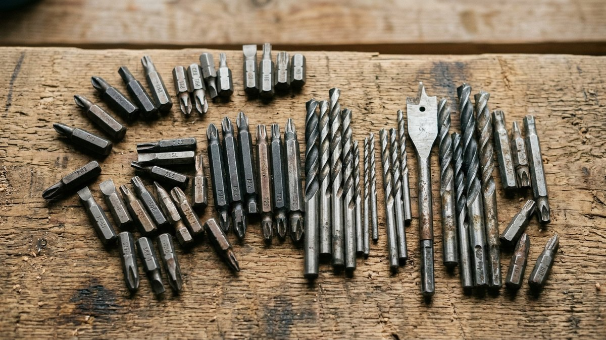
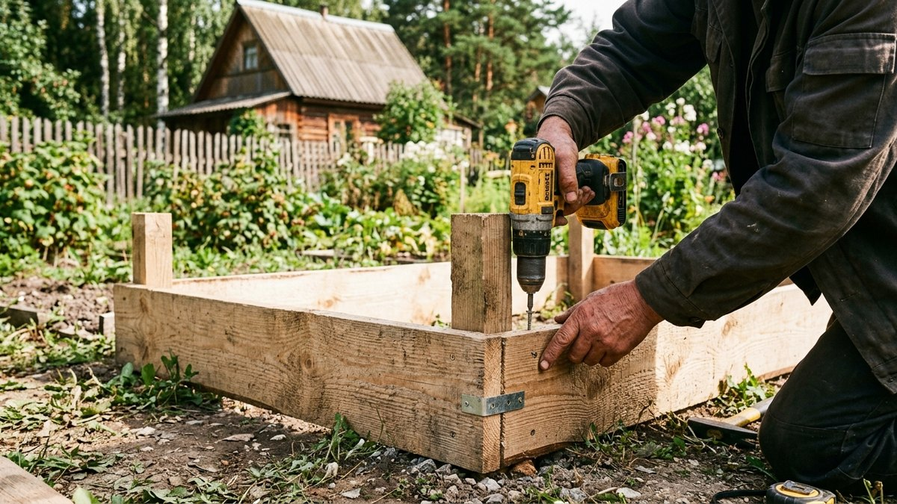
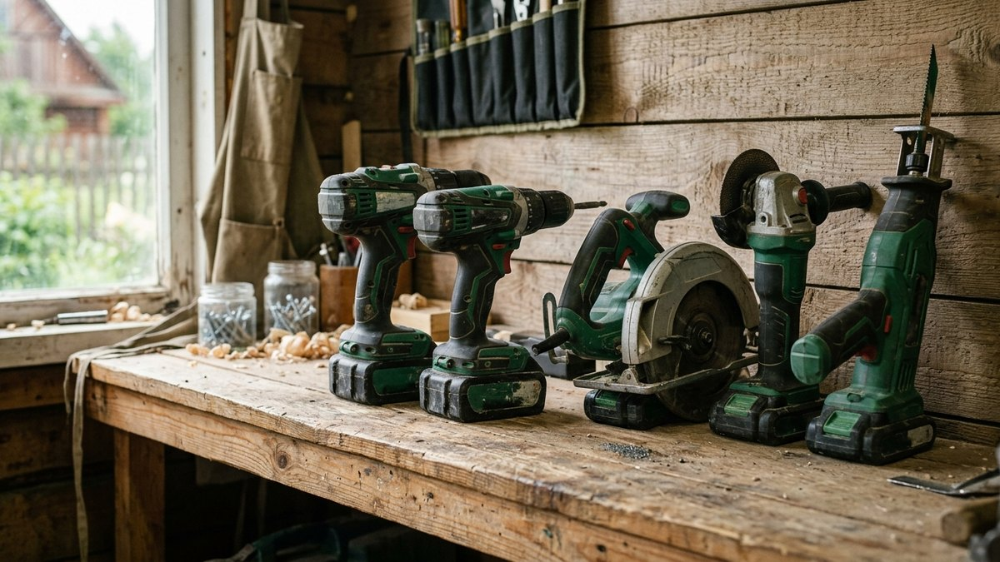
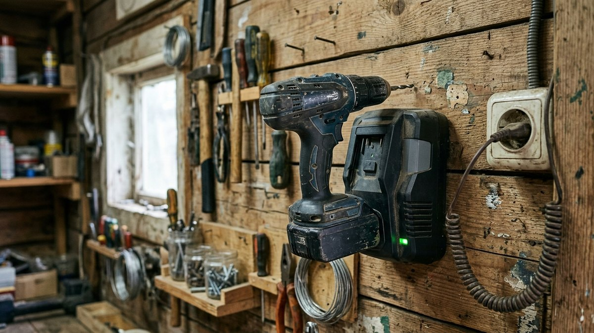

Для дачи шуруповёрт нужен не раз в год, а регулярно: собрать грядки-короба,
прикрутить обшивку веранды, починить забор, поставить полки в сарае. Разница
между дешёвой моделью «на сезон» и нормальным инструментом ощущается не в
характеристиках на коробке, а в том, докрутит ли он саморез в сухую доску
без раскола и хватит ли одного заряда на весь объём работ. Разбираем, чем
аккумуляторный шуруповёрт отличается от сетевого, на какой крутящий момент
смотреть и какие ошибки чаще всего совершают при выборе для дачных задач.

## Аккумуляторный или сетевой: что выбрать для дачи

Для дачи почти всегда выигрывает аккумуляторный шуруповёрт — не нужно
тянуть удлинитель к забору или крыше веранды, а современные литий-ионные
батареи держат заряд достаточно долго для полного дня работы. Сетевой
шуруповёрт имеет смысл только для одной задачи: постоянной работы на одном
месте (например, в мастерской в бытовке), где длина провода не мешает и не
нужно перемещаться по участку.

| Критерий | Аккумуляторный | Сетевой |
|---|---|---|
| Мобильность | Полная, работает где угодно | Ограничена длиной удлинителя |
| Мощность | Достаточная для дачных задач, ограничена ёмкостью батареи | Стабильная, не зависит от заряда |
| Вес | 1,3–2 кг с батареей | Легче без батареи, но провод мешает |
| Автономность | 100–300 саморезов на одном заряде в зависимости от модели | Не ограничена |
| Цена | Выше из-за батареи и зарядного устройства | Ниже |
| Долговечность батареи | 3–5 лет активного использования, потом требует замены | Не актуально |

## На что смотреть при выборе, кроме цены

### Крутящий момент

Для дачных задач — сборка мебели, крепёж обшивки, работа с деревом и
тонким металлом — достаточно 30–50 Н·м. Для регулярного вкручивания
длинных саморезов в твёрдую древесину или работы с металлоконструкциями
стоит смотреть модели от 50 Н·м и выше.

### Тип аккумулятора

Литий-ионные (Li-Ion) батареи давно вытеснили никель-кадмиевые: не имеют
«эффекта памяти», держат заряд в режиме ожидания месяцами и легче по весу
при той же ёмкости. Никель-кадмиевые модели сейчас встречаются в самом
бюджетном сегменте — для дачи их лучше не рассматривать даже ради
экономии: ресурс заметно ниже.

### Патрон

Быстрозажимной патрон (без ключа) — стандарт для большинства задач,
позволяет менять биты и свёрла одной рукой за секунды. Патрон под ключ
сейчас встречается редко и оправдан только для инструмента с очень высоким
крутящим моментом, где нужна дополнительная фиксация.

### Ударный режим

Обычный шуруповёрт справляется с деревом, гипсокартоном, металлическим
профилем и мягким кирпичом. Для сверления бетона и кирпичной кладки нужен
именно ударный режим (шуруповёрт-перфоратор или отдельный перфоратор) —
разница между этими инструментами и когда какой нужен разобрана в статье
[чем отличается ударная дрель от перфоратора](https://mir-doma.pro/chem-otlichaetsya-udarnaya-drel-ot-perforatora/).

### Количество скоростей и регулировка момента

Две скорости (низкая для закручивания с высоким моментом, высокая для
сверления) и регулятор момента затяжки в 15–20 положениях — стандарт для
среднего ценового сегмента. Без регулировки момента саморезы в мягкое
дерево или гипсокартон легко перетянуть и сорвать шляпку или расколоть
материал.

## Одна платформа аккумуляторов — экономия на комплекте инструментов

Большинство производителей выпускают линейку инструментов на едином
аккумуляторе: шуруповёрт, дрель-шуруповёрт, лобзик, а иногда и триммер или
воздуходувка используют одну и ту же батарею. Если на даче планируется не
один инструмент, а набор, есть смысл сразу выбирать бренд с широкой линейкой
на общей платформе — это ощутимо дешевле, чем покупать отдельные
аккумуляторы и зарядные устройства под каждый инструмент. Например, при
выборе аккумуляторного триммера для покоса травы стоит проверить, не входит
ли он в ту же линейку, что и шуруповёрт — подробнее в статье
[какой триммер выбрать для дачи](https://mir-doma.pro/kakoy-trimmer-vybrat-dlya-dachi/).

## Пошагово: как выбрать шуруповёрт под свои задачи

1. **Определите основной тип работ.** Сборка мебели и лёгкий крепёж — до
   30 Н·м достаточно. Обшивка, настил пола, работа с брусом — от 40–50 Н·м.
2. **Проверьте вес с установленной батареей.** Разница в 300–400 г
   ощущается при долгой работе над головой (например, при монтаже
   потолка) или в неудобной позе.
3. **Сравните ёмкость аккумулятора в ампер-часах (Ач).** 1,5–2 Ач хватает
   на бытовые задачи, от 4 Ач — для интенсивной работы без частой подзарядки.
4. **Уточните, продаётся ли запасной аккумулятор отдельно.** Второй
   аккумулятор в резерве избавляет от простоя во время зарядки первого.
5. **Проверьте комплектацию бит и свёрл.** Базового набора часто не
   хватает даже на первую сборку — стоит сразу присмотреть расширенный
   набор для дерева и металла.

## Частые ошибки при выборе

- **Покупка самой дешёвой модели без регулировки момента.** Постоянный
  риск сорвать шляпку самореза или расколоть тонкую доску.
- **Выбор никель-кадмиевой батареи ради экономии.** Ресурс такой батареи
  заметно ниже литий-ионной, а через 1–2 сезона придётся покупать новую.
- **Игнорирование веса инструмента.** То, что кажется лёгким на весах в
  магазине, ощущается иначе после часа работы над головой.
- **Покупка без запасного аккумулятора для интенсивных задач.** Одна
  зарядка занимает от 40 минут до нескольких часов — простой посреди
  работы неудобен, если объём большой.
- **Путаница между шуруповёртом и ударной дрелью.** Для сверления бетона
  и кирпича обычный шуруповёрт не подходит — нужен инструмент с ударным
  режимом.

## Частые вопросы

### Какой шуруповёрт лучше для дачи: аккумуляторный или сетевой

Аккумуляторный — для большинства дачных задач важна мобильность без
привязки к розетке. Сетевой оправдан только для постоянной работы на
одном месте, например в мастерской.

### Какой крутящий момент нужен шуруповёрту для дачных работ

30–50 Н·м достаточно для сборки мебели, крепежа обшивки и работы с
деревом. Для регулярной работы с твёрдой древесиной и металлом стоит брать
модель от 50 Н·м.

### Можно ли сверлить бетон обычным шуруповёртом

Нет, обычный шуруповёрт не рассчитан на бетон и кирпич — нужен инструмент
с ударным режимом (шуруповёрт-перфоратор или отдельный перфоратор).

### Сколько саморезов выкручивает шуруповёрт на одном заряде

От 100 до 300 саморезов в зависимости от ёмкости аккумулятора, твёрдости
материала и длины крепежа — точная цифра указывается производителем для
конкретной модели.

### Стоит ли переплачивать за фирменную линейку с одним аккумулятором

Да, если планируется покупать несколько инструментов одного бренда —
единая платформа аккумуляторов экономит на батареях и зарядных
устройствах в долгосрочной перспективе.

Шуруповёрт — только часть базового набора для дачи, полный список
инструментов и материалов, которые пригодятся в первый же сезон, собран в
статье [инструменты для дачи](https://mir-doma.pro/instrumenty-dlya-dachi/).

