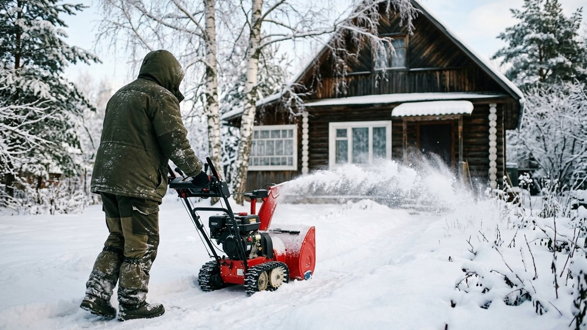
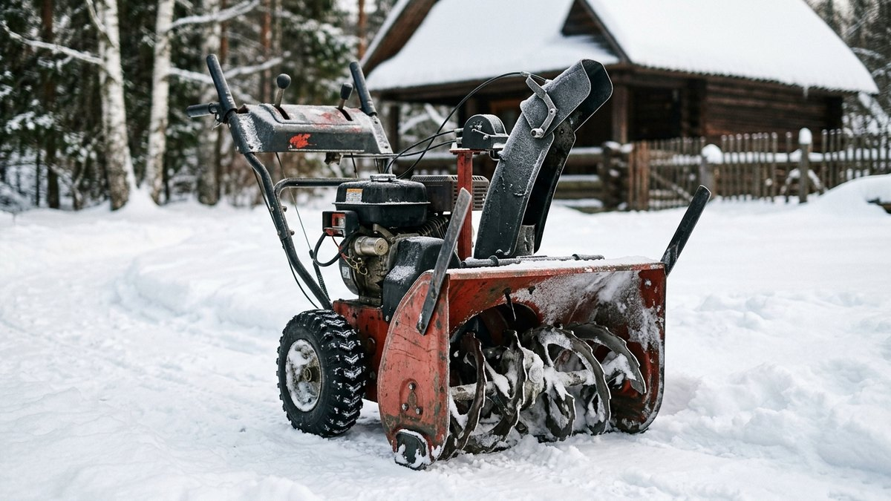
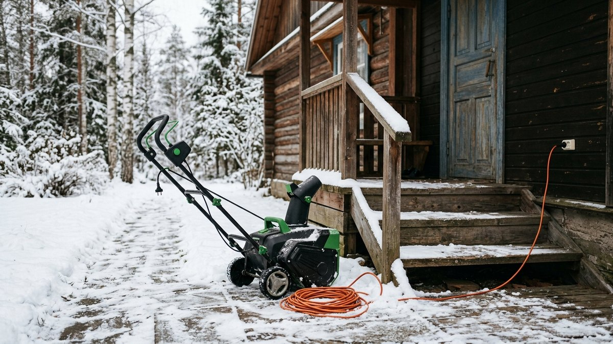
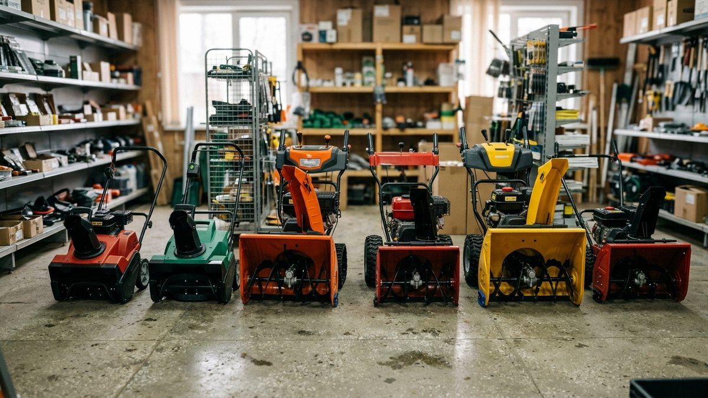
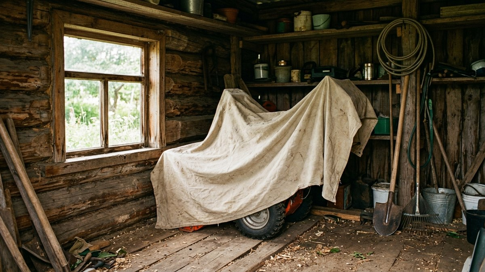
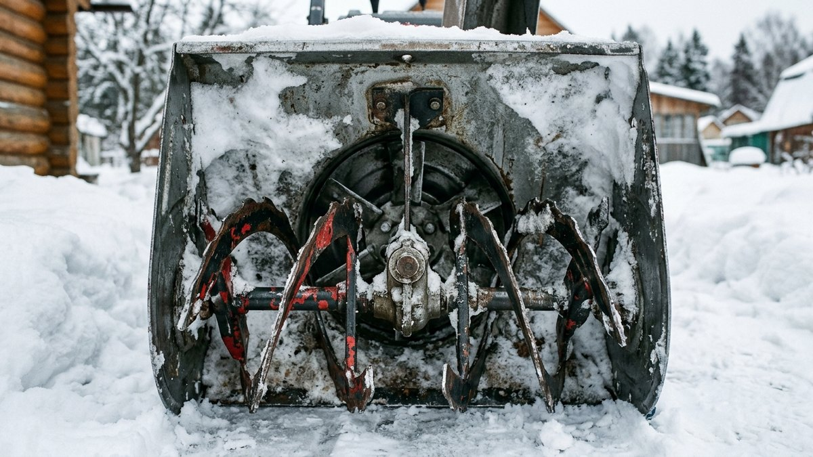

# Какой снегоуборщик выбрать для дачи: электрический или бензиновый

Если на участке уже есть [мотоблок](https://mir-doma.pro/kakoy-motoblok-vybrat/),
проще докупить снегоуборочную насадку к нему, а не отдельную машину — это
разобрано в статье про выбор мотоблока. Но для тех, кому мотоблок не
нужен весь остальной год, отдельный снегоуборщик — однофункциональная и
часто более простая в хранении и запуске машина. Разберём, какие типы
бывают и как выбрать под свой участок, а не переплатить за мощность,
которая не понадобится.

## Какие бывают снегоуборщики

- **Электрический** — лёгкий, тихий, не требует бензина и обслуживания
  двигателя, но привязан к розетке и удлинителю, поэтому подходит для
  небольших расчищаемых площадей рядом с домом.
- **Одноступенчатый бензиновый** — шнек сам захватывает и отбрасывает
  снег за один проход, лёгкий и манёвренный, но плохо справляется с
  плотным слежавшимся снегом и льдом на дорожке.
- **Двухступенчатый бензиновый** — шнек подаёт снег к отдельной крыльчатке
  (ротору), которая уже отбрасывает его в сторону; справляется с глубоким
  и плотным снегом, но тяжелее, дороже и требует больше места для
  хранения.

## Сравнение: что выбрать под участок

| Критерий | Электрический | Одноступенчатый бензиновый | Двухступенчатый бензиновый |
|---|---|---|---|
| Площадь под силу | Дорожки, до 10–15 см снега | Средний участок, до 20–25 см рыхлого снега | Большой участок, любая глубина и плотность |
| Плотный/слежавшийся снег | Не справляется | Справляется плохо | Справляется хорошо |
| Автономность | Нужна розетка рядом | Полная (бак топлива) | Полная (бак топлива) |
| Обслуживание | Минимальное | Как у любого бензоинструмента | Как у любого бензоинструмента, сложнее |
| Хранение | Компактный | Компактный | Требует места в сарае |
| Ориентир по цене | Низкая | Средняя | Высокая |

## Как подобрать снегоуборщик под свой участок

<!-- wp:html -->

<h3 class="md-sn__title">Подбор снегоуборщика</h3>

Отметьте площадь расчистки и обычный характер снега в вашем регионе.

<label class="md-sn__f">Площадь расчистки, м²<input type="number" id="snArea" value="60" min="5" max="2000" step="5"></label>
<label class="md-sn__f">Обычная глубина снегопада
<select id="snDepth">
<option value="1">До 10 см, снег обычно рыхлый</option>
<option value="2" selected>10–20 см, бывает и плотный</option>
<option value="3">Больше 20 см, часто наметает сугробы</option>
</select></label>
<label class="md-sn__f">Есть розетка рядом с расчищаемой зоной
<select id="snPower">
<option value="yes">Да</option>
<option value="no" selected>Нет</option>
</select></label>

—

<!-- /wp:html -->

## Что выбрать под свою задачу

- **Только расчистить дорожку к калитке и крыльцу** — электрический
  снегоуборщик: компактный, не требует бензина и заводится сразу даже в
  мороз. [Электрические снегоуборщики в каталоге](aff:vi-snegouborshchiki-elektricheskie)
- **Участок среднего размера, снег не всегда рыхлый** — одноступенчатый
  бензиновый: справляется с коркой льда на дорожке лучше электрического,
  но остаётся лёгким и манёвренным. [Одноступенчатые бензиновые снегоуборщики в каталоге](aff:vi-snegouborshchiki-odnostupenchatye)
- **Большой участок, снега наметает много** — двухступенчатый бензиновый:
  дороже и тяжелее, зато не забивается и не останавливается на плотном
  снегу. [Двухступенчатые снегоуборщики в каталоге](aff:vi-snegouborshchiki-dvuhstupenchatye)

## Частые ошибки

- **Берут одноступенчатый снегоуборщик под плотный слежавшийся снег.**
  Машина забивается и глохнет именно тогда, когда снегоуборщик нужнее
  всего — после оттепели и повторного заморозка.
- **Электрический снегоуборщик без розетки поблизости.** Удлинитель на
  30–40 метров по снегу и морозу — не то же самое, что розетка в
  пяти метрах от крыльца; стоит заранее прикинуть реальный маршрут кабеля.
- **Экономят на ширине захвата.** Слишком узкий снегоуборщик на большой
  площади превращает уборку в долгую нарезку кругов, хотя разница в цене
  между соседними моделями по ширине захвата обычно небольшая.
- **Не проверяют, куда убирать снег зимой заранее.** Если участок с двух
  сторон закрыт забором, снегоуборщик выбрасывает снег в единственном
  доступном направлении — и через пару снегопадов там вырастает вал выше
  самой машины.

## Частые вопросы

### Какой снегоуборщик выбрать для дачи

Зависит от площади и характера снега: для дорожки у крыльца хватит
электрического, для среднего участка — одноступенчатого бензинового, а
для большой площади с глубокими снегопадами — двухступенчатого. Точный
ориентир — в калькуляторе выше.

### Что лучше: снегоуборщик или насадка на мотоблок

Если мотоблок на участке уже есть и используется весь сезон для других
задач, снегоуборочная насадка обычно выгоднее отдельной машины — подробнее
в статье [какой мотоблок выбрать](https://mir-doma.pro/kakoy-motoblok-vybrat/).
Если мотоблока нет и не планируется, отдельный снегоуборщик проще в
хранении и запуске.

### Можно ли купить бюджетный снегоуборщик, который реально работает

Да, но в бюджетном сегменте разумно ограничиться электрической или лёгкой
одноступенчатой моделью под небольшую площадь — бюджетный двухступенчатый
снегоуборщик почти всегда означает экономию на мощности двигателя и
качестве шнека, а не только на бренде.

### Заводится ли бензиновый снегоуборщик в сильный мороз

Да, но с оговоркой: старое несвежее топливо и разряженный аккумулятор
(если запуск электрический) — самые частые причины, по которым
снегоуборщик не заводится именно в мороз, а не сама низкая температура
как таковая.
