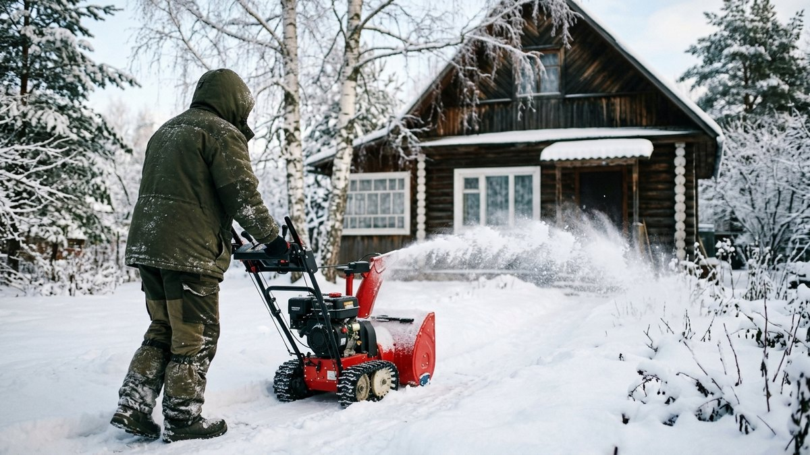
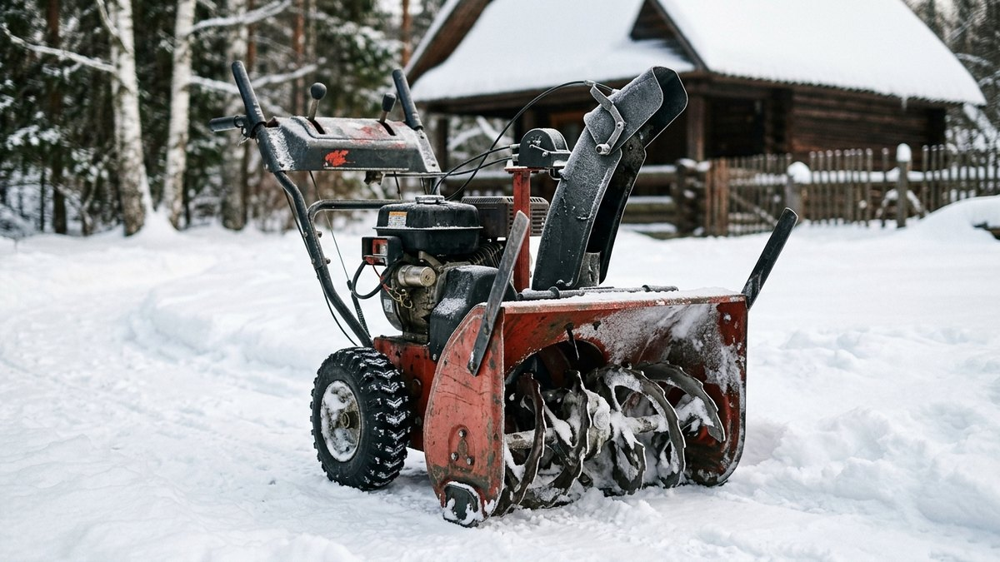
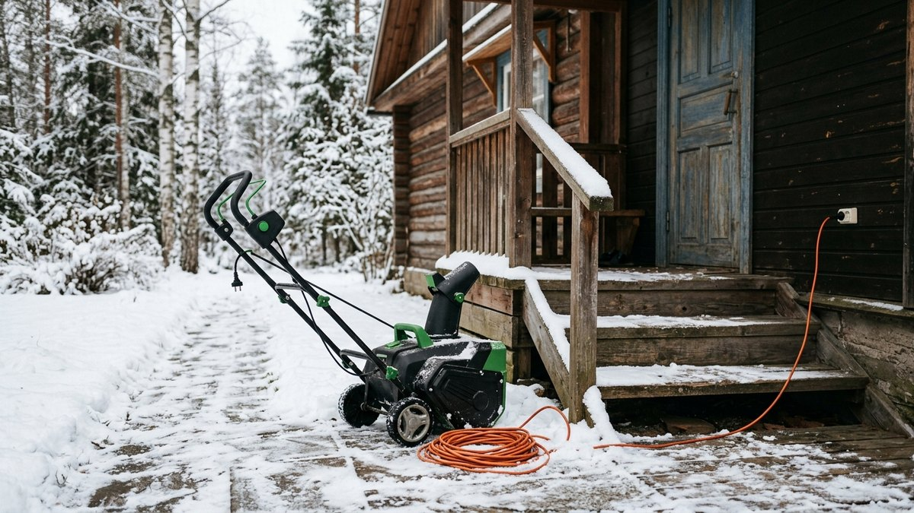
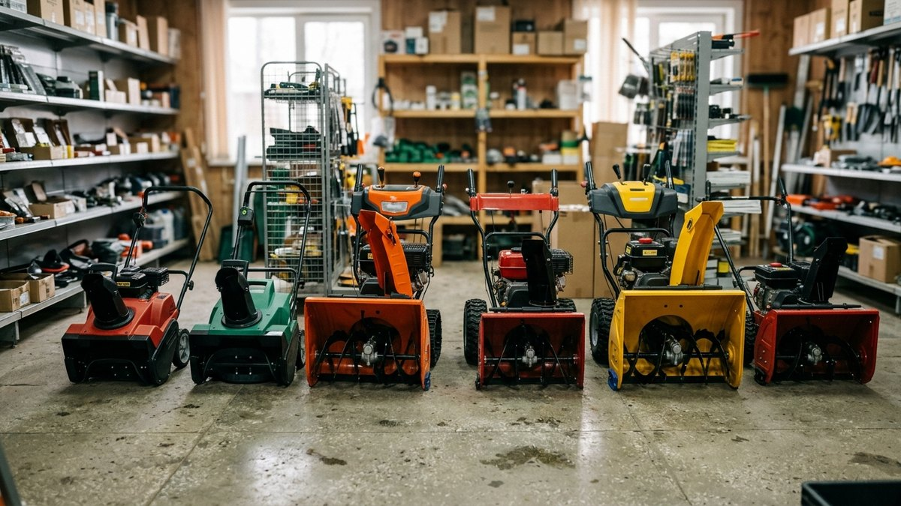
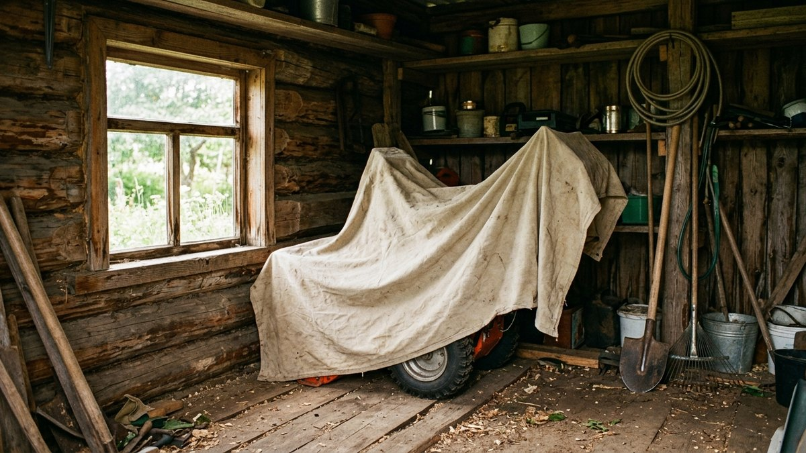
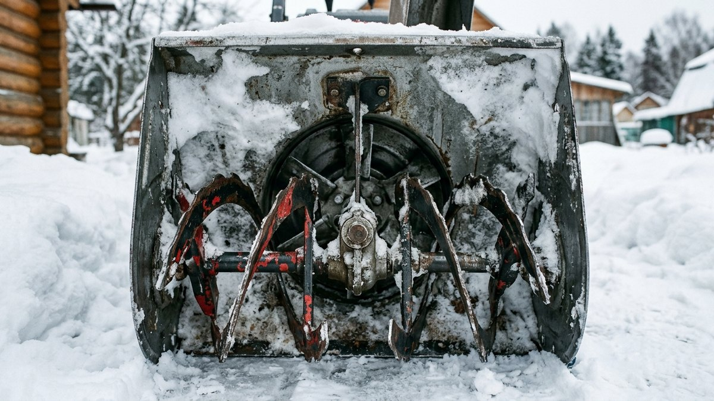

# Какой снегоуборщик выбрать для дачи: электрический или бензиновый

Если на участке уже есть [мотоблок](https://mir-doma.pro/kakoy-motoblok-vybrat/),
проще докупить снегоуборочную насадку к нему, а не отдельную машину — это
разобрано в статье про выбор мотоблока. Но для тех, кому мотоблок не
нужен весь остальной год, отдельный снегоуборщик — однофункциональная и
часто более простая в хранении и запуске машина. Разберём, какие типы
бывают и как выбрать под свой участок, а не переплатить за мощность,
которая не понадобится.

## Какие бывают снегоуборщики

- **Электрический** — лёгкий, тихий, не требует бензина и обслуживания
  двигателя, но привязан к розетке и удлинителю, поэтому подходит для
  небольших расчищаемых площадей рядом с домом.
- **Одноступенчатый бензиновый** — шнек сам захватывает и отбрасывает
  снег за один проход, лёгкий и манёвренный, но плохо справляется с
  плотным слежавшимся снегом и льдом на дорожке.
- **Двухступенчатый бензиновый** — шнек подаёт снег к отдельной крыльчатке
  (ротору), которая уже отбрасывает его в сторону; справляется с глубоким
  и плотным снегом, но тяжелее, дороже и требует больше места для
  хранения.

## Сравнение: что выбрать под участок

| Критерий | Электрический | Одноступенчатый бензиновый | Двухступенчатый бензиновый |
|---|---|---|---|
| Площадь под силу | Дорожки, до 10–15 см снега | Средний участок, до 20–25 см рыхлого снега | Большой участок, любая глубина и плотность |
| Плотный/слежавшийся снег | Не справляется | Справляется плохо | Справляется хорошо |
| Автономность | Нужна розетка рядом | Полная (бак топлива) | Полная (бак топлива) |
| Обслуживание | Минимальное | Как у любого бензоинструмента | Как у любого бензоинструмента, сложнее |
| Хранение | Компактный | Компактный | Требует места в сарае |
| Ориентир по цене | Низкая | Средняя | Высокая |

## На какие характеристики смотреть при покупке

Тип машины — только первая развилка. Внутри одного типа модели различаются в цене вдвое, и разница не всегда в бренде. Ориентиры по ходовым моделям:

| Характеристика | Электрический | Одноступенчатый бензиновый | Двухступенчатый бензиновый |
|---|---|---|---|
| Ширина захвата | 30–46 см | 51–56 см | 56–76 см |
| Высота захвата | 15–25 см | 25–33 см | 45–55 см |
| Мощность | 1,6–2,2 кВт | 4–6 л.с. | 6–11 л.с. |
| Дальность выброса | 5–8 м | 6–10 м | 10–15 м |
| Масса | 12–17 кг | 25–40 кг | 60–120 кг |
| Привод колёс | нет, толкаете сами | нет, шнек подтягивает машину | самоходный, у мощных — несколько скоростей |

Что ещё стоит проверить на витрине:

- **Шнек.** У электрических и одноступенчатых он обрезиненный и касается покрытия: чисто снимает снег до плитки, но не берёт наст и лёд. Металлический зубчатый шнек двухступенчатой машины ломает корку, но к покрытию не прижимается — остаётся слой 1–2 см.
- **Регулируемые полозья.** На двухступенчатой машине полозья задают зазор между ковшом и землёй. На гравии и щебне их поднимают на 2–3 см, иначе шнек будет швырять камни. Одноступенчатыми машинами гравийные дорожки не чистят вовсе: шнек цепляет покрытие — подробнее о таком покрытии в статье про [дорожку из щебня](https://mir-doma.pro/dorozhka-iz-shchebnya-svoimi-rukami/).
- **Колёса или гусеницы.** Колёса проще и манёвреннее. Гусеницы нужны на уклоне и на подъездах, которые раскатываются до льда.
- **Электростартер от 220 В.** На бензиновой машине это главная страховка в мороз: если ручной стартер не взял с 3–4 рывков, втыкаете вилку в розетку и заводите от сети.
- **Поворот жёлоба с рукоятки.** Когда жёлоб поворачивается рычагом у рук, а не вручную у самого ковша, направление выброса меняется без остановки — а на участке с забором с двух сторон это делается на каждом проходе.
- **Запасные срезные болты.** Шнек крепится к валу болтами, которые специально срезаются, если в ковш попадёт камень или ветка — так спасается редуктор. К новой машине обычно прилагается 2–4 штуки; докупите ещё несколько того же класса прочности, обычный болт вместо срезного превращает поломку на 50 рублей в ремонт редуктора.

## Как подобрать снегоуборщик под свой участок

<!-- wp:html -->

<h3 class="md-sn__title">Подбор снегоуборщика</h3>

Отметьте площадь расчистки и обычный характер снега в вашем регионе.

<label class="md-sn__f">Площадь расчистки, м²<input type="number" id="snArea" value="60" min="5" max="2000" step="5"></label>
<label class="md-sn__f">Обычная глубина снегопада
<select id="snDepth">
<option value="1">До 10 см, снег обычно рыхлый</option>
<option value="2" selected>10–20 см, бывает и плотный</option>
<option value="3">Больше 20 см, часто наметает сугробы</option>
</select></label>
<label class="md-sn__f">Есть розетка рядом с расчищаемой зоной
<select id="snPower">
<option value="yes">Да</option>
<option value="no" selected>Нет</option>
</select></label>

—

<!-- /wp:html -->

## Что выбрать под свою задачу

- **Только расчистить дорожку к калитке и крыльцу** — электрический
  снегоуборщик: компактный, не требует бензина и заводится сразу даже в
  мороз. [Электрические снегоуборщики в каталоге](aff:vi-snegouborshchiki-elektricheskie)
- **Участок среднего размера, снег не всегда рыхлый** — одноступенчатый
  бензиновый: справляется с коркой льда на дорожке лучше электрического,
  но остаётся лёгким и манёвренным. [Одноступенчатые бензиновые снегоуборщики в каталоге](aff:vi-snegouborshchiki-odnostupenchatye)
- **Большой участок, снега наметает много** — двухступенчатый бензиновый:
  дороже и тяжелее, зато не забивается и не останавливается на плотном
  снегу. [Двухступенчатые снегоуборщики в каталоге](aff:vi-snegouborshchiki-dvuhstupenchatye)

## Электрический снегоуборщик: какой нужен удлинитель

Электрическая машина потребляет 1,6–2,2 кВт — это ток 7–10 А, как у мощного пылесоса или утюга. Тонкий бытовой удлинитель на такой нагрузке греется, а напряжение на длинном проводе проседает, и мотор теряет тягу именно на мокром снегу.

| Длина удлинителя | Сечение жил при мощности до 2,2 кВт |
|---|---|
| до 20 м | 3×1,5 мм² |
| 20–40 м | 3×2,5 мм² |
| больше 40 м | электроснегоуборщик лучше не брать — нужна розетка ближе или бензиновая машина |

Кабель берите в резиновой изоляции (марка КГ или удлинитель с пометкой о работе на морозе): обычная ПВХ-изоляция на морозе дубеет и трескается при изгибах. Розетка — только через УЗО: работа идёт по мокрому снегу. Если уличной розетки у дома нет, как её вывести и защитить — в статье про [схему электропроводки на даче](https://mir-doma.pro/skhema-elektroprovodki-na-dache/).

Начинайте у розетки и двигайтесь от неё, отбрасывая кабель на уже расчищенную сторону: так шнек не наедет на провод.

## Как не сломать снегоуборщик и не покалечиться

- **Никогда не прочищайте забитый жёлоб рукой**, даже при заглушенном двигателе: у застрявшего в снегу шнека и крыльчатки остаётся напряжение, и при выбивании пробки они проворачиваются. Это самая частая травма со снегоуборщиками. Заглушите мотор, дождитесь остановки и выбейте снег палкой или пластиковой лопаткой, которая обычно идёт в комплекте.
- **Пройдите участок до первого снега.** Шланг, забытый кирпич, кусок бордюра под снегом — это срезанные болты в лучшем случае и погнутый шнек в худшем.
- **Масло — зимнее.** Для четырёхтактных двигателей снегоуборщиков производители обычно указывают вязкость 5W-30. Летнее масло в мороз густеет, и двигатель плохо проворачивается при запуске.
- **После работы дайте поработать 1–2 минуты вхолостую** с включённым шнеком: он выбросит остатки снега, и к следующему разу ковш не примёрзнет к валу.
- **Бензин — свежий.** Топливо старше 1–2 месяцев теряет лёгкие фракции, и именно с ним машина хуже всего заводится в мороз. На лето бак либо сливают до конца, либо заправляют со стабилизатором топлива. Масло меняют в конце сезона, а не перед первым снегом.

Хранят машину летом в сухом месте, накрыв от пыли, но не плёнкой вплотную: под ней собирается конденсат. Если места в доме нет, удобно отвести угол в [сарае](https://mir-doma.pro/saray-svoimi-rukami/).

## Частые ошибки

- **Берут одноступенчатый снегоуборщик под плотный слежавшийся снег.**
  Машина забивается и глохнет именно тогда, когда снегоуборщик нужнее
  всего — после оттепели и повторного заморозка.
- **Электрический снегоуборщик без розетки поблизости.** Удлинитель на
  30–40 метров по снегу и морозу — не то же самое, что розетка в
  пяти метрах от крыльца; стоит заранее прикинуть реальный маршрут кабеля.
- **Экономят на ширине захвата.** Слишком узкий снегоуборщик на большой
  площади превращает уборку в долгую нарезку кругов, хотя разница в цене
  между соседними моделями по ширине захвата обычно небольшая.
- **Не проверяют, куда убирать снег зимой заранее.** Если участок с двух
  сторон закрыт забором, снегоуборщик выбрасывает снег в единственном
  доступном направлении — и через пару снегопадов там вырастает вал выше
  самой машины.

## Частые вопросы

### Какой снегоуборщик выбрать для дачи

Зависит от площади и характера снега: для дорожки у крыльца хватит
электрического, для среднего участка — одноступенчатого бензинового, а
для большой площади с глубокими снегопадами — двухступенчатого. Точный
ориентир — в калькуляторе выше.

### Что лучше: снегоуборщик или насадка на мотоблок

Если мотоблок на участке уже есть и используется весь сезон для других
задач, снегоуборочная насадка обычно выгоднее отдельной машины — подробнее
в статье [какой мотоблок выбрать](https://mir-doma.pro/kakoy-motoblok-vybrat/).
Если мотоблока нет и не планируется, отдельный снегоуборщик проще в
хранении и запуске.

### Можно ли купить бюджетный снегоуборщик, который реально работает

Да, но в бюджетном сегменте разумно ограничиться электрической или лёгкой
одноступенчатой моделью под небольшую площадь — бюджетный двухступенчатый
снегоуборщик почти всегда означает экономию на мощности двигателя и
качестве шнека, а не только на бренде.

### Заводится ли бензиновый снегоуборщик в сильный мороз

Да, но с оговоркой: старое несвежее топливо и разряженный аккумулятор
(если запуск электрический) — самые частые причины, по которым
снегоуборщик не заводится именно в мороз, а не сама низкая температура
как таковая.

### Какая ширина захвата нужна для дачи

Для дорожки от калитки до крыльца хватит 40–50 см — это два-три прохода на дорожку шириной метр. Для площадки под машину и дорожек на 300–500 м² берут 56–62 см, на большую площадь — 66–76 см. Шире на дачу почти не нужно: машина становится тяжёлой и не проходит в узкую калитку. Ширину и время расчистки под вашу площадь покажет калькулятор выше.

### Можно ли чистить снегоуборщиком тротуарную плитку и гравий

Плитку — да, лучше одноступенчатой или электрической машиной с обрезиненным шнеком: она снимает снег до покрытия и не царапает его. Гравий и щебень — только двухступенчатой, с полозьями, поднятыми на 2–3 см: иначе камни полетят в окна и в соседей.

### Сколько лет служит снегоуборщик

Электрический при бережном хранении — 7–10 сезонов, ресурс ограничивают щётки мотора и износ обрезиненного шнека, его меняют как расходник. Бензиновый — 10–15 сезонов и больше, если менять масло каждый сезон и не оставлять бензин в баке на лето.
