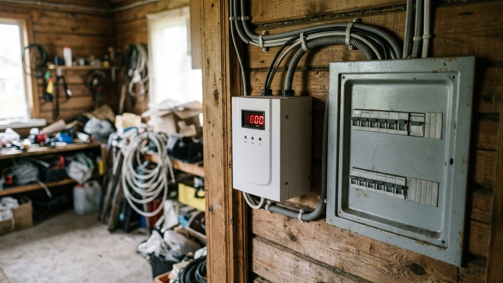
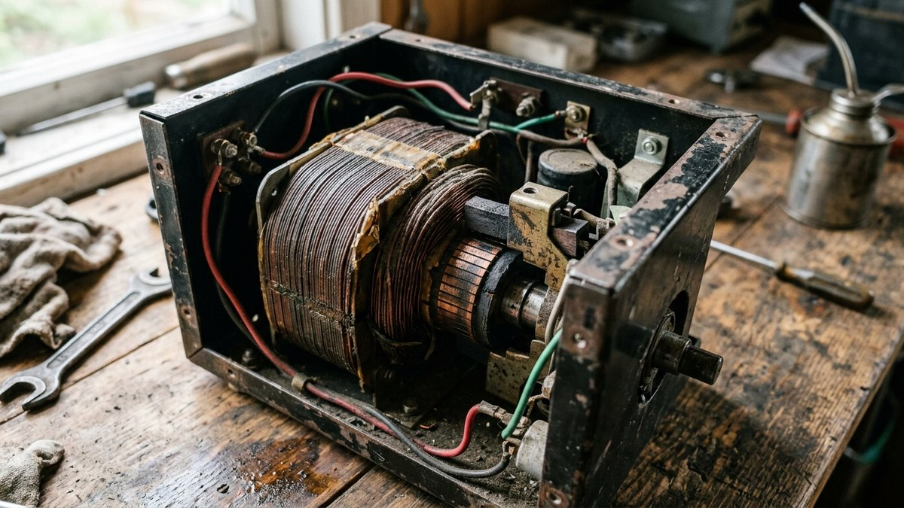
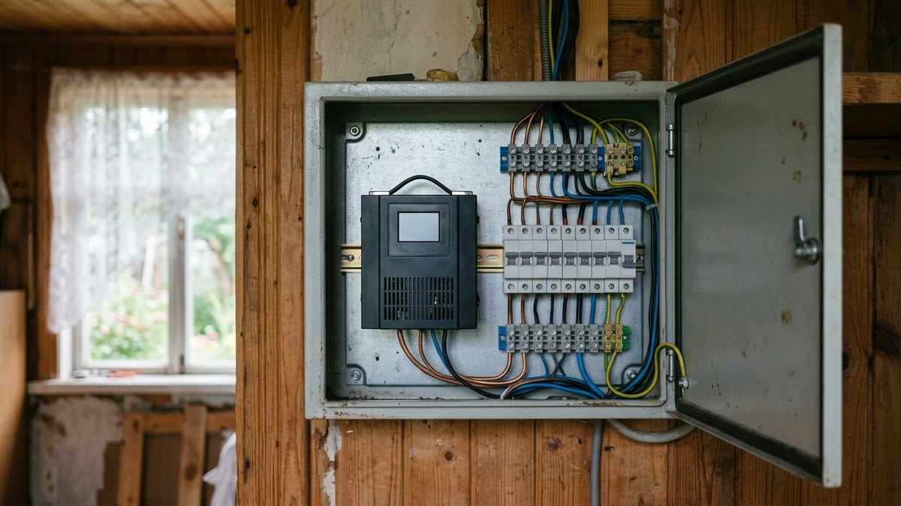
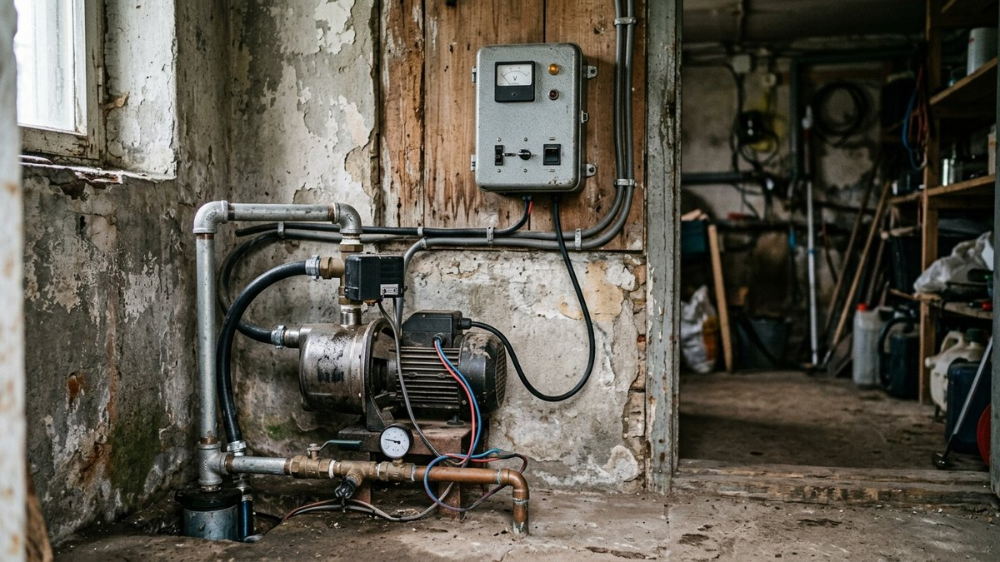
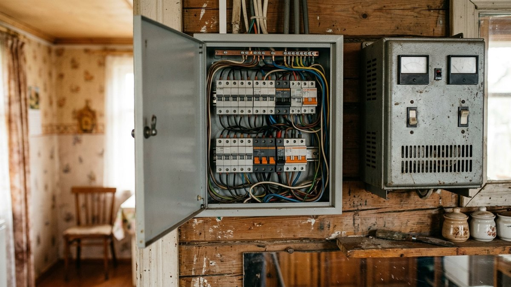
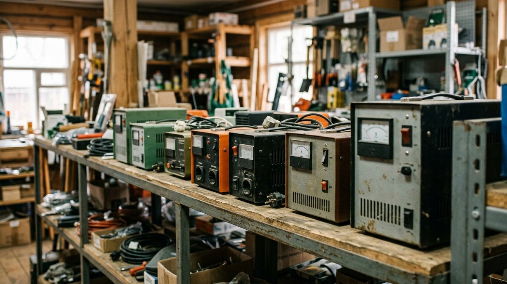

# Какой стабилизатор напряжения выбрать для дачи: тип и мощность

В СНТ и на удалённых от подстанции участках напряжение в сети редко
держится ровно 220 В — вечером, когда соседи включают насосы и
обогреватели, оно проседает до 180–190 В, а ночью на пустой линии может
подскочить выше нормы. От этого страдает не лампочка, а техника с
электродвигателем и электроникой: [насос скважины](https://mir-doma.pro/skvazhina-ili-kolodec/),
котёл, холодильник. Разберём, чем отличаются типы стабилизаторов и как
посчитать нужную мощность, чтобы не переплатить и не остаться без запаса.

## Какие бывают стабилизаторы напряжения

- **Релейный** — переключает обмотки трансформатора ступенями по 10–20 В
  с помощью реле. Самый дешёвый и надёжный вариант, но коррекция идёт
  скачками и слышна щелчками реле — для чувствительной электроники
  (насосный частотник, котёл с платой управления) не лучший выбор.
- **Электромеханический (сервоприводный)** — вместо реле напряжение
  плавно подстраивает электромотор, двигающий щётку по обмотке. Точность
  выше, работает бесшумнее реле, но медленнее реагирует на резкий скачок
  и боится частых пусков — не рассчитан на постоянные включения-выключения.
- **Инверторный (двойного преобразования)** — переводит входное
  напряжение в постоянный ток и обратно в чистую синусоиду 220 В,
  полностью независимо от качества сети на входе. Самый точный и
  быстрый тип, держит нагрузку без просадок даже при сильных перепадах,
  но и самый дорогой из трёх.

## Сравнение: что выбрать под сценарий

| Критерий | Релейный | Электромеханический | Инверторный |
|---|---|---|---|
| Точность коррекции | Ступенями, ±10–15 В | Плавно, ±3–5 В | Плавно, ±1–2 В |
| Скорость реакции | Быстрая | Средняя | Мгновенная |
| Шум | Щелчки реле | Тихий гул мотора | Бесшумный |
| Ресурс при частых перепадах | Высокий | Средний, боится частых пусков | Высокий |
| Для насоса, котла, электроники | Терпимо | Хорошо | Отлично |
| Цена за киловатт | Низкая | Средняя | Высокая |

## Как рассчитать нужную мощность

Мощность стабилизатора берут с запасом от суммарной нагрузки
подключаемых приборов — так пусковые токи насоса или холодильного
компрессора не срезают напряжение в момент запуска. Ниже — калькулятор:
впишите суммарную мощность приборов, которые будут через него запитаны,
и качество сети.

<!-- wp:html -->

<h3 class="md-st__title">Калькулятор мощности стабилизатора</h3>

Ориентировочный расчёт по суммарной нагрузке приборов и качеству сети.

<label class="md-st__f">Суммарная мощность приборов, кВт<input type="number" id="stLoad" value="3.5" min="0.5" max="30" step="0.1"></label>
<label class="md-st__f">Есть насос, котёл или другой мотор
<select id="stMotor">
<option value="1" selected>Да, есть приборы с двигателем</option>
<option value="0">Нет, только освещение и электроника</option>
</select></label>
<label class="md-st__f">Качество сети
<select id="stGrid">
<option value="1">Стабильная, просадки редкие</option>
<option value="1.3" selected>Средняя (СНТ, вечерние просадки)</option>
<option value="1.6">Плохая, частые сильные перепады</option>
</select></label>

Нужная мощность<b id="stKva">6.4 кВА</b>

Тип<b id="stRec">—</b>

<button type="button" id="stCopy" class="md-st__btn md-st__btn--main">Скопировать результат</button>
<a id="stVk" class="md-st__btn md-st__btn--vk" href="#" target="_blank" rel="noopener noreferrer">Поделиться ВКонтакте</a>
<a id="stTg" class="md-st__btn md-st__btn--tg" href="#" target="_blank" rel="noopener noreferrer">Поделиться в Telegram</a>
<button type="button" id="stShareNative" class="md-st__btn" hidden>Поделиться…</button>

<!-- /wp:html -->

Если на участке уже стоит [генератор на случай отключений](https://mir-doma.pro/kakoy-generator-nuzhen-dlya-dachi/),
стабилизатор не заменяет его функцию, а решает другую задачу — держит
напряжение ровным, пока внешняя линия вообще под напряжением, генератор
же берёт нагрузку при полном отключении. Это разные приборы для разных
ситуаций, и на участке со слабой сетью и частыми блэкаутами пригождаются
оба.

Стабилизатор компенсирует просадки напряжения, но не решает нехватку самой выделенной мощности — если приборов больше, чем позволяют киловатты по документам, автоматы будут выбивать независимо от стабилизатора. Как узнать реальную разрешённую мощность и подать заявку на увеличение через сетевую организацию, разобрано в статье [«Как увеличить мощность электричества на участке»](https://mir-doma.pro/kak-uvelichit-moshchnost-elektrichestva-na-uchastke/).

## Что выбрать под свою задачу

- **Только холодильник и освещение** — хватит релейного стабилизатора
  небольшой мощности, скачки для этой техники не критичны.
- **Насос скважины, [септик](https://mir-doma.pro/septik-dlya-dachi/)
  или другое оборудование с мотором** — электромеханический или
  инверторный, релейный слишком грубо ступенчатый для частых пусков.
- **Котёл, насосная станция и электроника одновременно, [проводка](https://mir-doma.pro/skhema-elektroprovodki-na-dache/)
  на весь дом** — инверторный на весь щиток: держит нагрузку без просадок
  при одновременном пуске нескольких приборов.
- **Сильно просевшая сеть, напряжение регулярно ниже 180 В** — стабилизатор
  с расширенным диапазоном входного напряжения (уточняется в паспорте
  модели), обычный рассчитан на диапазон 140–260 В и на глубокую просадку
  не рассчитан.

## Частые ошибки

- **Берут стабилизатор впритык по паспортной мощности приборов** — без
  запаса на пусковой ток мотора стабилизатор уходит в защиту при каждом
  включении насоса или компрессора холодильника.
- **Ставят релейный на линию с частотником насосной станции** —
  ступенчатая коррекция сбивает работу электроники частотного
  преобразователя, он либо ошибается, либо изнашивается быстрее.
- **Не проверяют диапазон входного напряжения перед покупкой** —
  бюджетные модели рассчитаны на просадку не глубже 140–150 В, а в
  дальнем СНТ вечером бывает и 120 В.
- **Ставят один стабилизатор на весь дом без расчёта одновременной
  нагрузки** — если насос, котёл и духовка включаются одновременно, а
  запас взят только под средний расход, стабилизатор уходит в перегрузку.

## Частые вопросы

### Какой стабилизатор напряжения выбрать для дачи

Для насоса, котла и другой техники с мотором — электромеханический или
инверторный с запасом мощности минимум 25–30% сверх суммарной нагрузки.
Для освещения и бытовой электроники без моторов хватает релейного.

### Нужен ли стабилизатор, если уже есть генератор

Да, это разные задачи: генератор даёт питание при полном отключении,
стабилизатор выравнивает напряжение, пока сеть работает, но нестабильна.
На участке со слабой линией и частыми блэкаутами приборы дополняют друг
друга, а не заменяют.

### Чем инверторный стабилизатор лучше электромеханического

Инверторный полностью пересобирает синусоиду и не зависит от скорости
механической подстройки, поэтому держит нагрузку без просадки даже при
резком скачке и не изнашивается от частых пусков. Электромеханический
дешевле, но не рассчитан на постоянные включения-выключения мотора.

### Какой мощности стабилизатор нужен на дом с насосом и котлом

Ориентир — суммарная мощность всех приборов, которые будут работать
одновременно, умноженная на коэффициент запаса 1,25–1,6 в зависимости от
качества сети и деленная на коэффициент мощности 0,8. Точный расчёт —
в калькуляторе выше.

### Можно ли ставить стабилизатор только на розетку с холодильником

Можно, если остальная техника не чувствительна к перепадам напряжения —
локальный стабилизатор на одну линию дешевле, чем на весь щиток. Но
насос и котёл в этом случае остаются без защиты.

## Где посмотреть модели

- [Релейные стабилизаторы в каталоге](aff:vi-stabilizatory-releynye) — бюджетный вариант для освещения и техники без мотора.
- [Электромеханические стабилизаторы в каталоге](aff:vi-stabilizatory-elektromehanicheskie) — для насоса и котла с умеренным бюджетом.
- [Инверторные стабилизаторы в каталоге](aff:vi-stabilizatory-invertornye) — на весь щиток при слабой и нестабильной сети.

