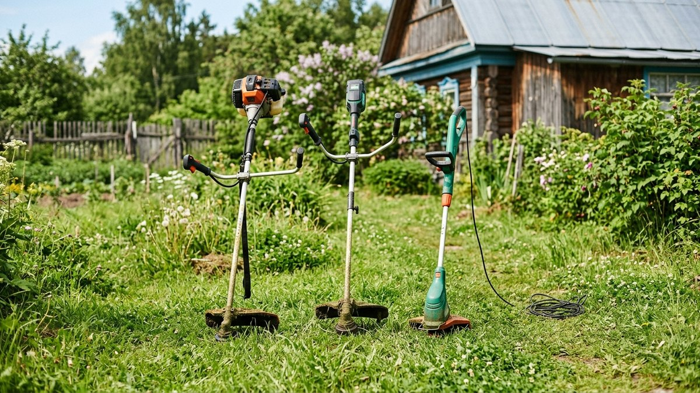
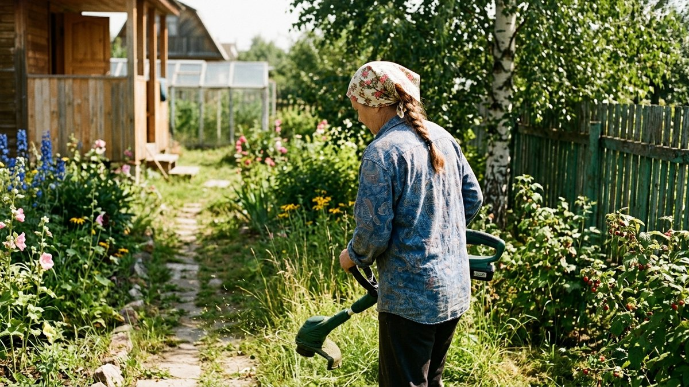
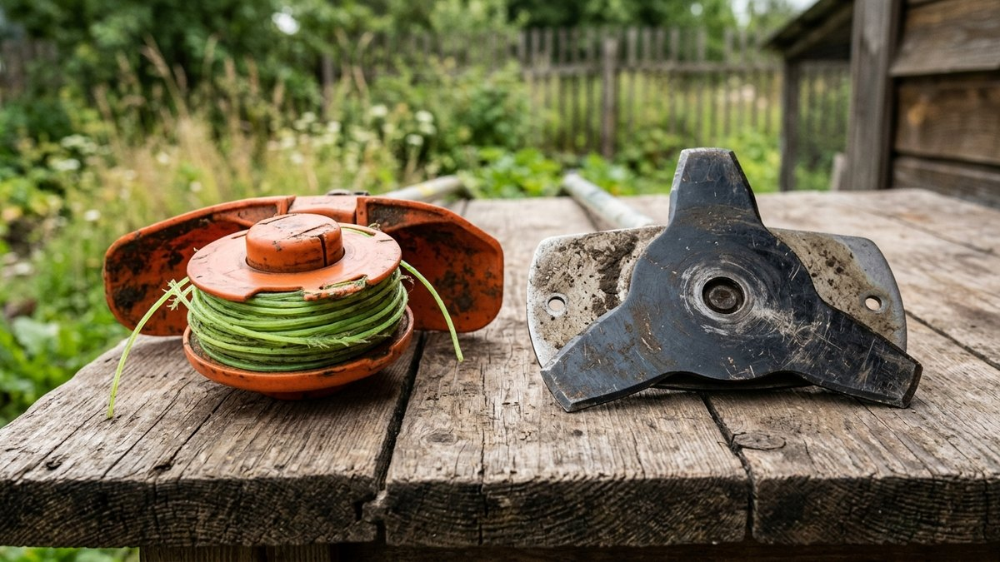
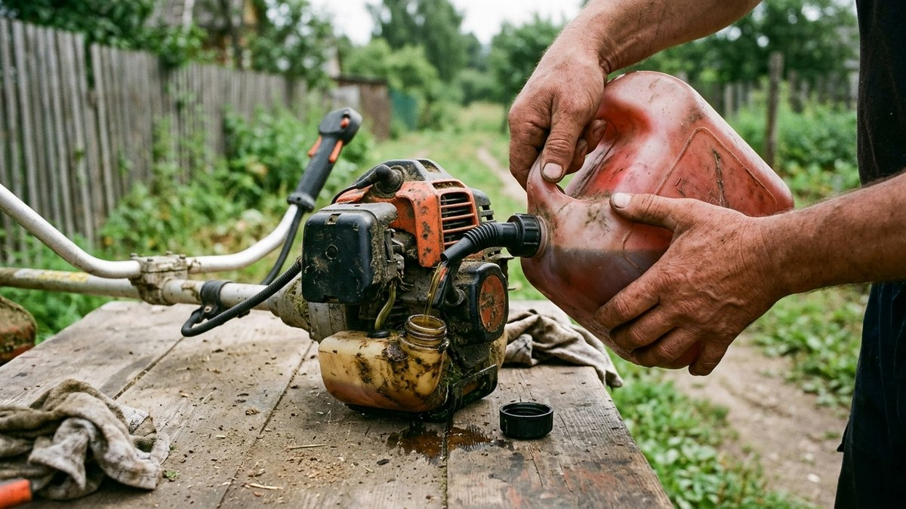
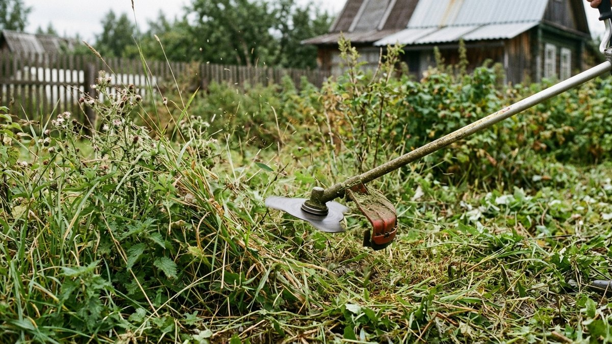
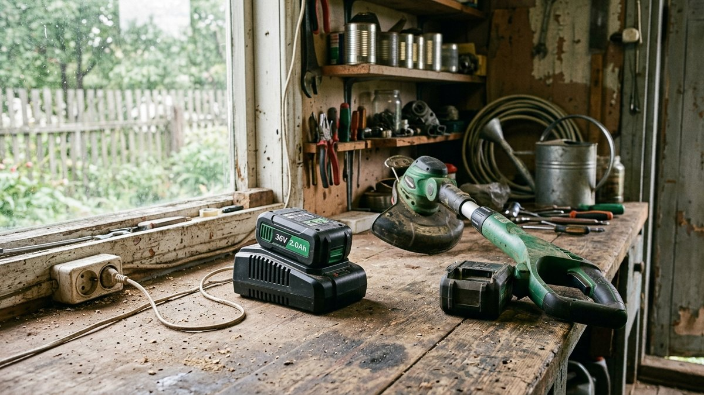

На полке магазина триммеры для дачи делятся на три принципиально разных
типа питания — бензиновый, аккумуляторный и сетевой электрический — и
разница между ними больше, чем просто цена. Один тянет высокую жёсткую
траву и борщевик без перегрева, другой удобен для еженедельного покоса
газона без запаха бензина и шума, третий ограничен длиной удлинителя.
Разбираем, какой тип подойдёт под конкретный участок, сколько это стоит и
на что смотреть при покупке, кроме мощности в характеристиках.

## Чем принципиально отличаются три типа триммеров

Тип питания определяет не только удобство, но и то, какую траву триммер
физически способен скосить. Двигатель внутреннего сгорания даёт стабильную
мощность независимо от заряда или длины провода — поэтому все триммеры для
жёсткой травы, молодой поросли и борщевика бензиновые. Аккумуляторные и
сетевые модели рассчитаны на траву и сорняки помягче: газон, обычные
сорные травы, аккуратную обработку кромок дорожек и клумб.

## Сравнение бензинового, аккумуляторного и сетевого триммера

| Критерий | Бензиновый | Аккумуляторный | Сетевой электрический |
|---|---|---|---|
| Мощность | Высокая, тянет жёсткую траву и поросль | Средняя, для газона и мягких сорняков | Средняя, зависит от модели |
| Автономность | Полная, ограничена запасом топлива | 20–40 минут на одном заряде | Ограничена длиной удлинителя |
| Вес | Тяжелее (5–7 кг с баком) | Средний (3–4,5 кг) | Лёгкий (2,5–3,5 кг) |
| Шум и запах | Громкий, запах выхлопа | Тихий, без запаха | Тихий, без запаха |
| Обслуживание | Топливная смесь, свеча, воздушный фильтр | Зарядка аккумулятора, следить за циклами заряда | Минимальное |
| Цена | Средняя-высокая + расход топлива | Высокая (цена батареи в комплекте) | Низкая-средняя |
| Площадь участка | От 15 соток и заросшие участки | До 10–12 соток регулярного покоса | До 6–8 соток при доступе к розетке |

### Когда точно нужен бензиновый триммер

Если на участке есть заросли высокой жёсткой травы, молодая древесная
поросль по краю леса или борщевик, аккумуляторный и сетевой триммер просто
не справятся — леска или нож будут либо застревать, либо перегревать
двигатель. Бензиновый триммер также незаменим на больших участках без
доступа к розетке в нужной точке и там, где предстоит несколько часов
непрерывной работы без пауз на подзарядку.

### Когда достаточно аккумуляторного

Аккумуляторный триммер закрывает большинство типичных дачных задач:
регулярный покос газона, обработка кромок вдоль дорожек и грядок, стрижка
травы вокруг деревьев и построек, куда не подлезть колёсной косилкой. Для
участка до 10–12 соток одного заряда обычно хватает на весь объём работы
за раз; для больших площадей стоит сразу брать сменный аккумулятор.

### Когда хватит сетевого электрического

Сетевой триммер — самый бюджетный и лёгкий вариант, подходит, если участок
компактный, розетка есть в пределах длины удлинителя (обычно 20–30 м
хватает на 5–6 соток) и трава не запущена. Минус очевиден: провод путается
в траве и ограничивает манёвр, а обрыв удлинителя — частая причина
поломки на даче, где кабели тянут через кусты и грядки.

## На что смотреть при выборе, кроме типа питания

- **Тип режущего элемента.** Леска — для газона и мягкой травы, быстро
  расходуется на жёсткой траве. Пластиковый или металлический нож — для
  сорняков и молодой поросли потолще, служит дольше на жёстких стеблях.
- **Разъёмная или цельная штанга.** Разъёмная позволяет менять насадки
  (нож, кусторез, культиватор) на одном моторе — удобно, если хочется
  сэкономить на покупке отдельных инструментов.
- **Ремень или наспинная система.** При работе больше 30–40 минут подряд
  простая рукоятка без ремня ощутимо нагружает руку и спину — для
  участков с большим объёмом покоса ремень обязателен.
- **Диаметр реза.** У бензиновых моделей обычно 40–46 см, у бытовых
  аккумуляторных — 25–33 см. Больший диаметр реза — меньше проходов по
  участку, но и тяжелее сама головка.
- **Наличие второго аккумулятора в комплекте или в продаже отдельно.**
  Для аккумуляторных моделей это критично: без запасного аккумулятора
  работа на большом участке превращается в покос с перерывами на
  подзарядку по 40–60 минут.

Если помимо травы на участке регулярно нужно пилить сучья или готовить
дрова, стоит одновременно прицениться к бензопиле — разбор моделей и
разница по мощности есть в статье
[как выбрать бензопилу](https://mir-doma.pro/kak-vybrat-benzopilu/). А если
кроме покоса нужна ещё и обработка почвы под грядки, схожая логика выбора
между бензиновым и электрическим приводом действует и для мотоблока —
сравнение в статье [какой мотоблок выбрать](https://mir-doma.pro/kakoy-motoblok-vybrat/).

## Пошагово: как определить свой тип триммера

1. **Оцените площадь регулярного покоса.** До 6 соток с розеткой рядом —
   сетевой. До 10–12 соток без привязки к розетке — аккумуляторный. Больше
   или есть жёсткая заросшая трава — бензиновый.
2. **Проверьте, есть ли на участке борщевик, поросль или высокая жёсткая
   трава.** Если да — только бензиновый триммер с ножом, а не леской.
3. **Прикиньте частоту использования.** Раз в неделю летом — хватит
   аккумуляторного или сетевого. Ежедневный уход за большой территорией —
   экономичнее в обслуживании выходит бензиновый.
4. **Определите бюджет с учётом расходников.** У бензинового в бюджет
   закладывается топливо и леска/ножи, у аккумуляторного — цена
   дополнительной батареи, у сетевого — удлинитель нужной длины.
5. **Проверьте вес в руках перед покупкой.** Разница в 1,5–2 кг между
   моделями ощущается уже через 15–20 минут работы, особенно при покосе
   наклонных участков или высокой травы.

## Частые ошибки при выборе триммера

- **Покупка сетевого триммера для большого заросшего участка.** Провод
  физически не дотягивается до дальних углов, а мощности не хватает на
  жёсткую траву — деньги потрачены зря.
- **Экономия на запасном аккумуляторе.** Один аккумулятор в комплекте
  обычно рассчитан на демонстрационный объём работы, а не на реальный
  покос всего участка за один заход.
- **Леска вместо ножа на молодой поросли.** Леска быстро перетирается о
  жёсткие стебли и требует постоянной перемотки — для поросли и сорняков
  потолще нужен нож.
- **Игнорирование веса и балансировки при выборе в магазине.** Модель,
  которая кажется лёгкой на витрине, может ощутимо тянуть руку через
  полчаса реальной работы под углом.
- **Покупка без учёта наличия сменных насадок.** Разъёмная штанга с
  набором насадок часто выгоднее по итоговой цене, чем отдельная покупка
  кустореза или культиватора позже.

## Частые вопросы

### Какой триммер лучше для дачи: бензиновый или аккумуляторный

Зависит от участка. Для жёсткой травы, поросли и площади от 15 соток —
бензиновый. Для регулярного ухода за газоном на участке до 10–12 соток
без такой травы — аккумуляторного достаточно, и он тише и легче в
обслуживании.

### Хватит ли одного заряда аккумуляторного триммера на весь участок

На участок до 6–8 соток обычно хватает одного заряда (20–40 минут работы
в зависимости от модели и травы). На участках больше стоит сразу
докупать второй аккумулятор.

### Можно ли триммером косить борщевик

Только бензиновым с металлическим ножом, а не леской — жёсткий и сочный
стебель борщевика быстро изнашивает леску и требует мощности, которую
аккумуляторные модели обычно не дают.

### Что выбрать: триммер с леской или с ножом

Леска — для газона и мягкой травы, дешевле в замене. Нож — для сорняков,
жёстких стеблей и молодой поросли, служит дольше на такой траве и не
требует частой перемотки.

### Сколько соток может обкосить аккумуляторный триммер за один заряд

В среднем 4–8 соток при обычной траве без сильных зарослей, в зависимости
от ёмкости аккумулятора и жёсткости травы. Точная цифра указывается в
характеристиках конкретной модели.

Полный список базового набора садового инструмента для дачи, куда триммер
входит наравне с лопатой и секатором, — в статье
[инструменты для дачи](https://mir-doma.pro/instrumenty-dlya-dachi/). Если
вместо бензинового триммера рассматриваете аккумуляторную линейку
инструментов целиком — единый аккумулятор часто подходит и для
шуруповёрта, разбор в статье
[какой шуруповёрт выбрать для дачи](https://mir-doma.pro/kakoy-shurupovyort-vybrat-dlya-dachi/).
