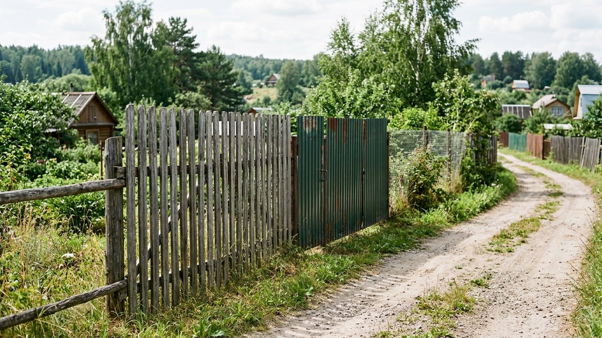
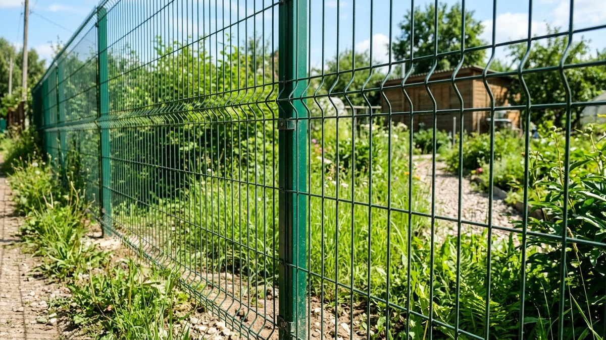
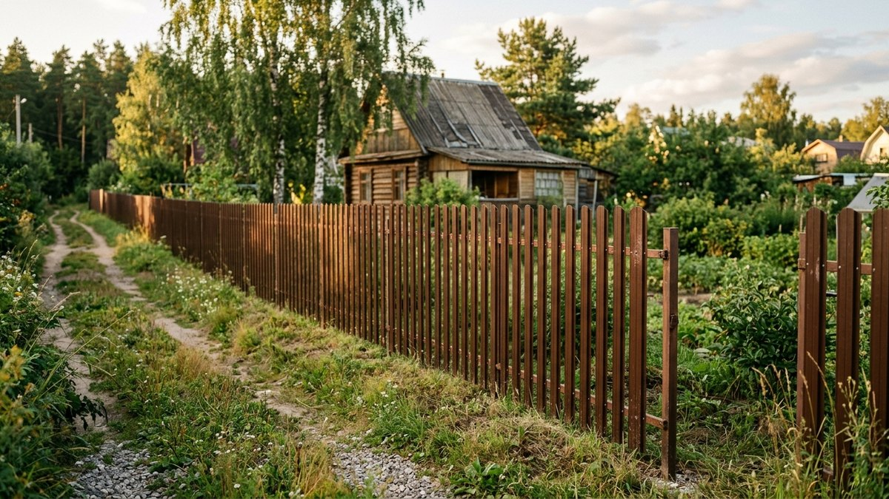
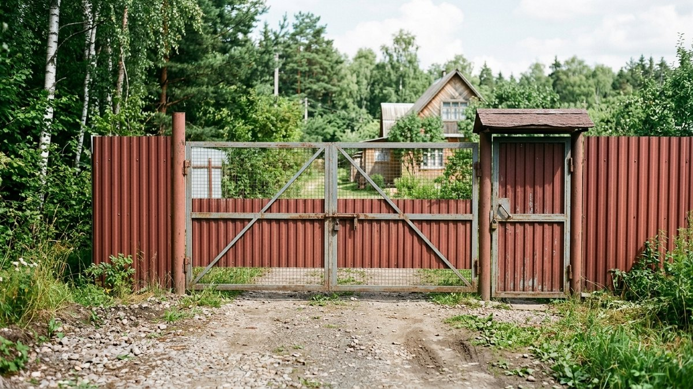
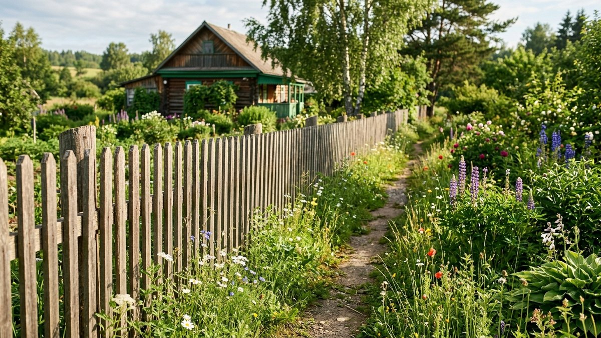
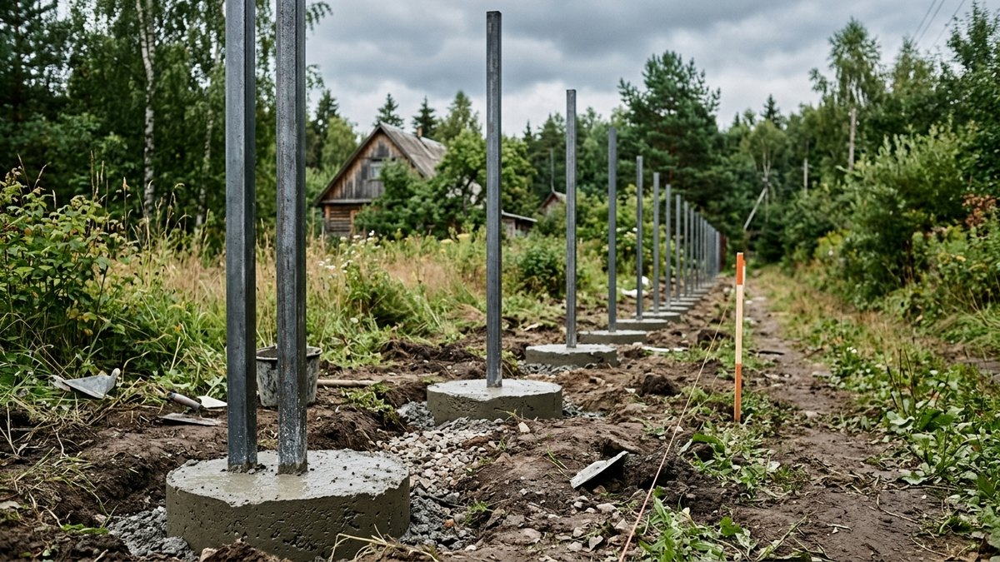

На сайте уже разобран монтаж отдельных видов забора — из профнастила, из дерева. Но перед тем как выбирать материал, обычно встаёт другой вопрос: что вообще дешевле поставить на весь периметр участка. Сравним 6 популярных видов ограждения по цене за погонный метр с учётом столбов и монтажа, а в конце — калькулятор под ваш периметр.

## Сетка-рабица

Самый дешёвый вариант: полотно из оцинкованной или ПВХ-сетки натягивается между столбами.

**Плюсы:** минимальная цена, участок не затеняется, быстрый монтаж.
**Минусы:** нулевая приватность, провисает без промежуточных опор, смотрится «по-хозяйственному», а не декоративно.

Цена с монтажом — от 700 до 1200 ₽/пог.м.

## 3D-сетка (сварная)

Панели из сварной оцинкованной проволоки с объёмным рифлением для жёсткости, крепятся на столбы.

**Плюсы:** не провисает в отличие от рабицы, служит 25–30 лет без обслуживания, участок продувается и не затеняется.
**Минусы:** приватности так же не даёт, дороже рабицы почти вдвое.

Цена с монтажом — от 1500 до 2500 ₽/пог.м.

## Деревянный штакетник

Классический дощатый забор: вертикальные рейки с зазором крепятся на прожилины между столбами.

**Плюсы:** живой материал, недорогой, легко ремонтируется точечной заменой доски.
**Минусы:** требует обработки антисептиком и подкраски каждые 3–5 лет, без обработки гниёт у земли за 7–10 лет.

Цена с монтажом — от 1200 до 2000 ₽/пог.м.

## Евроштакетник

Металлический профиль, имитирующий деревянный штакетник по форме, с полимерным покрытием.

**Плюсы:** не гниёт и не требует покраски, служит 30–50 лет, богатый выбор цветов.
**Минусы:** дороже деревянного аналога, при сильном ударе гнётся без возможности выправить.

Цена с монтажом — от 1500 до 2500 ₽/пог.м.

## Профнастил

Сплошные металлические листы с полимерным покрытием, крепятся на столбы и прожилины внахлёст.

**Плюсы:** полная приватность, служит 30–50 лет, устойчив к ветру благодаря жёсткости листа.
**Минусы:** глухой забор затеняет участок с этой стороны, летом металл сильно нагревается, при сильном ветре — повышенная парусность на столбы.

Цена с монтажом — от 1800 до 2800 ₽/пог.м. Подробный монтаж разобран в статье [забор из профнастила своими руками](https://mir-doma.pro/zabor-iz-profnastila-svoimi-rukami/).

## Деревянный глухой забор (доска встык)

Сплошное полотно из обрезной доски, закреплённой встык или внахлёст, без зазоров.

**Плюсы:** полная приватность, естественный вид, ремонтопригоден точечно.
**Минусы:** самый дорогой из деревянных вариантов, требует регулярной обработки, при плотном прилегании досок хуже сохнет после дождя.

Цена с монтажом — от 2000 до 3200 ₽/пог.м. Больше о материалах — в статье [забор из дерева своими руками](https://mir-doma.pro/zabor-iz-dereva-svoimi-rukami/).

## Сравнение по цене

| Материал | Цена, ₽/пог.м | Приватность | Срок службы |
|---|---|---|---|
| Сетка-рабица | 700–1200 | нет | 10–15 лет |
| 3D-сетка | 1500–2500 | нет | 25–30 лет |
| Деревянный штакетник | 1200–2000 | частичная | 10–20 лет с уходом |
| Евроштакетник | 1500–2500 | частичная | 30–50 лет |
| Профнастил | 1800–2800 | полная | 30–50 лет |
| Деревянный глухой | 2000–3200 | полная | 15–25 лет с уходом |

## Калькулятор: сколько будет стоить забор на ваш периметр

Укажите периметр участка, добавьте ворота и калитку, если нужны, — калькулятор посчитает смету под выбранный материал.

<!-- wp:html -->

<h3 class="md-zb__title">Калькулятор забора</h3>

Цены — средние по России с монтажом. Для точного расчёта уточните цену у продавца в своём регионе.

<label class="md-zb__f">Периметр участка, м<input type="number" id="zbPer" value="60" min="1" max="1000" step="1"></label>
<label class="md-zb__f">Материал
<select id="zbMat">
<option value="950">Сетка-рабица — 950 ₽/пог.м</option>
<option value="2000">3D-сетка — 2000 ₽/пог.м</option>
<option value="1600">Деревянный штакетник — 1600 ₽/пог.м</option>
<option value="2000" selected>Евроштакетник — 2000 ₽/пог.м</option>
<option value="2300">Профнастил — 2300 ₽/пог.м</option>
<option value="2600">Деревянный глухой — 2600 ₽/пог.м</option>
</select></label>
<label class="md-zb__f">Своя цена, ₽/пог.м (необязательно)<input type="number" id="zbPrice" value="" min="0" max="10000" step="1" placeholder="если знаете точную"></label>

<label class="md-zb__chk"><input type="checkbox" id="zbGate" checked>Ворота (≈18 000 ₽)</label>
<label class="md-zb__chk"><input type="checkbox" id="zbWicket" checked>Калитка (≈10 000 ₽)</label>

Полотно забора<b id="zbFence">0 ₽</b>

Ворота и калитка<b id="zbGw">0 ₽</b>

Итого<b id="zbTotal">—</b>

Ориентир без учёта сложного рельефа, глубокого промерзания грунта под столбы и доставки.

<button type="button" id="zbCopy" class="md-zb__btn md-zb__btn--main">Скопировать результат</button>
<a id="zbVk" class="md-zb__btn md-zb__btn--vk" href="#" target="_blank" rel="noopener noreferrer">Поделиться ВКонтакте</a>
<a id="zbTg" class="md-zb__btn md-zb__btn--tg" href="#" target="_blank" rel="noopener noreferrer">Поделиться в Telegram</a>
<button type="button" id="zbPrint" class="md-zb__btn">Печать</button>

<!-- /wp:html -->

## Что выбрать под задачу

- **Разделить зоны внутри участка, не закрывая вид** — сетка-рабица или 3D-сетка: дешевле всего и не затеняет грядки.
- **Огородить участок от улицы и соседей с приватностью** — профнастил или глухой деревянный забор.
- **Баланс цены, вида и долговечности** — евроштакетник: не самый дешёвый, но не требует обслуживания десятилетиями.
- **Ограниченный бюджет, но нужен приличный вид с улицы** — деревянный штакетник: дешевле евроштакетника, декоративнее рабицы.

## Частые ошибки

- **Экономия на столбах.** Тонкостенные или неглубоко вкопанные столбы — самая частая причина, почему забор «повело» после первой же зимы с морозным пучением грунта.
- **Монтаж без разметки диагоналей.** Забор без проверки прямоугольности при разметке в итоге кривит, и последние пролёты приходится подгонять со значительным перерасходом материала.
- **Расчёт материала без запаса.** Профнастил и штакетник продаются определённой шириной листа — если не учесть нахлёст, материала не хватит на 1–2 пролёта.
- **Установка глухого забора без согласования с соседями.** По СНиП высота и светопроницаемость забора между соседними участками обычно регламентированы — стоит свериться заранее, чтобы не переделывать.

## Частые вопросы

### Какой забор самый дешёвый?

Сетка-рабица — самый доступный вариант и по материалу, и по монтажу, но не даёт приватности.

### Что дешевле: профнастил или евроштакетник?

По деньгам они близки, профнастил чуть дороже за счёт сплошного полотна. Разница в другом: профнастил даёт полную приватность, евроштакетник — частичную, но лучше продувается и меньше парусит на ветру.

### На сколько лет хватает деревянного забора без ухода?

Без обработки антисептиком нижняя часть досок начинает гнить уже через 5–7 лет у земли. С регулярной обработкой (раз в 3–5 лет) срок службы увеличивается до 15–20 лет.

### Сколько стоит поставить забор на 6 соток?

Периметр участка 6 соток при пропорции сторон примерно 2:1 — около 100 м. При заборе из евроштакетника (2000 ₽/пог.м) с воротами и калиткой это ориентировочно 228 000 ₽ — посчитайте точнее по калькулятору выше под форму своего участка.

### Нужен ли фундамент под забор?

Под лёгкие заборы (сетка, штакетник) фундамент не нужен — достаточно бетонирования столбов. Под тяжёлые глухие заборы (кирпичные столбы, массивное дерево) иногда заливают ленточный цоколь, но для дачи это редкость и заметно удорожает смету.

### Как сэкономить на заборе, не теряя в качестве?

Ставить столбы самому, а обшивку заказывать готовыми панелями, покупать материал одной партией под весь периметр сразу — так продавцы чаще дают скидку за объём, и не переплачивать за глухой забор там, где достаточно частичной приватности.
