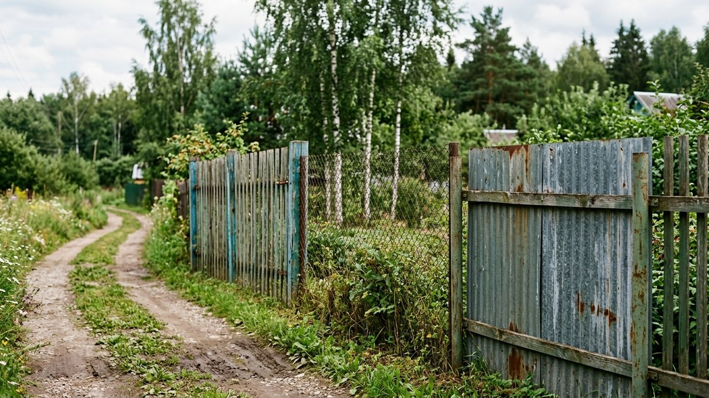
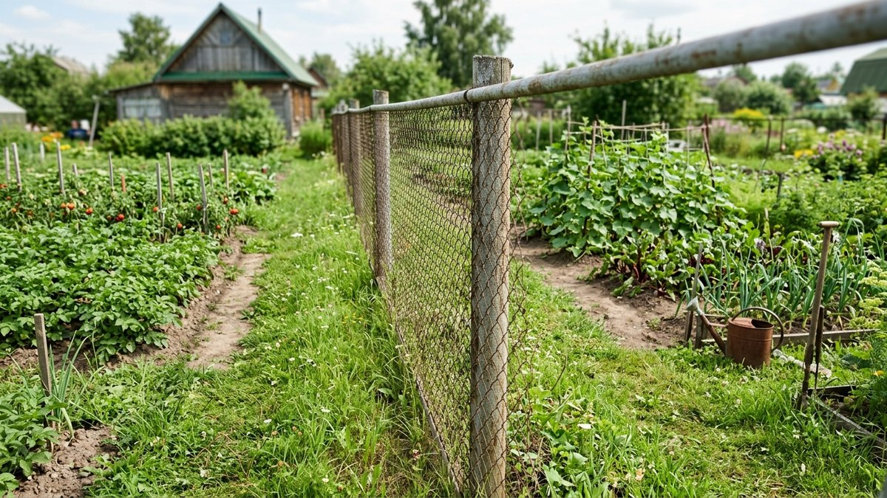
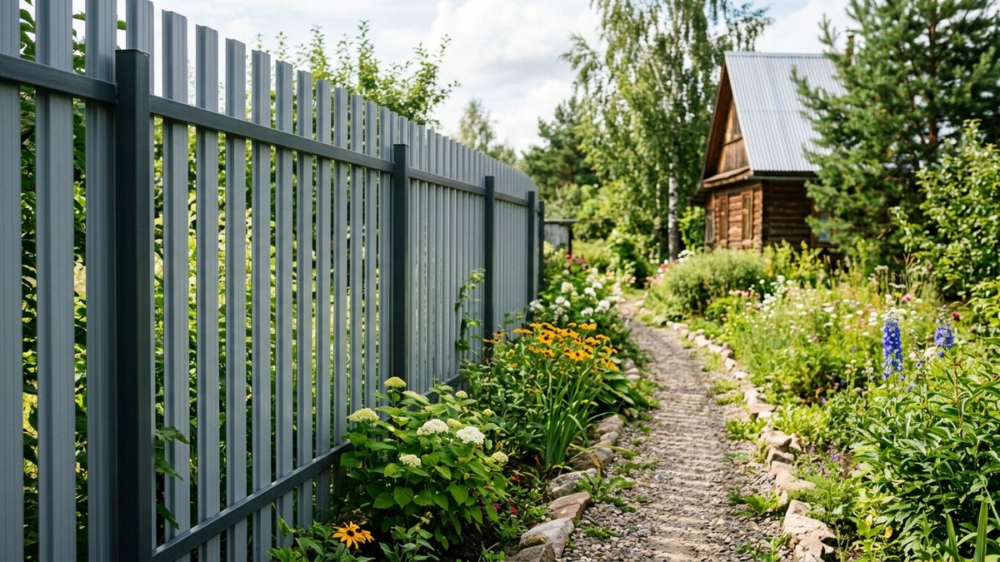
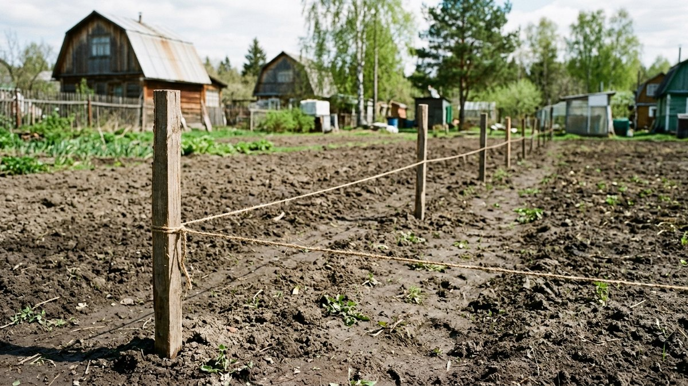
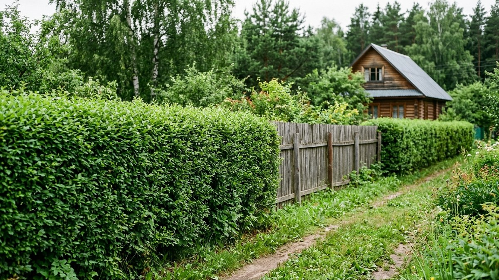
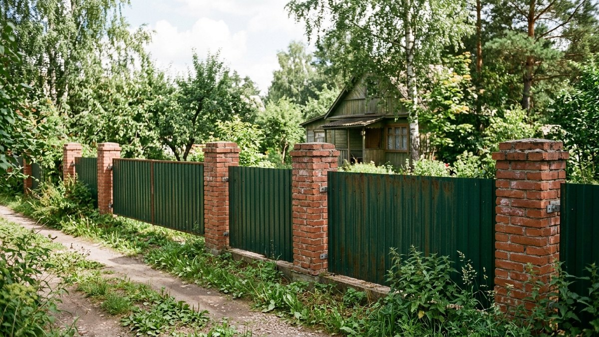

# Какой забор выбрать для дачи: сравнение материалов

Забор на даче решает две разные задачи — обозначить границу участка или
закрыть его от посторонних глаз, — и материал для них нужен разный. Хозяева
часто ставят один и тот же профнастил и по периметру с соседями, и вдоль
улицы, хотя для соседской межи это переплата, а для улицы — иногда наоборот
недостаточно приватности. Разберём, чем отличаются основные варианты и как
выбрать материал под конкретную границу участка, а не по принципу «что
ставят все».

## Сравнение материалов

| Материал | Цена за метр | Срок службы | Приватность | Монтаж |
|---|---|---|---|---|
| Сетка рабица | Низкая | 10–15 лет | Нулевая, полностью просматривается | Простой |
| Сварная сетка (3D) | Средняя | 20–25 лет | Низкая | Простой |
| Деревянный штакетник | Средняя | 10–15 лет без обработки | Средняя, зависит от зазора | Средний |
| Евроштакетник (металл) | Средняя | 30–50 лет | Средняя, зависит от зазора | Средний |
| Профнастил | Средняя-высокая | 20–30 лет | Полная | Средний |
| Кирпич, камень | Высокая | 50+ лет | Полная | Сложный, нужен фундамент |
| Живая изгородь | Низкая на старте, время на рост | Десятки лет при уходе | От средней до полной по мере роста | Минимальный, но нужен уход |

## Для границы с соседями: сетка рабица или сварная сетка

Между соседскими участками закон обычно не требует (и часто прямо не
рекомендует) ставить глухой забор — он затеняет обе стороны. Сетка рабица —
самый бюджетный и практичный вариант: пропускает свет, не создаёт тени на
грядках соседа, служит 10–15 лет. Сварная сетка (3D-сетка) чуть дороже, но
не провисает со временем и выглядит аккуратнее.

## Для приватности со стороны улицы: профнастил или сплошной штакетник

Если задача — закрыть участок от посторонних глаз со стороны улицы или
дороги, разумны только сплошные материалы:

- **Профнастил** — быстрый монтаж, полная приватность, среднее по сроку
  службы покрытие. Подробный пошаговый монтаж — в статье [забор из
  профнастила своими руками](https://mir-doma.pro/zabor-iz-profnastila-svoimi-rukami/).
- **Деревянный штакетник без зазоров** («шахматка» с нахлёстом досок) —
  дороже в трудозатратах, но выглядит теплее профнастила.
- **Кирпич или каменный цоколь с металлическими секциями сверху** —
  капитальное решение, самое дорогое, но и самое долговечное.

## Для эстетики участка: евроштакетник или живая изгородь

Если забор — часть общего вида участка, а не только функция, рассматривают:

- **Евроштакетник** — металлические ламели с полимерным покрытием, богатая
  палитра цветов, служит дольше дерева и не требует покраски.
- **Живая изгородь** — самый недорогой вариант на старте, но результат
  ждать 2–4 года до плотной стены зелени. Какие растения растут быстрее
  других и как формировать изгородь — в статье [живая
  изгородь](https://mir-doma.pro/zhivaya-izgorod/).

## Как посчитать бюджет заранее

Итоговая цена забора складывается не только из погонных метров полотна, но и
из столбов, лаг, крепежа и, для кирпича, — фундамента. Прежде чем сравнивать
цены материалов между собой, посчитайте периметр и разбейте его на пролёты
между будущими столбами — это даёт реалистичную картину количества
материала для любого из вариантов, а не только для профнастила.

## Частые ошибки

- **Ставить одинаковый забор по всему периметру** — граница с соседями и
  граница с улицей решают разные задачи, и материал для них не обязан
  совпадать.
- **Экономить на столбах, а не на полотне** — именно столбы держат
  геометрию забора годами; дешёвые тонкостенные столбы гнутся под ветровой
  нагрузкой быстрее, чем изнашивается само полотно.
- **Сажать живую изгородь у самой границы участка**, не оставляя запаса —
  разросшиеся кусты через несколько лет создают споры с соседями и
  затеняют их сторону.
- **Не проверять нормы отступа от границы** перед капитальным забором из
  кирпича — демонтировать неправильно расположенный капитальный фундамент
  значительно дороже, чем перенести секцию сетки.

## Частые вопросы

### Какой забор самый дешёвый для дачи

Сетка рабица — самый недорогой вариант на квадратный метр ограждения среди
готовых промышленных материалов. Живая изгородь дешевле на старте, но
требует нескольких лет роста и регулярного ухода, прежде чем станет полноценной
преградой.

### Какой забор не нужно красить или обрабатывать

Профнастил с полимерным покрытием, евроштакетник и сварная оцинкованная
сетка не требуют регулярной обработки — в отличие от дерева, которое нужно
обновлять антисептиком и краской каждые несколько лет.

### Нужен ли фундамент под забор из профнастила или штакетника

Полноценный ленточный фундамент не нужен — столбы бетонируют точечно в
пробуренных или выкопанных ямах. Сплошной фундамент нужен только под
капитальные заборы из кирпича или камня, где вес конструкции значительно
выше.

### Какой забор ставить между соседними участками по нормам

По большинству региональных норм между соседними дачными участками
рекомендуется ставить светопрозрачное ограждение (сетка, решётчатый
штакетник), чтобы не затенять посадки на обеих сторонах. Глухой забор
между соседями обычно ставят по обоюдному согласию, а не по умолчанию.

## Заключение

Материал забора выбирают под конкретную границу, а не один на весь участок:
сетка для соседской межи, сплошной материал для улицы, живая изгородь или
евроштакетник — там, где важен внешний вид. Если материал для сплошного
забора уже выбран в пользу профнастила, следующий шаг — пошаговый монтаж:
[забор из профнастила своими руками](https://mir-doma.pro/zabor-iz-profnastila-svoimi-rukami/).
