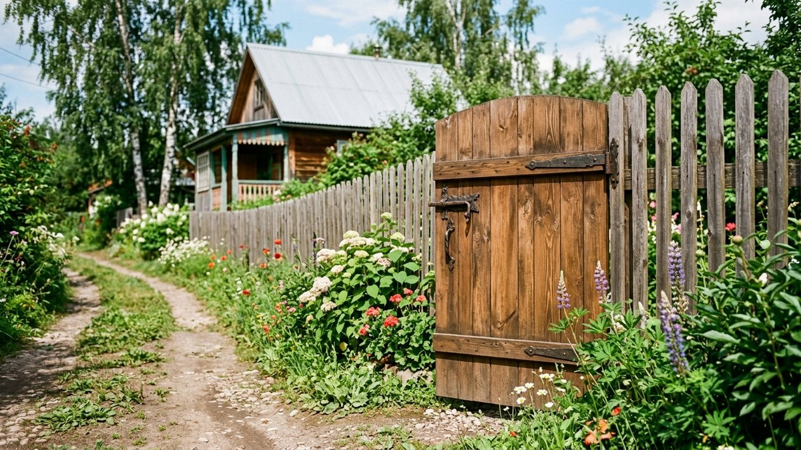
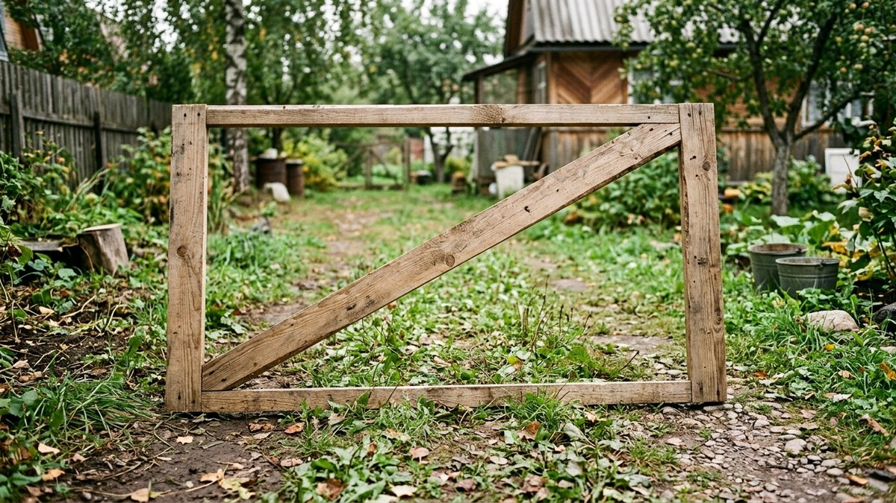
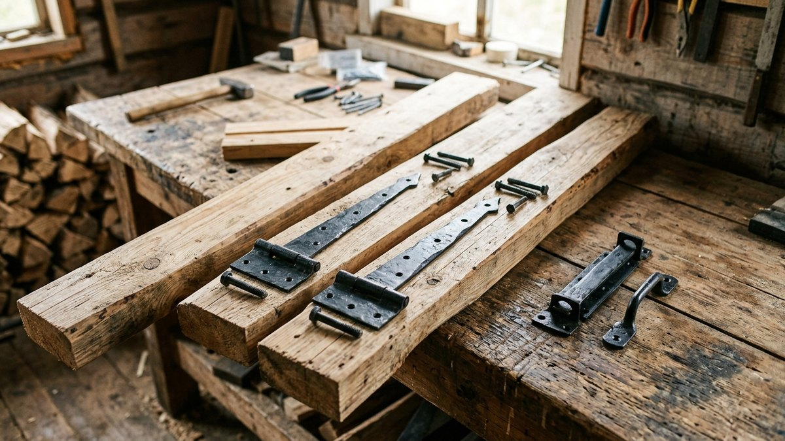
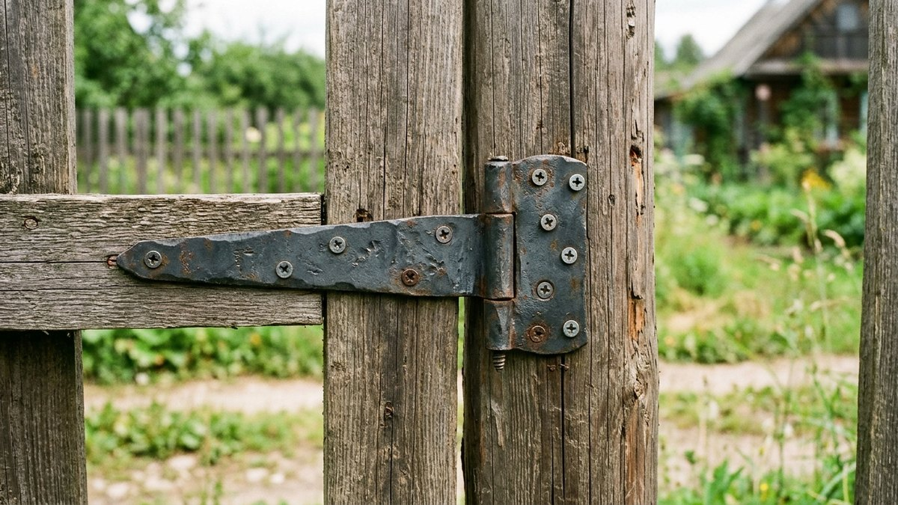
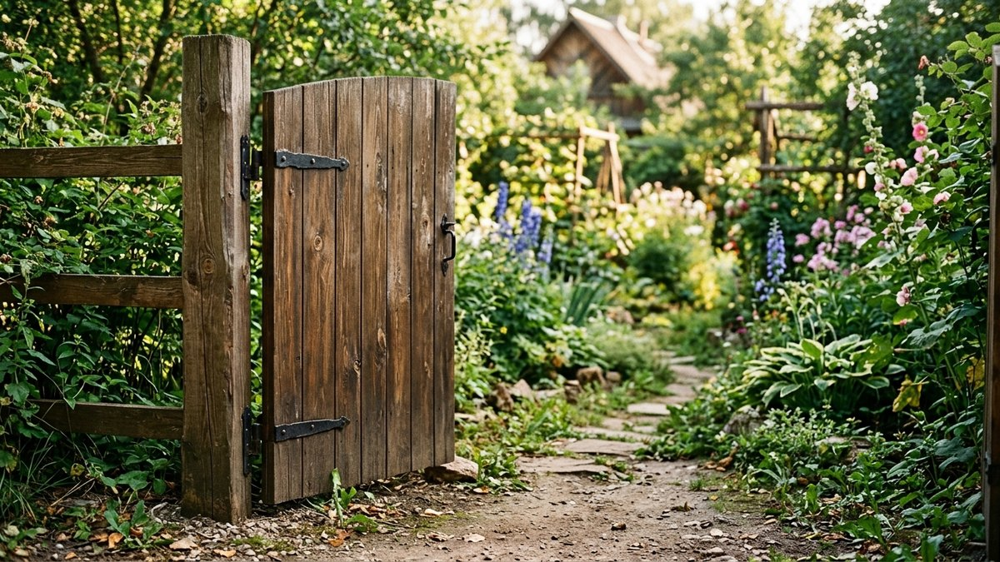
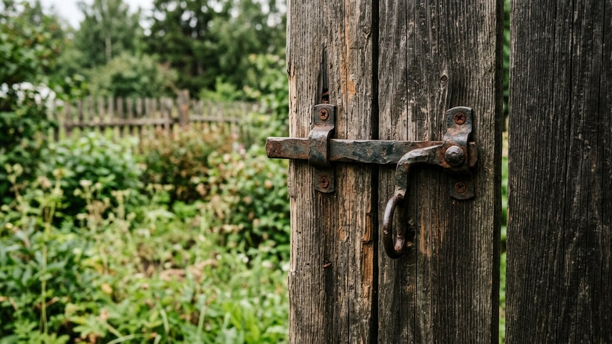

# Калитка своими руками: деревянная, чертежи и монтаж

Калитка — самая нагруженная часть забора: её открывают по нескольку раз
в день, и именно на створке первой проявляются ошибки монтажа — перекос
от слабой рамы, провисание от неправильных петель, забитая грязью защёлка.
Разберём, как сделать калитку своими руками из дерева: чертёж рамы, выбор
петель и защёлки под вес створки, монтаж на столб так, чтобы через сезон
она не просела.

Если калитка нужна как часть нового забора — устройство полотна и монтаж
столбов разобраны в статье [забор из дерева своими
руками](https://mir-doma.pro/zabor-iz-dereva-svoimi-rukami/). Здесь —
только про саму створку и её узлы: раму, навес и запор.

## Размер и чертёж рамы

Стандартная ширина калитки — 90–100 см: уже неудобно проносить садовую
тачку или носилки, шире — рама начинает провисать без усиления. Высота
обычно совпадает с высотой забора, 1,8–2 м.

Рама делается из бруса 50×70 или 60×80 мм — сечение тоньше, чем у
столбов забора, но толще, чем у обычного штакетника, потому что рама
несёт вес всей створки на двух петлях, а не распределяет нагрузку по
всей длине пролёта. Обязательный элемент — **диагональный раскос**: брус
по диагонали от нижнего угла у петель к верхнему углу у защёлки. Без
раскоса прямоугольная рама со временем превращается в параллелограмм —
калитка перекашивается и начинает цеплять землю или столб.

## Материалы

| Элемент | Материал | Комментарий |
|---|---|---|
| Рама | Брус 50×70–60×80 мм | Сосна или лиственница, обязательно с раскосом |
| Обшивка | Штакетник, доска, решётка | В том же стиле, что и полотно забора |
| Петли | Накладные или ввёртные, 2–3 шт. | На тяжёлую створку — 3 петли, не 2 |
| Защёлка/замок | Щеколда, шпингалет или врезной замок | Подбирается по нужному уровню защиты |
| Опорный столб | Усиленный, толще рядовых | Несёт всю нагрузку створки на вылет |

## Монтаж опорного столба

Столб под петли калитки нагружен больше остальных столбов забора — вся
масса створки давит на него на вылете, как рычаг. Здесь экономить нельзя:

- Сечение или диаметр столба под калитку — на одну ступень толще, чем
  рядовые столбы забора (например, брус 150×150 мм вместо 100×100 мм).
- Глубина установки — ниже точки промерзания, как и у остальных столбов,
  но с увеличенным объёмом бетонирования: не менее 40 см в диаметре
  вокруг столба.
- Если калитка встроена в пролёт между двумя столбами забора, оба столба
  по краям проёма усиливают одинаково — нагрузка от открывания и
  захлопывания передаётся на оба.

## Петли и запор

**Петли.** На лёгкую калитку (штакетник, решётка) хватает двух накладных
петель. На глухую обшитую доской створку весом от 25–30 кг ставят три
петли — верхнюю, среднюю и нижнюю: третья петля снимает нагрузку
скручивания со средней части рамы и не даёт створке провиснуть за
1–2 сезона.

**Зазоры.** От земли до низа калитки оставляют 5–7 см — достаточно, чтобы
створка не цепляла грунт при пучении почвы зимой, но и не давала щели, в
которую пролезет собака или курица. От столба до створки по бокам —
0,5–1 см на разбухание дерева от влажности.

**Защёлка.** Для дачи, где калитку открывают часто, удобнее щеколда или
шпингалет — быстро и не боится мороза. Врезной замок ставят, если калитка
выходит на улицу и нужна защита от случайных прохожих, но зимой врезной
механизм может подмерзать без смазки на силиконовой основе.

## Пошаговый монтаж

1. **Соберите раму** на земле — брус по размеру, углы на металлические
   уголки и саморезы, диагональный раскос враспор между противоположными
   углами.
2. **Обшейте раму** штакетником или доской с тем же зазором, что и на
   основном полотне забора, — иначе калитка визуально выделится на общем
   фоне.
3. **Обработайте антисептиком** всю створку, включая торцы бруса и места
   под петлями — под металлом дерево сохнет хуже и гниёт быстрее, если
   пропустить обработку именно там.
4. **Навесьте на петли**, выставив по уровню и с нужным зазором от земли,
   подложив временные клинья под низ на время крепления.
5. **Установите защёлку** так, чтобы она защёлкивалась без усилия при
   свободном ходе створки — тугая защёлка означает перекос рамы или
   петель, который проще поправить сразу, чем через месяц.

## Частые ошибки

- **Рама без диагонального раскоса.** Самая частая причина, по которой
  калитка «съезжает» и цепляет землю уже через один сезон.
- **Две петли на тяжёлую глухую створку.** Экономия на третьей петле
  оборачивается провисанием и заменой петель раньше срока.
- **Столб под калитку той же толщины, что и рядовые столбы забора.**
  Нагрузка на вылет требует запаса прочности, которого рядовой столб не
  даёт.
- **Калитка без зазора от земли.** Весной, когда почву пучит, такая
  створка перестаёт открываться или начинает скрести по грунту.

## Частые вопросы

### Какой ширины делать калитку

90–100 см — стандарт, при котором свободно проходит человек с тачкой или
носилками. Уже 80 см уже не всегда, шире 110 см требует усиленной рамы
из-за роста нагрузки на петли.

### Сколько петель нужно на калитку

Две — для лёгкой обшивки (решётка, редкий штакетник). Три — для глухой
створки из доски весом от 25–30 кг, чтобы она не провисала.

### Как сделать так, чтобы калитка не провисала

Обязательный диагональный раскос в раме, усиленный опорный столб под
петли и правильное число петель под вес створки — это три меры, которые
вместе решают проблему провисания.

### Чем обработать калитку от гниения

Антисептиком глубокого проникновения по всей створке, включая торцы
бруса и зону под петлями, — так же, как и остальную древесину забора,
разбор в статье [забор из дерева своими
руками](https://mir-doma.pro/zabor-iz-dereva-svoimi-rukami/).

### Нужен ли замок на калитку на даче

Не обязательно — щеколда или шпингалет достаточны для повседневного
использования. Врезной замок ставят, если калитка выходит на открытую
улицу, а не на закрытую территорию с общим забором.

## Заключение

Деревянная калитка держится на трёх вещах: раме с диагональным раскосом,
усиленном опорном столбе под нагрузку на вылет и правильном числе петель
под вес створки. Пропустить любой из трёх пунктов — и калитка начнёт
провисать уже за один сезон, даже если остальной забор простоит десятки
лет.
