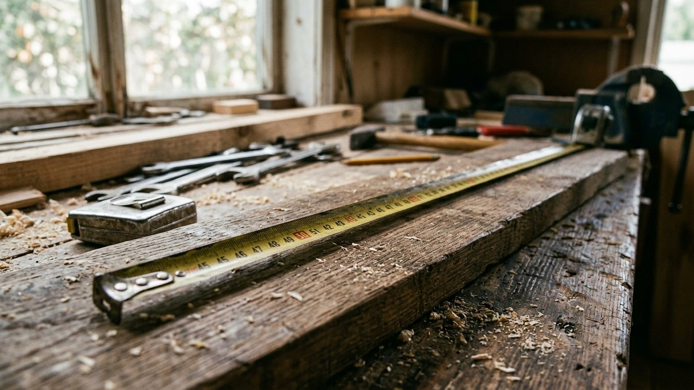
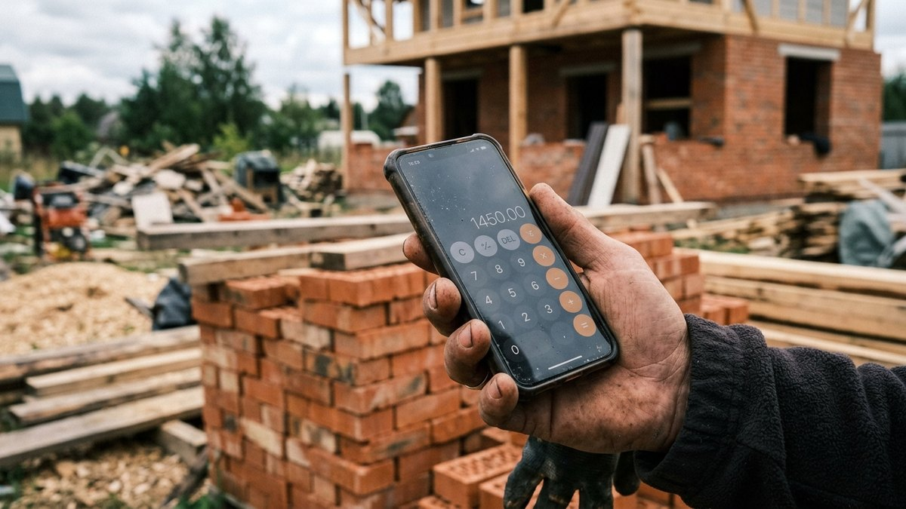
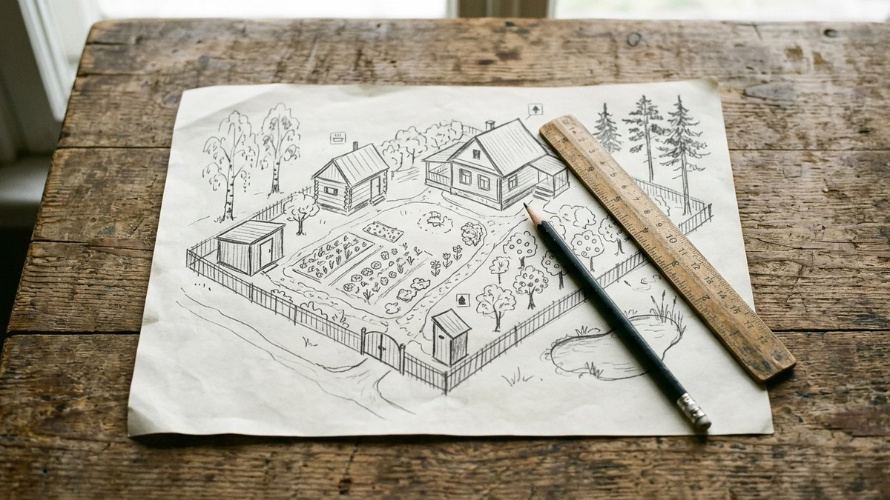
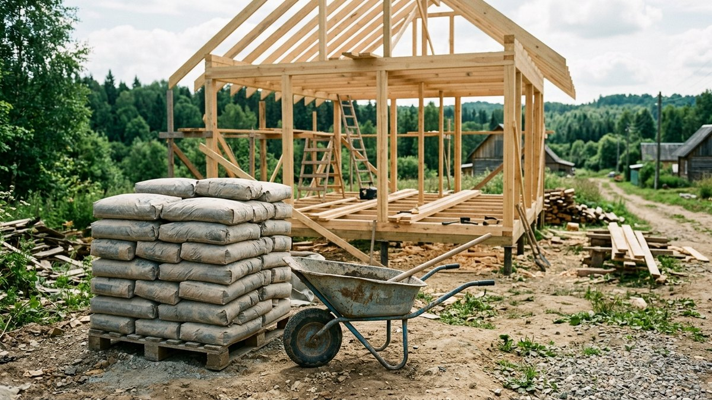
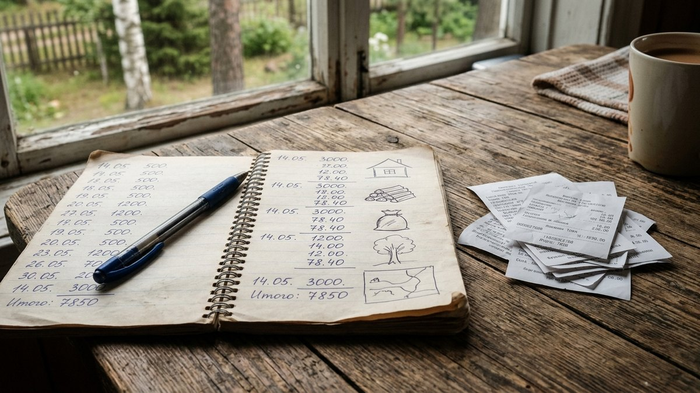

# Калькуляторы для дачи и стройки: все расчёты сайта в одном месте

Считать материал на глаз — почти всегда означает либо переплатить за
лишний запас, либо доехать до магазина второй раз. На mir-doma.pro у каждой
статьи с расчётом есть свой встроенный калькулятор: вводите размеры своего
объекта — получаете готовое число, а не общую формулу, которую ещё нужно
досчитать самому. Здесь собраны все калькуляторы сайта по разделам, чтобы
не искать нужный через поиск по каждой статье отдельно.

## Баня и сауна

- [Брус на сруб бани](https://mir-doma.pro/banya-iz-brusa-svoimi-rukami/#mdBbCalc) — количество бруса и венцов по размерам сруба.
- [Бетон на фундамент бани](https://mir-doma.pro/fundament-pod-banyu-svoimi-rukami/#mdFbCalc) — объём бетона на ленточный фундамент.
- [Масса камней для каменки](https://mir-doma.pro/pech-dlya-bani-iz-metalla/#mdPbCalc) — сколько камней нужно на печь-каменку по объёму топки.

## Кровля и фасады

- [Материал для обшивки дома](https://mir-doma.pro/chem-obshit-dom-snaruzhi/#mdFoCalc) — площадь и расход по выбранному материалу.
- [Краска для фасада](https://mir-doma.pro/chem-pokrasit-fasad/#mdPfCalc) — количество краски по площади и числу слоёв.
- [Кровельные материалы](https://mir-doma.pro/chem-pokryt-kryshu-dachi/#mdRoofCalc) — расход материала по площади и уклону кровли.
- [Водосток](https://mir-doma.pro/vodostok-svoimi-rukami/#mdVodCalc) — длина желобов, число воронок и колен по периметру крыши.

## Утепление и энергосбережение

- [Утепление дачного дома](https://mir-doma.pro/skolko-stoit-uteplit-dachnyy-dom/#mdSuCalc) — стоимость утепления по площади дома.
- [Пеноплекс, дюбели и клей на цоколь](https://mir-doma.pro/uteplenie-cokolya-fundamenta-penopleksom/#mdCkCalc) — материал на утепление цоколя с учётом толщины.

## Системы отопления

- [Стоимость отопления](https://mir-doma.pro/otoplenie-dachi-chto-deshevle/#mdOtCalc) — расходы на сезон по виду топлива и площади.
- [Тёплый пол на веранде](https://mir-doma.pro/teplyy-pol-na-verande/#mdTvCalc) — мощность и стоимость тёплого пола по площади.

## Электрика и сантехника

- [Электропроводка на даче](https://mir-doma.pro/skhema-elektroprovodki-na-dache/#mdEpCalc) — сечение кабеля и номинал автомата по нагрузке.

## Внутренняя отделка

- [Обшивка открытой террасы](https://mir-doma.pro/otdelka-otkrytoy-terrasy/#mdOtCalc) — материал на стены и потолок террасы по площади.
- [Пол на холодной веранде](https://mir-doma.pro/pol-na-holodnoy-verande/#mdFloorCalc) — материал на настил пола по размерам веранды.

## Заборы и ограждения

- [Забор](https://mir-doma.pro/kakoy-zabor-deshevle/#mdZbCalc) — стоимость забора на разный периметр и материал.

## Газоны и дорожки

- [Щебень для дорожки](https://mir-doma.pro/dorozhka-iz-shchebnya-svoimi-rukami/#mdShCalc) — объём щебня по длине, ширине и толщине пирога.
- [Тротуарная плитка](https://mir-doma.pro/raschet-trotuarnoy-plitki/#mdTpCalc) — количество плитки с запасом на подрезку.

## Ландшафтный дизайн

- [Дренажная траншея](https://mir-doma.pro/drenazh-uchastka-na-glinistoy-pochve/#mdDrCalc) — объём земляных работ и щебня на дренаж участка.

## Погреба и кладовые

- [Строительство погреба](https://mir-doma.pro/stroitelstvo-pogreba-smeta/#mdPgCalc) — смета на погреб по размерам и материалу стен.

## Хозяйственные постройки

- [Бак для летнего душа](https://mir-doma.pro/letniy-dush-dlya-dachi-svoimi-rukami/#mdDsCalc) — объём бака по числу пользователей в сутки.

## Мебель своими руками

- [Подвес качелей](https://mir-doma.pro/kacheli-dlya-dachi-svoimi-rukami/#mdKcCalc) — длина цепи или троса подвеса по высоте сиденья.
- [Доски на скамью с ящиком](https://mir-doma.pro/mebel-dlya-verandy-svoimi-rukami/#mdMvCalc) — количество досок и бруска на скамью по размерам.

## Овощи и зелень

- [Грядка-короб](https://mir-doma.pro/gryadki-koroba-iz-dosok-svoimi-rukami/#mdGkCalc) — доски и объём грунта на грядку-короб по размерам.

## Инструменты и материалы

- [Мощность генератора](https://mir-doma.pro/kakoy-generator-nuzhen-dlya-dachi/#mdGenCalc) — суммарная нагрузка приборов и нужная мощность генератора.

## Умный дом и автоматика для дачи

- [Трафик 4G-камеры](https://mir-doma.pro/videonablyudenie-na-dache-svoimi-rukami/#mdVnCalc) — расход мобильного трафика в месяц по разрешению видео.
- [Зоны GSM-сигнализации](https://mir-doma.pro/gsm-signalizaciya-dlya-dachi-svoimi-rukami/#mdGsCalc) — количество зон и подбор ёмкости панели.

## Частые вопросы

### Калькуляторы на сайте бесплатные

Да, все калькуляторы открыты без регистрации и ограничений — считайте
сколько угодно раз, меняя размеры под свой объект.

### Насколько точны расчёты калькуляторов

Калькуляторы используют те же формулы и коэффициенты запаса, что разобраны
в тексте статьи рядом с ними — точность такая же, как у расчёта вручную по
этой методике, но без риска ошибиться в арифметике.

### Можно ли поделиться результатом расчёта

Да, у каждого калькулятора есть кнопки «Скопировать результат» и
отправка в ВКонтакте или Telegram — удобно переслать готовую смету
партнёру по стройке или продавцу материала.

### Почему калькулятор не встроен прямо на этой странице

Каждый калькулятор рассчитан на конкретную методику и коэффициенты,
которые разбираются в самой статье, — переходите по ссылке к нужному
расчёту, там же есть пример на реальных цифрах.
