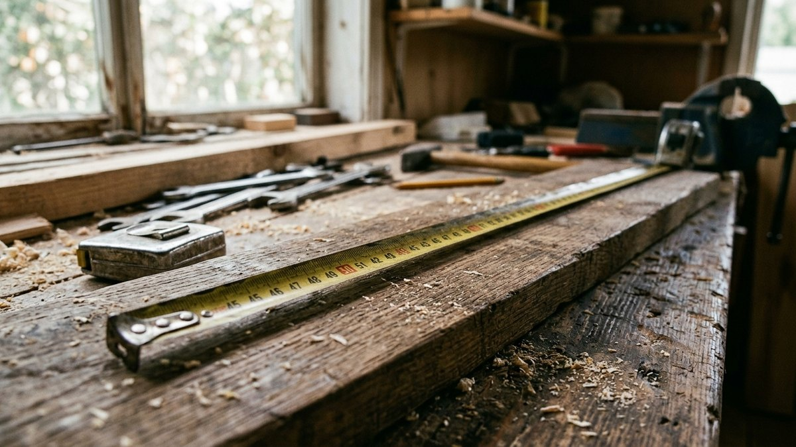
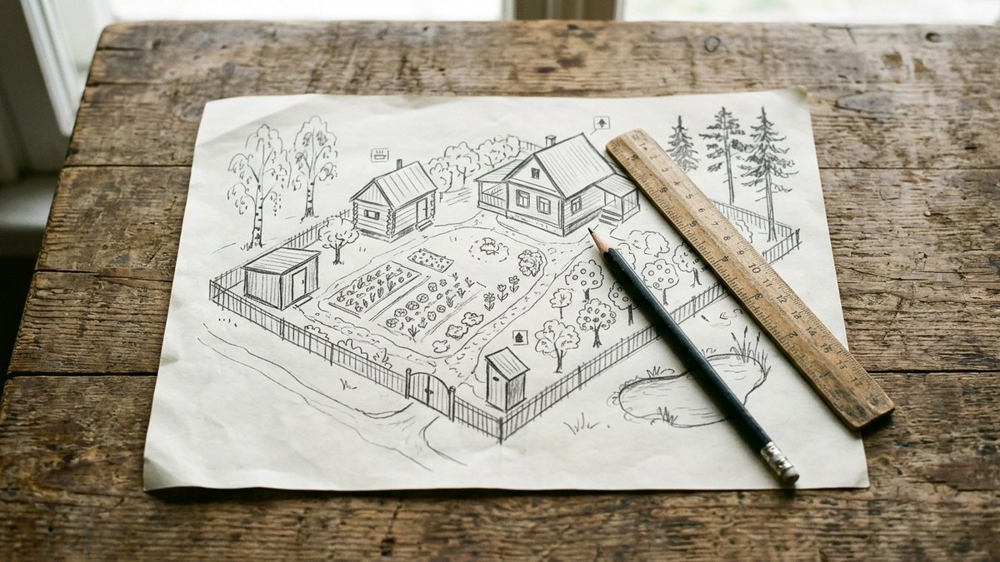
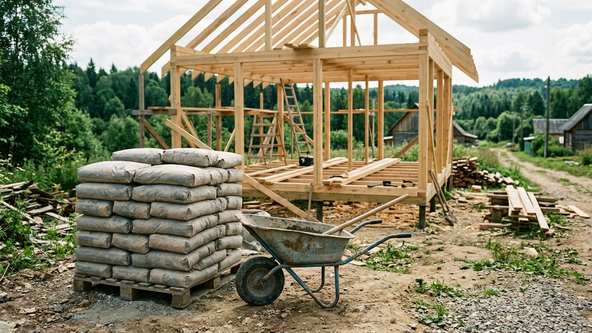
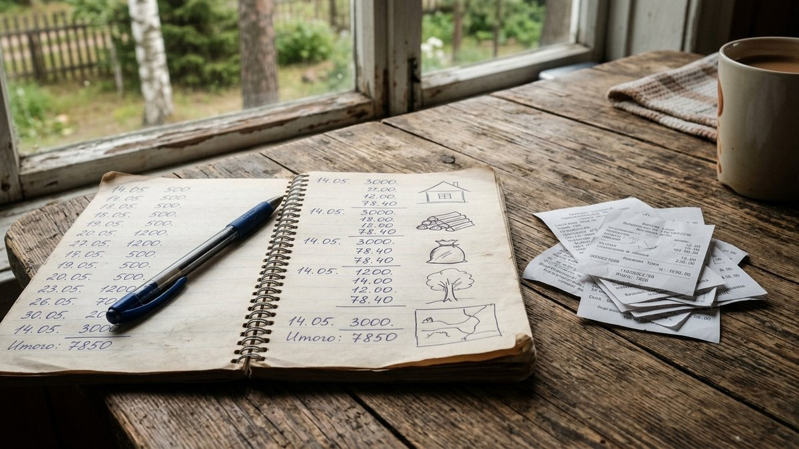

# Калькуляторы для дачи и стройки: все расчёты сайта в одном месте

Считать материал на глаз — почти всегда означает либо переплатить за
лишний запас, либо доехать до магазина второй раз. На mir-doma.pro у каждой
статьи с расчётом есть свой встроенный калькулятор: вводите размеры своего
объекта — получаете готовое число, а не общую формулу, которую ещё нужно
досчитать самому. Здесь собраны все калькуляторы сайта по разделам, чтобы
не искать нужный через поиск по каждой статье отдельно.

## Баня и сауна

- [Брус на сруб бани](https://mir-doma.pro/banya-iz-brusa-svoimi-rukami/#mdBbCalc) — количество бруса и венцов по размерам сруба.
- [Бетон на фундамент бани](https://mir-doma.pro/fundament-pod-banyu-svoimi-rukami/#mdFbCalc) — объём бетона на ленточный фундамент.
- [Масса камней для каменки](https://mir-doma.pro/pech-dlya-bani-iz-metalla/#mdPbCalc) — сколько камней нужно на печь-каменку по объёму топки.
- [Обшивка предбанника](https://mir-doma.pro/predbannik-svoimi-rukami/#mdPbCalc) — вагонка, кляммеры, утеплитель и пароизоляция по размерам предбанника.
- [Высота дымохода бани](https://mir-doma.pro/kakoy-dymokhod-luchshe-dlya-bani/#mdDhCalc) — высота трубы над кровлей по расстоянию до конька и общая высота от колосника.
- [Искрогаситель на дымоход](https://mir-doma.pro/iskrogasitel-na-dymokhod-dlya-bani/#mdIgCalc) — высота сетчатого цилиндра, заготовка сетки и размер колпака под диаметр трубы.
- [Потолок бани](https://mir-doma.pro/potolok-v-bane-svoimi-rukami/#mdPtCalc) — вагонка, фольга, алюминиевый скотч, рейки вентзазора и утеплитель по размерам потолка.
- [Проливной пол бани](https://mir-doma.pro/prolivnoy-pol-v-bane-svoimi-rukami/#mdPpCalc) — доски с учётом зазора, лаги, перепад поддона и бетон на поддон.
- [Стоимость протопки бани](https://mir-doma.pro/drovyanaya-ili-elektricheskaya-pech-dlya-bani/#mdBanyaCalc) — во что обходится одна протопка дровяной и электрической печью.
- [Тёплый пол в бане](https://mir-doma.pro/teplyy-pol-v-bane/#mdTpCalc) — мощность и длина кабеля с расходом за визит или длина трубы и объём антифриза для контура от печи.
- [Замена нижних венцов в бане](https://mir-doma.pro/zamena-nizhnih-vencov-v-bane/#mdVnCalc) — масса сруба с крышей, подбор домкратов, объём нового венца и высота подъёма.
- [Вентиляция в бане](https://mir-doma.pro/ventilyaciya-v-bane-svoimi-rukami/#mdVbCalc) — сечение притока и вытяжки по мощности печи, диаметр трубы и размер короба.
- [Полки в бане](https://mir-doma.pro/lavki-v-bane-svoimi-rukami/#mdLvCalc) — высота ярусов по потолку, длина лежака по росту и число досок настила.

## Кровля и фасады

- [Материал для обшивки дома](https://mir-doma.pro/chem-obshit-dom-snaruzhi/#mdFoCalc) — площадь и расход по выбранному материалу.
- [Краска для фасада](https://mir-doma.pro/chem-pokrasit-fasad/#mdPfCalc) — количество краски по площади и числу слоёв.
- [Кровельные материалы](https://mir-doma.pro/chem-pokryt-kryshu-dachi/#mdRoofCalc) — расход материала по площади и уклону кровли.
- [Водосток](https://mir-doma.pro/vodostok-svoimi-rukami/#mdVodCalc) — длина желобов, число воронок и колен по периметру крыши.
- [Снегозадержатели](https://mir-doma.pro/snegozaderzhateli-na-kryshu/#mdSnowCalc) — сколько рядов и секций трубчатых снегозадержателей нужно на скат.

## Утепление и энергосбережение

- [Утепление дачного дома](https://mir-doma.pro/skolko-stoit-uteplit-dachnyy-dom/#mdSuCalc) — стоимость утепления по площади дома.
- [Пеноплекс, дюбели и клей на цоколь](https://mir-doma.pro/uteplenie-cokolya-fundamenta-penopleksom/#mdCkCalc) — материал на утепление цоколя с учётом толщины.
- [Пакля и джут для конопатки](https://mir-doma.pro/chem-zadelat-shcheli-v-derevyannom-dome/#mdShCalc) — длина швов сруба, масса пакли и длина джутового шнура нужного диаметра.
- [Утепление подвала изнутри](https://mir-doma.pro/uteplenie-podvala-iznutri/#mdPdCalc) — плиты ЭППС по зонам глубины, клей, дюбели, пена и пароизоляция.
- [Утепление стен снаружи](https://mir-doma.pro/uteplenie-sten-snaruzhi/#mdUsCalc) — утеплитель в упаковках, мембрана, брусок на обрешётку и дюбели по размерам дома.
- [Утепление веранды изнутри](https://mir-doma.pro/chem-uteplit-verandu-iznutri/#mdVeCalc) — толщина минваты по региону, утеплитель и плёнки для стен, потолка и пола.
- [Утепление крыши и мансарды](https://mir-doma.pro/uteplenie-kryshi-i-mansardy/#mdRoofCalc) — площадь скатов по уклону или перекрытия, утеплитель в упаковках, плёнки и проверка высоты стропил.

## Системы отопления

- [Стоимость отопления](https://mir-doma.pro/otoplenie-dachi-chto-deshevle/#mdOtCalc) — расходы на сезон по виду топлива и площади.
- [Тёплый пол на веранде](https://mir-doma.pro/teplyy-pol-na-verande/#mdTvCalc) — мощность и стоимость тёплого пола по площади.
- [Мощность обогревателя](https://mir-doma.pro/kakoy-obogrevatel-vybrat-dlya-dachi/#mdObCalc) — сколько киловатт нужно по площади, высоте потолка и утеплению.
- [Мощность буржуйки](https://mir-doma.pro/burzhuyka-svoimi-rukami/#mdBurCalc) — какой мощности нужна печь под площадь и тип помещения.
- [Сколько дров на зиму](https://mir-doma.pro/skolko-drov-nuzhno-na-zimu/#mdWoodCalc) — кубы дров на сезон по площади, утеплению, региону, породе и влажности дров.
- [Электроотопление дачи](https://mir-doma.pro/elektricheskoe-otoplenie-dachi/#mdElCalc) — мощность обогревателей по площади и утеплению, расход и счёт за месяц, запас по выделенной мощности.

## Электрика и сантехника

- [Электропроводка на даче](https://mir-doma.pro/skhema-elektroprovodki-na-dache/#mdEpCalc) — сечение кабеля и номинал автомата по нагрузке.
- [Мощность стабилизатора](https://mir-doma.pro/kakoy-stabilizator-napryazheniya-vybrat/#mdStCalc) — мощность стабилизатора напряжения по нагрузке приборов и качеству сети.
- [Греющий кабель для водопровода](https://mir-doma.pro/greyushchiy-kabel-dlya-vodoprovoda/#mdCableCalc) — длина и мощность кабеля, расход электричества в месяц.

## Водоемы и системы полива

- [Кессон для скважины](https://mir-doma.pro/kesson-dlya-skvazhiny-svoimi-rukami/#mdKsCalc) — глубина кессона по промерзанию, объём котлована, бетон на плиту и утеплитель.
- [Объём воды в системе полива](https://mir-doma.pro/konservaciya-poliva-na-zimu/#mdKpCalc) — сколько воды должно вытечь из ленты, трубок ПНД и шлангов при сливе на зиму.

## Интерьер дачи

- [Гирлянды для дачи](https://mir-doma.pro/kak-ukrasit-dachu-na-novyy-god/#mdNgCalc) — длина гирлянд на карниз, окна и деревья, количество и мощность.

## Внутренняя отделка

- [Обшивка открытой террасы](https://mir-doma.pro/otdelka-otkrytoy-terrasy/#mdOtCalc) — материал на стены и потолок террасы по площади.
- [Пол на холодной веранде](https://mir-doma.pro/pol-na-holodnoy-verande/#mdFloorCalc) — материал на настил пола по размерам веранды.

## Заборы и ограждения

- [Забор](https://mir-doma.pro/kakoy-zabor-deshevle/#mdZbCalc) — стоимость забора на разный периметр и материал.
- [Откатные ворота](https://mir-doma.pro/otkatnye-vorota-svoimi-rukami/#mdOvCalc) — длина створки с противовесом, вес, класс комплекта, закладная и бетон на фундамент.

## Газоны и дорожки

- [Щебень для дорожки](https://mir-doma.pro/dorozhka-iz-shchebnya-svoimi-rukami/#mdShCalc) — объём щебня по длине, ширине и толщине пирога.
- [Тротуарная плитка](https://mir-doma.pro/raschet-trotuarnoy-plitki/#mdTpCalc) — количество плитки с запасом на подрезку.

## Ландшафтный дизайн

- [Дренажная траншея](https://mir-doma.pro/drenazh-uchastka-na-glinistoy-pochve/#mdDrCalc) — объём земляных работ и щебня на дренаж участка.
- [Планировка участка 15 соток](https://mir-doma.pro/planirovka-uchastka-15-sotok/#md15Calc) — сколько земли займут дом, баня, гараж, теплицы и сад и что останется под огород и отдых.
- [Планировка участка 6 соток](https://mir-doma.pro/planirovka-uchastka-6-sotok/#md6Calc) — влезет ли отдельная баня в 8 м от дома и сколько останется под огород.

## Погреба и кладовые

- [Строительство погреба](https://mir-doma.pro/stroitelstvo-pogreba-smeta/#mdPgCalc) — смета на погреб по размерам и материалу стен.
- [Погреб в гараже](https://mir-doma.pro/pogreb-v-garazhe-svoimi-rukami/#mdPgCalc) — объём котлована, бетон или кирпич на стены, гидроизоляция.
- [Полки для банок в погреб](https://mir-doma.pro/polki-v-pogreb-svoimi-rukami/#mdShelfCalc) — вес банок на полке и сколько нужно стоек.
- [Серные шашки для погреба](https://mir-doma.pro/raschet-sernoy-shashki-dlya-pogreba/#mdSsCalc) — объём погреба, сера по норме и число шашек по весу или по данным упаковки.
- [Вентиляция погреба](https://mir-doma.pro/ventilyaciya-v-pogrebe/#mdVpCalc) — сечение и диаметр приточной и вытяжной трубы по площади погреба.

## Хозяйственные постройки

- [Бак для летнего душа](https://mir-doma.pro/letniy-dush-dlya-dachi-svoimi-rukami/#mdDsCalc) — объём бака по числу пользователей в сутки.

## Мебель своими руками

- [Подвес качелей](https://mir-doma.pro/kacheli-dlya-dachi-svoimi-rukami/#mdKcCalc) — длина цепи или троса подвеса по высоте сиденья.
- [Доски на скамью с ящиком](https://mir-doma.pro/mebel-dlya-verandy-svoimi-rukami/#mdMvCalc) — количество досок и бруска на скамью по размерам.
- [Высота верстака](https://mir-doma.pro/verstak-svoimi-rukami/#mdBenchCalc) — высота столешницы под ваш рост для столярной и слесарной работы.

## Овощи и зелень

- [Грядка-короб](https://mir-doma.pro/gryadki-koroba-iz-dosok-svoimi-rukami/#mdGkCalc) — доски и объём грунта на грядку-короб по размерам.

## Инструменты и материалы

- [Мощность генератора](https://mir-doma.pro/kakoy-generator-nuzhen-dlya-dachi/#mdGenCalc) — суммарная нагрузка приборов и нужная мощность генератора.
- [Напильник для заточки цепи](https://mir-doma.pro/napilnik-dlya-zatochki-cepi-benzopily/#mdNpCalc) — шаг цепи по замеру заклёпок, диаметр напильника и высота ограничителя глубины.

## Умный дом и автоматика для дачи

- [Трафик 4G-камеры](https://mir-doma.pro/videonablyudenie-na-dache-svoimi-rukami/#mdVnCalc) — расход мобильного трафика в месяц по разрешению видео.
- [Зоны GSM-сигнализации](https://mir-doma.pro/gsm-signalizaciya-dlya-dachi-svoimi-rukami/#mdGsCalc) — количество зон и подбор ёмкости панели.
- [Трафик интернета на даче](https://mir-doma.pro/internet-na-dachu/#mdNetCalc) — сколько гигабайт уходит за месяц и какой тариф брать.
- [Дежурное отопление](https://mir-doma.pro/udalennoe-upravlenie-otopleniem-na-dache/#mdDutyCalc) — сколько стоит месяц отопления при +20 °C и при дежурных +5 °C.
- [Умная розетка](https://mir-doma.pro/umnaya-rozetka-dlya-dachi/#mdSocketCalc) — какой ток должна выдерживать розетка под ваш прибор.

## Ремонт дачного дома

- [Лестница на второй этаж](https://mir-doma.pro/lestnica-na-vtoroy-etazh-svoimi-rukami/#mdStairCalc) — число и высота ступеней, глубина проступи, угол и длина косоура.
- [Ступени крыльца](https://mir-doma.pro/remont-kryltsa-svoimi-rukami/#mdKrCalc) — число и высота ступеней под высоту порога, глубина проступи и площадки.

## Заморозка

- [Объём морозильника](https://mir-doma.pro/morozilnyy-lar-ili-morozilnaya-kamera/#mdFreezeCalc) — сколько литров морозильника нужно под ваш урожай и заготовки.

## Строительство на участке

- [Навес из профильной трубы](https://mir-doma.pro/raschet-navesa-iz-profilnoy-truby/#mdNavesCalc) — снеговая нагрузка, сечение трубы и число стоек.

## Удобрения и подкормки

- [Зола как удобрение](https://mir-doma.pro/zola-kak-udobrenie/#mdZoCalc) — сколько золы нужно на сезон под картофель, овощи, ягодники и деревья, в вёдрах и стаканах.
- [Известкование почвы](https://mir-doma.pro/izvestkovanie-pochvy-osenyu/#mdIzCalc) — доза доломитовой муки, мела или пушонки по типу почвы и pH, в килограммах и мешках.

## Частые вопросы

### Калькуляторы на сайте бесплатные

Да, все калькуляторы открыты без регистрации и ограничений — считайте
сколько угодно раз, меняя размеры под свой объект.

### Насколько точны расчёты калькуляторов

Калькуляторы используют те же формулы и коэффициенты запаса, что разобраны
в тексте статьи рядом с ними — точность такая же, как у расчёта вручную по
этой методике, но без риска ошибиться в арифметике.

### Можно ли поделиться результатом расчёта

Да, у каждого калькулятора есть кнопки «Скопировать результат» и
отправка в ВКонтакте или Telegram — удобно переслать готовую смету
партнёру по стройке или продавцу материала.

### Почему калькулятор не встроен прямо на этой странице

Каждый калькулятор рассчитан на конкретную методику и коэффициенты,
которые разбираются в самой статье, — переходите по ссылке к нужному
расчёту, там же есть пример на реальных цифрах.
