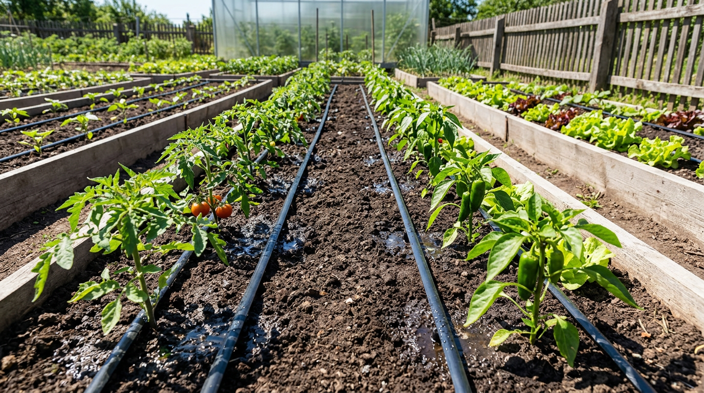
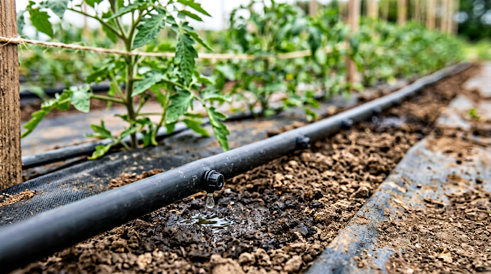
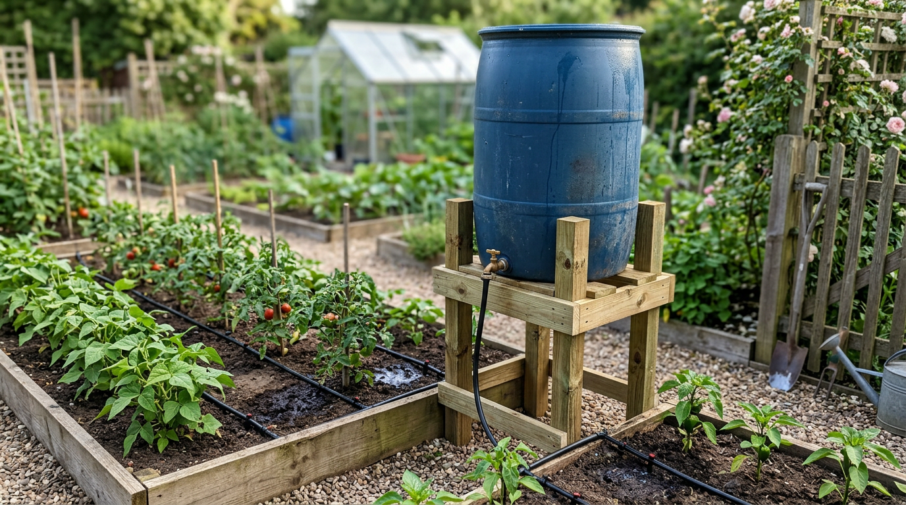
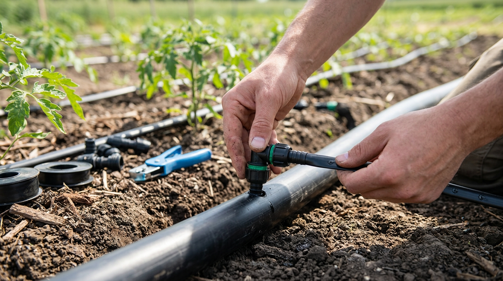
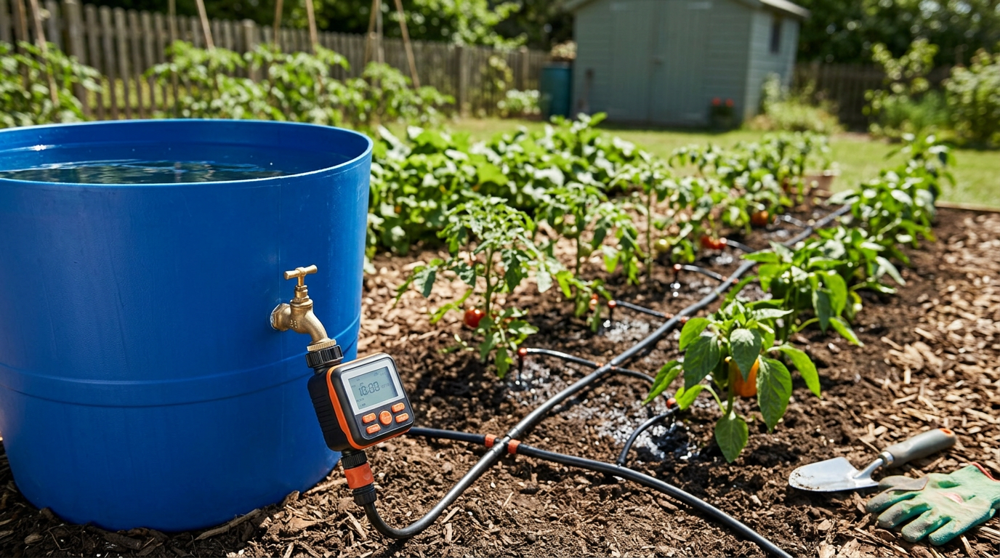
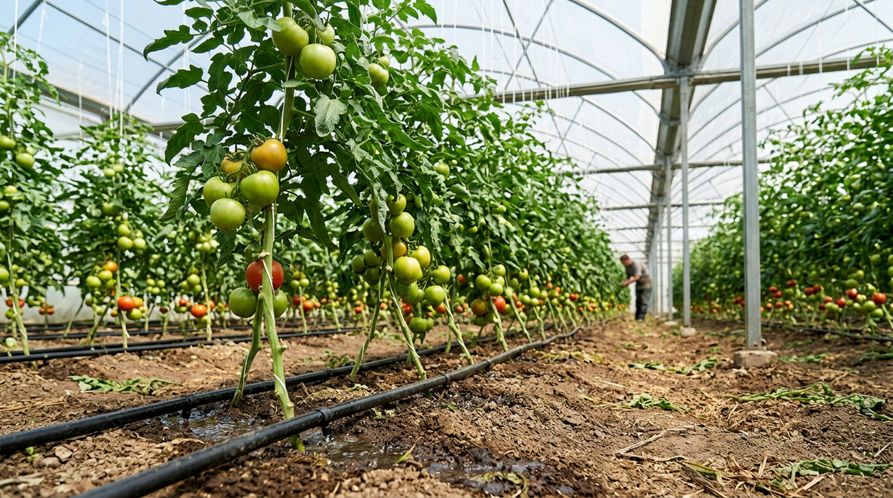

Полив — самая частая и утомительная дачная забота, особенно в жару, когда грядки нужно проливать каждый день. Капельный полив решает эту проблему: вода поступает прямо к корням растений, экономно и без вашего постоянного участия. Собрать такую систему своими руками несложно и недорого — её можно сделать и из обычной бочки без всякого водопровода. В этой статье разберём, как устроен капельный полив, как смонтировать его из бочки и от водопровода, как всё автоматизировать и каких ошибок избегать.

## 💧 Чем хорош капельный полив

Капельный полив — это система, при которой вода подаётся малыми порциями прямо в прикорневую зону каждого растения. У такого подхода масса преимуществ перед поливом из шланга или лейки:

- **Экономия воды** — вода идёт точно под корень, ничего не испаряется и не уходит в междурядья. Расход воды сокращается в 2–3 раза по сравнению с поливом из шланга — это особенно важно там, где воду привозят или качают из скважины.
- **Экономия времени и сил** — система поливает сама, вам не нужно таскать лейки и стоять со шлангом.
- **Меньше болезней** — листья остаются сухими, а именно влага на листьях провоцирует грибковые болезни вроде [мучнистой росы](https://mir-doma.pro/muchnistaya-rosa-na-ogurtsah/) и фитофторы.
- **Равномерность и стабильность** — растения получают воду регулярно, без перепадов «засуха — потоп», которые вызывают [пожелтение листьев](https://mir-doma.pro/zhelteyut-listya-u-ogurtsov/), горечь огурцов и вершинную гниль томатов.
- **Меньше сорняков** — увлажняется только зона у растений, а междурядья остаются сухими.
- **Можно вносить удобрения** прямо с водой (это называется фертигация).

Стабильный полив, который обеспечивает капельная система, — это, без преувеличения, основа здорового урожая. Именно из-за нерегулярного полива чаще всего возникает [вершинная гниль томатов](https://mir-doma.pro/vershinnaya-gnil-tomatov/) и трескаются плоды, а капельный полив поддерживает влажность ровной и убирает эти проблемы.

## 🧩 Из чего состоит система

Прежде чем собирать, разберёмся в компонентах. Капельная система проста и состоит из нескольких частей:

- **Источник воды** — бочка на возвышении или водопроводный кран.
- **Фильтр** — обязательный элемент, очищает воду от частиц, иначе капельницы быстро забьются.
- **Магистральная труба** — основная труба (обычно ПНД), которая идёт вдоль грядок и распределяет воду.
- **Капельная лента или трубка** — укладывается вдоль рядов растений; в ленте через равные промежутки (20–30 см) встроены капельницы.
- **Фитинги и старт-коннекторы** — соединяют ленту с магистралью, часто с краником для каждой грядки.
- **Заглушки** — закрывают концы ленты и магистрали.
- **Кран и редуктор давления** (для водопровода) — регулируют подачу.

Капельная лента дешевле и служит 1–3 сезона, а капельная трубка с внешними капельницами дороже, но прочнее и работает много лет. Для начала проще и бюджетнее лента. При покупке обращайте внимание на шаг капельниц: для близко посаженных культур (зелень, морковь) берут ленту с шагом 10–20 см, для томатов и перца, посаженных реже, — 30 см и больше. Под конкретные грядки можно комбинировать разные ленты.

## 🛢️ Капельный полив из бочки

Это самый популярный вариант для дачи без водопровода. Система работает самотёком — за счёт давления столба воды в приподнятой бочке, поэтому насос не нужен.

### Что понадобится

Бочка (200 л — оптимально), подставка или помост, кран в нижней части бочки, фильтр, магистральная труба, капельная лента, старт-коннекторы, заглушки.

### Пошаговый монтаж

1. **Поднимите бочку на высоту 1,5–2 метра.** Это ключевой момент: столб воды создаёт давление, нужное для работы капельниц. Чем выше бочка, тем стабильнее полив. Каждый метр высоты даёт примерно 0,1 атмосферы давления, а капельной ленте нужно хотя бы 0,1–0,2 — поэтому полутора-двух метров достаточно. Если поднять бочку высоко негде, помогает небольшой насос, но в большинстве случаев хватает и самотёка.
2. **Установите кран** в нижней части бочки, отступив несколько сантиметров от дна, чтобы осадок не попадал в систему.
3. **Поставьте фильтр** сразу после крана — он защитит капельницы от засорения.
4. **Проложите магистральную трубу** вдоль грядок и подключите её к крану через фильтр.
5. **Врежьте капельные ленты** в магистраль старт-коннекторами — по одной ленте на каждую грядку, краником можно регулировать или отключать полив отдельной грядки.
6. **Разложите ленту** вдоль рядов растений капельницами вверх и заглушите свободные концы.
7. **Залейте воду, откройте кран и проверьте** систему: вода должна равномерно капать из всех капельниц.

Большой плюс полива из бочки — вода в ней нагревается на солнце, а тёплая вода как раз полезна для теплолюбивых огурцов и томатов, в отличие от холодной водопроводной.

## 🚰 Капельный полив от водопровода

Если на участке есть водопровод или скважина с напором, систему можно подключить к нему — тогда не нужно следить за уровнем воды в бочке.

Принцип тот же, но есть важное отличие: **давление в водопроводе слишком высокое** для капельной ленты (она рассчитана на 0,5–1 атмосферу, а в водопроводе бывает 2–4). Поэтому обязательно ставят **редуктор (регулятор) давления**, иначе ленту попросту разорвёт. Схема подключения такая: кран → редуктор давления → фильтр → магистраль → капельные ленты. Фильтр здесь так же обязателен, как и в системе из бочки.

Подключение к водопроводу удобнее тем, что воду не нужно подливать, и его легко автоматизировать таймером. Минус один: вода из водопровода или скважины обычно холодная, а это стресс для теплолюбивых культур. Решение — поставить промежуточную бочку-накопитель, в которой вода будет отстаиваться и нагреваться, и уже от неё пускать капельный полив.

## 📐 Монтаж и раскладка: важные детали

При сборке системы есть нюансы, от которых зависит, как она будет работать:

- **Укладывайте ленту капельницами вверх** (если иное не указано производителем) — так в них меньше попадает грязи со дна борозды.
- **Длина одной ленты** обычно не больше 50–80 метров, иначе на дальнем конце давление падает и полив становится неравномерным.
- **Концы лент заглушайте**, но удобно сделать их съёмными — раз в сезон лену промывают, открыв концы.
- **Раскладывайте ленту по ровной поверхности** без резких перегибов, которые перекрывают воду.
- **Располагайте капельницы у самих растений**, чтобы вода шла точно к корням.

После сборки обязательно промойте систему чистой водой перед установкой заглушек — так вы удалите частицы, попавшие при монтаже. И проверьте всю систему под рабочим давлением: пройдите вдоль грядок и убедитесь, что капельницы работают равномерно, а соединения не подтекают.

## ⏱️ Автоматизация полива

Капельный полив можно сделать полностью автоматическим — тогда он будет работать даже в ваше отсутствие. Для этого на кран (бочки или водопровода) ставят **таймер полива** или контроллер. Простые механические таймеры открывают воду на заданное время, электронные — включают полив по расписанию (например, утром и вечером на 30 минут). Это идеальное решение для тех, кто бывает на даче наездами: грядки поливаются строго по графику без вашего участия.

Электронные таймеры работают от батареек и не требуют подключения к электросети, поэтому подходят даже для участка без электричества. Главное — раз в сезон проверять батарейки, чтобы полив не остановился незаметно.

## 🌱 Капельный полив в теплице

В теплице капельный полив особенно полезен. Здесь важно поливать строго под корень, не повышая влажность воздуха, иначе развиваются болезни. Капельная система делает именно это — увлажняет почву, оставляя листья и воздух сухими.

Для теплицы удобнее всего полив из бочки, установленной рядом или внутри: вода прогревается, а холодный полив, который огурцы и томаты не любят, исключён. Подробно об устройстве теплицы — в статье о [теплице из поликарбоната](https://mir-doma.pro/teplitsa-iz-polikarbonata-svoimi-rukami/). Совместив капельный полив с хорошим проветриванием, вы создадите в теплице идеальный микроклимат для растений.

## 🌿 Для каких растений подходит капельный полив

Капельный полив универсален и подходит почти для всех огородных культур, но особенно выручает там, где важен ровный полив под корень и сухие листья:

- **Томаты, перец, баклажаны** — им критично важен стабильный полив и сухая листва для профилактики болезней.
- **Огурцы, кабачки, тыквы** — влаголюбивы и хорошо отзываются на регулярную подачу воды.
- **Капуста, корнеплоды, зелень** — равномерное увлажнение улучшает налив и качество.
- **Ягодники и кусты** — клубника, малина, смородина прекрасно растут на капельном поливе.
- **Деревья** — для них используют отдельные капельницы или кольцевую укладку трубки вокруг ствола.

По сути, капельный полив подходит везде, где есть рядовые посадки. А вот для газона он не годится — там нужен дождевание по площади, а не точечный полив под корень.

## 🛡️ Уход за системой и частые ошибки

Чтобы капельный полив служил долго и не подводил, за ним нужен минимальный уход, а при сборке стоит избегать типичных ошибок:

- **Промывайте фильтр** регулярно, а ленту — раз в сезон, открыв заглушки на концах.
- **На зиму систему демонтируют**: сливают воду, снимают ленты (их хранят в сухом месте) и убирают фильтр. Вода, замёрзнув, разрывает капельницы.
- **Не подключайте ленту к водопроводу без редуктора давления** — высокое давление её разорвёт.
- **Не ставьте систему без фильтра** — капельницы забьются частицами, и полив прекратится.
- **Не размещайте бочку слишком низко** — без достаточной высоты не будет давления, и вода не пойдёт по ленте.
- **Не укладывайте слишком длинные ленты** — на дальнем конце воды будет не хватать.

При правильном уходе капельная лента служит несколько сезонов, а капельная трубка — много лет. Если капельницы всё же начали забиваться, ленту промывают, открыв концы и пустив воду под напором, а сильно засорённые участки заменяют. Раз в сезон полезно прочистить и фильтр, разобрав его и промыв сетку.

## ❓ Частые вопросы

### Нужен ли насос для капельного полива из бочки?

Нет, насос не нужен. Достаточно поднять бочку на высоту 1,5–2 метра — столб воды создаёт давление, которого хватает для работы капельной ленты самотёком. Чем выше бочка, тем стабильнее и равномернее полив.

### Какое давление нужно для капельной ленты?

Капельная лента рассчитана на низкое давление — примерно 0,5–1 атмосфера. Поднятой на 1,5–2 метра бочки для этого достаточно. При подключении к водопроводу давление обязательно понижают редуктором, иначе ленту разорвёт.

### Можно ли поливать капельным поливом холодной водой?

Технически можно, но нежелательно для теплолюбивых культур — огурцы и томаты не любят холодную воду. Поэтому полив из бочки, где вода нагревается на солнце, предпочтительнее прямого подключения к холодному водопроводу.

### Зачем в системе капельного полива фильтр?

Фильтр очищает воду от мелких частиц, ила и ржавчины, которые иначе забивают тонкие отверстия капельниц. Без фильтра система быстро выходит из строя, поэтому это обязательный элемент и для бочки, и для водопровода.

### Как сделать капельный полив на даче без электричества?

Очень просто: используйте систему из бочки, поднятой на 1,5–2 метра, — она работает самотёком, без насоса и электричества. А для автоматизации поставьте электронный таймер на батарейках. Такая система полностью автономна.

### Как часто включать капельный полив?

Зависит от культуры, погоды и почвы. В среднем в жару поливают ежедневно или через день по 30–60 минут, в прохладную погоду реже. С таймером полив настраивают на утренние и вечерние часы, когда испарение минимально.

### Сколько стоит собрать капельный полив своими руками?

Самодельная система из бочки обходится недорого: основные траты — капельная лента (продаётся на метраж), фильтр, фитинги и старт-коннекторы. Бочка обычно уже есть на участке. Готовые наборы капельного полива тоже недороги, но собрать из отдельных деталей под свои грядки чаще выгоднее.

### Капельный полив или дождевание — что лучше?

Это разные задачи. Капельный полив подаёт воду под корень и идеален для грядок, теплиц и кустов: экономит воду и держит листья сухими. Дождевание (разбрызгивание) нужно для газонов и больших площадей. Для огорода капельный полив почти всегда предпочтительнее.

### Можно ли вносить удобрения через капельный полив?

Да, это называется фертигацией. Растворимые удобрения добавляют в бочку или через специальный инжектор, и питание поступает прямо к корням вместе с водой. Это экономно и эффективно, но раствор должен быть хорошо растворён, чтобы не забить капельницы.

## Заключение

Капельный полив своими руками — одно из самых полезных вложений труда на даче: он экономит воду и время, защищает растения от болезней и обеспечивает тот самый стабильный полив, без которого не бывает хорошего урожая. Собрать систему просто — из обычной бочки на подставке или от водопровода с редуктором давления, а таймер сделает её полностью автоматической. Не забывайте про фильтр, правильную высоту бочки и уход — и капельный полив будет годами избавлять вас от ежедневной возни с лейкой, а грядки отблагодарят щедрым урожаем.

Начать можно с малого — собрать простую систему из бочки на одну-две грядки, а убедившись в удобстве, расширить её на весь огород и теплицу. А вы пользуетесь капельным поливом или поливаете по старинке? Делитесь опытом в комментариях и подписывайтесь, чтобы не пропустить новые статьи об обустройстве дачи.
